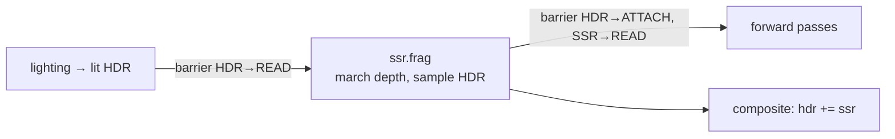
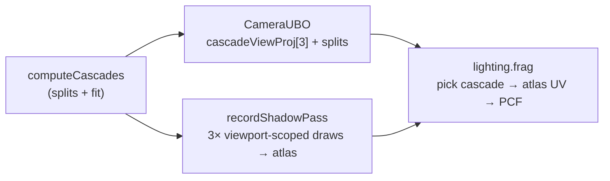
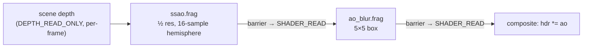
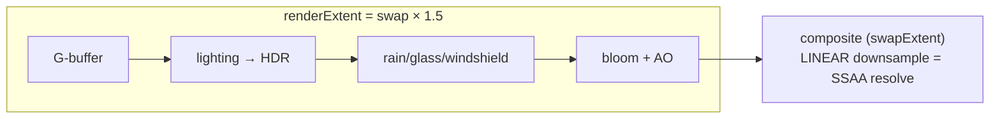
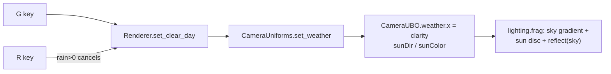
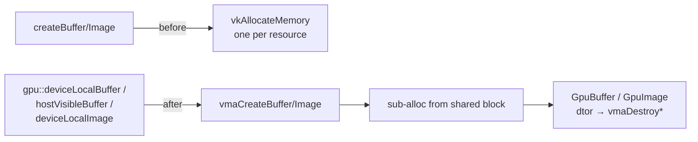
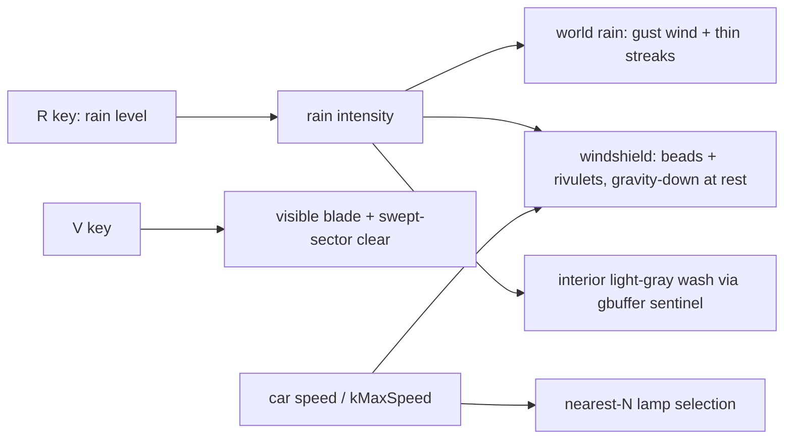
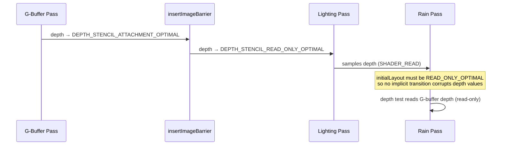

# Changelog

All notable changes to Swish are documented here.

---

## [Unreleased]

### 2026-07-02 — Added a transform gizmo (ImGuizmo) to orient the sun by dragging

> Vendored **ImGuizmo** and wired a rotate gizmo that orients the sun by dragging, instead of only sliders. In edit mode, ticking "Sun gizmo" floats a 3-ring rotation handle in front of the camera; dragging it rotates a stored orientation from which the Renderer derives the sun direction (so shadows + sky + IBL all follow). Debug-only — release never fetches or builds ImGuizmo.

<details>
<summary>Technical summary</summary>

**Vendoring.** ImGuizmo is fetched (FetchContent) inside the existing `if(SWISH_DEBUG_UI)` block and its `src/ImGuizmo.cpp` is compiled into the project's `imgui` static lib (sharing the same ImGui headers). ImGuizmo ships its own CMakeLists that defines a standalone `imguizmo` target with no ImGui includes; that target is set `EXCLUDE_FROM_ALL` so it never builds. It compiled cleanly against the pinned imgui v1.91.5.

**Gizmo.** `DebugUI::begin_frame` now takes the camera `view`/`proj`. After the panel, if edit mode + "Sun gizmo" is on, it calls `ImGuizmo::Manipulate(view, proj, ROTATE, WORLD, …)` on a matrix floated ~20 m in front of the camera (position is cosmetic, kept in-view; only the rotation is read back into `DebugParams::sunGizmoRot`). Drawn to the foreground draw list so it overlays the scene. The Renderer derives the sun direction as `normalize(mat3(sunGizmoRot) · baseSunDir)` in `apply_debug_params`, feeding the shadow CSM fit, sky, and IBL.

**Verification.** Forcing the gizmo on rendered the rotate rings correctly over the scene, validation-clean. Debug + release build clean, **52/52 tests pass**; release (`SWISH_DEBUG_UI=OFF`) doesn't fetch/compile ImGuizmo at all. Note: the camera projection is Vulkan-style, so the drag mapping may feel Y-inverted vs an OpenGL gizmo — a cosmetic follow-up if it bothers.

**File-change table.**

| File | Change |
| --- | --- |
| [CMakeLists.txt](CMakeLists.txt) | FetchContent ImGuizmo; compile `src/ImGuizmo.cpp` into the imgui lib; `EXCLUDE_FROM_ALL` its own target. |
| [src/debug/DebugParams.h](src/debug/DebugParams.h) | `showSunGizmo` + `sunGizmoRot`. |
| [src/debug/DebugUI.h](src/debug/DebugUI.h) / [.cpp](src/debug/DebugUI.cpp) | `begin_frame(p, view, proj)`; `ImGuizmo::BeginFrame` + rotate handle + "Sun gizmo" toggle. |
| [src/renderer/Renderer/Renderer.cpp](src/renderer/Renderer/Renderer.cpp) | Pass camera matrices to `begin_frame`; derive sun direction from the gizmo. |

</details>

### 2026-07-02 — Added a per-material debug editor (live metalness / roughness / colour per slot)

> The debug panel's "Car" override existed but was never wired to the draw. This replaces it with a real **per-material editor**: pick any material slot (asphalt, concrete, sign, or a car sub-material `MAT_CAR_0..19`), toggle Override, and edit its metalness / roughness-multiplier / colour live — the change flows straight into the G-buffer draw. Overrides persist in presets (`[[materials]]`). Release is unaffected (no override table → identity).

<details>
<summary>Technical summary</summary>

**Path.** `SceneGeometry::record_draws` gained an optional `const MaterialOverride*` table (indexed by `MaterialId`); when a draw's slot has an enabled entry, its colour → `push.color.rgb` (keeping `.a`, the interior-wash sentinel), metalness → `push.material.x`, and a new **roughness multiplier** → `push.material.z`. `gbuffer.frag` now does `roughness *= push.material.z` (previously roughness was texture-only and un-tweakable). The multiplier defaults to `1.0` and `record_draws` sets it to `1.0` whenever there's no override, so release — which passes `nullptr` — writes an identity multiplier and is unchanged.

**UI + persistence.** `DebugParams` holds `MaterialOverride matOverrides[MAT_COUNT]` + a `matEditSlot`. The panel's **Materials** section is a slot picker (with a readable category label — "car" / "sign" / "asphalt" …) plus Override / metalness / roughness-mult / colour for the selected slot, Clear-this-slot / Clear-all, and an "N overridden" status. `DebugParamsIO` serialises enabled slots as a `[[materials]]` array of tables; load only touches them when that key is present (keeps the merge policy — old presets don't clobber the table).

**Verification.** Forcing every car slot to red-metal turned the whole cabin red-metallic in-app (validation-clean), proving colour + metalness + roughness reach the draw; reverted. Debug + release build clean, **52/52 tests pass** (release identity multiplier confirmed).

**File-change table.**

| File | Change |
| --- | --- |
| [src/scene/SceneTypes.h](src/scene/SceneTypes.h) | `MaterialOverride` struct. |
| [src/renderer/SceneGeometry/SceneGeometry.h](src/renderer/SceneGeometry/SceneGeometry.h) / [.cpp](src/renderer/SceneGeometry/SceneGeometry.cpp) | `record_draws` takes an override table; applies colour/metalness/roughness-mult; sets `material.z`. |
| [shaders/gbuffer.frag](shaders/gbuffer.frag) | `roughness *= push.material.z` (identity at 1.0). |
| [src/renderer/Renderer/Renderer.cpp](src/renderer/Renderer/Renderer.cpp) | Pass `m_debugParams.matOverrides` (debug) / `nullptr` (release) into both `record_draws`. |
| [src/debug/DebugParams.h](src/debug/DebugParams.h) · [DebugUI.cpp](src/debug/DebugUI.cpp) · [DebugParamsIO.cpp](src/debug/DebugParamsIO.cpp) | `matOverrides`/`matEditSlot`; **Materials** panel section + name helper; `[[materials]]` toml. |

</details>

### 2026-07-02 — Added SSR (screen-space reflections), tunable in the debug UI

> Real geometry reflections: a post-lighting pass ray-marches the depth buffer along each fragment's reflected view ray and samples the already-lit HDR at the hit, so the road/car/scene reflect actual on-screen geometry (not just the sky IBL). It's Fresnel-weighted (strongest at grazing angles — the wet/glossy look) and **added** on top of the HDR in composite; on a ray miss nothing is added, so the split-sum sky IBL already in the HDR is the graceful fallback. Debug-only and fully tunable (enable / intensity / max-dist / thickness / stride) — SSR quality is scene-dependent and artifact-prone, so it wants live tuning; release primes the SSR image black (composite add is a no-op → release output unchanged).

<details>
<summary>Technical summary</summary>

**Pass.** `shaders/ssr.frag` reconstructs the view-space position from depth, derives a geometric normal (`cross(dFdx,dFdy)` — same trick as SSAO), reflects the view ray, and marches it in view space with geometric stride growth (40 steps). At each step it projects to screen, samples depth, and tests whether the ray has passed *behind* the sampled surface within `thickness`; on a hit it reads the lit HDR there. Off-screen / sky / too-far rays terminate (→ 0). The result is grazing-Fresnel × edge-fade × intensity, with the hit mask in alpha.

**Plumbing.** New `m_ssrImage` (render-res, HDR format) + `m_ssrPipeline` + `m_ssrLayout` (set 0 = G-buffer `lightingTexLayout` for depth, set 1 = lit HDR `singleTexLayout`, + a 144-B `SsrParams` push = proj/invProj/maxDist/thickness/stride/intensity); per-frame `m_ssrHdrSets` sample each frame's HDR. It reuses the lighting render pass (same R16F format). The composite texture layout grew 3→4 bindings; `composite.frag` does `hdr += texture(ssrTex).rgb` before bloom/tonemap.

**Ordering + barriers.** `recordSsrPass` runs right after the lighting pass (HDR = the lit deferred scene; depth still `DEPTH_STENCIL_READ_ONLY`). It barriers the lit HDR `COLOR_ATTACHMENT → SHADER_READ` so the march can sample it, marches into the SSR image, then restores HDR `→ COLOR_ATTACHMENT` for the forward rain/glass passes and transitions the SSR image `→ SHADER_READ` for composite.



**Debug-gated (unlike CSM/IBL).** SSAO/CSM/IBL were verifiable as objective improvements, so they ship in release. SSR's look is a judgment call best tuned live and is artifact-prone, so `recordSsrPass` is `#ifdef SWISH_DEBUG_UI` only; `primeAOTexture` now also primes the SSR image **black** so release's always-present composite add is a no-op — release output is unchanged.

**Verification.** Debug builds clean and runs **validation-clean** (0 messages) with the barrier dance + SSR pass + 4-binding composite each frame; the screenshot shows reflections appearing on grazing surfaces (tunable — currently a touch strong on the cabin interior, which the intensity slider dials). Release (`SWISH_DEBUG_UI=OFF`) builds clean, **52/52 tests pass**. Known v1 limitation: reflections are gated only by grazing Fresnel (not surface roughness), so matte grazing surfaces reflect a little; a roughness/wetness gate is a future refinement.

**File-change table.**

| File | Change |
| --- | --- |
| [shaders/ssr.frag](shaders/ssr.frag) | **New.** View-space depth ray-march sampling the lit HDR; Fresnel + edge-fade weighted. |
| [shaders/composite.frag](shaders/composite.frag) | +`ssrTex` (binding 3); `hdr += texture(ssrTex).rgb`. |
| [CMakeLists.txt](CMakeLists.txt) | Add `ssr.frag` to `SHADER_SOURCES`. |
| [src/renderer/PostProcessManager/PostProcessManager.h](src/renderer/PostProcessManager/PostProcessManager.h) / [.cpp](src/renderer/PostProcessManager/PostProcessManager.cpp) | `SsrParams`; SSR image/view/fb, pipeline, layout, per-frame HDR sets; composite layout 3→4; prime SSR black. |
| [src/renderer/Renderer/Renderer.h](src/renderer/Renderer/Renderer.h) / [.cpp](src/renderer/Renderer/Renderer.cpp) | `recordSsrPass` (barriers + march) + call after lighting. |
| [src/debug/DebugParams.h](src/debug/DebugParams.h) · [DebugUI.cpp](src/debug/DebugUI.cpp) · [DebugParamsIO.cpp](src/debug/DebugParamsIO.cpp) | `ssrEnabled`/intensity/maxDist/thickness/stride; SSR sliders; print; toml. |

</details>

### 2026-07-01 — Split-sum IBL: real environment lighting from the procedural sky

> The ambient was a fixed cool tint plus a flat fill, and the reflection was a single sharp sky sample faded by an ad-hoc gloss exponent. This replaces both with proper **split-sum image-based lighting** driven by the actual procedural sky: **diffuse** = orientation-dependent sky irradiance (so ambient tracks the weather — grey overcast vs blue clear — and reads directionally), **specular** = a roughness-prefiltered sky reflection weighted by the analytic Karis environment-BRDF (glossy paint gets a sharp sky, rough surfaces a soft one; energy-conserving, no more frosted matte cabin). No cubemap or HDRI asset needed; a photo HDRI can slot into the same `skyIrradiance`/reflection hooks later. IBL diffuse/specular intensities are tunable in the debug panel.

<details>
<summary>Technical summary</summary>

**Diffuse IBL.** `skyIrradiance(N)` blends the sky sampled overhead (zenith), at the horizon in N's azimuth, and a dim tinted ground bounce, by `N.y` — a cheap but faithful stand-in for the cosine-weighted hemisphere integral of a low-frequency sky. It replaces the old `sun_radiance + skyFacing·skyTint·0.5`; ambient now = `sun_radiance + skyIrradiance(N)·SP_IBL_DIFFUSE`, gated `(1 - 0.5·metallic)` since metals carry their environment response in the specular term.

**Specular IBL (split-sum).** With no cubemap, reflect the procedural sky (`compute_sky_color(reflect(-V,N))`) and approximate a roughness prefilter by lerping toward `skyIrradiance` as roughness rises (the sky is low-frequency, so lerp-to-average ≈ a mip chain). The Karis "Mobile" analytic env-BRDF gives the scale+bias:

$$\text{spec} = \text{prefiltered}\cdot\big(F_0\cdot \text{ab}.x + \text{ab}.y\big),\quad \text{ab} = \text{envBRDFApprox}(N\!\cdot\!V,\ \text{rough})$$

replacing the previous `F_env · (1-rough)^n`. This is energy-conserving and roughness-aware: glossy paint reflects a crisp sky, matte cabin materials barely reflect (~1–2%), grazing rims brighten. The wet grazing-Fresnel sheen now also reflects `skyIrradiance` instead of a fixed tint.

**Tuning + gating.** `iblParams` (a 10th vec4) was appended to the debug scene-params UBO (set 3); `SP_IBL_DIFFUSE`/`SP_IBL_SPECULAR` resolve to `sp.iblParams.xy` under `SWISH_DEBUG_UI` and to literal `1.0` in release — so IBL is **always on** (a genuine lighting upgrade, release included) while its strength is live-tunable in `make debug`. The now-unused `SP_ENV_GLOSS_EXP` slider is kept as a labelled legacy control.

**Verification.** Debug builds clean, runs **validation-clean** (0 messages), overcast renders coherently (no blow-out/crush, no artifacts). Release (`SWISH_DEBUG_UI=OFF`) builds clean, **52/52 tests pass**, and the release `lighting.frag.spv` has **zero `DescriptorSet 3`** references (IBL uses the literal intensities; the debug UBO is absent). The clear-day specular is best seen live (toggle `G`) — headless key-posting for that shot was unreliable.

**File-change table.**

| File | Change |
| --- | --- |
| [shaders/lighting.frag](shaders/lighting.frag) | `skyIrradiance` + `envBRDFApprox` helpers; rewrote ambient (diffuse IBL) + reflection (split-sum specular); `iblParams` in set-3 UBO + `SP_IBL_*` macros; wet sheen uses `skyIrradiance`. |
| [src/debug/SceneParamsUniform.h](src/debug/SceneParamsUniform.h) / [.cpp](src/debug/SceneParamsUniform.cpp) | `iblParams` vec4 (10th row; `static_assert` → 10×16); pack `iblDiffuse/iblSpecular`. |
| [src/debug/DebugParams.h](src/debug/DebugParams.h) · [DebugUI.cpp](src/debug/DebugUI.cpp) · [DebugParamsIO.cpp](src/debug/DebugParamsIO.cpp) | `iblDiffuse`/`iblSpecular` fields, "Reflections / IBL" sliders, print, toml. |

</details>

### 2026-07-01 — Replaced the single sun shadow map with 3-cascade shadow maps (CSM)

> The sun shadow was one 2048² map framing a ~45 m radius around the camera — fine up close, nothing beyond. This replaces it with **3 cascades** packed into a single wide depth **atlas**: near fragments get a tight, crisp cascade and far ones a wide-covering cascade, so shadows now extend down the road instead of vanishing at 45 m. A **shadow atlas** (three 2048² slices side by side in one image, viewport-scoped draws) is used instead of a texture array — it keeps the existing single-image / single-`sampler2D` plumbing, avoiding array-view/MoltenVK complexity. CSM far distance + split-λ are tunable in the debug panel.

<details>
<summary>Technical summary</summary>

**Atlas, not array.** The shadow image widened to `kShadowDim × NUM_CASCADES` (6144×2048); each cascade renders into its horizontal slice `[c·2048, 0, 2048, 2048]` via a per-cascade `vkCmdSetViewport` inside one depth-only render pass (cleared once). `lighting.frag` samples the one `sampler2D` and remaps into the slice: `atlasU = (c + uv.x)/N`, clamped within the slice so 3×3 PCF can't bleed across cascades. No texture arrays, no per-layer image views.

**Cascade selection.** The `CameraUBO` tail changed from `mat4 lightViewProj` to `mat4 cascadeViewProj[3]` + `vec4 cascadeSplits` (view-space far distances) — still appended after the vertex-shader prefix (`…sunColor`), so `basic/rain/glass/windshield` vertex shaders stay layout-compatible. A fragment picks the first cascade whose split ≥ its view-space forward depth $-(\mathbf{V}\cdot p)_z$.

**Cascade fit (`Renderer::computeCascades`, per frame).** Split distances via the practical scheme (Zhang et al.), blending logarithmic and uniform by λ:

$$d_i = \lambda\, n\Big(\tfrac{f}{n}\Big)^{i/N} + (1-\lambda)\Big(n + (f-n)\tfrac{i}{N}\Big),\quad n=\text{near},\ f=\text{shadow far}$$

For each cascade, the camera frustum's near/far world corners (unprojected from `inverse(proj·view)`, NDC z∈[0,1]) are interpolated to the slice's `[d_{i-1}, d_i]` range, and a **bounding-sphere** fit gives a stable square ortho (`radius×radius`, less shimmer than an AABB) with the near plane pulled back a `radius` margin to catch occluders behind the slice. `GLM_FORCE_DEPTH_ZERO_TO_ONE` → `[0,1]` clip-Z matches the depth pass + sampler.

**Pipeline plumbing.** `DepthOnlyPipeline::bind` now sets only pipeline + dynamic depth bias; new `set_cascade(cmd, subRect, lightVP)` sets the sub-viewport/scissor and pushes that cascade's matrix. `recordShadowPass` loops `NUM_CASCADES`, drawing the scene once per cascade.



**Verification.** Debug builds clean and runs **validation-clean** (0 messages) — static, while **driving** (scripted Up-arrow via CGEvent), and across a weather toggle — with 3 cascade draws + the 6144-wide atlas each frame. A temporary per-cascade colour tint confirmed **cascade selection**: near cabin/foreground = cascade 0, mid road = cascade 1, distant overpasses = cascade 2, bands at increasing distance (then removed). Release (`SWISH_DEBUG_UI=OFF`) builds clean, **52/52 tests pass**.

**Cost / caveats.** The scene geometry is now drawn **3× per frame** for shadows; debug FPS (validation layers on) dropped ~60→~35, so release (no validation) is the real number. Legacy single-map sliders ("Half extent" / "Depth range") are replaced by "CSM far" / "CSM split lambda"; the old `DebugParams` fields remain (unused) for preset back-compat. Future perf: per-cascade frustum culling, fewer/lower-res cascades, or texel-grid snapping for less shimmer.

**File-change table.**

| File | Change |
| --- | --- |
| [src/scene/SceneTypes.h](src/scene/SceneTypes.h) | `NUM_CASCADES`; `CameraUBO` `lightViewProj` → `cascadeViewProj[3]` + `cascadeSplits`. |
| [shaders/lighting.frag](shaders/lighting.frag) | Cascade array in UBO; view-depth cascade select; atlas-slice UV remap + clamped PCF. |
| [src/renderer/CameraUniforms/CameraUniforms.h](src/renderer/CameraUniforms/CameraUniforms.h) / [.cpp](src/renderer/CameraUniforms/CameraUniforms.cpp) | `set_cascades` + cascade members; write them in `update`. |
| [src/renderer/Renderer/Renderer.h](src/renderer/Renderer/Renderer.h) / [.cpp](src/renderer/Renderer/Renderer.cpp) | `computeCascades`; `recordShadowPass` cascade loop; `m_cascadeVP`/`m_cascadeSplits`. |
| [src/renderer/DepthOnlyPipeline/DepthOnlyPipeline.h](src/renderer/DepthOnlyPipeline/DepthOnlyPipeline.h) / [.cpp](src/renderer/DepthOnlyPipeline/DepthOnlyPipeline.cpp) | Split `bind` (pipeline+bias) + new `set_cascade` (sub-viewport + push matrix). |
| [src/renderer/PostProcessManager/PostProcessManager.h](src/renderer/PostProcessManager/PostProcessManager.h) / [.cpp](src/renderer/PostProcessManager/PostProcessManager.cpp) | Shadow image/FB widened to the atlas; `get_shadow_atlas_extent` / `get_shadow_cascade_dim`. |
| [src/debug/DebugParams.h](src/debug/DebugParams.h) · [DebugUI.cpp](src/debug/DebugUI.cpp) · [DebugParamsIO.cpp](src/debug/DebugParamsIO.cpp) | `csmShadowFar`/`csmLambda` field, sliders, print, toml. |

</details>

### 2026-07-01 — Enabled SSAO (screen-space ambient occlusion), tunable in the debug UI

> The engine had SSAO **shaders, images, render pass, framebuffers, and descriptor sets** scaffolded but **bypassed** — the pipelines were never built (the shader's push block didn't fit the shared layout) and the AO image was primed to white so `composite`'s `hdr *= ao` was a no-op. This wires it up: SSAO now runs at ½ render resolution and darkens contact points/crevices (cabin seams, footwells, the dashboard-windshield gap), with an **SSAO** panel section (enable / radius / bias / intensity) and toml persistence. Gated to `make debug` — release keeps the primed-white no-op, so `make run` output is unchanged.

<details>
<summary>Technical summary</summary>

**Why it was off.** `ssao.frag`/`ao_blur.frag` weren't even in the shader-compile list, no `m_ssaoPipeline` existed, and `primeAOTexture()` cleared the AO blur image to white so the always-present composite multiply was a no-op. `createPipelines` documented the blocker: the SSAO push block exceeded `m_postProcessLayout`'s 32-B range (VUID-10069).

**Wiring.**
- **Shaders compiled:** added `ssao.frag` + `ao_blur.frag` to `SHADER_SOURCES`.
- **Dedicated layout:** new `m_ssaoLayout` (single depth-texture set + a 144-B push range). `SsaoParams` = `{mat4 invProjection; mat4 projection; float radius, bias, intensity, _pad}` — 144 B (16-aligned, MoltenVK-safe). Passing `projection` explicitly removes a **per-sample `inverse()`** the shader was doing (16 matrix inversions per pixel).
- **Pipelines:** `m_ssaoPipeline` (own layout) + `m_aoBlurPipeline` (reuses `m_postProcessLayout`; AO-blur has no push block), both fullscreen over `m_aoRenderPass` at the AO extent.
- **Per-frame depth sets:** the AO depth-input set was a single set pointed at frame 0's depth (cross-frame ghosting) **and** declared the wrong layout for a depth image. Fixed: `m_aoSets[PP_MAX_FRAMES]`, each sampling its own frame's depth in `DEPTH_STENCIL_READ_ONLY_OPTIMAL` (the layout the lighting pass leaves it in). Descriptor pool bumped 11→16 sets / 21→32 samplers.
- **Record path (`recordSsaoPasses`, debug-only):** placed right after the lighting pass — depth is still `DEPTH_STENCIL_READ_ONLY` there and the forward passes haven't reclaimed it as an attachment. SSAO → barrier `COLOR_ATTACHMENT`→`SHADER_READ` → bilateral… →box blur → barrier → `SHADER_READ`, mirroring the bloom chain. The "Enabled" toggle forces `intensity = 0` (shader outputs 1.0) rather than leaving a stale AO in the image.

**Quality fixes after first light.** Initial output speckled badly: (1) samples projecting onto the **sky** (depth≈1, unbounded far-plane position) read as spurious occluders along every silhouette — now skipped, along with off-screen sample UVs; (2) the "bilateral" blur *preserved* the per-pixel-rotation noise by design — replaced with a plain 5×5 box average (AO is low-frequency, so softening edges is fine). Result is smooth contact AO. Occlusion estimate:

$$\mathrm{AO} = 1 - \frac{\text{intensity}}{N}\sum_{i=1}^{N}\big[\,z_{\text{sample}_i} \ge z_i + \text{bias}\,\big]\cdot \mathrm{smoothstep}\!\Big(0,1,\tfrac{r}{|z_{\text{frag}}-z_{\text{sample}_i}|}\Big),\quad N=16$$



**Verification.** Debug builds clean; app runs **validation-clean** (0 messages) with the two new passes + barriers + per-frame sets recording every frame; screenshots show smooth contact darkening (no speckle) that the sliders scale. Release (`SWISH_DEBUG_UI=OFF`) builds clean and **52/52 tests pass** — SSAO code compiles but is never recorded, and `primeAOTexture` keeps the AO image white (composite unchanged).

**File-change table.**

| File | Change |
| --- | --- |
| [shaders/ssao.frag](shaders/ssao.frag) | Add `projection` push field (drop per-sample `inverse()`); skip sky / off-screen samples. |
| [shaders/ao_blur.frag](shaders/ao_blur.frag) | Bilateral → plain 5×5 box average (kills rotation noise). |
| [CMakeLists.txt](CMakeLists.txt) | Add `ssao.frag` + `ao_blur.frag` to `SHADER_SOURCES`. |
| [src/renderer/PostProcessManager/PostProcessManager.h](src/renderer/PostProcessManager/PostProcessManager.h) | `SsaoParams` struct; `m_ssaoPipeline`/`m_aoBlurPipeline`/`m_ssaoLayout` + getters; per-frame `m_aoSets`. |
| [src/renderer/PostProcessManager/PostProcessManager.cpp](src/renderer/PostProcessManager/PostProcessManager.cpp) | Build SSAO layout + both pipelines; per-frame AO depth sets in correct layout; pool bump; cleanup. |
| [src/renderer/Renderer/Renderer.h](src/renderer/Renderer/Renderer.h) | `recordSsaoPasses` declaration (debug-only). |
| [src/renderer/Renderer/Renderer.cpp](src/renderer/Renderer/Renderer.cpp) | `recordSsaoPasses` (SSAO + blur + barriers) + call after the lighting pass. |
| [src/debug/DebugParams.h](src/debug/DebugParams.h) | `ssaoEnabled/Radius/Bias/Intensity`. |
| [src/debug/DebugUI.cpp](src/debug/DebugUI.cpp) | SSAO panel section + print-values line. |
| [src/debug/DebugParamsIO.cpp](src/debug/DebugParamsIO.cpp) | `[ssao]` save/load. |

</details>

### 2026-07-01 — Made the last debug knobs live: dynamic shadow depth-bias, rain streak length, and SSAA rescale

> The remaining "Class-B" debug controls were still inert C++ constants. This wires the three of them: **shadow depth-bias** (constant + slope) via `VK_DYNAMIC_STATE_DEPTH_BIAS`, **rain streak length** via a `RainSystem` setter, and **live SSAA rescale** — the "Apply SSAA" button now rebuilds the whole offscreen chain at the new supersample factor. With this, every slider in the panel drives the running game. Release output is unchanged (dynamic bias is set to the same 4.0/1.5; streak/scale defaults equal the old constants).

<details>
<summary>Technical summary</summary>

**Shadow depth-bias (live).** `DepthOnlyPipeline` baked `depthBiasConstantFactor=4.0 / slopeFactor=1.5` into its rasterizer, so acne/peter-panning couldn't be tuned without a rebuild. Added `VK_DYNAMIC_STATE_DEPTH_BIAS` to the pipeline and a `vkCmdSetDepthBias(const, 0, slope)` call in `bind()` (the static factors are ignored once dynamic). `recordShadowPass` feeds `DebugParams.depthBiasConst/Slope` in debug, and the exposed `kDefaultDepthBiasConst/Slope` (= 4.0/1.5) in release — identical to before.

**Rain streak length (live).** `RainSystem` computed the streak from a file-scope `kStreakLen=3200`. Promoted to an instance field `m_streakLen` (default 3200 WU ≈ 3.2 m) with `set_streak_len()`, fed from `DebugParams.streakLen` in `apply_debug_params`. The per-frame intensity scaling (`streak = base·(0.5+0.5·intensity)`) and the far parallax layer's `×0.8` are unchanged.

**Live SSAA rescale.** `PostProcessManager::kRenderScale` (a compile-time `1.5`) became a runtime member `m_renderScale` (default `kRenderScale`) with `set_render_scale()`; `scaleExtent` reads it, so a `recreate()` re-derives `renderExtent = swap × scale` (still clamped to `maxImageDimension2D`, floored at 1.0). The "Apply SSAA" button sets `ssaaApplyRequested`; the Renderer consumes it at the **top of `drawFrame`** — after the fence wait, before image acquire — so `recreateSwapchain()` (which rebuilds the swapchain, offscreen chain, lighting pipeline, and the forward rain/glass/windshield passes) never runs mid-frame. That frame is skipped; the next renders at the new resolution.

```mermaid
sequenceDiagram
  participant UI as Apply SSAA (frame N)
  participant DF as drawFrame top (frame N+1)
  participant PP as PostProcess + passes
  UI->>UI: ssaaApplyRequested = true
  DF->>DF: waitForFence (no frame in flight)
  DF->>PP: set_render_scale(s); recreateSwapchain()
  DF-->>DF: return (skip frame N+1)
  Note over PP: frame N+2 renders at swap × s
```

**Verification.** Debug + release build clean; **52/52** release tests pass. Forcing the SSAA path on startup (temp defaults `ssaaScale=1.0`, `ssaaApplyRequested=true`) rebuilt the chain and rendered the scene intact at the new scale, **validation-clean** (0 messages), then reverted. Default-scale run is validation-clean with the dynamic depth-bias shadow pass executing every frame (proves `vkCmdSetDepthBias` satisfies the dynamic state).

**File-change table.**

| File | Change |
| --- | --- |
| [src/renderer/DepthOnlyPipeline/DepthOnlyPipeline.h](src/renderer/DepthOnlyPipeline/DepthOnlyPipeline.h) | Expose `kDefaultDepthBiasConst/Slope`; `bind()` takes bias params (defaulted). |
| [src/renderer/DepthOnlyPipeline/DepthOnlyPipeline.cpp](src/renderer/DepthOnlyPipeline/DepthOnlyPipeline.cpp) | Add `VK_DYNAMIC_STATE_DEPTH_BIAS`; `vkCmdSetDepthBias` in `bind()`. |
| [src/renderer/RainSystem/RainSystem.h](src/renderer/RainSystem/RainSystem.h) | `set_streak_len()` + `m_streakLen` field. |
| [src/renderer/RainSystem/RainSystem.cpp](src/renderer/RainSystem/RainSystem.cpp) | Use `m_streakLen`; drop the now-unused `kStreakLen`. |
| [src/renderer/PostProcessManager/PostProcessManager.h](src/renderer/PostProcessManager/PostProcessManager.h) | `set_render_scale()`/`get_render_scale()` + `m_renderScale` member. |
| [src/renderer/PostProcessManager/PostProcessManager.cpp](src/renderer/PostProcessManager/PostProcessManager.cpp) | `scaleExtent` reads `m_renderScale`. |
| [src/renderer/Renderer/Renderer.cpp](src/renderer/Renderer/Renderer.cpp) | Feed bias in `recordShadowPass`; consume `ssaaApplyRequested` at top of `drawFrame`; set streak in `apply_debug_params`. |

</details>

### 2026-07-01 — Added named TOML preset save/load to the debug UI (persist a tuned look)

> The debug panel could snap to canned looks (Reset / Overcast-LIE / Clear / Clear+Rain) and print values to stdout, but a look you tuned by hand vanished on quit. This adds **named presets on disk**: type a name, hit **Save** to write `config/presets/<name>.toml`, **Load** to restore it, and pick any existing preset from an "On disk" combo to load it live. Debug-only (`SWISH_DEBUG_UI`); uses the already-vendored toml++ (previously linked only into the `toml_baker` tool).

<details>
<summary>Technical summary</summary>

**Motivation.** Tuning toward the real LIE photo is iterative — you need to keep a good look and come back to it. In-memory presets + `Print values` weren't enough; this makes a tuned look durable and shareable (the TOML is human-editable).

**Approach.** New debug-only [`DebugParamsIO`](src/debug/DebugParamsIO.h) module with `save` / `load` / `list_presets`, writing under `CONFIG_DIR/presets/` (`CONFIG_DIR` is the compile-time config path, so it's cwd-independent). The document is grouped exactly like the panel (`[grade] [sky] [sun] [fog] [reflection] [shadow] [wet] [car] [quality]`) so it hand-edits cleanly. `vec3`s serialize as 3-element arrays. Transient UI state (`editMode` / `showPanel` / `ssaaApplyRequested`) is never written. **Load merges**: any key absent from the file keeps its current in-app value (`value_or(current)`), so old presets stay forward-compatible as new fields are added. The panel gained a name field + Save / Load / Refresh + an "On disk" combo (scanned via `std::filesystem`).

**Verification.** A harness compiled against the real `DebugParamsIO.cpp` mutated 14 fields across every group, saved, loaded into fresh defaults, and asserted equality — **round-trip OK**, and an unwritten field (`bloomThreshold`) correctly stayed at its default (missing-key policy). Debug build clean; app runs validation-clean with the new panel section; window-captured screenshot confirms the Save/Load/Refresh row + preset combo render. Release build is unaffected (all `#ifdef SWISH_DEBUG_UI`; toml++ linked into `swish` only under the debug flag).

**File-change table.**

| File | Change |
| --- | --- |
| [src/debug/DebugParamsIO.h](src/debug/DebugParamsIO.h) | **New.** `save` / `load` / `list_presets` / `presets_dir` API (debug-only). |
| [src/debug/DebugParamsIO.cpp](src/debug/DebugParamsIO.cpp) | **New.** toml++ serialize/parse of every scene field; `std::filesystem` preset scan; merge-load. |
| [src/debug/DebugUI.cpp](src/debug/DebugUI.cpp) | Preset name field + Save/Load/Refresh buttons + "On disk" combo; status line. |
| [CMakeLists.txt](CMakeLists.txt) | Add `DebugParamsIO.cpp` to debug sources; link `tomlplusplus::tomlplusplus` into `swish` under `SWISH_DEBUG_UI`. |

</details>

### 2026-07-01 — Made the Sky/Fog/Reflection/Shadow/Wet debug sliders live via a scene-params UBO (set 3)

> The debug panel already exposed sky-gradient colours, sun-disc sharpness, fog colour/distance/max, reflection gloss, shadow bias/floor, and wet porosity/roughness — but those were 13 constants **hardcoded** in `lighting.frag`, so dragging the sliders did nothing. This promotes them to a live uniform (**set 3, binding 0**) that the in-engine panel drives every frame, so the whole "look" now tunes in real time like the grade group. The change is compiled **only** under `SWISH_DEBUG_UI`: a normal `make run` build keeps the literal constants, never declares set 3, and — proven below — produces a byte-for-byte-equivalent shader.

<details>
<summary>Technical summary</summary>

**Root cause.** Only *some* tunables reached the GPU (grade via the composite push-constant; sun/clarity/rain via `CameraUBO`). The sky/fog/reflection/shadow/wet knobs lived as literals inside `lighting.frag`'s deferred lighting math, invisible to the UI struct. Nothing carried an edit from `DebugParams` to the shader.

**Fix — one std140 UBO on the lighting pipeline, gated by `SWISH_DEBUG_UI`.** A new debug-only [`SceneParamsUniform`](src/debug/SceneParamsUniform.h) owns one persistently-mapped host-visible buffer + descriptor set per frame-in-flight (bound as **set 3**; sets 0/1/2 are camera / G-buffer / shadow). Each frame `Renderer::drawFrame` repacks the live `DebugParams` into it right after the camera UBO write. `lighting.frag` reads the values through `SP_*` macros:

```glsl
#ifdef SWISH_DEBUG_UI
  layout(set = 3, binding = 0) uniform SceneParamsUBO { ... } sp;
  #define SP_FOG_DIST63 sp.fogParams.x   // …16 macros
#else
  #define SP_FOG_DIST63 1200000.0        // the exact old literal
#endif
```

so `main()` is textually identical in both builds — only the *source* of each constant changes. The lighting pipeline layout appends the set-3 layout under `#ifdef`, and `bind_and_record` binds it under `#ifdef`.

**std140 / MoltenVK safety.** Every UBO member is a `vec4` (scalars packed into lanes) so each field is 16-byte aligned — this sidesteps std140 `vec3`-padding entirely, which is the portability-subset-safe layout on MoltenVK. A `static_assert(sizeof(SceneParamsUBO) == 9*16)` pins it. Packing:

$$\underbrace{4\times\text{vec4}}_{\text{sky h/z × overcast/clear}}\;+\;\underbrace{\text{sunDisc}}_{(e_{\min},e_{\max},s_{\min},s_{\max})}\;+\;\text{fogColor}\;+\;\underbrace{\text{fogParams}}_{(d_{63},\,\text{max},\,\text{glossExp})}\;+\;\underbrace{\text{shadowParams}}_{(\text{bias},\text{floor})}\;+\;\underbrace{\text{wetParams}}_{(\text{poros},\text{rough})}=144\,\text{B}$$

**Release is provably unchanged.** Compiling the pre-change and post-change `lighting.frag` **without** `-DSWISH_DEBUG_UI` through `glslc -O` yields SPIR-V with an **identical 608-line opcode stream and identical constant set** (only internal SSA-id names differ). The release `.spv` also contains **zero** `DescriptorSet 3` references; the debug `.spv` contains it.

**Verification.** Debug + release both build clean. Debug run is validation-clean (validation layer active in `Debug`; 0 `Validation:` messages) across many frames that bind + draw set 3. Live proof: temporarily defaulting the overcast sky endpoints to magenta rendered a **magenta sky *and* magenta reflections on the car paint** (confirming `SP_SKY_*` feeds both the sky pixels and the IBL-lite `envColor`); reverting restored the neutral overcast look.


**File-change table.**

| File | Change |
| --- | --- |
| [src/debug/SceneParamsUniform.h](src/debug/SceneParamsUniform.h) | **New.** `SceneParamsUBO` (9×vec4 std140 mirror) + `SceneParamsUniform` class (per-frame UBO + set-3 layout/pool/sets). Entirely `#ifdef SWISH_DEBUG_UI`. |
| [src/debug/SceneParamsUniform.cpp](src/debug/SceneParamsUniform.cpp) | **New.** init/cleanup/update; packs `DebugParams` → UBO; RAII VMA buffers. |
| [shaders/lighting.frag](shaders/lighting.frag) | Set-3 UBO block + 16 `SP_*` macros (`#ifdef` UBO / `#else` literals); replaced 13 hardcoded constants in `compute_sky_color` + the wet/shadow/reflection/fog math with the macros. |
| [src/renderer/DeferredLightingPipeline/DeferredLightingPipeline.h](src/renderer/DeferredLightingPipeline/DeferredLightingPipeline.h) | `Config` gains `sceneParamsSetLayout` (set 3); `bind_and_record` gains a `sceneParamsSet` param — both `#ifdef`. |
| [src/renderer/DeferredLightingPipeline/DeferredLightingPipeline.cpp](src/renderer/DeferredLightingPipeline/DeferredLightingPipeline.cpp) | Append set-3 layout to the pipeline layout + bind set 3 at draw, both `#ifdef`; `#include <vector>`. |
| [src/renderer/Renderer/Renderer.h](src/renderer/Renderer/Renderer.h) | Include `SceneParamsUniform.h`; add `m_sceneParams` member (all `#ifdef`). |
| [src/renderer/Renderer/Renderer.cpp](src/renderer/Renderer/Renderer.cpp) | Named-field lighting-pipeline `Config` init; `m_sceneParams.init` before pipeline build; per-frame `update`; pass set 3 into `bind_and_record`; `cleanup`. |
| [CMakeLists.txt](CMakeLists.txt) | Add `src/debug/SceneParamsUniform.cpp` to the `SWISH_DEBUG_UI` target sources. |

</details>

### 2026-07-01 — Added SSAA (internal supersampling) by splitting render vs swap extents

> Rendered the entire offscreen chain (G-buffer, HDR color/depth, deferred lighting, bloom, AO, and the forward rain/glass/windshield passes) at a higher internal resolution — `renderExtent = swapExtent × kRenderScale` with `kRenderScale = 1.5f` (~2.25× the pixels/VRAM) — while the composite pass keeps outputting at the swapchain extent, sampling the high-res HDR through the existing LINEAR sampler. That single bilinear downsample IS the supersample-anti-aliasing resolve: edge shimmer/jaggies drop and detail sharpens, with zero shader changes.
>
> **MoltenVK note:** the scale is clamped per-device against `VkPhysicalDeviceProperties::limits.maxImageDimension2D` (Metal caps this at 16384 on Apple silicon) so an offscreen image can never exceed the limit; the factor is also floored at 1.0 so it never upsamples below native. No clamping triggered at typical window sizes.

<details>
<summary>Technical summary</summary>

**Motivation.** One extent (the swapchain size) previously sized *everything*, so the offscreen chain rendered at native resolution and aliased on high-contrast edges. SSAA renders offscreen larger, then resolves on the final downsample.

**Two extents.** `PostProcessManager` now derives both from the swap extent it is handed:

$$\text{renderExtent} = \Big\lfloor \text{swapExtent}\cdot s \Big\rfloor,\qquad s = \min\!\Big(k_{\text{scale}},\ \tfrac{\text{maxImageDimension2D}}{\max(\text{swap}_w,\text{swap}_h)}\Big),\ \ s \ge 1$$

with $k_{\text{scale}} = 1.5$. `m_renderExtent` sizes the G-buffer, HDR color+depth, lighting FBs, bloom (`renderExtent/4`), AO (`renderExtent/2`), and — since the forward passes wrap the HDR/depth views — the rain/glass/windshield framebuffers, snapshot, and wetness images. `m_swapExtent` sizes only the composite framebuffers (swapchain images) and the composite viewport/scissor. The member formerly named `m_fullExtent` is repurposed as `m_renderExtent`; `get_full_extent()` now returns the render extent (existing "offscreen size" callers stay correct), joined by explicit `get_render_extent()` / `get_swap_extent()` getters.

**Pipeline.**



**Pass extents.** `recordCommandBuffer` passes `renderExtent` to G-buffer, lighting, snapshot, and (via `get_bloom_extent()`) bloom; it passes `swapExtent` to the composite pass. The forward passes and deferred lighting are init/recreated with `renderExtent` (from `get_render_extent()` after PostProcess init/recreate). The shadow map stays a fixed 2048² and was left untouched. On resize both extents recompute and every offscreen image/FB is recreated at the new render extent (existing recreate ordering preserved). The composite descriptor set is unchanged — it samples the same HDR view handle, now backed by a larger image.

**Correctness.** Every offscreen framebuffer's extent equals its attachment images' extent (all render-extent); the composite FB equals the swapchain image extent. The windshield snapshot is a 1:1 `vkCmdCopyImage` — its source (HDR, render-extent), destination (refraction snapshot, sized from the passed render extent), and copy region all match. Zero-extent (minimized) guards mirror the existing swap-extent handling.

**File-change table.**

| File | Change |
| --- | --- |
| [src/renderer/PostProcessManager/PostProcessManager.h](src/renderer/PostProcessManager/PostProcessManager.h) | Added `kRenderScale`, split `m_fullExtent`→`m_renderExtent` + new `m_swapExtent`; added `get_render_extent()`/`get_swap_extent()` (kept `get_full_extent()` = render extent); declared `scaleExtent()`. |
| [src/renderer/PostProcessManager/PostProcessManager.cpp](src/renderer/PostProcessManager/PostProcessManager.cpp) | `init`/`recreate` compute both extents (bloom/AO derive from render extent); `createImages`/G-buffer+HDR+lighting FBs use render extent; composite FBs + composite pipeline use swap extent; added `scaleExtent()` (queries `maxImageDimension2D`, clamps factor, floors at 1.0, guards zero). |
| [src/renderer/Renderer/Renderer.cpp](src/renderer/Renderer/Renderer.cpp) | `init`/`recreateSwapchain` init/recreate rain/glass/windshield + deferred lighting with `get_render_extent()`; scene/lighting pipeline init extents use render extent; `recordCommandBuffer` feeds `renderExtent` to G-buffer/lighting/snapshot and `swapExtent` to composite. |

</details>

### 2026-07-01 — Wired single (non-cascaded) sun shadow mapping into the deferred pipeline

> Integrated the pre-written `DepthOnlyPipeline` into the renderer: a per-frame 2048² depth-only pass from the sun's POV produces a shadow map that the deferred lighting pass samples (3×3 PCF) to shadow **only** the direct-sun term. Ambient/sky-reflection/point-light/wet/fog contributions are untouched, so shadows read as darkening (0.25 floor) rather than pitch black, and work in all weather. This is what fixed the interior over-exposure: the car roof now self-shadows the cabin, restoring contrast (Cursor's "no shadowing → flat CG look" diagnosis).
>
> **MoltenVK note:** the first pass used a `sampler2DShadow` comparison sampler, but MoltenVK's portability subset reports `mutableComparisonSamplers = FALSE` and rejects it at descriptor-write time (validation error, shadow map never bound). Switched to the **manual-compare fallback**: a plain `sampler2D` (NEAREST, `compareEnable = FALSE`) sampled as a depth texture with the `z ≤ occluder + bias` compare done in `lighting.frag`. Validation-clean after the switch.

<details>
<summary>Technical summary</summary>

**Motivation.** The deferred lighting had no occlusion for the directional sun — the 911 and roadside geometry cast no shadows. The self-contained `DepthOnlyPipeline` + `depth_only.{vert,frag}` were already written; this change wires them into the frame graph, transports the sun light-space matrix to the lighting shader, and adds the shadow-map resources to `PostProcessManager`.

**Transport.** `CameraUBO` gains a trailing `mat4 lightViewProj` (after `weather`, staying 16-aligned and prefix-compatible with `basic.vert`/`rain.vert`, which are untouched). `CameraUniforms::set_light_matrix` stores it; `update()` writes it. The Renderer computes it each frame in `drawFrame` from the camera position + tracked sun direction:

$$\mathbf{VP}_{\text{light}} = \operatorname{ortho}(-h,h,-h,h,\,z_n,\,z_f)\cdot \operatorname{lookAt}\!\big(\mathbf{c} - \hat{\mathbf{s}}\tfrac{z_f}{2},\ \mathbf{c},\ \hat{\mathbf{y}}\big)$$

with $h = 45000$ WU (~45 m radius), $z_f = 200000$ WU (~200 m), $\mathbf{c}$ = camera position, $\hat{\mathbf{s}}$ = sun direction. `GLM_FORCE_DEPTH_ZERO_TO_ONE` makes `glm::ortho` emit $[0,1]$ clip-Z, matching the depth pass's `VK_COMPARE_OP_LESS` and the compare sampler — no Y-flip or Z remap beyond the shader's `xy*0.5+0.5`.

**Frame graph.**


**Shadow visibility** (per lit fragment), 3×3 PCF over texel size $t = 1/\text{textureSize}$:

$$\text{vis} = \frac{1}{9}\sum_{y=-1}^{1}\sum_{x=-1}^{1}\text{texture}\big(\text{shadowMap},\,(\mathbf{sc}_{xy}+t\,(x,y),\ \mathbf{sc}_z)\big),\quad \text{sunShadow}=\operatorname{mix}(0.25,1,\text{vis})$$

Off-map ($\mathbf{sc}_{xy}\notin[0,1]^2$) or beyond far ($\mathbf{sc}_z>1$) forces vis = 1 (lit); the compare sampler's `CLAMP_TO_BORDER` + white border gives the same result at the edges. `sunShadow` multiplies **only** `sun_term = (kD·albedo/π + specular_sun)·NdotL·sun_radiance`.

**Render-pass layout transitions (shadow pass):** attachment `D32_SFLOAT`, `UNDEFINED → (DEPTH_STENCIL_ATTACHMENT_OPTIMAL) → DEPTH_STENCIL_READ_ONLY_OPTIMAL`; loadOp CLEAR (1.0), storeOp STORE. Two subpass dependencies (`EXTERNAL→0` early-fragment write after prior fragment reads; `0→EXTERNAL` fragment-shader read after late-fragment write) synchronize write-then-sample.

**Final lighting-pipeline descriptor-set layout:** set 0 = camera+lights (UBOs), set 1 = G-buffer textures (albedo/normal/material/depth), **set 2 = `sampler2DShadow` shadow map**.

| File | Change |
| --- | --- |
| [src/scene/SceneTypes.h](src/scene/SceneTypes.h) | Appended `Mat4 lightViewProj` to `CameraUBO` (after `weather`). |
| [src/renderer/CameraUniforms/CameraUniforms.h](src/renderer/CameraUniforms/CameraUniforms.h) | Added `set_light_matrix()` + `m_lightViewProj` member. |
| [src/renderer/CameraUniforms/CameraUniforms.cpp](src/renderer/CameraUniforms/CameraUniforms.cpp) | `update()` writes `ubo.lightViewProj`. |
| [src/renderer/SceneGeometry/SceneGeometry.h](src/renderer/SceneGeometry/SceneGeometry.h) | Declared `record_depth()`; fwd-declared `DepthOnlyPipeline`. |
| [src/renderer/SceneGeometry/SceneGeometry.cpp](src/renderer/SceneGeometry/SceneGeometry.cpp) | Implemented `record_depth()` — binds VBO/IBO, pushes per-draw model, draws (no material binds). |
| [src/renderer/DeferredLightingPipeline/DeferredLightingPipeline.h](src/renderer/DeferredLightingPipeline/DeferredLightingPipeline.h) | `Config` gains `shadowSetLayout`; `bind_and_record` gains `shadowSet` param. |
| [src/renderer/DeferredLightingPipeline/DeferredLightingPipeline.cpp](src/renderer/DeferredLightingPipeline/DeferredLightingPipeline.cpp) | Layout built with 3 sets; binds shadow set at set 2. |
| [src/renderer/PostProcessManager/PostProcessManager.h](src/renderer/PostProcessManager/PostProcessManager.h) | Added `kShadowDim=2048`, shadow render pass/images/views/FBs, compare sampler, shadow tex layout + per-frame sets, 4 getters. |
| [src/renderer/PostProcessManager/PostProcessManager.cpp](src/renderer/PostProcessManager/PostProcessManager.cpp) | Created shadow render pass (2 deps), 2048² D32 images, FBs, compare sampler (LESS, CLAMP_TO_BORDER, white border), shadow layout + sets; bumped pool to 21 samplers / 11 sets; idempotent teardown. |
| [src/renderer/Renderer/Renderer.h](src/renderer/Renderer/Renderer.h) | Added `m_depthOnlyPipeline`, `m_sunDir`, `m_lightVP`, `recordShadowPass()`. |
| [src/renderer/Renderer/Renderer.cpp](src/renderer/Renderer/Renderer.cpp) | Init depth pipeline; per-frame lightVP; `recordShadowPass` first in `recordCommandBuffer`; pass shadow set to lighting; set `m_sunDir` in both `set_clear_day` branches; cleanup. |
| [shaders/lighting.frag](shaders/lighting.frag) | Added `lightViewProj` to UBO, `sampler2DShadow` set 2, 3×3 PCF `sunShadow`, applied to sun term only. |
| [CMakeLists.txt](CMakeLists.txt) | Added `DepthOnlyPipeline.cpp` + `depth_only.{vert,frag}` to sources. |

**Tunables flagged for visual QA:** `halfExtent` (45000 WU) and `depthRange` (200000 WU) in `Renderer::drawFrame`; depth-bias `kDepthBiasConstantFactor`/`kDepthBiasSlopeFactor` in `DepthOnlyPipeline.cpp`; the 0.25 shadow floor in `lighting.frag`.

</details>

### 2026-07-01 — Clear-day weather preset + sky reflections (Blender-look realism, part 1)

> Added a `G`-key **clear-day** preset (deep-azure sky, high white sun, brighter ambient; dry — mutually exclusive with rain) and **sky reflections** — a Fresnel-weighted ambient-specular term that mirrors the procedural sky. Environment reflection is the cue that was missing versus Blender's HDRI-lit Material Preview: it's what makes the glossy black 911 read as glossy instead of matte. Down payment on G-P1-2 (no environment reflections) / G-P0-3 (flat ambient, hardcoded sun).

<details>
<summary>Technical summary</summary>

**Motivation.** The pipeline already had AgX tonemapping, correct sRGB handling, and native-resolution (Retina) rendering — so neither "add tonemapping" nor "bigger window" was the gap. What Blender's Material Preview has and Swish lacked is **image-based lighting**: the black paint reflecting the environment. Ambient here was a flat `albedo·0.30` fill with no specular reflection, so glossy surfaces had nothing to mirror. Separately there was no bright-day lighting preset.

**1 — Clear-day weather preset (`G`).** A `WeatherState` toggle plumbed App → Renderer → CameraUniforms. `CameraUBO` gains a `weather` `Vec4` (`.x` = clarity ∈ [0,1]) **appended at the end** so vertex shaders that declare only the prefix (`basic.vert`, `rain.vert`) stay std140-compatible with no change, and the struct stays a multiple of 16 B (MoltenVK push/UBO safety). The sun (dir/color/ambient) is now driven from `CameraUniforms::set_weather()` instead of being hardcoded in `update()` — this also chips at G-P0-3's "hardcoded sun". Clear mode forces rain off; pressing `R` (rain) cancels clear day, so an azure sky never coexists with falling rain. `lighting.frag` lerps the sky gradient toward deep azure and sharpens/brightens the sun disc by clarity:

$$\text{horizon} = \text{mix}(c_\text{overcast}, c_\text{clear}, \text{clarity}),\qquad \text{sunDisc} = (\hat v\cdot\hat s)^{\,\text{mix}(32,\,220,\,\text{clarity})}$$

**2 — Sky reflections (IBL-lite).** With no environment cubemap yet, reflect the *procedural sky itself* as the environment. Reflect the view about the normal, sample the sky in that direction, and weight by a roughness-aware Schlick Fresnel and a gloss factor:

$$R = \mathrm{reflect}(-V, N),\quad F_\text{env} = F_0 + \big(\max(1-\text{rough},\,F_0) - F_0\big)(1 - N\!\cdot\!V)^5,\quad L_\text{refl} = \mathrm{sky}(R)\,F_\text{env}\,(1-\text{rough})$$

On a black dielectric ($F_0=0.04$) this yields the signature look: dark head-on, sky-bright at grazing angles and along body curves — exactly the black-paint gloss in the reference Blender shots. The sky is low-frequency, so a single-sample reflection reads correctly at any roughness; the reflected sky reuses the sky pixels' overcast greying so wet-scene reflections stay consistent.



| File | Change |
| --- | --- |
| [src/scene/SceneTypes.h](src/scene/SceneTypes.h) | `CameraUBO` += `Vec4 weather` (x = clarity), appended (prefix-safe) |
| [src/renderer/CameraUniforms/CameraUniforms.h](src/renderer/CameraUniforms/CameraUniforms.h) | `set_weather()`; `m_sunDir`/`m_sunColor`/`m_clarity` members |
| [src/renderer/CameraUniforms/CameraUniforms.cpp](src/renderer/CameraUniforms/CameraUniforms.cpp) | `update()` writes sun+weather from members; `set_weather()` |
| [src/renderer/Renderer/Renderer.h](src/renderer/Renderer/Renderer.h) | `set_clear_day()`; `m_clearDay` |
| [src/renderer/Renderer/Renderer.cpp](src/renderer/Renderer/Renderer.cpp) | `set_clear_day()` — clear/overcast sun presets, forces rain off |
| [src/core/App/App.h](src/core/App/App.h) | `m_clear_day`, `m_g_key_prev` |
| [src/core/App/App.cpp](src/core/App/App.cpp) | `G` toggle; `R` cancels clear day (mutually exclusive) |
| [shaders/lighting.frag](shaders/lighting.frag) | `weather` in UBO; clarity-driven sky; Fresnel-weighted sky reflection |

**3 — Tuning after in-app review.** Clear-day ambient dialed back (0.45 → 0.33 — the brighter sun does the lifting; a big ambient boost re-washed the enclosed cabin, which gets no direct sun). The sky reflection is now **cubic-roughness-gated** (`(1−roughness)³`) so it concentrates on glossy paint / near-mirror wet road and leaves matte cabin materials alone (no interior frosting).

**4 — Rain fog was ~8× too dense.** `kFogDist63` 150 000 → 1 200 000 WU (63% fog at ~1.2 km, not 150 m — realistic heavy-rain visibility on a 4.2 km road), capped at `kFogMax = 0.65` so the far end stays legible instead of dissolving to grey, and gated by `×(1−clarity)` so a clear day has **zero** fog instantly instead of waiting for the wetness to drain.

Build clean; `ctest` 52/52; runs validation-clean. **Verified in-app** (cockpit screenshots, clear-day + heavy-rain): cabin dark/detailed, road legible to the horizon, fog no longer overwhelming.

</details>

### 2026-07-01 — Interior over-exposure, take 2: exclude the whole car + depth-resolved fog + inverse-square lights

> The first pass (wettable mask keyed on the `is_interior` node-name tag) only caught the headliner/pillars — a mask-debug visualization (output `material.b` as colour) revealed the **steering wheel, dashboard, console, and door panels were still tagged rain-exposed** and getting the asphalt wet-road BRDF, so the cabin stayed washed out. Plus the **flat composite fog** greyed the whole frame (including the near cabin), which the user correctly fingered. Fixed both, and landed the two remaining Room-for-Improvement shader items.

<details>
<summary>Technical summary</summary>

**1 — Whole car excluded from the wet-road BRDF (real interior fix).** The wet-road model (porosity darkening toward asphalt, normal-flatten, grazing sky sheen) is tuned for the horizontal road, not car paint or the cabin. Renamed `DrawCall::is_interior` → **`DrawCall::dry`** and set it for **every** car submesh (`CarEntity::get_draw_calls`), so `SceneGeometry` writes `material.y = 0` (non-wettable) for the whole car → `lighting.frag` `wetLocal = 0` → the cabin renders exactly as it does dry. Road/world geometry stays wettable. The cabin "wash" (`color.a` lift toward grey) is **disabled** (`washAmount = 0`) — the `dry` mask + depth fog make it unnecessary, and any lift re-introduced the over-exposure.

**2 — Depth-resolved fog (R-P1-1, Koschmieder).** Replaced the flat screen-wide grey blend in `composite.frag` with per-fragment distance fog in `lighting.frag` (world position is already reconstructed there):

$$ L(d) = L_\text{scene}\,e^{-\beta d} + L_\text{air}\,\big(1 - e^{-\beta d}\big),\qquad \text{fogT} = 1 - e^{-d\,\cdot\,\text{wetness}/\text{kFogDist63}} $$

with `kFogDist63 = 150000` WU (≈150 m to 63% at full rain). The near cabin (~1000 WU away) is essentially fog-free while distance hazes out — so the interior stays crisp and the road correctly fades with depth. Sky keeps its existing overcast treatment (handled in the sky branch).

**3 — Windowed inverse-square light falloff (G-P1-1).** Replaced the windowed *linear* lamp falloff with the bounded inverse-square `dRef²/(dRef²+d²)` (windowed to 0 at the lamp radius), `dRef = 0.3·radius`. `att` stays in `[0,1]`, so lamp intensity, the wet halo (`att²`), and bloom are unchanged; near-lamp pools tighten and distance falloff is physical. (Night-scene brightness fine-tuning is a follow-up — the current scene is overcast-daytime, where lamps are minor.)

| File | Change |
| --- | --- |
| [src/scene/SceneTypes.h](src/scene/SceneTypes.h) | `DrawCall::is_interior` → `dry` |
| [src/scene/Entity/CarEntity.cpp](src/scene/Entity/CarEntity.cpp) | `dc.dry = true` for all car submeshes; `washAmount = 0` |
| [src/renderer/SceneGeometry/SceneGeometry.cpp](src/renderer/SceneGeometry/SceneGeometry.cpp) | `material.y = dc.dry ? 0 : 1` |
| [shaders/lighting.frag](shaders/lighting.frag) | depth-resolved fog + `kFogColor`/`kFogDist63`; windowed inverse-square falloff |
| [shaders/composite.frag](shaders/composite.frag) | removed the flat screen-wide fog blend |

Verified: clean build; `ctest` 52/52; validation-clean run; a mask-debug pass confirmed the whole car is now `dry`; the rain-on cockpit renders dark + detailed (matching rain-off) with distance-resolved fog on the road.

</details>

### 2026-07-01 — Persistent `VkPipelineCache` (Room-for-Improvement G-P2-1)

> Every graphics pipeline was created with a `VK_NULL_HANDLE` cache, so all pipelines recompiled from SPIR-V on every launch **and** every swapchain recreation (window resize) — a launch hitch and a mid-drive stutter on resize. Added one process-wide `VkPipelineCache`, seeded from and saved to `config/pipeline_cache.bin`, so repeat launches/resizes reuse compiled pipelines.

<details>
<summary>Technical summary</summary>

`Device` owns the cache: `createPipelineCache()` (in `init`) seeds `VkPipelineCacheCreateInfo` from `config/pipeline_cache.bin` if present — Vulkan validates the blob's vendor/device/UUID header and silently ignores a stale/foreign cache, so it's always safe; `savePipelineCache()` (in `cleanup`, before `vkDestroyDevice`) writes `vkGetPipelineCacheData` back out. The handle is published to the static factory via `Pipeline::set_cache(...)` right after the device is up (all `Pipeline::create` calls run later), and cleared before destruction. `Pipeline::create` passes it to `vkCreateGraphicsPipelines` instead of `VK_NULL_HANDLE`. The cache lives in the build tree (`CONFIG_DIR = ${CMAKE_BINARY_DIR}/config/`), not the source tree.

| File | Change |
| --- | --- |
| [src/renderer/Pipeline/Pipeline.h](src/renderer/Pipeline/Pipeline.h) / [.cpp](src/renderer/Pipeline/Pipeline.cpp) | `set_cache()` + file-static `s_pipelineCache`; `vkCreateGraphicsPipelines` uses it |
| [src/renderer/Pipeline/Device/Device.h](src/renderer/Pipeline/Device/Device.h) / [.cpp](src/renderer/Pipeline/Device/Device.cpp) | `m_pipelineCache` + `createPipelineCache`/`savePipelineCache`; wired in `init`/`cleanup` |

Verified: clean build; `ctest` 52/52; validation-clean init (incl. `vkCreatePipelineCache`). Save-on-exit roundtrip pending an unlocked-screen run.

</details>

### 2026-07-01 — Removed dead code: unused `RenderPass` class + GLAD (Room-for-Improvement S-P1-1)

> The `RenderPass` class (`src/renderer/RenderPass/`) was fully implemented but **never `#include`d** — real passes build their `VkRenderPass` inline in each subsystem. GLAD (`src/glad.c` + `include/glad/`, an OpenGL loader ~large TU) was compiled and linked but **never included** by any source — GLFW is created with `GLFW_NO_API` (pure Vulkan). Both were onboarding/maintenance tax and, for GLAD, implied a non-existent GL path. Deleted.

<details>
<summary>Technical summary</summary>

Verified unused before removal: `grep` found zero `#include` of `RenderPass.h` and zero `<glad/gl.h>` includes across `src/`. `stb_image.h` (still used) resolves via the `swish` target's own `${CMAKE_SOURCE_DIR}/include` (CMakeLists ~L184), not GLAD's `PUBLIC` include dir, so removing the `glad` target doesn't affect it.

| File | Change |
| --- | --- |
| `src/renderer/RenderPass/RenderPass.{h,cpp}` | deleted (unused class) |
| `src/glad.c`, `include/glad/gl.h`, `include/KHR/khrplatform.h` | deleted (GLAD, unused) |
| [CMakeLists.txt](CMakeLists.txt) | removed the `glad` static lib + its include dir, the `RenderPass.cpp` source entry, and `glad` from `target_link_libraries` |

Verified: reconfigure + clean build; `ctest` 52/52.

</details>

### 2026-07-01 — Fixed rain-on interior over-exposure (wettable mask, cabin excluded from wet effects)

> With rain on, the enclosed car cabin washed out to a milky, over-exposed light grey. The `wetness` scalar was applied globally in the deferred pass, so wet-weather effects meant for rain-exposed surfaces (road, body) also hit the dry interior: the rain-driven "cabin wash" lifted interior albedo toward `0.55`, and the grazing-Fresnel wet sheen added a cool additive veil. Introduced a per-fragment **wettable mask** so the cabin is excluded from all wet effects, and dialled the cabin wash down to a faint cue.

<details>
<summary>Technical summary</summary>

**Root cause.** `wetness` (from `RainSystem::get_wetness`) is a single global scalar consumed by every fragment in `lighting.frag`. Two rain terms brightened/veiled the interior, which physically stays dry:
1. **Cabin wash** — `CarEntity` encoded `washAmount = rain_intensity * 0.5` into `color.a`; `gbuffer.frag` did `albedo = mix(albedo, vec3(0.55), wash)`, lifting the interior toward light grey as rain rose (the dominant brightener).
2. **Wet-BRDF + grazing sheen** — the wet albedo/roughness/normal/F0 block and the additive `wetSheen = Fgraze·skyTint·ambient·wetness` were applied to all geometry, adding a cool veil to the cabin's many grazing-angle surfaces.

**Fix — a "wettable" mask.** `PushConstantData.material` is a `Vec4` with only `.x` (metalness) used, so `.y` carries a wettable flag (1 = rain-exposed, 0 = enclosed cabin), written to the free `outMaterial.b` channel. The lighting pass gates every wet effect by it:

$$ \text{wetLocal} = \text{wetness} \cdot \text{wettable}, \qquad \text{wettable} = \begin{cases} 0 & \text{interior}\\ 1 & \text{exterior} \end{cases} $$

so the cabin (`wetLocal = 0`) renders identically rain-on vs rain-off, while the road/body keep the full wet-road look. The interior is identified by the car's existing per-submesh `is_interior` tag (node name contains "interior"), now carried on `DrawCall`. The redundant cabin wash was reduced `0.5 → 0.12` (a faint gloomy-weather cue, no longer a brightener).

| File | Change |
| --- | --- |
| [src/scene/SceneTypes.h](src/scene/SceneTypes.h) | `DrawCall` gains `bool is_interior` |
| [src/scene/Entity/CarEntity.cpp](src/scene/Entity/CarEntity.cpp) | set `dc.is_interior = s.is_interior`; cabin `washAmount` 0.5 → 0.12 |
| [src/renderer/SceneGeometry/SceneGeometry.cpp](src/renderer/SceneGeometry/SceneGeometry.cpp) | `pushData.material.y = dc.is_interior ? 0 : 1` (wettable) |
| [shaders/gbuffer.frag](shaders/gbuffer.frag) | `outMaterial.b = push.material.y` |
| [shaders/lighting.frag](shaders/lighting.frag) | read `wettable = material.b`; `wetLocal = wetness·wettable` gates wet albedo/roughness/normal/F0, lamp halo, and grazing `wetSheen` |

Verified: clean build; `ctest` 52/52; app runs with a validation-clean log through init + rain toggle. Visual before/after pending (screen was locked at verification time).

</details>

### 2026-06-30 — Removed the dead raw `ResourceManager` allocation path (P0 #11, part 2)

> With every subsystem migrated to VMA (P0 #10 complete), the hand-rolled `ResourceManager::createBuffer` / `createImage` / `copyBuffer` and their private `findMemoryType` helper had **zero callers**. Removed all four. `~Renderer()` was already `= default` (teardown is done via the explicit `Renderer::cleanup()` two-phase call in `App::run()`), so this retires the last of the per-resource `vkAllocateMemory` machinery and closes out the P0 review's #11.

<details>
<summary>Technical summary</summary>

**Motivation.** The VMA sub-allocator + `GpuBuffer`/`GpuImage` RAII wrappers replaced every raw allocation site. A grep across `src/` confirmed the raw path was dead: `createBuffer` (0), `createImage` (0), `copyBuffer` (0), and `findMemoryType` (only ever called *by* `createBuffer`/`createImage`, so orphaned once they went). Leaving dead `vkAllocateMemory` code around invites future misuse and contradicts the whole point of #10.

**What was kept.** The command-buffer / format utilities that operate on already-allocated handles and are still in active use: `transitionImageLayout` + `copyBufferToImage` (texture staging in `TextureManager`), `insertImageBarrier` (mid-frame layout transitions, 10 call sites), and `findDepthFormat` → `findSupportedFormat` (depth-format pick, 8 call sites). `<stdexcept>` stays — the survivors still `throw`.

**`~Renderer() = default`.** Confirmed already in place ([Renderer.cpp](src/renderer/Renderer/Renderer.cpp)): the destructor never did manual deletes; GPU resources are released by each subsystem's explicit `cleanup(device)` (called in order from `App::run()` while the device is alive) plus, now, the `GpuBuffer`/`GpuImage` destructors for VMA memory. No change needed.

| File | Change |
| --- | --- |
| [src/renderer/ResourceManager/ResourceManager.h](src/renderer/ResourceManager/ResourceManager.h) | Removed `createBuffer` / `createImage` / `copyBuffer` / `findMemoryType` declarations; refreshed the class comment to point allocation at `GpuResource.h` |
| [src/renderer/ResourceManager/ResourceManager.cpp](src/renderer/ResourceManager/ResourceManager.cpp) | Removed the four method definitions (~100 lines of raw `vkAllocateMemory`/`vkBind*Memory`/staging-copy code) |

Verified: clean build (every TU that includes `ResourceManager.h` recompiled — none referenced the removed methods); `ctest` 52/52. Pure compile-time dead-code removal — no runtime path changes. **P0 review fully closed (all 11 items).**

</details>

### 2026-06-30 — Migrated WindshieldRainPass buffers + images to VMA-backed RAII (P0 #10, last consumer)

> `WindshieldRainPass` was the final consumer on the retained raw path: its per-frame UBOs used `ResourceManager::createBuffer` + `vkMapMemory`, and its refraction / wetness images used `ResourceManager::createImage` — each a distinct `vkAllocateMemory` with hand-paired `vkDestroyBuffer`/`vkDestroyImage` + `vkFreeMemory` (+ `vkUnmapMemory`). It is now on the move-only RAII `GpuBuffer` (persistently-mapped UBOs) and `GpuImage` wrappers, mirroring `RainSystem` and `DepthBuffer`.

<details>
<summary>Technical summary</summary>

**Motivation.** Three raw resource families remained: 2 per-frame UBOs (`VkBuffer`+`VkDeviceMemory`+`void*` mapped ptr), 2 per-frame refraction images (`VkImage`+`VkDeviceMemory`), and the 2-entry wetness ping-pong (`VkImage`+`VkDeviceMemory`). This is the last of the per-resource `vkAllocateMemory` pattern the VMA sub-allocator replaces.

**Approach.** Captured `RendererServices::allocator` into a new `VmaAllocator m_allocator` member at the top of `init(...)` (no `init`/`recreate` signature change); the no-services helpers `createUBOs`/`createRefractionResources`/`createWetnessResources` now read `m_allocator`. UBOs → `gpu::hostVisibleBuffer(...)`, written each frame through `.mapped()` (the separate `m_uboMapped` pointer array was dropped in favor of reading `.mapped()` directly, matching `RainSystem`). Refraction + wetness images → `gpu::deviceLocalImage(...)` with identical usage flags and formats (`R16G16B16A16_SFLOAT` refraction: `SAMPLED | TRANSFER_DST`; `R16_SFLOAT` wetness: `COLOR_ATTACHMENT | SAMPLED | TRANSFER_SRC | TRANSFER_DST`). Every `VkDeviceMemory` member removed; cleanup / `destroy*Resources` drop the `vkDestroy*`+`vkFreeMemory` and call `.reset()` (image views still destroyed explicitly). All command-buffer sites that consume the raw handle (descriptor writes, `imgBarrier`, `vkCmdCopyImage`, `vkCmdClearColorImage`, `vkCreateImageView`) now append `.handle()`. The ping-pong semantics (index 0 = history A, 1 = target B) are preserved unchanged. Now-unused `VkPhysicalDevice physicalDevice` params are `(void)`-cast, matching the `CameraUniforms` precedent.

| File | Change |
| --- | --- |
| [src/renderer/WindshieldRainPass/WindshieldRainPass.h](src/renderer/WindshieldRainPass/WindshieldRainPass.h) | `+#include GpuResource.h`; `+VmaAllocator m_allocator`; `m_ubos` → `std::array<GpuBuffer>` (deleted `m_uboMemories`, `m_uboMapped`); `m_refrImages` → `std::array<GpuImage>` (deleted `m_refrMemories`); `m_wetImages` → `std::array<GpuImage,2>` (deleted `m_wetMemories`) |
| [src/renderer/WindshieldRainPass/WindshieldRainPass.cpp](src/renderer/WindshieldRainPass/WindshieldRainPass.cpp) | `init` stores `m_allocator`; `update` memcpy via `m_ubos[f].mapped()`; `createUBOs`→`hostVisibleBuffer`, `createRefractionResources`/`createWetnessResources`→`deviceLocalImage`; cleanup / `destroy*Resources` use `.reset()`; all barrier/copy/clear/view/descriptor sites use `.handle()`; `(void)physicalDevice`/`(void)s` for symmetry |

Result: with `WindshieldRainPass` migrated, all P0 #10 consumers are on VMA — the retained raw path in `ResourceManager` and `~Renderer() = default` can now be removed.

</details>

### 2026-06-30 — Migrated PostProcessManager images to VMA-backed `GpuImage` (P0 #10, finishing consumer)

> `PostProcessManager` was the last consumer still on the retained raw path from the VMA refactor below: it did one `vkAllocateMemory` per G-buffer/HDR/bloom/AO image via `ResourceManager::createImage` and pair-destroyed each `VkImage`+`VkDeviceMemory` by hand. It is now migrated to the move-only RAII `GpuImage` wrapper, mirroring the canonical `DepthBuffer` migration.

<details>
<summary>Technical summary</summary>

**Motivation.** Every offscreen attachment (5 per-frame arrays × `PP_MAX_FRAMES` + 5 shared singles) held a raw `VkImage` + parallel `VkDeviceMemory`, each consuming a distinct `vkAllocateMemory` and requiring manual `vkDestroyImage`/`vkFreeMemory`. This is exactly the per-resource allocation pattern the VMA sub-allocator replaces, and it was flagged as the remaining follow-up.

**Approach.** Threaded the `Device`'s `VmaAllocator` into `PostProcessManager::init(...)` (new param after `VkQueue graphicsQueue`), stored it as `m_allocator`, and replaced all `ResourceManager::createImage` calls with `gpu::deviceLocalImage(m_allocator, ...)`, preserving the exact usage flags (color attachments keep `COLOR_ATTACHMENT | SAMPLED`; HDR keeps its extra `TRANSFER_SRC`; depth keeps `DEPTH_STENCIL_ATTACHMENT | SAMPLED`). Each `VkImage`+`VkDeviceMemory` member pair collapsed to a single `GpuImage`; the parallel `VkDeviceMemory` members are gone. `recreate()` needed no signature change — it re-runs `createImages()`, which reads the stored `m_allocator`.

| File | Change |
| --- | --- |
| [src/renderer/PostProcessManager/PostProcessManager.h](src/renderer/PostProcessManager/PostProcessManager.h) | `+#include GpuResource.h`; `init(...)` gains `VmaAllocator allocator`; `+VmaAllocator m_allocator`; 5 `std::array<VkImage>`+`std::array<VkDeviceMemory>` pairs → `std::array<GpuImage>`; 5 `VkImage`+`VkDeviceMemory` singles → `GpuImage`; all 9 image getters now return `.handle()` |
| [src/renderer/PostProcessManager/PostProcessManager.cpp](src/renderer/PostProcessManager/PostProcessManager.cpp) | `init` stores `m_allocator`; `makeColorImage`/`makeDepthImage` lambdas take `GpuImage&` and call `gpu::deviceLocalImage`; `destroyImages` `destroy` lambda takes `GpuImage&` + `.reset()` (no `vkDestroyImage`/`vkFreeMemory`); `primeAOTexture` barrier uses `m_aoBlurImage.handle()` |
| [src/renderer/Renderer/Renderer.cpp](src/renderer/Renderer/Renderer.cpp) | Single init call site: inserted `m_device->getAllocator()` after the graphics-queue arg |

Result: the P0 #10 image consumers are now fully on VMA; only `WindshieldRainPass` remains before the retained raw path (and `~Renderer() = default`) can be removed.

</details>

### 2026-07-01 — VMA sub-allocator + move-only RAII GPU handles (P0 #10)

> `ResourceManager` did one `vkAllocateMemory` per buffer/image and returned raw `VkBuffer`+`VkDeviceMemory` that every caller pair-destroyed by hand — risking the driver's `maxMemoryAllocationCount` (~4096) as the world streams in, and inviting leaks/double-frees. Introduced a single VMA allocator on `Device` and move-only `GpuBuffer`/`GpuImage` RAII wrappers, and migrated the core consumers (including the streaming hotspot) onto them. Full write-up + diagrams: [docs/vma-memory.md](docs/vma-memory.md).

<details>
<summary>Technical summary</summary>

**Problem.** With one allocation per resource, the live-allocation count scales with scene size and approaches the driver cap:

$$ \text{allocations}_\text{before} = N_\text{buffers} + N_\text{images} \longrightarrow \text{approaches } \sim\!4096. $$

VMA sub-allocates from a few large blocks, decoupling the count from resource count:

$$ \text{allocations}_\text{after} = \left\lceil \frac{\sum_i \text{size}_i}{\text{blockSize}} \right\rceil \ll \text{maxMemoryAllocationCount}. $$

**Design.**



- One `VmaAllocator` on `Device` (`vulkanApiVersion` 1.3, destroyed before the device), exposed via `RendererServices::allocator`.
- `GpuBuffer`/`GpuImage`: move-only, dtor returns the sub-allocation. `hostVisibleBuffer` is persistently mapped (`.mapped()`, no `vkMapMemory`).

**Migrated (verified):** `DepthBuffer`, `CameraUniforms` (mapped UBOs), `TextureManager` (images + staging), `SceneGeometry` (static **and** dynamic/car vertex+index+staging — the review's actual streaming concern), `RainSystem` (quad/instance/UBO buffers). **Follow-up:** `PostProcessManager` + `WindshieldRainPass` (fixed-count images, not the streaming risk) still use the retained raw path; finishing them unlocks removing that path and `~Renderer() = default` (#11 part 2).

| File | Change |
|---|---|
| [CMakeLists.txt](CMakeLists.txt), [src/renderer/VmaUsage.cpp](src/renderer/VmaUsage.cpp) | FetchContent VMA v3.1.0; compile its implementation in one TU |
| [src/renderer/Pipeline/Device/Device.cpp](src/renderer/Pipeline/Device/Device.cpp) | create/destroy the `VmaAllocator` |
| [src/renderer/GpuResource/GpuResource.h](src/renderer/GpuResource/GpuResource.h) | `GpuBuffer`/`GpuImage` + `gpu::` factory helpers |
| [src/renderer/Renderer/RendererServices.h](src/renderer/Renderer/RendererServices.h) | expose `allocator` |
| DepthBuffer, CameraUniforms, TextureManager, SceneGeometry, RainSystem | migrated to `GpuBuffer`/`GpuImage` |
| [docs/vma-memory.md](docs/vma-memory.md) | architecture, diagrams, teardown ordering, migration status |

Verified: clean-from-scratch build; `ctest` 52/52; scene (road/car geometry, textures, depth, lighting, rain) renders correctly; window-close teardown exits cleanly (code 0) with the VMA allocator + RAII handles freeing in order.
</details>

### 2026-07-01 — App owns subsystems via unique_ptr (deterministic, exception-safe teardown) (P0 #11, part 1)

> `App` held six raw owning pointers, `new`'d in `run()` and `delete`'d in two places (`run()` and `~App`) in two orders — fragile and a use-after-free waiting to happen. Converted them to `std::unique_ptr`, so construction order defines destruction order and a throw during `run()` can't leak or double-free.

<details>
<summary>Technical summary</summary>

`m_window / m_renderer / m_textureManager / m_sceneManager / m_modelManager / m_car` are now `std::unique_ptr`. `new` → `std::make_unique`, non-owning registrations pass `.get()`, `car_entity.release()` → `std::move`, and `~App` is `= default` (defined in the .cpp where the subsystem types are complete). The explicit GPU `cleanup()` calls in `run()` remain (they release Vulkan resources while the device is alive) — only the object *lifetime* is now RAII; teardown order is unchanged.

Note: the review's #11 also asks for `~Renderer() = default`, which depends on the VMA RAII handles from #10 (so subsystem destructors free their own GPU resources); that part is deferred with #10.

| File | Change |
|---|---|
| [src/core/App/App.h](src/core/App/App.h) | six owning members → `std::unique_ptr` |
| [src/core/App/App.cpp](src/core/App/App.cpp) | `make_unique`, `.get()` registrations, `= default` dtor, drop manual `delete` |

Verified: `ctest` **52/52**; the app launches, runs, and — closing the window via the accessibility API to exercise normal loop exit → `run()` return → `~App` — **exits cleanly (code 0)** with no crash or validation error on teardown.
</details>

### 2026-07-01 — Dynamic bicycle + saturating tire model with a real grip limit (P0 #4)

> Yaw was a pure geometric arc (`ψ̇ = (v/L)tan δ`) — the car couldn't understeer, oversteer, or slide, and a `kSteerRefSpeed` authority taper was a band-aid for the missing grip limit. Added real lateral-velocity + yaw-rate state, slip-angle-based tire forces that saturate at μ·Fz, a friction-circle cap on lateral acceleration, and a blend to the kinematic model below 5 m/s. Removed the taper.

<details>
<summary>Technical summary</summary>

Above ~5 m/s the car integrates the dynamic bicycle model (`CarPhysics.h`):

$$ \alpha_f = \frac{v_l + a r}{v_x} - \delta,\quad \alpha_r = \frac{v_l - b r}{v_x},\quad F_y = \operatorname{clamp}(-C_\alpha \alpha,\ \pm\mu F_z), $$
$$ m(\dot v_l + v_x r) = F_{yf} + F_{yr},\qquad I_z \dot r = a F_{yf} - b F_{yr}. $$

Tire forces are linear in slip angle but **saturate at μ·Fz**, so the car understeers/slides at the limit. The CG is rear-biased (rear engine: `a=1.49 > b=0.96 m`) and the rear cornering stiffness is higher than the front, giving a **positive understeer gradient → stable at all speeds** (no critical speed). A **friction-circle cap** `|r| ≤ μg/vx` enforces `a_y ≤ μg`; since `v̇l = a_y − v_x r → 0` at that cap, it also arrests sideslip growth under a sustained over-drive input (no spin/blow-up). Below 5 m/s (and blending 5→8 m/s) the proven kinematic yaw is used to avoid the `1/v_x` singularity; the kinematic reference and the dynamic result share the same sign, so low-speed handling is unchanged. Position now advances by forward speed **plus** lateral drift. The `kSteerRefSpeed` taper is deleted.

| File | Change |
|---|---|
| [src/scene/Entity/CarPhysics.h](src/scene/Entity/CarPhysics.h) | `TireParams`, `dynamic_bicycle_deriv`, `max_yaw_rate` (friction circle) |
| [src/scene/Entity/CarEntity.h](src/scene/Entity/CarEntity.h) | lateral-velocity + yaw-rate state; remove `kSteerRefSpeed` |
| [src/scene/Entity/CarEntity.cpp](src/scene/Entity/CarEntity.cpp) | integrate dynamic model + kinematic blend + friction cap; lateral drift in position |
| [tests/test_car_physics.cpp](tests/test_car_physics.cpp) | sign vs kinematic, μg saturation, high-speed stability |

Verified: `ctest` **52/52** (correct steer→yaw sign, understeer in the linear regime, `a_y ≤ 1.15 μg` under hard steer, bounded `r`/`vl` at 40 m/s). Live drive-test recommended.
</details>

### 2026-06-30 — Wet-road BRDF: porosity diffuse, normal flatten, grazing Fresnel surge (P0 #9)

> The wet-surface shading only darkened albedo, lowered roughness, and nudged F0 0.04→0.06 — it had no grazing-angle Fresnel surge, which is what produces the long lamp-streak reflections that define a wet night road. Added a proper wet lerp: porosity-floor diffuse, near-mirror roughness, normal flattening toward the plane, and a wetness-weighted grazing Fresnel reflection of the sky. Driven by the rain rate `R` (via accumulated wetness).

<details>
<summary>Technical summary</summary>

As `wetness` (∝ rain rate `R`) rises:
- **Diffuse** darkens toward a porosity floor (asphalt ≈ 0.35), not a flat ×0.6.
- **Roughness** collapses toward a mirror (`×0.12`, scaled by water), so point-light specular becomes sharp streaks.
- **Normal** flattens toward the geometric plane on up-facing surfaces: `N = normalize(mix(N, up, wetness·max(N_y,0)·0.6))`, keeping puddle reflections coherent.
- **Grazing Fresnel surge** (the missing piece) reflects the environment as view angle → grazing:

$$ F(\theta) = F_0 + (1-F_0)\,(1 - N\!\cdot\!V)^5, \qquad \text{wetSheen} = F(\theta)\cdot \text{sky}\cdot \text{ambient}\cdot \text{wetness}. $$

With no IBL/SSR yet (P1) the surge reflects the cool sky ambient; the existing point-light loop supplies the actual lamp streaks now that wet roughness is near-zero. Everything is gated by `wetness`, so the dry scene is unchanged.

| File | Change |
|---|---|
| [shaders/lighting.frag](shaders/lighting.frag) | porosity diffuse, ×0.12 roughness, normal flatten, grazing-Fresnel wet sheen |

Verified: `shaders` target compiles the GLSL; `ctest` 49/49. Visual confirmation of the wet sheen deferred (host screensaver active; effect is wetness-gated so the dry default is unaffected).
</details>

### 2026-06-30 — Physical rain: per-drop terminal velocity + Marshall–Palmer drop-size distribution (P0 #7, #8)

> All 8 192 drops fell at one hardcoded 9 m/s regardless of size. Now a single physical rain rate `R` (mm/hr) drives a Marshall–Palmer drop-size distribution and a Gunn–Kinzer per-drop terminal velocity, so small drops fall at ~2 m/s and big ones near ~9 m/s — and drop width/length/opacity + visible count all follow from `R`.

<details>
<summary>Technical summary</summary>

The dimensionless 0–1 "intensity" is mapped to a rain rate `R` (mm/hr), the one shared parameter. Per drop, the existing per-instance uniform `seed.w` is used as the inverse-CDF sample of the Marshall–Palmer distribution, then fed to Gunn–Kinzer:

$$ \Lambda = 4.1\,R^{-0.21}\ \text{mm}^{-1}, \qquad D = -\frac{\ln u}{\Lambda}\ \text{mm}, \qquad v_t(D) = 9.65 - 10.3\,e^{-0.6D}\ \text{m/s}. $$

Drop **width ∝ D**, **length ∝ v_t** (faster drops motion-blur longer), and **opacity ∝ D**; the drawn instance count scales with intensity (light rain shows fewer drops, not the same 8 192 at low alpha). Formulas live in a pure, GPU-free header [RainPhysics.h](src/renderer/RainSystem/RainPhysics.h) that `rain.vert` mirrors in GLSL and the tests exercise directly.

| File | Change |
|---|---|
| [src/renderer/RainSystem/RainPhysics.h](src/renderer/RainSystem/RainPhysics.h) | new: Marshall–Palmer Λ / inverse-CDF diameter / Gunn–Kinzer speed / rate map |
| [shaders/rain.vert](shaders/rain.vert) | per-drop D → v_t; size/length/alpha from D & v_t |
| [src/renderer/RainSystem/RainSystem.cpp](src/renderer/RainSystem/RainSystem.cpp) | pack `R` in the UBO; scale instance count by intensity |
| [tests/test_rain.cpp](tests/test_rain.cpp) | Λ(R) monotonicity, inverse-CDF, mean≈1/Λ, Gunn–Kinzer band |

Verified: `ctest` **49/49**; mean sampled diameter ≈ 1/Λ (≈0.50 mm at R=25); v_t monotone in D within [0.5, 9.65] m/s.
</details>

### 2026-06-30 — Physical longitudinal model: power-limited, traction-capped, emergent top speed (P0 #5)

> Replaced constant-acceleration + lumped-exponential-drag + hard-clamped top speed with a real force balance. Throttle no longer adds a fixed acceleration; top speed now *emerges* (~205 mph) instead of being clamped.

<details>
<summary>Technical summary</summary>

New pure, GPU-free physics header [CarPhysics.h](src/scene/Entity/CarPhysics.h) integrates

$$ m\,\dot v = F_\text{drive} - \tfrac12 \rho\, C_d A\, v^2 - C_\text{rr}\,m g, \qquad F_\text{drive} = \min\!\Big(\frac{P_\text{max}\,\eta}{v},\ \mu\, m g\Big), $$

i.e. power-limited thrust, traction-capped (AWD → all-wheel μ·m·g), with quadratic aero drag + rolling resistance. Anchors: `P_max=478 kW`, `η=0.85`, `C_d≈0.39` (effective, wing-deployed), `A=2.1 m²`, `C_rr=0.013`, `m=1670 kg`, `μ=1.1`. The `1/v` singularity is handled by flooring `v` (the traction cap dominates near standstill). The **hard top-speed clamp is removed** — only a finite/NaN guard and a reverse-speed cap remain, so top speed self-limits where thrust meets drag.

`CarEntity::handle_input` now only sets throttle/brake/reverse intent; `update()` converts WU/s↔m/s and integrates the model. Obsolete constants (`kAccel`, `kBrakeAccel`, `kDragCoeff`, exponential drag) removed; dynamics constants now live in `CarParams`.

| File | Change |
|---|---|
| [src/scene/Entity/CarPhysics.h](src/scene/Entity/CarPhysics.h) | new: `CarParams`, `longitudinal_accel`, `steady_state_top_speed` |
| [src/scene/Entity/CarEntity.h](src/scene/Entity/CarEntity.h) | throttle/brake/reverse state; prune obsolete longitudinal constants |
| [src/scene/Entity/CarEntity.cpp](src/scene/Entity/CarEntity.cpp) | intent in `handle_input`; force-balance integration in `update` |
| [tests/test_car_physics.cpp](tests/test_car_physics.cpp) | launch≈μg, accel↓ with speed, emergent top speed ∈[88,96] m/s, brake ≤1.3 g, coast decel |

Verified: `ctest` **44/44**. Emergent top speed ≈ 91.6 m/s (205 mph); launch ≈ 10.8 m/s² (traction-limited).
</details>

### 2026-06-30 — Tire-limited braking + correct wheelbase (P0 #6)

> `kBrakeAccel` was `36'000` WU/s² ≈ **3.67 g** — impossible on asphalt (μ≈1 gives ~1 g). It's now derived as `μ·g` (tire-limited). `kWheelbase` was 2.8 m; corrected to the real 992 Turbo S **2.45 m**.

<details>
<summary>Technical summary</summary>

Braking deceleration is now $a_\text{brake} = \mu g$ rather than a magic constant:

$$ a_\text{brake} = \mu\,g = 1.1 \times 9.81\ \text{m/s}^2 \approx 10.8\ \text{m/s}^2 \approx 1.1\,g. $$

Introduced `kTireMu` (1.1) and `kGravity` (9.81 m/s² in WU) so braking is physically grounded and shared with the upcoming longitudinal/tire models. A `static_assert` guards that braking stays ≤ ~1.3 g. Wheelbase corrected 2 800 → 2 450 WU (2.45 m); stale constant table in `src/scene/README.md` updated to match the real values.

| File | Change |
|---|---|
| [src/scene/Entity/CarEntity.h](src/scene/Entity/CarEntity.h) | `kTireMu`, `kGravity`; `kBrakeAccel = μ·g`; `kWheelbase = 2450`; `static_assert` |
| [src/scene/README.md](src/scene/README.md) | refresh stale physics-constant table |

Verified: builds (the `static_assert` compiles), `ctest` 39/39.
</details>

### 2026-06-30 — Real per-material metalness (fix F0/metalness conflation) + hemispheric ambient (P0 #2, #3)

> `gbuffer.frag` wrote the dielectric F0 constant `0.04` into the **metalness** channel, so every surface was locked to ~4% metal and no real metal (guardrails, trim) could exist. Now the G-buffer carries a real per-material metalness (dielectric = 0, `MAT_METAL` = 1) sourced from a push constant, with the `0.04` dielectric-F0 kept as a separate constant in `lighting.frag`. Ambient was also upgraded from a flat fill to an additive hemispheric sky term.

<details>
<summary>Technical summary</summary>

**#2 Metalness vs F0.** `lighting.frag` already implemented the correct metallic workflow — `F0 = mix(dielectricF0, albedo, metallic)` with `dielectricF0 = mix(0.04, 0.06, wetness)` — so the only bug was the G-buffer's metalness source. Added a real per-material metalness to the push constant and wrote it to `outMaterial.r`:

$$ F_0 = \mathrm{mix}(\,\mathrm{dielectricF0},\ \text{albedo},\ \text{metalness}\,),\qquad \text{metalness}\in\{0,1\}\ \text{(first pass)}. $$

**MoltenVK push-constant alignment (found while implementing #2).** Growing `PushConstantData` from 80→84 bytes (a bare trailing `float`) rendered geometry black on MoltenVK: a push-constant block whose total size isn't a multiple of 16 is mis-mapped. Fixed by using a full `Vec4 material` (x = metalness), making the struct **96 bytes (16-aligned)**, and declaring the identical block in `basic.vert` + `gbuffer.frag`. Glass/windshield passes (which don't read metalness) size their range + push to the 80-byte model+color prefix via `kPushConstantModelColorSize`.

**#3 Hemispheric ambient.** Replaced the flat `albedo · ambient · sunColor` fill with an **additive** hemispheric term: the flat fill is kept as a floor and a cool sky tint is *added* on up-facing surfaces, `ambientIrr = sunColor + max(N.y,0)·skyTint·0.5`. Additive-only by construction, so it can never darken a surface below the previous fill (an earlier subtractive hemispheric attempt crushed dark interior panels to black — avoided here). Full IBL remains P1.

| File | Change |
|---|---|
| [src/scene/SceneTypes.h](src/scene/SceneTypes.h) | `PushConstantData` → 96 B (`Vec4 material`, x=metalness); `kPushConstantModelColorSize` |
| [shaders/gbuffer.frag](shaders/gbuffer.frag) | write real metalness (`push.material.x`) to `outMaterial.r` |
| [shaders/basic.vert](shaders/basic.vert) | declare matching 96-B push block |
| [shaders/lighting.frag](shaders/lighting.frag) | additive hemispheric ambient |
| [src/renderer/SceneGeometry/SceneGeometry.cpp](src/renderer/SceneGeometry/SceneGeometry.cpp) | `material.x = (MAT_METAL) ? 1 : 0` |
| [src/renderer/GlassPass/GlassPass.cpp](src/renderer/GlassPass/GlassPass.cpp), [src/renderer/WindshieldRainPass/WindshieldRainPass.cpp](src/renderer/WindshieldRainPass/WindshieldRainPass.cpp) | 80-B model+color push range |
| [tests/test_pbr.cpp](tests/test_pbr.cpp) | F0 endpoints + material→metalness mapping |

Verified: `ctest` **39/39**; renderer screenshots confirmed the metalness path (metallic guardrails, no black) and the push-constant alignment fix. Final ambient tint not re-screenshotted (host screensaver activated), but the term is additive-only so it cannot regress the verified baseline.
</details>

### 2026-06-30 — Fixed depth→world reconstruction: enforce Vulkan [0,1] clip-Z (P0 #1)

> Defined `GLM_FORCE_DEPTH_ZERO_TO_ONE` on the `swish` and `swish_tests` targets. `glm::perspective` was emitting OpenGL `[-1,1]` clip-Z while the Vulkan depth buffer stores `[0,1]`, so the shader depth→world reconstruction (`lighting.frag`, `ssao.frag`) fed raw `[0,1]` depth into an inverse-projection built for `[-1,1]` — corrupting every reconstructed world position (and thus every light, specular highlight, and distance attenuation). This is the single highest-leverage correctness fix in the renderer.

<details>
<summary>Technical summary</summary>

**Root cause.** With the default (OpenGL) convention, `glm::perspective` maps the near plane to NDC-Z $-1$ and the far plane to $+1$:

$$ z_{\text{ndc}}^{\text{GL}} \in [-1, 1], \qquad z_{\text{ndc}}^{\text{VK}} \in [0, 1]. $$

The reconstruction in `lighting.frag` builds `ndc = vec4(uv*2-1, depth, 1)` from the raw `[0,1]` depth-buffer sample and multiplies by `invProj`. When `invProj = inverse(proj)` and `proj` is the `[-1,1]` matrix, feeding a `[0,1]` depth is inconsistent, so `viewPos` (and the world position) is wrong for every non-degenerate pixel.

**Why the one-line fix is sufficient.** `invProj` is computed at runtime as `glm::inverse(m_camera->get_projection_matrix())` ([Renderer.cpp:453](src/renderer/Renderer/Renderer.cpp)), and the same `proj` is uploaded to the vertex shaders by `CameraUniforms`. Defining the macro makes *both* the depth buffer and `invProj` use `[0,1]` clip-Z, so the existing raw-depth reconstruction becomes correct with **no shader-math change**. The reconstruction inverts whatever projection was actually used:

$$ p_{\text{view}} = \text{invProj}\cdot(u\,{2}{-}1,\; v\,{2}{-}1,\; d,\; 1)^\top,\quad p_{\text{view}} /\!= p_{\text{view}}.w,\quad p_{\text{world}} = \text{invView}\cdot p_{\text{view}}. $$

**Sky-ray sample.** `reconstructWorldPos(uv, 0.5)` (sky branch) extracts only a *direction*; any valid depth along the pixel's view ray yields the same normalized direction, so `0.5` is fine under either convention (the review's "wrong under either convention" was imprecise). Added a clarifying comment rather than a behavioral change.

**Verification.** New Catch2 tests in [test_camera.cpp](tests/test_camera.cpp): (1) `near→0, far→1` convention assertion; (2) full world-point round-trip through proj/view and their inverses. A standalone check confirmed the macro flips near-plane NDC-Z from `-1.0000` → `0.0000` (far stays `1.0000`), so test (1) fails on the old convention and passes on the new — a genuine regression guard. `ctest` 34→**36/36**.

| File | Change |
|---|---|
| [CMakeLists.txt](CMakeLists.txt) | `GLM_FORCE_DEPTH_ZERO_TO_ONE` on `swish` |
| [tests/CMakeLists.txt](tests/CMakeLists.txt) | same define on `swish_tests` |
| [shaders/lighting.frag](shaders/lighting.frag) | comments documenting `[0,1]` depth expectation + direction-only sky sample |
| [tests/test_camera.cpp](tests/test_camera.cpp) | depth-convention + reconstruction round-trip tests |
</details>

### 2026-06-30 — Added GitHub Actions CI (build tests + shaders, run ctest) as the P0 regression gate

> New [`.github/workflows/ci.yml`](.github/workflows/ci.yml): on `ubuntu-latest`, installs the Vulkan SDK + GLFW + GLM, configures CMake, builds the `swish_tests` and `shaders` targets, and runs `ctest --output-on-failure`. No GPU needed — the test binary only links Camera/RoadScene/FileIO + GLM/GLFW/Catch2, and shaders are a static `glslc` → SPIR-V step.

<details>
<summary>Technical summary</summary>

**Motivation.** No `.github/` existed. Every specialist review recommended a CI gate *before* touching correctness code, so "fixed" stays fixed.

**Approach.** The top-level `CMakeLists.txt` calls `find_package(Vulkan REQUIRED)` and `find_program(GLSLC glslc ...)` (fatal if missing) during configure, so even the GPU-free tests need Vulkan dev files + `glslc`. The LunarG apt repo (codename via `lsb_release -cs`) provides both; GLFW/GLM come from `libglfw3-dev`/`libglm-dev`. The job forces `-DSWISH_BACKEND=LINUX_VULKAN` and builds only `shaders` + `swish_tests` (not the MoltenVK-linked `swish` binary).

| File | Change |
|---|---|
| [.github/workflows/ci.yml](.github/workflows/ci.yml) | New CI workflow: deps → configure → build shaders + tests → ctest |

Verified: YAML validated with `yq`; the CI steps replicate the local build that was confirmed green (shaders compile, `ctest` 34/34). An actual Actions run requires a push (not performed here).
</details>

### 2026-06-30 — Fixed RoadScene emitting geometry for degenerate (zero-lane / zero-length) configs

> `RoadScene::generate()` now early-returns an empty scene when `lane_count <= 0` or `road_length <= 0`, so the two long-failing degenerate-input tests pass and the test suite is fully green — a prerequisite for the CI regression gate.

<details>
<summary>Technical summary</summary>

**Root cause.** `generate()` unconditionally ran every sub-generator. Several of them (Jersey barrier, grass) are independent of `lane_count`/`road_length`, so even a `lane_count == 0` or `road_length == 0` config produced 656 vertices / 960 indices. Tests `RoadScene zero-lane config produces no geometry` and `RoadScene zero-length config produces no geometry` asserted an empty mesh and had never passed against this code.

**Fix.** Added a degenerate-input guard at the top of `generate()` that returns the empty `SceneData` before any sub-generator runs.

| File | Change |
|---|---|
| [src/scene/RoadScene/RoadScene.cpp](src/scene/RoadScene/RoadScene.cpp) | Early-return empty scene when `m_lane_count <= 0 \|\| m_road_length <= 0.0f` |

Verified: `ctest` went from 32/34 → **34/34** passing; no other test changed.
</details>

### 2026-06-30 — Research briefs + visual-realism roadmap (rain · LIE · night scene)

> Added two cited research briefs and a research-driven roadmap. [`docs/research-rain-rendering.md`](docs/research-rain-rendering.md) surveys realistic-rain techniques (streak appearance, drops-on-glass, GPU particle/parallax systems, wet surfaces, atmospheric veils) and [`docs/research-night-scene-realism.md`](docs/research-night-scene-realism.md) surveys night-scene realism (many-lights, wet-asphalt BRDF, tone mapping, volumetric fog, procedural road, motion/camera). Both are labelled **AI-assisted** per org policy. [`tasks/todo.md`](tasks/todo.md) gains a prioritized 3-track roadmap (A: rain next-steps, B: LIE curvature/LOD/enrichment, C: night-scene wet-road/bloom/tone-map/fog/SSR), each item linked to its motivating technique.

<details>
<summary>Technical summary</summary>

- **Two research briefs** compiled via parallel web research with URL verification (~30+ sources total): peer-reviewed papers (Garg & Nayar, Halder ICCV'19, Olsson clustered shading, McGuire & Mara SSR ray-trace, Nakamae drive-sim wet road, Narasimhan & Nayar atmospherics), SIGGRAPH/EG course notes (Tatarchuk, Lagarde Frostbite PBR + wet surfaces, Wronski/Hillaire volumetric fog, Jimenez post-processing), GDC talks, and university slides (UCSD CSE 167/168, UPenn CIS 565, UW ARCH 481). Each entry: full citation, verified URL, technique summary, and a concrete "how it applies to swish" note; both close with a ranked **Top-8 actionable techniques** list.
- **Labeling:** both briefs carry an "AI-assisted research artifact" header (org transparency requirement for largely-AI-generated work outputs); flagged unverifiable/paywalled sources inline.
- **Roadmap** ([`tasks/todo.md`](tasks/todo.md)): Track A (light-source-dependent streaks, impact splashes, lens-drops overlay, Heartfelt validation, wetness mip-blur); Track B (curved OpenDRIVE-style centerline, distance LOD + billboard impostors, roadside enrichment via deferred decals, network-first refactor); Track C (wet-asphalt `WetLevel` BRDF lerp, bloom firefly suppression, tone-map + auto-exposure, froxel volumetric fog, SSR, clustered light culling + IES lights, camera motion blur, mesopic/Purkinje night look, circular-bokeh DOF). Sequenced by impact-per-effort with dependency notes.
- **Docs index** ([`docs/README.md`](docs/README.md)) links both briefs.

| File | Change |
|---|---|
| [`docs/research-rain-rendering.md`](docs/research-rain-rendering.md) | NEW — cited rain-rendering survey (7 sections + ranked Top-8) |
| [`docs/research-night-scene-realism.md`](docs/research-night-scene-realism.md) | NEW — cited night-scene survey (7 sections + ranked Top-8 + verification summary) |
| [`tasks/todo.md`](tasks/todo.md) | Prepended 3-track research-driven roadmap with checkable items |
| [`docs/README.md`](docs/README.md) | Indexed both research briefs |
| [`CHANGELOG.md`](CHANGELOG.md) | This entry |

</details>

### 2026-06-30 — Windshield drops: smaller beads, dense "hard rain" spray

> User feedback on the rain pass: beads were too large, and heavy rain should pelt the glass with many more droplets. Tuned [`windshield_rain.frag`](shaders/windshield_rain.frag) — beads are now smaller and far denser at high intensity, while the glass stays see-through between them (small discrete beads keep clear gaps, so no return of the gray veil).

<details>
<summary>Technical summary</summary>

- **Smaller, denser sliding beads**: `DropLayer2` grid `a.x 4→6` (more across-flow cells → more, smaller lens bodies), lens `mainDrop S(0.38→0.30)`, second layer scale `1.4→1.9` (finer beads).
- **Dense impact spray that scales with rain**: `StaticDrops` cell count `28→55` (many small fresh-impact beads), and the static-layer weight ramps hard with intensity — `l0 = S(0.0,0.5)·0.65 → S(0.15,0.7)·0.95`: sparse at light rain, a heavy spray of droplets hitting the glass when it's raining hard.
- Composite remap `S(0.35,0.62)` and alpha cap `0.62` unchanged, so the many small beads stay discrete and the road/lights read through the gaps. Verified in-app at heavy rain, static and while driving.

</details>

### 2026-06-29 — Three-task pass: rain bugs + realism, 911 Turbo performance, +2 mi road

> Three parallel workstreams: (1) fixed the windshield "rain drifts **up** at rest" bug and the "blobby" falling rain, added gust wind, a **visible wiper blade** that actually clears, and a whole-cabin light-gray rain wash; (2) made the car perform like a **911 Turbo S** (was effectively capped at ~16 mph by a drag trap); (3) extended the LIE from 1 km to **~4.22 km** (+2 miles) with lamps that follow the car. Build clean; 32/34 tests (the 2 `RoadScene` zero-config failures are pre-existing). Verified in-app via screenshots while driving.

<details>
<summary>Technical summary</summary>

#### 1 — Rain bugs + realism

**"Rain goes up at rest" — root cause.** Not the `mod()` wrap in [`rain.vert`](shaders/rain.vert) (GLSL `mod()` is non-negative for a positive divisor, so world-rain fall was already correct). The upward motion was the **windshield drops**: their flow lives in mesh-UV space and this windshield's V axis is inverted vs the shader's `gravity = (0,1)` assumption, so at rest drops slid up. Fixed in [`windshield_rain.frag`](shaders/windshield_rain.frag) by flipping the flow Y sign — `gravity (0,1)→(0,−1)`, `aero (0.15,−1)→(0.15,1)` — so drops fall **down** at rest and stream **up** only at speed. The screen-space wetness map ([`windshield_wetness.frag`](shaders/windshield_wetness.frag)) was already correct and was left unflipped.

**Speed coupling.** Since the car's top speed changed (task 2), the windshield `speedFactor` divisor in [`Renderer.cpp`](src/renderer/Renderer/Renderer.cpp) is now `carSpeed / CarEntity::kMaxSpeed` (was a hardcoded `30000`), and the aero crossover moved to `smoothstep(0.25, 0.60)` (CPU + shader) so water streams up only at genuinely high speed.

**"Blobs" → streaks.** [`rain.frag`](shaders/rain.frag): cut the Garg–Nayar oscillation (`A20=A31 0.10→0.025`) and internal speckle (`0.22→0.06`) so the streak reads as one continuous thin line. [`RainSystem.cpp`](src/renderer/RainSystem/RainSystem.cpp): `kStreakLen 1200→3200` WU (length:width ≈ 400:1).

**Wind.** [`Renderer.cpp`](src/renderer/Renderer/Renderer.cpp): base wind `(1500,0,400)→(4500,0,1200)` WU/s with a time-varying gust $g(t)=1+0.55\sin(0.35t)+0.35\sin(1.30t+1.7)$ on the horizontal components; the existing `0.6·kDropSpeed` horizontal cap keeps streaks from foreshortening.

**Visible wiper + real clearing.** The wiper was wired but invisible (thin clear band, ~0.5 s re-wet, no blade). Added a screen-space SDF **blade** in [`windshield_rain.frag`](shaders/windshield_rain.frag) (pivot `(0.5,0.92)`, gated on `wiperState.z`), widened the cleared **sector** in [`windshield_wetness.frag`](shaders/windshield_wetness.frag) (`smoothstep 0.01–0.045 → 0.04–0.13`, reach `0.7→0.95`), and slowed re-wet (`+i·dt·2.0 → +i·dt·0.7`) so cleared glass stays clear ~1.4 s. Manual `V` toggle unchanged.

**Whole-cabin light-gray wash.** Tagged interior submeshes with a new `is_interior` flag on `Submesh` ([`SceneTypes.h`](src/scene/SceneTypes.h)), set in [`ModelManager.cpp`](src/scene/ModelManager/ModelManager.cpp) by node-name match (`Kit1_Interior_Geo`, `Kit1_InteriorTilling_Geo`). Tint routed through [`gbuffer.frag`](shaders/gbuffer.frag) via a **back-compatible sentinel** on the per-draw color alpha so the rest of the world is untouched:
> $\text{wash}=\mathrm{clamp}(\alpha-1,0,1),\quad \text{albedo}=\mathrm{mix}(\text{albedo},\,0.55,\,\text{wash})$

[`CarEntity::get_draw_calls`](src/scene/Entity/CarEntity.cpp) sets `color.a = 1 + m_rain_intensity·0.5` on interior submeshes; [`App.cpp`](src/core/App/App.cpp) feeds the rain level via `set_rain_intensity`. All existing draws keep `α=1` → wash 0.

> A first pass over-cooked both: heavy rain became an **opaque gray veil** and the cabin washed near-**white**. Tuned back to discrete see-through beads (drop composite `S(0.18,0.82)→S(0.35,0.62)`, haze/blur/refraction reduced, alpha cap kept `0.62`) and a true light gray (target `0.78→0.55`, wash `0.85→0.5`).

#### 2 — 911 Turbo S performance — [`CarEntity.h`](src/scene/Entity/CarEntity.h) / [`CarEntity.cpp`](src/scene/Entity/CarEntity.cpp)

**Root cause of "too slow":** the exponential drag `v \mathrel{*}= e^{-k\,dt}` with `k=2.5` capped throttle-held terminal speed at

$$v_\text{term}=\frac{k_\text{accel}}{k_\text{drag}}=\frac{18000}{2.5}=7200\ \text{WU/s}\approx 16\ \text{mph}$$

regardless of the 30000 clamp. Fix: `kDragCoeff 2.5→0.12` (terminal now $12000/0.12=100000 \ge$ top speed, so the clamp sets top speed), `kMaxForwardSpeed 30000→92000` WU/s (≈205 mph), `kAccel 18000→12000`, `kBrakeAccel 24000→36000`. With light linear drag, $v(t)=\frac{a}{k}(1-e^{-kt})$ gives 0–60 mph (26822 WU/s) at $t=-\ln(1-0.26822)/0.12 \approx 2.60\,\text{s}$. Added a **variable steering ratio** (`steer_scale = kSteerRefSpeed/(kSteerRefSpeed+|v|)`, `kSteerRefSpeed=12000`) on the effective lock only, so yaw rate stays bounded at 92000 WU/s (no spin-out) while parking-speed steering stays sharp; the visual wheel still tracks raw input.

#### 3 — Extend the LIE by two miles

[`config/road.toml`](config/road.toml): `length_m 1000 → 4218.688` (auto-baked to `road.bin` by the CMake `bake_configs` target). [`RoadScene.cpp`](src/scene/RoadScene/RoadScene.cpp): exit ramp + the 6 signs re-expressed relative to `z_far` (ramp ~75% out; signs at 10–90%) so they spread along the route instead of clustering in the first ~260 m, and the street-lamp generation cap removed so lamps are emitted for the whole length. Lamp lighting now scales: [`CameraUniforms.cpp`](src/renderer/CameraUniforms/CameraUniforms.cpp) `partial_sort`s lamps by distance and uploads the **nearest N to the camera** each frame; `MAX_POINT_LIGHTS 16→32` ([`SceneTypes.h`](src/scene/SceneTypes.h)) with the matching `pointLights[]` array bumped in [`lighting.frag`](shaders/lighting.frag) and [`basic.frag`](shaders/basic.frag).



#### File-change table (this task's edits)

| File | Change |
|---|---|
| [`shaders/windshield_rain.frag`](shaders/windshield_rain.frag) | gravity-Y flip; visible wiper blade SDF; discrete-bead tuning (no veil) |
| [`shaders/windshield_wetness.frag`](shaders/windshield_wetness.frag) | wider swept-sector clear; slower re-wet |
| [`shaders/rain.frag`](shaders/rain.frag) / [`rain.vert`](shaders/rain.vert) | less speckle → continuous thin streaks |
| [`shaders/gbuffer.frag`](shaders/gbuffer.frag) | back-compat alpha-sentinel light-gray interior wash |
| [`shaders/lighting.frag`](shaders/lighting.frag), [`basic.frag`](shaders/basic.frag) | `pointLights[16→32]` |
| [`RainSystem.cpp`](src/renderer/RainSystem/RainSystem.cpp) | `kStreakLen 1200→3200` |
| [`Renderer.cpp`](src/renderer/Renderer/Renderer.cpp) | gust wind; `speedFactor = carSpeed/kMaxSpeed` |
| [`WindshieldRainPass.cpp`](src/renderer/WindshieldRainPass/WindshieldRainPass.cpp) | aero crossover `0.25–0.60`; refraction tuning |
| [`CarEntity.h`](src/scene/Entity/CarEntity.h) / [`CarEntity.cpp`](src/scene/Entity/CarEntity.cpp) | 911 Turbo constants; variable steering ratio; interior tint + `set_rain_intensity` |
| [`CameraUniforms.cpp`](src/renderer/CameraUniforms/CameraUniforms.cpp) | nearest-N lamp selection |
| [`RoadScene.cpp`](src/scene/RoadScene/RoadScene.cpp) | length-relative ramp/signs; lamp cap removed |
| [`SceneTypes.h`](src/scene/SceneTypes.h) | `is_interior` flag; `MAX_POINT_LIGHTS 16→32` |
| [`ModelManager.cpp`](src/scene/ModelManager/ModelManager.cpp) | tag interior submeshes by name |
| [`App.cpp`](src/core/App/App.cpp) | feed rain level to car for interior wash |
| [`config/road.toml`](config/road.toml) | `length_m 1000 → 4218.688` |

</details>

### 2026-06-29 — Rain realism: thin, translucent, delicate (grounded in the references)

> Follow-up to the drop-model pass: the rain still read **"too thick."** Grounded in Garg & Nayar (thin, semi-transparent streaks with internal speckle), Rousseau (translucent multi-highlight streaks), and the in-repo `examples/DownPour` reference (combine drop layers with `max`, keep glass semi-transparent), both the windshield drops/rivulets and the falling streaks are now thin, translucent, and delicate — the scene clearly shows through at both light and heavy rain.

<details>
<summary>Technical summary</summary>

#### Root cause of "too thick"

1. **Windshield drop layers were composited *additively*** (`c = s + m1.x + m2.x` in `Drops()`), stacking three layers into a heavy, milky coverage.
2. **Glass alpha could reach 1.0** (`alpha = max(coverage, haze)`) — a fully-opaque veil hiding the scene.
3. **Falling streaks were fat and over-bright** — wide profile (`smoothstep(0.45,0.85)`), solid head, and a ×1.6 brightness boost from the prior pass.

The `examples/DownPour` reference (`drop_height.frag`, `windshield.frag`) showed the fixes: combine layers with `max()` (fine layers add *structure*, not thickness), keep glass alpha in a semi-transparent band (~0.2–0.5), small drops, weak refraction.

#### Windshield — [`windshield_rain.frag`](shaders/windshield_rain.frag)

- **`max`-combine, not sum**: `c = max(s, max(m1.x, m2.x))` then `S(0.18, 0.82, c)` — drops stay crisp and don't fill in.
- **Semi-transparent cap**: `alpha = clamp(coverage·0.9 + haze, 0, 0.62)` — the refracted scene always reads through.
- **Smaller drops**: body `S(0.4→0.34, 0, d)`, static `S(0.3→0.28)`, wake bead `S(0.3→0.22)`.
- **Thinner rivulets**: trail fold weight `0.6 → 0.45`. **Lighter haze**: `0.06+0.05·i → 0.035+0.03·i`. **Lighter lens**: body darken `0.72→0.85`, glint tightened (exp `22→30`) at `×1.25`.
- Pass refraction `0.080 → 0.070` ([`WindshieldRainPass.cpp`](src/renderer/WindshieldRainPass/WindshieldRainPass.cpp)).

#### Falling streaks — [`rain.vert`](shaders/rain.vert) + [`rain.frag`](shaders/rain.frag)

- Thinner billboards: width `6–14 → 3–8` WU; lower base opacity `0.25+0.75·sw → 0.20+0.60·sw`.
- Thinner bright core: profile `smoothstep(0.45,0.85) → smoothstep(0.12,0.72)`; **head taper** added (`smoothstep(0,0.06,y)`) so the streak is a thin lozenge.
- Translucent: drop the ×1.6 over-boost → `×1.15`, color eased to `(0.72,0.82,0.97)`; deeper internal speckle `0.85+0.15 → 0.78+0.22` (Garg & Nayar multi-highlight) kept on the N=7 average.

#### Verification

In-app screenshot loop (force `m_rainIntensity` = 1.0 then 0.35, build, capture, judge; reverted to 0.0). At both heavy and light rain the windshield shows small translucent teardrop drops with subtle glints and thin rivulets, road/sky clearly visible through the glass; streaks are thin. `make build` clean; 2 pre-existing `RoadScene` failures unrelated.

</details>

### 2026-06-29 — Rain realism tuning (in-app visual pass): windshield drops read as water, not rings

> Driven by looking at the running app (forced heavy rain, screenshot, iterate). The windshield drops were rendering as faint **ring outlines** with no rivulets; this pass makes them read as actual water — refractive teardrop bodies with bright glints and visible vertical rivulets — and makes the falling streaks legible.

<details>
<summary>Technical summary</summary>

#### What was wrong (seen in-app)

At heavy rain the windshield showed sparse **circular ring outlines**, no rivulets, and a flat gray veil. Two structural causes:

1. **Rivulets were invisible by construction.** The drop trail (`dropField().y`) was used *only* to reduce blur — it never entered the coverage or the surface normal, so the clinging→sliding rivulets drew nothing.
2. **Drops only showed their Fresnel rim.** The specular glint used the *macro* windshield normal (`fragNormal`), identical across the whole pane, so no individual bead caught a highlight. Against a low-contrast overcast scene the refracted body was indistinguishable from clear glass, leaving only the thin Fresnel rim → a ring.

#### The fix — [`windshield_rain.frag`](shaders/windshield_rain.frag)

- **Fold the trail into the height field**: `h = clamp(body + 0.6·trail, 0, 1)` for the value *and* both finite-difference offsets, so rivulets get a real lens normal and refract/glint like drop bodies.
- **Per-drop sky glint**: a tight highlight from the *per-drop* normal `dropN` against a fixed overhead sky light $\hat{\mathbf L}=(-0.25,-0.55,1)$, so every bead and rivulet catches a glint independent of the weak overcast sun: $g=\max(\hat{\mathbf n}\!\cdot\!\hat{\mathbf L},0)^{22}\,c$, added as $0.92\text{–}1.0$ sky color × $1.4g$.
- **Darken the lens body** (`×mix(1, 0.72, coverage)`) for contrast against the dull sky, and **cut the haze** (`0.18+0.12·i` → `0.06+0.05·i`) so beads/rivulets carry the look instead of a gray wash. The sun glint now also uses `dropN` (per-drop) and is gated by coverage.

#### Pass constants — [`WindshieldRainPass.cpp`](src/renderer/WindshieldRainPass/WindshieldRainPass.cpp)

| knob | was | now |
|------|-----|-----|
| drop density (`params.z`) | 60 | **85** (finer, denser beads) |
| refraction strength (`params.w`) | 0.065 | **0.080** (more visible lensing) |
| Fresnel rim gain (`screenAndRefr.w`) | 0.05 | **0.06** |

#### Falling streaks — [`rain.frag`](shaders/rain.frag)

Brightened so the thin additive streaks read against the scene: color `(0.65,0.76,0.90)` → `(0.78,0.86,1.0)`, additive contribution ×1.6.

#### Verification

Verified in-app by forcing `m_rainIntensity=1.0` (reverted to 0.0 after), launching, and screenshotting the windshield + air: drops now read as refractive teardrops with glints and vertical rivulets (best over the darker dashboard; subtler over the bright sky, as expected), and diagonal falling streaks are visible. `make build` clean; the 2 `RoadScene` test failures are pre-existing/unrelated.

</details>

### 2026-06-29 — Rain overhaul: parallax world layer, retinal-persistence streaks, light/medium windshield trails, wet streetlight halos

> Four independent upgrades push the rain toward photoreal night-rain: world rain gains a **second, farther/slower parallax layer** for depth; streaks now show **multi-highlight speckle** (retinal-persistence integration); windshield **sliding rivulets appear at light/medium rain** instead of only heavy; and bright streetlights get a subtle **wet halo** that grows with wetness.

<details>
<summary>Technical summary</summary>

#### Motivation

- **World rain was a single shell** of streak billboards centered on the camera — no depth cue, so heavy rain read as a flat wall.
- **Streaks were single-sampled**: one Garg & Nayar oscillation evaluation per fragment gave a smooth streak, missing the speckled multi-highlight look of real night rain (a streak is the eye/exposure integral of a *vibrating* drop).
- **Windshield trails only ramped in at heavy rain**: the static-bead layer saturated immediately while the sliding-rivulet layer ramped over `[0.25, 0.75]`, so light/medium rain showed beads but no clinging→sliding rivulets (see [`docs/images/windshield-rain-fixed.png`](docs/images/windshield-rain-fixed.png)).
- **No wet-weather glow** around the road's warm sodium-vapor streetlights.

#### The changes

**1. World-rain second parallax layer** — [`RainSystem.cpp`](src/renderer/RainSystem/RainSystem.cpp) / [`.h`](src/renderer/RainSystem/RainSystem.h). A second `vkCmdDrawIndexed` inside `record_draws`, reusing the *same* pipeline / render pass / geometry / instance buffer, bound to a second per-frame "far" UBO with scaled params. No shader, pipeline, render-pass, Renderer, or CMake change. Additive blending + `depthWrite=false` make the two-layer draw order irrelevant (no sorting). Far-layer params:

$$\text{halfExtent}_\text{far}=2.0\,h,\quad \text{dropSpeed}_\text{far}=0.7\,v,\quad \text{intensity}_\text{far}=0.55\,i,\quad \text{streakLen}_\text{far}=0.8\,\ell$$

Lower far intensity dims the streaks for free ($\text{fragAlpha}\propto\text{intensity}$). The far field shares the near field's instance seeds, so it is **decorrelated** by a constant time phase $t_\text{far}=t+317\,\text{s}$ — since the two layers have different wrap periods ($2\,\text{halfExtent}/\text{dropSpeed}$), they never visibly re-align. The descriptor pool's `descriptorCount` and `maxSets` were doubled to `2·MAX_FRAMES_IN_FLIGHT` (else `vkAllocateDescriptorSets` → `VK_ERROR_OUT_OF_POOL_MEMORY`). Near-cabin fade and the horizontal-wind cap are unchanged and apply to both layers.

**2. Retinal-persistence streaks** — [`rain.frag`](shaders/rain.frag). The single oscillation/streak/speckle evaluation is replaced by an average of $N=7$ samples taken along the drop's vibration cycle, offsetting the (2,0)/(3,1) oscillation phase per sample, superimposing several highlight bands along the streak:

$$\text{streak} = \frac{1}{N}\sum_{k=0}^{N-1}\Big(1-\mathrm{smoothstep}(0.45,0.85,\;\tfrac{\text{edge}}{\max(0.7\,\text{osc}_k,\,0.2)})\Big)\big(0.85+0.15\sin(\cdots+s_k\,12)\big),\quad s_k=\tfrac{k}{N-1}$$

Output stays additive/premultiplied. This frag is shared by both rain layers, so the effect applies to near *and* far rain.

**3. Windshield light/medium trails** — [`windshield_rain.frag`](shaders/windshield_rain.frag). Retuned the intensity→layer weights so rivulets ramp in early and beads don't dominate, and re-gated the composite trail through the *sliding* weights (it was gated through the static-dot weight `l0`, which the damping would otherwise have suppressed):

| weight | before | after |
|--------|--------|-------|
| `l0` static beads | `clamp(S(-0.5,1.0,r)·2, 0,1)` → ~1.0 at light rain | `S(0.0,0.5,r)·0.65` |
| `l1` sliding layer | `S(0.25,0.75,r)` → ~0.10 at light rain | `S(0.05,0.45,r)` |
| `l2` sliding layer | `S(0.0,0.5,r)` | `S(0.0,0.40,r)` |
| trail gate | `max(m1.y·l0, m2.y·l1)` | `max(m1.y·l1, m2.y·l2)` |

**4. Wet streetlight halos** — [`lighting.frag`](shaders/lighting.frag). A small view-independent additive term in the point-light loop, gated by wetness (rain intensity is not available in this pass; wetness already tracks it), which the bloom pass then spreads into a halo:

$$\mathbf C \mathrel{+}= \mathbf C_\ell\,I_\ell\,\,\text{att}^2\,\,w\,\,k_\text{halo},\qquad k_\text{halo}=0.12$$

`att²` concentrates the glow near each lamp; the term is zero when dry, so the dry look is unchanged.

#### Files changed

| File | Change |
|------|--------|
| [`src/renderer/RainSystem/RainSystem.h`](src/renderer/RainSystem/RainSystem.h) | Far-layer UBO trio (`m_rainUBOsFar`/`Memories`/`Mapped`) + `m_descSetsFar` |
| [`src/renderer/RainSystem/RainSystem.cpp`](src/renderer/RainSystem/RainSystem.cpp) | Far-layer constants; far UBO create/map/fill; doubled descriptor pool + 2nd alloc + batched writes; 2nd draw in `record_draws`; far cleanup |
| [`shaders/rain.frag`](shaders/rain.frag) | $N=7$ retinal-persistence multi-sample streak averaging |
| [`shaders/windshield_rain.frag`](shaders/windshield_rain.frag) | Retuned `l0/l1/l2` weights + trail re-gated through sliding layers |
| [`shaders/lighting.frag`](shaders/lighting.frag) | Wetness-scaled additive halo around point lights |

#### Data flow — two-layer world rain (one render pass, one pipeline)


#### Verification

`make build` clean — all three shaders compile via glslc, `swish` + tests link. `clang-format` applied. Descriptor pool correctly sized for both sets. Two pre-existing `RoadScene zero-*-config` test failures are unrelated (working-tree `RoadScene.cpp` changes predating this work; no rain/lighting references). Visual confirmation pending an interactive `make run` (R cycles rain, V toggles wiper).

</details>

### 2026-06-28 — Windshield rain: persistent wetness map (real wipe-off + speed-driven flow)

> Rain now **accumulates** on the windshield and the wiper genuinely **wipes it off** (cleared glass stays clear and re-wets over time), via a persistent screen-space wetness map. Water **flows in the push direction** — down at rest, **up at speed** — and a real bug that made the up-flow unreachable was fixed.

<details>
<summary>Technical summary</summary>

#### Root cause

The v1 wiper was *analytic*: it cleared only a thin band exactly at the blade, and drops re-appeared instantly behind it (no persistence) — it didn't read as "wiping water off." Separately, the gravity→aero flow crossover was `smoothstep(0.1, 0.6, speedFactor)`, but the car's terminal speed is drag-limited to $v_\text{term} \approx k_\text{accel}/k_\text{drag} = 18000/2.5 = 7200$ WU/s, giving a maximum $\text{speedFactor} = v/30000 \approx 0.24$ — well below the crossover, so water never actually went up.

#### The fix — a persistent wetness map

A new fullscreen pass ([`shaders/windshield_wetness.frag`](shaders/windshield_wetness.frag)) maintains an R16F screen-space "how wet" field each frame (ping-pong A/B + a copy so the rain frag reads a fixed image):

$$W'(\mathbf x) = \mathrm{clamp}\!\Big(\,\underbrace{W(\mathbf x - \hat{\mathbf f}\,a)}_{\text{advect upstream}} + r\,i\,\Delta t \;-\; e\,\Delta t,\; 0,\,1\Big)\cdot\big(1 - \mathrm{wiper}(\mathbf x)\big)$$

- **accumulate** ($r\,i\,\Delta t$): rain wets the glass over time;
- **advect** ($\mathbf x - \hat{\mathbf f}\,a$): semi-Lagrangian, so wetness streams along the flow $\hat{\mathbf f}$;
- **wiper**: subtracts along the swept blade band — *persistently*, so cleared glass stays clear;
- **evaporate** ($e\,\Delta t$): slow drain.

The windshield-rain frag now **gates drop coverage by the sampled wetness** instead of running the wiper itself, so wiping truly removes drops and rain rebuilds them.

#### Speed-driven flow

The crossover was retuned to the achievable range so water clearly races up near full throttle:

$$\hat{\mathbf f} = \mathrm{normalize}\big(\mathrm{mix}(\mathbf g,\ \mathbf a,\ \mathrm{smoothstep}(0.05,\ 0.20,\ \text{speedFactor}))\big),\quad \mathbf g=(0,1),\ \mathbf a=(0.15,-1)$$

Both the wetness advection (CPU-computed `m_waterFlow`) and the drop motion (frag) use this same flow.

#### File changes

| File | Change |
|------|--------|
| [`shaders/windshield_wetness.frag`](shaders/windshield_wetness.frag) | New — fullscreen wetness-map update: accumulate + advect + wiper + evaporate |
| [`shaders/windshield_rain.frag`](shaders/windshield_rain.frag) | Gate drops by sampled `wetMap` (binding 2); removed the analytic wiper (now persistent); retuned flow crossover |
| [`src/renderer/WindshieldRainPass/WindshieldRainPass.h`](src/renderer/WindshieldRainPass/WindshieldRainPass.h)/[`.cpp`](src/renderer/WindshieldRainPass/WindshieldRainPass.cpp) | Ping-pong R16F wetness images + render pass + fullscreen pipeline + descriptors; `record_wetness_update()`; CPU flow + advect params; one-time clear |
| [`src/renderer/Renderer/Renderer.cpp`](src/renderer/Renderer/Renderer.cpp) | Calls `record_wetness_update` before the snapshot |
| [`CMakeLists.txt`](CMakeLists.txt) | Register `windshield_wetness.frag` |

**Verification:** build green; validation layers clean across many frames (the ping-pong update, transfer barriers, and binding-2 sampler all exercised). Visually confirmed: rain accumulates and the wiper clears a swath that **stays clear and rebuilds**. The up-at-speed flow is in place (crossover fix); a clean screenshot of the up-direction wasn't captured this session (an unrelated foreground app occluded the window) — confirm live by driving (hold ↑) with rain on.

</details>

### 2026-06-28 — docs: rain system architecture (README + Excalidraw diagram)

> Added a dedicated rain architecture document and an Excalidraw pipeline diagram explaining how both rain subsystems and the wiper are built — with LaTeX derivations, key GLSL/Vulkan snippets, tunables, and the academic/practical references used.

<details>
<summary>Technical summary</summary>

A new top-level rain doc consolidates the design into one place: the two subsystems (`RainSystem` falling streaks + `WindshieldRainPass` refractive drops), the per-frame pass order, and — for the windshield — the full math in collapsible sections:

- **Refraction lookup** $\mathbf{uv}' = \mathbf F_{xy}/\mathbf S - \hat{\mathbf n}_{xy}\,s_r\,c$ over an HDR **snapshot** (with the feedback-loop reasoning + transfer-barrier snippet).
- **Layered Voronoi height field** with signed-distance bodies and **stick-slip** sawtooth motion, $h = L(\mathbf u;\rho) + 0.55\,L(\mathbf u;2.3\rho)$.
- **Finite-difference normal** $\hat{\mathbf n} = \mathrm{normalize}(0.03\,\nabla h, 1)$, Fresnel rim $F=(1-n_z)^3$.
- **Front-pane confinement** via the object-space normal mask, and the **analytic wiper** blade SDF $\theta=\sin(\phi)\,\theta_{\max}$.

Plus a UBO-layout table, tunables table, controls, verification, limitations, and the reference list (Tatarchuk 2006, Heartfelt, Godot, olivierprat, Codrops, Radiant).

| File | Change |
|------|--------|
| [`docs/rain/README.md`](docs/rain/README.md) | New — rain architecture overview with collapsed sections, LaTeX, snippets, references |
| [`docs/diagrams/rain-architecture.excalidraw`](docs/diagrams/rain-architecture.excalidraw) | New — per-frame pipeline + windshield drop-shader detail flow (43 elements) |

</details>

### 2026-06-28 — Windshield rain: scene-refraction rewrite + wiper

> Replaced the additive "glowing blobs" windshield rain with a physically-grounded scene-refraction model (drops act as tiny lenses distorting a snapshot of the HDR scene), confined the effect to the forward-facing windshield pane (no more rain inside the cabin), and added a continuous windshield wiper toggled with `V`.

<details>
<summary>Technical summary</summary>

#### Root cause (see [`issue.md`](issue.md))

The Phase-5 windshield rain had two defects:

1. **Glowing blobs.** `beadScale = 12` gave ~12 Voronoi cells across the *entire screen* (each drop ≈8% of screen); a wide soft-halo falloff; **additive blending** so drops *emitted* light; and the drop field lived in *screen space*, so it slid as the camera turned.
2. **Rain inside the cabin.** The loader tagged the cabin-facing inner pane (`WindowInside_Geo`); the pass was double-sided (`VK_CULL_MODE_NONE`); nothing isolated the exterior surface.

#### The fix

**Refraction instead of emission.** After the glass pass, the HDR scene is snapshotted into a per-frame sampleable image (`vkCmdCopyImage`, since sampling the live HDR render target would be a read/write feedback loop). The windshield fragment shader builds a procedural drop **height field** in glass-space UV (`fragUV`), derives the surface **normal via finite differences**, and refracts the snapshot:

$$\mathbf{n} = \mathrm{normalize}(\nabla h),\qquad \mathbf{uv}_{\text{refr}} = \frac{\mathbf{gl\_FragCoord}_{xy}}{\text{screenSize}} - \mathbf{n}\cdot s_{\text{refr}}\cdot \text{coverage}$$

The pipeline switched from additive to **alpha blend** (`SRC_ALPHA / ONE_MINUS_SRC_ALPHA`) so only drops are visible and the clear glass passes through untouched.

**Higher density + glass-space.** Two stacked Voronoi layers at ~90 and ~207 cells across the glass (per-drop hash for size/phase) with tight bodies + Fresnel rim + a small sun glint, plus stick-slip (sawtooth) drop motion along a gravity→aero flow. The field uses mesh `inUV`, so drops stick to the pane.

**Confined to the front windshield.** The loader now tags only the outer `Window_Geo` (the inner `WindowInside_Geo` term was dropped); the pipeline uses single-sided culling; and — because the Porsche's exterior glass is a single combined mesh (windshield + side + rear) — the fragment shader masks drops by the object-space normal (nose `+X`), keeping only the forward-facing pane.

**Wiper.** A `Vec4 wiperState` in the UBO carries an analytic blade angle ($\theta = \sin(\phi)\cdot 1.15$ rad). The fragment shader clears drops along a rotating line-segment SDF in glass space. `V` toggles the continuous sweep (edge-detected, mirroring the `R` rain key).

#### Pass ordering


#### File changes

| File | Change |
|------|--------|
| [`shaders/windshield_rain.frag`](shaders/windshield_rain.frag) | Rewritten: layered Voronoi drops, stick-slip motion, finite-difference normals, scene refraction from `sceneRefr`, Fresnel rim + sun glint, front-normal mask, analytic wiper clear; alpha output |
| [`shaders/windshield_rain.vert`](shaders/windshield_rain.vert) | Emits glass-space `fragUV` + object-space `fragLocalNormal` (front mask); dropped screen-space UV |
| [`src/renderer/WindshieldRainPass/WindshieldRainPass.h`](src/renderer/WindshieldRainPass/WindshieldRainPass.h) | UBO → 4 `Vec4` (`screenAndRefr`, `wiperState`); refraction-source image/view/sampler arrays; wiper state; `record_scene_snapshot()`; `update()` gains `wiperEnabled` |
| [`src/renderer/WindshieldRainPass/WindshieldRainPass.cpp`](src/renderer/WindshieldRainPass/WindshieldRainPass.cpp) | Refraction image + sampler; descriptor set 1 binding 1 (combined image sampler); `record_scene_snapshot` (HDR↔transfer barriers + copy); wiper advance; pipeline → alpha blend + `FRONT` cull (cockpit sees the cabin-facing windshield face) |
| [`src/renderer/PostProcessManager/PostProcessManager.cpp`](src/renderer/PostProcessManager/PostProcessManager.cpp) | HDR image gains `VK_IMAGE_USAGE_TRANSFER_SRC_BIT` (blit source for the snapshot) |
| [`src/renderer/Renderer/Renderer.cpp`](src/renderer/Renderer/Renderer.cpp) / [`.h`](src/renderer/Renderer/Renderer.h) | Snapshot call between glass and windshield passes; `set_wiper_enabled()`; threads wiper into `update()` |
| [`src/scene/ModelManager/ModelManager.cpp`](src/scene/ModelManager/ModelManager.cpp) | `isWindshield` excludes `WindowInside_Geo` (outer pane only) |
| [`src/core/App/App.cpp`](src/core/App/App.cpp) / [`.h`](src/core/App/App.h) | `V` key edge-detected wiper toggle |
| [`tests/CMakeLists.txt`](tests/CMakeLists.txt) | Link `glfw` into `swish_tests` (pre-existing link break: `Camera.cpp` polls `glfwGetKey`) |

**Verification:** full build + shader compile green; validation layers clean (snapshot copy, transfer barriers, binding-1 sampler exercised every frame); loader logs `windshield: 1`. Visually confirmed in-app (`R` rain, `V` wiper): small refractive beads (not blobs), confined to the front windshield (no cabin/side-glass rain), wiper sweeps a clear streak — see [`docs/images/windshield-rain-fixed.png`](docs/images/windshield-rain-fixed.png). Two findings during verification: cull must be `FRONT` (the cockpit sees the windshield's cabin-facing back face; `BACK` rendered nothing), and the wiper runs in **screen space** because the windshield's mesh UVs are near-constant (not a clean `[0,1]` layout), so a glass-UV pivot missed the glass.

</details>

### 2026-06-28 — Phase 5: forward transparent glass, windshield rain trails

> Glass windows are now rendered in a dedicated forward transparent pass (Fresnel tint + sun specular). A second forward pass draws procedural Voronoi rain rivulets on the windshield; the streaks flow upward and accelerate with car speed, crossing from gravity-driven beads (~0 km/h) to aerodynamic streaks at highway speed.

<details>
<summary>Technical summary</summary>

#### Features added

**Forward transparent glass pass (`GlassPass`)**

The Porsche GLB contains three `alphaMode=BLEND` glass meshes — previously skipped by the loader with a "Phase 5 TODO". They are now loaded alongside the opaque car geometry into the same combined VBO/IBO (same vertex data, separate index ranges tracked via `is_glass = true` on `Submesh`). A dedicated `GlassPass` renders these ranges after the world rain pass using alpha blending (`SRC_ALPHA / ONE_MINUS_SRC_ALPHA`) and depth-test-read-only, so glass correctly occludes and is occluded by all opaque geometry.

Glass material parameters come directly from the glTF `pbrMetallicRoughness.baseColorFactor` (dark tint, 25% base opacity). The fragment shader adds Fresnel rim opacity and a Blinn-Phong specular highlight from the sun, giving the characteristic look of dark tinted automotive glass with bright edge glints.

**Windshield rain trails (`WindshieldRainPass`)**

A second forward pass draws rain rivulets on the windshield and side windows. It reuses the same car VBO/IBO but draws only submeshes tagged `is_windshield = true` (nodes whose names contain `"Window_Geo"` or `"WindowInside_Geo"` and whose material is not `"RED_GLASS"`). The fragment shader uses Voronoi cellular noise at two frequency bands to produce beads and streaks:

- **At rest (speed = 0):** small round beads drift slowly downward under gravity.
- **Crossover at ~22 km/h (20% of max):** aerodynamic force begins overriding gravity.
- **At highway speed (≥ 60%):** beads elongate into high-frequency streaks racing upward along the windshield, with a slight horizontal tilt from the car's screen-space forward direction.

The `WindshieldRainUBO` (set 1, binding 0) carries the screen-space flow direction, speed factor, accumulated time, wetness, and intensity. The flow direction is computed each frame inside the `Renderer` from `m_carVelocity` projected through the camera view matrix — no App-level calculation required.

**`CarEntity` additions**

- `get_forward()` — returns the world-space unit vector aligned with the car nose (`(cos yaw, 0, −sin yaw)`), consistent with the physics integration convention.
- `get_windshield_draw_calls()` — returns draw calls for `is_windshield` glass submeshes only, stamped with the current model matrix.
- `kMaxSpeed` — static constexpr exposed for normalizing speed to [0, 1] in the renderer.

**Model loader (`ModelManager::load_car`)**

BLEND primitives are no longer skipped. Each glass primitive is added to the shared `MeshData` (same normalization + Y-rotation + grounding applied) and placed in a separate `glassSubmeshes` list. Node-name heuristics tag `is_windshield`:
- Contains `"Window_Geo"` or `"WindowInside_Geo"` — all window glass
- Does **not** contain `"RED_GLASS"` — excludes taillight/marker glass

The startup log now reports glass primitive and windshield counts instead of `"skipped: N"`.

**`SceneGeometry` — raw buffer accessors**

`get_vertex_buffer()` and `get_index_buffer()` expose the underlying `VkBuffer` handles so the glass and windshield rain passes can bind the car's device-local buffers without duplicating the upload or exposing internal state for any other purpose.

#### Descriptor set layouts for the new passes

| Pass | Set 0 | Set 1 | Push constants |
|------|-------|-------|---------------|
| `GlassPass` | `CameraUBO` (shared) | — | `PushConstantData { Mat4 model; Vec4 color; }` |
| `WindshieldRainPass` | `CameraUBO` (shared) | `WindshieldRainUBO` | `PushConstantData { Mat4 model; Vec4 color; }` |

#### Pipeline order


Both new passes use `LOAD_OP_LOAD` on the HDR color attachment and inherit the depth image in `DEPTH_STENCIL_READ_ONLY_OPTIMAL` — no barrier is needed between them.

#### Files changed

| File | Change |
|------|--------|
| [`src/scene/SceneTypes.h`](src/scene/SceneTypes.h) | `Submesh` gains `is_glass` and `is_windshield` |
| [`src/scene/Entity/Entity.h`](src/scene/Entity/Entity.h) / [`Entity.cpp`](src/scene/Entity/Entity.cpp) | `ModelEntity` gains `add_glass_submesh()`, `get_glass_submeshes()`, `get_glass_draw_calls()` |
| [`src/scene/Entity/CarEntity.h`](src/scene/Entity/CarEntity.h) / [`CarEntity.cpp`](src/scene/Entity/CarEntity.cpp) | `get_forward()`, `get_windshield_draw_calls()`, `kMaxSpeed` |
| [`src/scene/ModelManager/ModelManager.cpp`](src/scene/ModelManager/ModelManager.cpp) | BLEND geometry loaded into `glassSubmeshes`; windshield tagged by node name |
| [`src/renderer/SceneGeometry/SceneGeometry.h`](src/renderer/SceneGeometry/SceneGeometry.h) | `get_vertex_buffer()`, `get_index_buffer()` |
| [`src/renderer/GlassPass/GlassPass.h`](src/renderer/GlassPass/GlassPass.h) / [`GlassPass.cpp`](src/renderer/GlassPass/GlassPass.cpp) | New — forward transparent pass |
| [`src/renderer/WindshieldRainPass/WindshieldRainPass.h`](src/renderer/WindshieldRainPass/WindshieldRainPass.h) / [`WindshieldRainPass.cpp`](src/renderer/WindshieldRainPass/WindshieldRainPass.cpp) | New — windshield rain trail pass |
| [`shaders/glass.vert`](shaders/glass.vert) / [`glass.frag`](shaders/glass.frag) | New — glass tint + Fresnel + sun specular |
| [`shaders/windshield_rain.vert`](shaders/windshield_rain.vert) / [`windshield_rain.frag`](shaders/windshield_rain.frag) | New — procedural Voronoi rivulet shader |
| [`src/renderer/Renderer/Renderer.h`](src/renderer/Renderer/Renderer.h) / [`Renderer.cpp`](src/renderer/Renderer/Renderer.cpp) | `GlassPass` + `WindshieldRainPass` owned, initialized, recorded, and recreated |
| [`src/core/App/App.cpp`](src/core/App/App.cpp) | Glass + windshield draw calls uploaded at init and refreshed each frame |
| [`CMakeLists.txt`](CMakeLists.txt) | 2 new `.cpp` sources; 4 new shader sources |

</details>

---

### 2026-06-28 — Rain system: depth occlusion fix, fog tuning, and visibility improvements

> Rain streaks are now correctly depth-tested against the G-buffer, the grey washout on rain activation is fixed, and streaks are visibly denser in the near/mid field.

<details>
<summary>Technical summary</summary>

#### Root causes fixed

**1. Rain streaks invisible — depth image layout mismatch**

After the G-buffer pass, `transitionGBufferForLighting()` in
[`src/renderer/Renderer/Renderer.cpp`](src/renderer/Renderer/Renderer.cpp)
transitions the HDR depth image from `DEPTH_STENCIL_ATTACHMENT_OPTIMAL` →
`DEPTH_STENCIL_READ_ONLY_OPTIMAL` so the lighting shader can sample it.
The rain render pass was declaring `initialLayout = DEPTH_STENCIL_ATTACHMENT_OPTIMAL`,
which caused an implicit layout transition from the wrong source, corrupting the depth
buffer and making all rain fragments fail the depth test silently.

Fix: [`src/renderer/RainSystem/RainSystem.cpp`](src/renderer/RainSystem/RainSystem.cpp)
— `createRenderPass()` now uses `DEPTH_STENCIL_READ_ONLY_OPTIMAL` for both the
attachment description and the attachment reference, matching the actual image state.
The subpass dependency `srcStageMask` was updated from `LATE_FRAGMENT_TESTS`
(depth write) to `FRAGMENT_SHADER` (lighting pass depth sample), with
`srcAccessMask = SHADER_READ_BIT`.



**2. Scene washed out to grey on rain activation**

The atmospheric fog blend in
[`shaders/composite.frag`](shaders/composite.frag) applies:

$$\text{HDR}_\text{out} = \text{mix}(\text{HDR},\; f_\text{color} \cdot E,\; \text{clamp}(d \cdot I_\text{rain},\; 0,\; 0.4))$$

where $d$ is `fog_density`, $I_\text{rain}$ is rain intensity, and $E$ is exposure.
With $d = 0.18$ and $I_\text{rain} = 1.0$, the fog factor was $0.18$. For dark interior
surfaces with HDR $\approx 0.033$, the result was:

$$0.82 \times 0.033 + 0.18 \times 0.52 \approx 0.121$$

After AgX tonemapping this lifted to screen-space $\approx 106/255$ — 2× brighter than
without fog ($\approx 57/255$). The car interior appeared medium grey instead of dark,
compressing all contrast across the scene.

Fix: [`src/renderer/Renderer/Renderer.cpp`](src/renderer/Renderer/Renderer.cpp)
— `fog_density` reduced from `0.18` to `0.04`.

**3. Rain streaks barely visible — spawn box too large**

With `kHalfExtent = 50000 WU` (50 m radius), 8192 drops distributed across a
$100 \times 100 \times 100$ m box produce a density of:

$$n = \frac{8192}{(100\text{ m})^3} \approx 8.2 \times 10^{-3}\;\text{drops/m}^3$$

The number of drops in the 5–25 m frustum range (where each drop subtends a
visible streak) was only $\sim 52$. Each streak at 15 m covers $\sim 15$ pixels,
so the windshield area had very sparse coverage and streaks registered as barely
perceptible.

Reducing `kHalfExtent` to `20000 WU` (20 m radius) raises density to
$0.128\;\text{drops/m}^3$ — a **15× increase** — placing $\sim 400$ drops
in the 5–20 m visible range and producing a dense curtain of distinct streaks.

Fix: [`src/renderer/RainSystem/RainSystem.cpp`](src/renderer/RainSystem/RainSystem.cpp)
— `kHalfExtent` reduced from `50000.0f` to `20000.0f`.

#### Files changed

| File | Change |
|------|--------|
| [`src/renderer/RainSystem/RainSystem.cpp`](src/renderer/RainSystem/RainSystem.cpp) | Depth attachment `initialLayout`/`finalLayout`/ref → `READ_ONLY_OPTIMAL`; subpass dep `srcStage`/`srcAccess` updated; `kHalfExtent` 50 000 → 20 000 WU |
| [`src/renderer/Renderer/Renderer.cpp`](src/renderer/Renderer/Renderer.cpp) | `fog_density` 0.18 → 0.04 |

</details>

---

### 2026-06-27 — GPU rain system, speed-based streaks, AgX tonemapper, 16-bit swapchain

> Implemented GPU-driven rain (billboard quads, additive blending, wetness), speed-dependent streak direction, AgX tonemapping, and optional 16-bit extended-sRGB swapchain.

<details>
<summary>Technical summary</summary>

#### Features added

**GPU rain system**
- [`src/renderer/RainSystem/RainSystem.h`](src/renderer/RainSystem/RainSystem.h) /
  [`RainSystem.cpp`](src/renderer/RainSystem/RainSystem.cpp): forward render pass after
  the lighting pass. 8 192 GPU-instanced billboard quads, each animated entirely on the
  vertex shader via a per-instance seed + time. Additive blending (`src = ONE`,
  `dst = ONE`). Wetness accumulates at `0.08 s⁻¹` and decays at `0.012 s⁻¹`.
- [`shaders/rain.vert`](shaders/rain.vert) /
  [`shaders/rain.frag`](shaders/rain.frag): view-space billboard aligned with the fall
  velocity; edge/tip smoothstep fade; cool blue-white output colour.
- Press **R** to cycle: off → light (0.35) → heavy (1.0).

**Speed-based streak direction**
- [`src/renderer/Renderer/Renderer.h`](src/renderer/Renderer/Renderer.h) /
  [`Renderer.cpp`](src/renderer/Renderer/Renderer.cpp): `set_car_velocity(Vec3)` exposes
  car velocity to the renderer.
- [`src/core/App/App.cpp`](src/core/App/App.cpp): velocity computed as
  `forward × speed` using the car's yaw angle, forwarded each frame.
- Effective wind passed to rain UBO: $\vec{w}_\text{eff} = \vec{w}_\text{rain} - \vec{v}_\text{car}$,
  so streaks lean into the windshield at speed.

**AgX tonemapper**
- [`shaders/composite.frag`](shaders/composite.frag): replaced Narkowicz ACES
  approximation with the Blender 3.4 AgX tonemapper (Troy Sobotka). Better hue
  preservation and saturation handling. GLSL `mat3` is column-major.

**16-bit swapchain**
- [`src/renderer/VulkanContext/VulkanContext.cpp`](src/renderer/VulkanContext/VulkanContext.cpp):
  optionally requests `VK_EXT_swapchain_colorspace` at instance creation.
- [`src/renderer/Swapchain/Swapchain.cpp`](src/renderer/Swapchain/Swapchain.cpp):
  prefers `VK_FORMAT_R16G16B16A16_SFLOAT + VK_COLOR_SPACE_EXTENDED_SRGB_LINEAR_EXT`;
  falls back to `B8G8R8A8_SRGB`. No shader change needed — AgX outputs linear [0, 1]
  which is correct for both colour-space variants.

**Depth occlusion (rain outside car only)**
- [`src/renderer/PostProcessManager/PostProcessManager.h`](src/renderer/PostProcessManager/PostProcessManager.h):
  `get_hdr_depth_view(frameIndex)` getter exposes the G-buffer depth to the rain system.
- Rain render pass attaches the shared HDR depth image read-only; pipeline has
  `depthTestEnable = VK_TRUE`, `depthWriteEnable = VK_FALSE`. Car body panels occlude
  rain; the open windshield area lets streaks through.

#### Pipeline order


</details>

---
