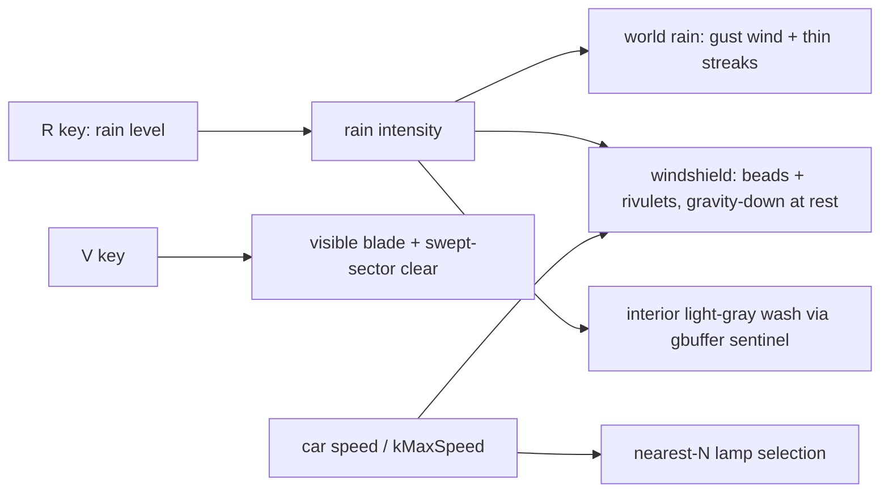
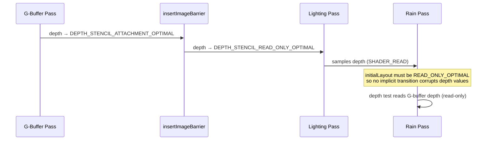

# Changelog

All notable changes to Swish are documented here.

---

## [Unreleased]

### 2026-06-30 — Fixed depth→world reconstruction: enforce Vulkan [0,1] clip-Z (P0 #1)

> Defined `GLM_FORCE_DEPTH_ZERO_TO_ONE` on the `swish` and `swish_tests` targets. `glm::perspective` was emitting OpenGL `[-1,1]` clip-Z while the Vulkan depth buffer stores `[0,1]`, so the shader depth→world reconstruction (`lighting.frag`, `ssao.frag`) fed raw `[0,1]` depth into an inverse-projection built for `[-1,1]` — corrupting every reconstructed world position (and thus every light, specular highlight, and distance attenuation). This is the single highest-leverage correctness fix in the renderer.

Technical summary

**Root cause.** With the default (OpenGL) convention, `glm::perspective` maps the near plane to NDC-Z $-1$ and the far plane to $+1$:

$$ z_{\text{ndc}}^{\text{GL}} \in [-1, 1], \qquad z_{\text{ndc}}^{\text{VK}} \in [0, 1]. $$

The reconstruction in `lighting.frag` builds `ndc = vec4(uv*2-1, depth, 1)` from the raw `[0,1]` depth-buffer sample and multiplies by `invProj`. When `invProj = inverse(proj)` and `proj` is the `[-1,1]` matrix, feeding a `[0,1]` depth is inconsistent, so `viewPos` (and the world position) is wrong for every non-degenerate pixel.

**Why the one-line fix is sufficient.** `invProj` is computed at runtime as `glm::inverse(m_camera->get_projection_matrix())` ([Renderer.cpp:453](src/renderer/Renderer/Renderer.cpp)), and the same `proj` is uploaded to the vertex shaders by `CameraUniforms`. Defining the macro makes *both* the depth buffer and `invProj` use `[0,1]` clip-Z, so the existing raw-depth reconstruction becomes correct with **no shader-math change**. The reconstruction inverts whatever projection was actually used:

$$ p_{\text{view}} = \text{invProj}\cdot(u\,{2}{-}1,\; v\,{2}{-}1,\; d,\; 1)^\top,\quad p_{\text{view}} /\!= p_{\text{view}}.w,\quad p_{\text{world}} = \text{invView}\cdot p_{\text{view}}. $$

**Sky-ray sample.** `reconstructWorldPos(uv, 0.5)` (sky branch) extracts only a *direction*; any valid depth along the pixel's view ray yields the same normalized direction, so `0.5` is fine under either convention (the review's "wrong under either convention" was imprecise). Added a clarifying comment rather than a behavioral change.

**Verification.** New Catch2 tests in [test_camera.cpp](tests/test_camera.cpp): (1) `near→0, far→1` convention assertion; (2) full world-point round-trip through proj/view and their inverses. A standalone check confirmed the macro flips near-plane NDC-Z from `-1.0000` → `0.0000` (far stays `1.0000`), so test (1) fails on the old convention and passes on the new — a genuine regression guard. `ctest` 34→**36/36**.

| File | Change |
|---|---|
| [CMakeLists.txt](CMakeLists.txt) | `GLM_FORCE_DEPTH_ZERO_TO_ONE` on `swish` |
| [tests/CMakeLists.txt](tests/CMakeLists.txt) | same define on `swish_tests` |
| [shaders/lighting.frag](shaders/lighting.frag) | comments documenting `[0,1]` depth expectation + direction-only sky sample |
| [tests/test_camera.cpp](tests/test_camera.cpp) | depth-convention + reconstruction round-trip tests |

### 2026-06-30 — Added GitHub Actions CI (build tests + shaders, run ctest) as the P0 regression gate

> New [`.github/workflows/ci.yml`](.github/workflows/ci.yml): on `ubuntu-latest`, installs the Vulkan SDK + GLFW + GLM, configures CMake, builds the `swish_tests` and `shaders` targets, and runs `ctest --output-on-failure`. No GPU needed — the test binary only links Camera/RoadScene/FileIO + GLM/GLFW/Catch2, and shaders are a static `glslc` → SPIR-V step.

Technical summary

**Motivation.** No `.github/` existed. Every specialist review recommended a CI gate *before* touching correctness code, so "fixed" stays fixed.

**Approach.** The top-level `CMakeLists.txt` calls `find_package(Vulkan REQUIRED)` and `find_program(GLSLC glslc ...)` (fatal if missing) during configure, so even the GPU-free tests need Vulkan dev files + `glslc`. The LunarG apt repo (codename via `lsb_release -cs`) provides both; GLFW/GLM come from `libglfw3-dev`/`libglm-dev`. The job forces `-DSWISH_BACKEND=LINUX_VULKAN` and builds only `shaders` + `swish_tests` (not the MoltenVK-linked `swish` binary).

| File | Change |
|---|---|
| [.github/workflows/ci.yml](.github/workflows/ci.yml) | New CI workflow: deps → configure → build shaders + tests → ctest |

Verified: YAML validated with `yq`; the CI steps replicate the local build that was confirmed green (shaders compile, `ctest` 34/34). An actual Actions run requires a push (not performed here).

### 2026-06-30 — Fixed RoadScene emitting geometry for degenerate (zero-lane / zero-length) configs

> `RoadScene::generate()` now early-returns an empty scene when `lane_count <= 0` or `road_length <= 0`, so the two long-failing degenerate-input tests pass and the test suite is fully green — a prerequisite for the CI regression gate.

Technical summary

**Root cause.** `generate()` unconditionally ran every sub-generator. Several of them (Jersey barrier, grass) are independent of `lane_count`/`road_length`, so even a `lane_count == 0` or `road_length == 0` config produced 656 vertices / 960 indices. Tests `RoadScene zero-lane config produces no geometry` and `RoadScene zero-length config produces no geometry` asserted an empty mesh and had never passed against this code.

**Fix.** Added a degenerate-input guard at the top of `generate()` that returns the empty `SceneData` before any sub-generator runs.

| File | Change |
|---|---|
| [src/scene/RoadScene/RoadScene.cpp](src/scene/RoadScene/RoadScene.cpp) | Early-return empty scene when `m_lane_count <= 0 \|\| m_road_length <= 0.0f` |

Verified: `ctest` went from 32/34 → **34/34** passing; no other test changed.

### 2026-06-30 — Research briefs + visual-realism roadmap (rain · LIE · night scene)

> Added two cited research briefs and a research-driven roadmap. [`docs/research-rain-rendering.md`](docs/research-rain-rendering.md) surveys realistic-rain techniques (streak appearance, drops-on-glass, GPU particle/parallax systems, wet surfaces, atmospheric veils) and [`docs/research-night-scene-realism.md`](docs/research-night-scene-realism.md) surveys night-scene realism (many-lights, wet-asphalt BRDF, tone mapping, volumetric fog, procedural road, motion/camera). Both are labelled **AI-assisted** per org policy. [`tasks/todo.md`](tasks/todo.md) gains a prioritized 3-track roadmap (A: rain next-steps, B: LIE curvature/LOD/enrichment, C: night-scene wet-road/bloom/tone-map/fog/SSR), each item linked to its motivating technique.

Technical summary

- **Two research briefs** compiled via parallel web research with URL verification (~30+ sources total): peer-reviewed papers (Garg & Nayar, Halder ICCV'19, Olsson clustered shading, McGuire & Mara SSR ray-trace, Nakamae drive-sim wet road, Narasimhan & Nayar atmospherics), SIGGRAPH/EG course notes (Tatarchuk, Lagarde Frostbite PBR + wet surfaces, Wronski/Hillaire volumetric fog, Jimenez post-processing), GDC talks, and university slides (UCSD CSE 167/168, UPenn CIS 565, UW ARCH 481). Each entry: full citation, verified URL, technique summary, and a concrete "how it applies to swish" note; both close with a ranked **Top-8 actionable techniques** list.
- **Labeling:** both briefs carry an "AI-assisted research artifact" header (org transparency requirement for largely-AI-generated work outputs); flagged unverifiable/paywalled sources inline.
- **Roadmap** ([`tasks/todo.md`](tasks/todo.md)): Track A (light-source-dependent streaks, impact splashes, lens-drops overlay, Heartfelt validation, wetness mip-blur); Track B (curved OpenDRIVE-style centerline, distance LOD + billboard impostors, roadside enrichment via deferred decals, network-first refactor); Track C (wet-asphalt `WetLevel` BRDF lerp, bloom firefly suppression, tone-map + auto-exposure, froxel volumetric fog, SSR, clustered light culling + IES lights, camera motion blur, mesopic/Purkinje night look, circular-bokeh DOF). Sequenced by impact-per-effort with dependency notes.
- **Docs index** ([`docs/README.md`](docs/README.md)) links both briefs.

| File | Change |
|---|---|
| [`docs/research-rain-rendering.md`](docs/research-rain-rendering.md) | NEW — cited rain-rendering survey (7 sections + ranked Top-8) |
| [`docs/research-night-scene-realism.md`](docs/research-night-scene-realism.md) | NEW — cited night-scene survey (7 sections + ranked Top-8 + verification summary) |
| [`tasks/todo.md`](tasks/todo.md) | Prepended 3-track research-driven roadmap with checkable items |
| [`docs/README.md`](docs/README.md) | Indexed both research briefs |
| [`CHANGELOG.md`](CHANGELOG.md) | This entry |

### 2026-06-30 — Windshield drops: smaller beads, dense "hard rain" spray

> User feedback on the rain pass: beads were too large, and heavy rain should pelt the glass with many more droplets. Tuned [`windshield_rain.frag`](shaders/windshield_rain.frag) — beads are now smaller and far denser at high intensity, while the glass stays see-through between them (small discrete beads keep clear gaps, so no return of the gray veil).

Technical summary

- **Smaller, denser sliding beads**: `DropLayer2` grid `a.x 4→6` (more across-flow cells → more, smaller lens bodies), lens `mainDrop S(0.38→0.30)`, second layer scale `1.4→1.9` (finer beads).
- **Dense impact spray that scales with rain**: `StaticDrops` cell count `28→55` (many small fresh-impact beads), and the static-layer weight ramps hard with intensity — `l0 = S(0.0,0.5)·0.65 → S(0.15,0.7)·0.95`: sparse at light rain, a heavy spray of droplets hitting the glass when it's raining hard.
- Composite remap `S(0.35,0.62)` and alpha cap `0.62` unchanged, so the many small beads stay discrete and the road/lights read through the gaps. Verified in-app at heavy rain, static and while driving.

### 2026-06-29 — Three-task pass: rain bugs + realism, 911 Turbo performance, +2 mi road

> Three parallel workstreams: (1) fixed the windshield "rain drifts **up** at rest" bug and the "blobby" falling rain, added gust wind, a **visible wiper blade** that actually clears, and a whole-cabin light-gray rain wash; (2) made the car perform like a **911 Turbo S** (was effectively capped at ~16 mph by a drag trap); (3) extended the LIE from 1 km to **~4.22 km** (+2 miles) with lamps that follow the car. Build clean; 32/34 tests (the 2 `RoadScene` zero-config failures are pre-existing). Verified in-app via screenshots while driving.

Technical summary

#### 1 — Rain bugs + realism

**"Rain goes up at rest" — root cause.** Not the `mod()` wrap in [`rain.vert`](shaders/rain.vert) (GLSL `mod()` is non-negative for a positive divisor, so world-rain fall was already correct). The upward motion was the **windshield drops**: their flow lives in mesh-UV space and this windshield's V axis is inverted vs the shader's `gravity = (0,1)` assumption, so at rest drops slid up. Fixed in [`windshield_rain.frag`](shaders/windshield_rain.frag) by flipping the flow Y sign — `gravity (0,1)→(0,−1)`, `aero (0.15,−1)→(0.15,1)` — so drops fall **down** at rest and stream **up** only at speed. The screen-space wetness map ([`windshield_wetness.frag`](shaders/windshield_wetness.frag)) was already correct and was left unflipped.

**Speed coupling.** Since the car's top speed changed (task 2), the windshield `speedFactor` divisor in [`Renderer.cpp`](src/renderer/Renderer/Renderer.cpp) is now `carSpeed / CarEntity::kMaxSpeed` (was a hardcoded `30000`), and the aero crossover moved to `smoothstep(0.25, 0.60)` (CPU + shader) so water streams up only at genuinely high speed.

**"Blobs" → streaks.** [`rain.frag`](shaders/rain.frag): cut the Garg–Nayar oscillation (`A20=A31 0.10→0.025`) and internal speckle (`0.22→0.06`) so the streak reads as one continuous thin line. [`RainSystem.cpp`](src/renderer/RainSystem/RainSystem.cpp): `kStreakLen 1200→3200` WU (length:width ≈ 400:1).

**Wind.** [`Renderer.cpp`](src/renderer/Renderer/Renderer.cpp): base wind `(1500,0,400)→(4500,0,1200)` WU/s with a time-varying gust $g(t)=1+0.55\sin(0.35t)+0.35\sin(1.30t+1.7)$ on the horizontal components; the existing `0.6·kDropSpeed` horizontal cap keeps streaks from foreshortening.

**Visible wiper + real clearing.** The wiper was wired but invisible (thin clear band, ~0.5 s re-wet, no blade). Added a screen-space SDF **blade** in [`windshield_rain.frag`](shaders/windshield_rain.frag) (pivot `(0.5,0.92)`, gated on `wiperState.z`), widened the cleared **sector** in [`windshield_wetness.frag`](shaders/windshield_wetness.frag) (`smoothstep 0.01–0.045 → 0.04–0.13`, reach `0.7→0.95`), and slowed re-wet (`+i·dt·2.0 → +i·dt·0.7`) so cleared glass stays clear ~1.4 s. Manual `V` toggle unchanged.

**Whole-cabin light-gray wash.** Tagged interior submeshes with a new `is_interior` flag on `Submesh` ([`SceneTypes.h`](src/scene/SceneTypes.h)), set in [`ModelManager.cpp`](src/scene/ModelManager/ModelManager.cpp) by node-name match (`Kit1_Interior_Geo`, `Kit1_InteriorTilling_Geo`). Tint routed through [`gbuffer.frag`](shaders/gbuffer.frag) via a **back-compatible sentinel** on the per-draw color alpha so the rest of the world is untouched:
> $\text{wash}=\mathrm{clamp}(\alpha-1,0,1),\quad \text{albedo}=\mathrm{mix}(\text{albedo},\,0.55,\,\text{wash})$

[`CarEntity::get_draw_calls`](src/scene/Entity/CarEntity.cpp) sets `color.a = 1 + m_rain_intensity·0.5` on interior submeshes; [`App.cpp`](src/core/App/App.cpp) feeds the rain level via `set_rain_intensity`. All existing draws keep `α=1` → wash 0.

> A first pass over-cooked both: heavy rain became an **opaque gray veil** and the cabin washed near-**white**. Tuned back to discrete see-through beads (drop composite `S(0.18,0.82)→S(0.35,0.62)`, haze/blur/refraction reduced, alpha cap kept `0.62`) and a true light gray (target `0.78→0.55`, wash `0.85→0.5`).

#### 2 — 911 Turbo S performance — [`CarEntity.h`](src/scene/Entity/CarEntity.h) / [`CarEntity.cpp`](src/scene/Entity/CarEntity.cpp)

**Root cause of "too slow":** the exponential drag `v \mathrel{*}= e^{-k\,dt}` with `k=2.5` capped throttle-held terminal speed at

$$v_\text{term}=\frac{k_\text{accel}}{k_\text{drag}}=\frac{18000}{2.5}=7200\ \text{WU/s}\approx 16\ \text{mph}$$

regardless of the 30000 clamp. Fix: `kDragCoeff 2.5→0.12` (terminal now $12000/0.12=100000 \ge$ top speed, so the clamp sets top speed), `kMaxForwardSpeed 30000→92000` WU/s (≈205 mph), `kAccel 18000→12000`, `kBrakeAccel 24000→36000`. With light linear drag, $v(t)=\frac{a}{k}(1-e^{-kt})$ gives 0–60 mph (26822 WU/s) at $t=-\ln(1-0.26822)/0.12 \approx 2.60\,\text{s}$. Added a **variable steering ratio** (`steer_scale = kSteerRefSpeed/(kSteerRefSpeed+|v|)`, `kSteerRefSpeed=12000`) on the effective lock only, so yaw rate stays bounded at 92000 WU/s (no spin-out) while parking-speed steering stays sharp; the visual wheel still tracks raw input.

#### 3 — Extend the LIE by two miles

[`config/road.toml`](config/road.toml): `length_m 1000 → 4218.688` (auto-baked to `road.bin` by the CMake `bake_configs` target). [`RoadScene.cpp`](src/scene/RoadScene/RoadScene.cpp): exit ramp + the 6 signs re-expressed relative to `z_far` (ramp ~75% out; signs at 10–90%) so they spread along the route instead of clustering in the first ~260 m, and the street-lamp generation cap removed so lamps are emitted for the whole length. Lamp lighting now scales: [`CameraUniforms.cpp`](src/renderer/CameraUniforms/CameraUniforms.cpp) `partial_sort`s lamps by distance and uploads the **nearest N to the camera** each frame; `MAX_POINT_LIGHTS 16→32` ([`SceneTypes.h`](src/scene/SceneTypes.h)) with the matching `pointLights[]` array bumped in [`lighting.frag`](shaders/lighting.frag) and [`basic.frag`](shaders/basic.frag).

#### File-change table (this task's edits)

| File | Change |
|---|---|
| [`shaders/windshield_rain.frag`](shaders/windshield_rain.frag) | gravity-Y flip; visible wiper blade SDF; discrete-bead tuning (no veil) |
| [`shaders/windshield_wetness.frag`](shaders/windshield_wetness.frag) | wider swept-sector clear; slower re-wet |
| [`shaders/rain.frag`](shaders/rain.frag) / [`rain.vert`](shaders/rain.vert) | less speckle → continuous thin streaks |
| [`shaders/gbuffer.frag`](shaders/gbuffer.frag) | back-compat alpha-sentinel light-gray interior wash |
| [`shaders/lighting.frag`](shaders/lighting.frag), [`basic.frag`](shaders/basic.frag) | `pointLights[16→32]` |
| [`RainSystem.cpp`](src/renderer/RainSystem/RainSystem.cpp) | `kStreakLen 1200→3200` |
| [`Renderer.cpp`](src/renderer/Renderer/Renderer.cpp) | gust wind; `speedFactor = carSpeed/kMaxSpeed` |
| [`WindshieldRainPass.cpp`](src/renderer/WindshieldRainPass/WindshieldRainPass.cpp) | aero crossover `0.25–0.60`; refraction tuning |
| [`CarEntity.h`](src/scene/Entity/CarEntity.h) / [`CarEntity.cpp`](src/scene/Entity/CarEntity.cpp) | 911 Turbo constants; variable steering ratio; interior tint + `set_rain_intensity` |
| [`CameraUniforms.cpp`](src/renderer/CameraUniforms/CameraUniforms.cpp) | nearest-N lamp selection |
| [`RoadScene.cpp`](src/scene/RoadScene/RoadScene.cpp) | length-relative ramp/signs; lamp cap removed |
| [`SceneTypes.h`](src/scene/SceneTypes.h) | `is_interior` flag; `MAX_POINT_LIGHTS 16→32` |
| [`ModelManager.cpp`](src/scene/ModelManager/ModelManager.cpp) | tag interior submeshes by name |
| [`App.cpp`](src/core/App/App.cpp) | feed rain level to car for interior wash |
| [`config/road.toml`](config/road.toml) | `length_m 1000 → 4218.688` |

### 2026-06-29 — Rain realism: thin, translucent, delicate (grounded in the references)

> Follow-up to the drop-model pass: the rain still read **"too thick."** Grounded in Garg & Nayar (thin, semi-transparent streaks with internal speckle), Rousseau (translucent multi-highlight streaks), and the in-repo `examples/DownPour` reference (combine drop layers with `max`, keep glass semi-transparent), both the windshield drops/rivulets and the falling streaks are now thin, translucent, and delicate — the scene clearly shows through at both light and heavy rain.

Technical summary

#### Root cause of "too thick"

1. **Windshield drop layers were composited *additively*** (`c = s + m1.x + m2.x` in `Drops()`), stacking three layers into a heavy, milky coverage.
2. **Glass alpha could reach 1.0** (`alpha = max(coverage, haze)`) — a fully-opaque veil hiding the scene.
3. **Falling streaks were fat and over-bright** — wide profile (`smoothstep(0.45,0.85)`), solid head, and a ×1.6 brightness boost from the prior pass.

The `examples/DownPour` reference (`drop_height.frag`, `windshield.frag`) showed the fixes: combine layers with `max()` (fine layers add *structure*, not thickness), keep glass alpha in a semi-transparent band (~0.2–0.5), small drops, weak refraction.

#### Windshield — [`windshield_rain.frag`](shaders/windshield_rain.frag)

- **`max`-combine, not sum**: `c = max(s, max(m1.x, m2.x))` then `S(0.18, 0.82, c)` — drops stay crisp and don't fill in.
- **Semi-transparent cap**: `alpha = clamp(coverage·0.9 + haze, 0, 0.62)` — the refracted scene always reads through.
- **Smaller drops**: body `S(0.4→0.34, 0, d)`, static `S(0.3→0.28)`, wake bead `S(0.3→0.22)`.
- **Thinner rivulets**: trail fold weight `0.6 → 0.45`. **Lighter haze**: `0.06+0.05·i → 0.035+0.03·i`. **Lighter lens**: body darken `0.72→0.85`, glint tightened (exp `22→30`) at `×1.25`.
- Pass refraction `0.080 → 0.070` ([`WindshieldRainPass.cpp`](src/renderer/WindshieldRainPass/WindshieldRainPass.cpp)).

#### Falling streaks — [`rain.vert`](shaders/rain.vert) + [`rain.frag`](shaders/rain.frag)

- Thinner billboards: width `6–14 → 3–8` WU; lower base opacity `0.25+0.75·sw → 0.20+0.60·sw`.
- Thinner bright core: profile `smoothstep(0.45,0.85) → smoothstep(0.12,0.72)`; **head taper** added (`smoothstep(0,0.06,y)`) so the streak is a thin lozenge.
- Translucent: drop the ×1.6 over-boost → `×1.15`, color eased to `(0.72,0.82,0.97)`; deeper internal speckle `0.85+0.15 → 0.78+0.22` (Garg & Nayar multi-highlight) kept on the N=7 average.

#### Verification

In-app screenshot loop (force `m_rainIntensity` = 1.0 then 0.35, build, capture, judge; reverted to 0.0). At both heavy and light rain the windshield shows small translucent teardrop drops with subtle glints and thin rivulets, road/sky clearly visible through the glass; streaks are thin. `make build` clean; 2 pre-existing `RoadScene` failures unrelated.

### 2026-06-29 — Rain realism tuning (in-app visual pass): windshield drops read as water, not rings

> Driven by looking at the running app (forced heavy rain, screenshot, iterate). The windshield drops were rendering as faint **ring outlines** with no rivulets; this pass makes them read as actual water — refractive teardrop bodies with bright glints and visible vertical rivulets — and makes the falling streaks legible.

Technical summary

#### What was wrong (seen in-app)

At heavy rain the windshield showed sparse **circular ring outlines**, no rivulets, and a flat gray veil. Two structural causes:

1. **Rivulets were invisible by construction.** The drop trail (`dropField().y`) was used *only* to reduce blur — it never entered the coverage or the surface normal, so the clinging→sliding rivulets drew nothing.
2. **Drops only showed their Fresnel rim.** The specular glint used the *macro* windshield normal (`fragNormal`), identical across the whole pane, so no individual bead caught a highlight. Against a low-contrast overcast scene the refracted body was indistinguishable from clear glass, leaving only the thin Fresnel rim → a ring.

#### The fix — [`windshield_rain.frag`](shaders/windshield_rain.frag)

- **Fold the trail into the height field**: `h = clamp(body + 0.6·trail, 0, 1)` for the value *and* both finite-difference offsets, so rivulets get a real lens normal and refract/glint like drop bodies.
- **Per-drop sky glint**: a tight highlight from the *per-drop* normal `dropN` against a fixed overhead sky light $\hat{\mathbf L}=(-0.25,-0.55,1)$, so every bead and rivulet catches a glint independent of the weak overcast sun: $g=\max(\hat{\mathbf n}\!\cdot\!\hat{\mathbf L},0)^{22}\,c$, added as $0.92\text{–}1.0$ sky color × $1.4g$.
- **Darken the lens body** (`×mix(1, 0.72, coverage)`) for contrast against the dull sky, and **cut the haze** (`0.18+0.12·i` → `0.06+0.05·i`) so beads/rivulets carry the look instead of a gray wash. The sun glint now also uses `dropN` (per-drop) and is gated by coverage.

#### Pass constants — [`WindshieldRainPass.cpp`](src/renderer/WindshieldRainPass/WindshieldRainPass.cpp)

| knob | was | now |
|------|-----|-----|
| drop density (`params.z`) | 60 | **85** (finer, denser beads) |
| refraction strength (`params.w`) | 0.065 | **0.080** (more visible lensing) |
| Fresnel rim gain (`screenAndRefr.w`) | 0.05 | **0.06** |

#### Falling streaks — [`rain.frag`](shaders/rain.frag)

Brightened so the thin additive streaks read against the scene: color `(0.65,0.76,0.90)` → `(0.78,0.86,1.0)`, additive contribution ×1.6.

#### Verification

Verified in-app by forcing `m_rainIntensity=1.0` (reverted to 0.0 after), launching, and screenshotting the windshield + air: drops now read as refractive teardrops with glints and vertical rivulets (best over the darker dashboard; subtler over the bright sky, as expected), and diagonal falling streaks are visible. `make build` clean; the 2 `RoadScene` test failures are pre-existing/unrelated.

### 2026-06-29 — Rain overhaul: parallax world layer, retinal-persistence streaks, light/medium windshield trails, wet streetlight halos

> Four independent upgrades push the rain toward photoreal night-rain: world rain gains a **second, farther/slower parallax layer** for depth; streaks now show **multi-highlight speckle** (retinal-persistence integration); windshield **sliding rivulets appear at light/medium rain** instead of only heavy; and bright streetlights get a subtle **wet halo** that grows with wetness.

Technical summary

#### Motivation

- **World rain was a single shell** of streak billboards centered on the camera — no depth cue, so heavy rain read as a flat wall.
- **Streaks were single-sampled**: one Garg & Nayar oscillation evaluation per fragment gave a smooth streak, missing the speckled multi-highlight look of real night rain (a streak is the eye/exposure integral of a *vibrating* drop).
- **Windshield trails only ramped in at heavy rain**: the static-bead layer saturated immediately while the sliding-rivulet layer ramped over `[0.25, 0.75]`, so light/medium rain showed beads but no clinging→sliding rivulets (see [`docs/images/windshield-rain-fixed.png`](docs/images/windshield-rain-fixed.png)).
- **No wet-weather glow** around the road's warm sodium-vapor streetlights.

#### The changes

**1. World-rain second parallax layer** — [`RainSystem.cpp`](src/renderer/RainSystem/RainSystem.cpp) / [`.h`](src/renderer/RainSystem/RainSystem.h). A second `vkCmdDrawIndexed` inside `record_draws`, reusing the *same* pipeline / render pass / geometry / instance buffer, bound to a second per-frame "far" UBO with scaled params. No shader, pipeline, render-pass, Renderer, or CMake change. Additive blending + `depthWrite=false` make the two-layer draw order irrelevant (no sorting). Far-layer params:

$$\text{halfExtent}_\text{far}=2.0\,h,\quad \text{dropSpeed}_\text{far}=0.7\,v,\quad \text{intensity}_\text{far}=0.55\,i,\quad \text{streakLen}_\text{far}=0.8\,\ell$$

Lower far intensity dims the streaks for free ($\text{fragAlpha}\propto\text{intensity}$). The far field shares the near field's instance seeds, so it is **decorrelated** by a constant time phase $t_\text{far}=t+317\,\text{s}$ — since the two layers have different wrap periods ($2\,\text{halfExtent}/\text{dropSpeed}$), they never visibly re-align. The descriptor pool's `descriptorCount` and `maxSets` were doubled to `2·MAX_FRAMES_IN_FLIGHT` (else `vkAllocateDescriptorSets` → `VK_ERROR_OUT_OF_POOL_MEMORY`). Near-cabin fade and the horizontal-wind cap are unchanged and apply to both layers.

**2. Retinal-persistence streaks** — [`rain.frag`](shaders/rain.frag). The single oscillation/streak/speckle evaluation is replaced by an average of $N=7$ samples taken along the drop's vibration cycle, offsetting the (2,0)/(3,1) oscillation phase per sample, superimposing several highlight bands along the streak:

$$\text{streak} = \frac{1}{N}\sum_{k=0}^{N-1}\Big(1-\mathrm{smoothstep}(0.45,0.85,\;\tfrac{\text{edge}}{\max(0.7\,\text{osc}_k,\,0.2)})\Big)\big(0.85+0.15\sin(\cdots+s_k\,12)\big),\quad s_k=\tfrac{k}{N-1}$$

Output stays additive/premultiplied. This frag is shared by both rain layers, so the effect applies to near *and* far rain.

**3. Windshield light/medium trails** — [`windshield_rain.frag`](shaders/windshield_rain.frag). Retuned the intensity→layer weights so rivulets ramp in early and beads don't dominate, and re-gated the composite trail through the *sliding* weights (it was gated through the static-dot weight `l0`, which the damping would otherwise have suppressed):

| weight | before | after |
|--------|--------|-------|
| `l0` static beads | `clamp(S(-0.5,1.0,r)·2, 0,1)` → ~1.0 at light rain | `S(0.0,0.5,r)·0.65` |
| `l1` sliding layer | `S(0.25,0.75,r)` → ~0.10 at light rain | `S(0.05,0.45,r)` |
| `l2` sliding layer | `S(0.0,0.5,r)` | `S(0.0,0.40,r)` |
| trail gate | `max(m1.y·l0, m2.y·l1)` | `max(m1.y·l1, m2.y·l2)` |

**4. Wet streetlight halos** — [`lighting.frag`](shaders/lighting.frag). A small view-independent additive term in the point-light loop, gated by wetness (rain intensity is not available in this pass; wetness already tracks it), which the bloom pass then spreads into a halo:

$$\mathbf C \mathrel{+}= \mathbf C_\ell\,I_\ell\,\,\text{att}^2\,\,w\,\,k_\text{halo},\qquad k_\text{halo}=0.12$$

`att²` concentrates the glow near each lamp; the term is zero when dry, so the dry look is unchanged.

#### Files changed

| File | Change |
|------|--------|
| [`src/renderer/RainSystem/RainSystem.h`](src/renderer/RainSystem/RainSystem.h) | Far-layer UBO trio (`m_rainUBOsFar`/`Memories`/`Mapped`) + `m_descSetsFar` |
| [`src/renderer/RainSystem/RainSystem.cpp`](src/renderer/RainSystem/RainSystem.cpp) | Far-layer constants; far UBO create/map/fill; doubled descriptor pool + 2nd alloc + batched writes; 2nd draw in `record_draws`; far cleanup |
| [`shaders/rain.frag`](shaders/rain.frag) | $N=7$ retinal-persistence multi-sample streak averaging |
| [`shaders/windshield_rain.frag`](shaders/windshield_rain.frag) | Retuned `l0/l1/l2` weights + trail re-gated through sliding layers |
| [`shaders/lighting.frag`](shaders/lighting.frag) | Wetness-scaled additive halo around point lights |

#### Data flow — two-layer world rain (one render pass, one pipeline)

#### Verification

`make build` clean — all three shaders compile via glslc, `swish` + tests link. `clang-format` applied. Descriptor pool correctly sized for both sets. Two pre-existing `RoadScene zero-*-config` test failures are unrelated (working-tree `RoadScene.cpp` changes predating this work; no rain/lighting references). Visual confirmation pending an interactive `make run` (R cycles rain, V toggles wiper).

### 2026-06-28 — Windshield rain: persistent wetness map (real wipe-off + speed-driven flow)

> Rain now **accumulates** on the windshield and the wiper genuinely **wipes it off** (cleared glass stays clear and re-wets over time), via a persistent screen-space wetness map. Water **flows in the push direction** — down at rest, **up at speed** — and a real bug that made the up-flow unreachable was fixed.

Technical summary

#### Root cause

The v1 wiper was *analytic*: it cleared only a thin band exactly at the blade, and drops re-appeared instantly behind it (no persistence) — it didn't read as "wiping water off." Separately, the gravity→aero flow crossover was `smoothstep(0.1, 0.6, speedFactor)`, but the car's terminal speed is drag-limited to $v_\text{term} \approx k_\text{accel}/k_\text{drag} = 18000/2.5 = 7200$ WU/s, giving a maximum $\text{speedFactor} = v/30000 \approx 0.24$ — well below the crossover, so water never actually went up.

#### The fix — a persistent wetness map

A new fullscreen pass ([`shaders/windshield_wetness.frag`](shaders/windshield_wetness.frag)) maintains an R16F screen-space "how wet" field each frame (ping-pong A/B + a copy so the rain frag reads a fixed image):

$$W'(\mathbf x) = \mathrm{clamp}\!\Big(\,\underbrace{W(\mathbf x - \hat{\mathbf f}\,a)}_{\text{advect upstream}} + r\,i\,\Delta t \;-\; e\,\Delta t,\; 0,\,1\Big)\cdot\big(1 - \mathrm{wiper}(\mathbf x)\big)$$

- **accumulate** ($r\,i\,\Delta t$): rain wets the glass over time;
- **advect** ($\mathbf x - \hat{\mathbf f}\,a$): semi-Lagrangian, so wetness streams along the flow $\hat{\mathbf f}$;
- **wiper**: subtracts along the swept blade band — *persistently*, so cleared glass stays clear;
- **evaporate** ($e\,\Delta t$): slow drain.

The windshield-rain frag now **gates drop coverage by the sampled wetness** instead of running the wiper itself, so wiping truly removes drops and rain rebuilds them.

#### Speed-driven flow

The crossover was retuned to the achievable range so water clearly races up near full throttle:

$$\hat{\mathbf f} = \mathrm{normalize}\big(\mathrm{mix}(\mathbf g,\ \mathbf a,\ \mathrm{smoothstep}(0.05,\ 0.20,\ \text{speedFactor}))\big),\quad \mathbf g=(0,1),\ \mathbf a=(0.15,-1)$$

Both the wetness advection (CPU-computed `m_waterFlow`) and the drop motion (frag) use this same flow.

#### File changes

| File | Change |
|------|--------|
| [`shaders/windshield_wetness.frag`](shaders/windshield_wetness.frag) | New — fullscreen wetness-map update: accumulate + advect + wiper + evaporate |
| [`shaders/windshield_rain.frag`](shaders/windshield_rain.frag) | Gate drops by sampled `wetMap` (binding 2); removed the analytic wiper (now persistent); retuned flow crossover |
| [`src/renderer/WindshieldRainPass/WindshieldRainPass.h`](src/renderer/WindshieldRainPass/WindshieldRainPass.h)/[`.cpp`](src/renderer/WindshieldRainPass/WindshieldRainPass.cpp) | Ping-pong R16F wetness images + render pass + fullscreen pipeline + descriptors; `record_wetness_update()`; CPU flow + advect params; one-time clear |
| [`src/renderer/Renderer/Renderer.cpp`](src/renderer/Renderer/Renderer.cpp) | Calls `record_wetness_update` before the snapshot |
| [`CMakeLists.txt`](CMakeLists.txt) | Register `windshield_wetness.frag` |

**Verification:** build green; validation layers clean across many frames (the ping-pong update, transfer barriers, and binding-2 sampler all exercised). Visually confirmed: rain accumulates and the wiper clears a swath that **stays clear and rebuilds**. The up-at-speed flow is in place (crossover fix); a clean screenshot of the up-direction wasn't captured this session (an unrelated foreground app occluded the window) — confirm live by driving (hold ↑) with rain on.

### 2026-06-28 — docs: rain system architecture (README + Excalidraw diagram)

> Added a dedicated rain architecture document and an Excalidraw pipeline diagram explaining how both rain subsystems and the wiper are built — with LaTeX derivations, key GLSL/Vulkan snippets, tunables, and the academic/practical references used.

Technical summary

A new top-level rain doc consolidates the design into one place: the two subsystems (`RainSystem` falling streaks + `WindshieldRainPass` refractive drops), the per-frame pass order, and — for the windshield — the full math in collapsible sections:

- **Refraction lookup** $\mathbf{uv}' = \mathbf F_{xy}/\mathbf S - \hat{\mathbf n}_{xy}\,s_r\,c$ over an HDR **snapshot** (with the feedback-loop reasoning + transfer-barrier snippet).
- **Layered Voronoi height field** with signed-distance bodies and **stick-slip** sawtooth motion, $h = L(\mathbf u;\rho) + 0.55\,L(\mathbf u;2.3\rho)$.
- **Finite-difference normal** $\hat{\mathbf n} = \mathrm{normalize}(0.03\,\nabla h, 1)$, Fresnel rim $F=(1-n_z)^3$.
- **Front-pane confinement** via the object-space normal mask, and the **analytic wiper** blade SDF $\theta=\sin(\phi)\,\theta_{\max}$.

Plus a UBO-layout table, tunables table, controls, verification, limitations, and the reference list (Tatarchuk 2006, Heartfelt, Godot, olivierprat, Codrops, Radiant).

| File | Change |
|------|--------|
| [`docs/rain/README.md`](docs/rain/README.md) | New — rain architecture overview with collapsed sections, LaTeX, snippets, references |
| [`docs/diagrams/rain-architecture.excalidraw`](docs/diagrams/rain-architecture.excalidraw) | New — per-frame pipeline + windshield drop-shader detail flow (43 elements) |

### 2026-06-28 — Windshield rain: scene-refraction rewrite + wiper

> Replaced the additive "glowing blobs" windshield rain with a physically-grounded scene-refraction model (drops act as tiny lenses distorting a snapshot of the HDR scene), confined the effect to the forward-facing windshield pane (no more rain inside the cabin), and added a continuous windshield wiper toggled with `V`.

Technical summary

#### Root cause (see [`issue.md`](issue.md))

The Phase-5 windshield rain had two defects:

1. **Glowing blobs.** `beadScale = 12` gave ~12 Voronoi cells across the *entire screen* (each drop ≈8% of screen); a wide soft-halo falloff; **additive blending** so drops *emitted* light; and the drop field lived in *screen space*, so it slid as the camera turned.
2. **Rain inside the cabin.** The loader tagged the cabin-facing inner pane (`WindowInside_Geo`); the pass was double-sided (`VK_CULL_MODE_NONE`); nothing isolated the exterior surface.

#### The fix

**Refraction instead of emission.** After the glass pass, the HDR scene is snapshotted into a per-frame sampleable image (`vkCmdCopyImage`, since sampling the live HDR render target would be a read/write feedback loop). The windshield fragment shader builds a procedural drop **height field** in glass-space UV (`fragUV`), derives the surface **normal via finite differences**, and refracts the snapshot:

$$\mathbf{n} = \mathrm{normalize}(\nabla h),\qquad \mathbf{uv}_{\text{refr}} = \frac{\mathbf{gl\_FragCoord}_{xy}}{\text{screenSize}} - \mathbf{n}\cdot s_{\text{refr}}\cdot \text{coverage}$$

The pipeline switched from additive to **alpha blend** (`SRC_ALPHA / ONE_MINUS_SRC_ALPHA`) so only drops are visible and the clear glass passes through untouched.

**Higher density + glass-space.** Two stacked Voronoi layers at ~90 and ~207 cells across the glass (per-drop hash for size/phase) with tight bodies + Fresnel rim + a small sun glint, plus stick-slip (sawtooth) drop motion along a gravity→aero flow. The field uses mesh `inUV`, so drops stick to the pane.

**Confined to the front windshield.** The loader now tags only the outer `Window_Geo` (the inner `WindowInside_Geo` term was dropped); the pipeline uses single-sided culling; and — because the Porsche's exterior glass is a single combined mesh (windshield + side + rear) — the fragment shader masks drops by the object-space normal (nose `+X`), keeping only the forward-facing pane.

**Wiper.** A `Vec4 wiperState` in the UBO carries an analytic blade angle ($\theta = \sin(\phi)\cdot 1.15$ rad). The fragment shader clears drops along a rotating line-segment SDF in glass space. `V` toggles the continuous sweep (edge-detected, mirroring the `R` rain key).

#### Pass ordering

#### File changes

| File | Change |
|------|--------|
| [`shaders/windshield_rain.frag`](shaders/windshield_rain.frag) | Rewritten: layered Voronoi drops, stick-slip motion, finite-difference normals, scene refraction from `sceneRefr`, Fresnel rim + sun glint, front-normal mask, analytic wiper clear; alpha output |
| [`shaders/windshield_rain.vert`](shaders/windshield_rain.vert) | Emits glass-space `fragUV` + object-space `fragLocalNormal` (front mask); dropped screen-space UV |
| [`src/renderer/WindshieldRainPass/WindshieldRainPass.h`](src/renderer/WindshieldRainPass/WindshieldRainPass.h) | UBO → 4 `Vec4` (`screenAndRefr`, `wiperState`); refraction-source image/view/sampler arrays; wiper state; `record_scene_snapshot()`; `update()` gains `wiperEnabled` |
| [`src/renderer/WindshieldRainPass/WindshieldRainPass.cpp`](src/renderer/WindshieldRainPass/WindshieldRainPass.cpp) | Refraction image + sampler; descriptor set 1 binding 1 (combined image sampler); `record_scene_snapshot` (HDR↔transfer barriers + copy); wiper advance; pipeline → alpha blend + `FRONT` cull (cockpit sees the cabin-facing windshield face) |
| [`src/renderer/PostProcessManager/PostProcessManager.cpp`](src/renderer/PostProcessManager/PostProcessManager.cpp) | HDR image gains `VK_IMAGE_USAGE_TRANSFER_SRC_BIT` (blit source for the snapshot) |
| [`src/renderer/Renderer/Renderer.cpp`](src/renderer/Renderer/Renderer.cpp) / [`.h`](src/renderer/Renderer/Renderer.h) | Snapshot call between glass and windshield passes; `set_wiper_enabled()`; threads wiper into `update()` |
| [`src/scene/ModelManager/ModelManager.cpp`](src/scene/ModelManager/ModelManager.cpp) | `isWindshield` excludes `WindowInside_Geo` (outer pane only) |
| [`src/core/App/App.cpp`](src/core/App/App.cpp) / [`.h`](src/core/App/App.h) | `V` key edge-detected wiper toggle |
| [`tests/CMakeLists.txt`](tests/CMakeLists.txt) | Link `glfw` into `swish_tests` (pre-existing link break: `Camera.cpp` polls `glfwGetKey`) |

**Verification:** full build + shader compile green; validation layers clean (snapshot copy, transfer barriers, binding-1 sampler exercised every frame); loader logs `windshield: 1`. Visually confirmed in-app (`R` rain, `V` wiper): small refractive beads (not blobs), confined to the front windshield (no cabin/side-glass rain), wiper sweeps a clear streak — see [`docs/images/windshield-rain-fixed.png`](docs/images/windshield-rain-fixed.png). Two findings during verification: cull must be `FRONT` (the cockpit sees the windshield's cabin-facing back face; `BACK` rendered nothing), and the wiper runs in **screen space** because the windshield's mesh UVs are near-constant (not a clean `[0,1]` layout), so a glass-UV pivot missed the glass.

### 2026-06-28 — Phase 5: forward transparent glass, windshield rain trails

> Glass windows are now rendered in a dedicated forward transparent pass (Fresnel tint + sun specular). A second forward pass draws procedural Voronoi rain rivulets on the windshield; the streaks flow upward and accelerate with car speed, crossing from gravity-driven beads (~0 km/h) to aerodynamic streaks at highway speed.

Technical summary

#### Features added

**Forward transparent glass pass (`GlassPass`)**

The Porsche GLB contains three `alphaMode=BLEND` glass meshes — previously skipped by the loader with a "Phase 5 TODO". They are now loaded alongside the opaque car geometry into the same combined VBO/IBO (same vertex data, separate index ranges tracked via `is_glass = true` on `Submesh`). A dedicated `GlassPass` renders these ranges after the world rain pass using alpha blending (`SRC_ALPHA / ONE_MINUS_SRC_ALPHA`) and depth-test-read-only, so glass correctly occludes and is occluded by all opaque geometry.

Glass material parameters come directly from the glTF `pbrMetallicRoughness.baseColorFactor` (dark tint, 25% base opacity). The fragment shader adds Fresnel rim opacity and a Blinn-Phong specular highlight from the sun, giving the characteristic look of dark tinted automotive glass with bright edge glints.

**Windshield rain trails (`WindshieldRainPass`)**

A second forward pass draws rain rivulets on the windshield and side windows. It reuses the same car VBO/IBO but draws only submeshes tagged `is_windshield = true` (nodes whose names contain `"Window_Geo"` or `"WindowInside_Geo"` and whose material is not `"RED_GLASS"`). The fragment shader uses Voronoi cellular noise at two frequency bands to produce beads and streaks:

- **At rest (speed = 0):** small round beads drift slowly downward under gravity.
- **Crossover at ~22 km/h (20% of max):** aerodynamic force begins overriding gravity.
- **At highway speed (≥ 60%):** beads elongate into high-frequency streaks racing upward along the windshield, with a slight horizontal tilt from the car's screen-space forward direction.

The `WindshieldRainUBO` (set 1, binding 0) carries the screen-space flow direction, speed factor, accumulated time, wetness, and intensity. The flow direction is computed each frame inside the `Renderer` from `m_carVelocity` projected through the camera view matrix — no App-level calculation required.

**`CarEntity` additions**

- `get_forward()` — returns the world-space unit vector aligned with the car nose (`(cos yaw, 0, −sin yaw)`), consistent with the physics integration convention.
- `get_windshield_draw_calls()` — returns draw calls for `is_windshield` glass submeshes only, stamped with the current model matrix.
- `kMaxSpeed` — static constexpr exposed for normalizing speed to [0, 1] in the renderer.

**Model loader (`ModelManager::load_car`)**

BLEND primitives are no longer skipped. Each glass primitive is added to the shared `MeshData` (same normalization + Y-rotation + grounding applied) and placed in a separate `glassSubmeshes` list. Node-name heuristics tag `is_windshield`:
- Contains `"Window_Geo"` or `"WindowInside_Geo"` — all window glass
- Does **not** contain `"RED_GLASS"` — excludes taillight/marker glass

The startup log now reports glass primitive and windshield counts instead of `"skipped: N"`.

**`SceneGeometry` — raw buffer accessors**

`get_vertex_buffer()` and `get_index_buffer()` expose the underlying `VkBuffer` handles so the glass and windshield rain passes can bind the car's device-local buffers without duplicating the upload or exposing internal state for any other purpose.

#### Descriptor set layouts for the new passes

| Pass | Set 0 | Set 1 | Push constants |
|------|-------|-------|---------------|
| `GlassPass` | `CameraUBO` (shared) | — | `PushConstantData { Mat4 model; Vec4 color; }` |
| `WindshieldRainPass` | `CameraUBO` (shared) | `WindshieldRainUBO` | `PushConstantData { Mat4 model; Vec4 color; }` |

#### Pipeline order

Both new passes use `LOAD_OP_LOAD` on the HDR color attachment and inherit the depth image in `DEPTH_STENCIL_READ_ONLY_OPTIMAL` — no barrier is needed between them.

#### Files changed

| File | Change |
|------|--------|
| [`src/scene/SceneTypes.h`](src/scene/SceneTypes.h) | `Submesh` gains `is_glass` and `is_windshield` |
| [`src/scene/Entity/Entity.h`](src/scene/Entity/Entity.h) / [`Entity.cpp`](src/scene/Entity/Entity.cpp) | `ModelEntity` gains `add_glass_submesh()`, `get_glass_submeshes()`, `get_glass_draw_calls()` |
| [`src/scene/Entity/CarEntity.h`](src/scene/Entity/CarEntity.h) / [`CarEntity.cpp`](src/scene/Entity/CarEntity.cpp) | `get_forward()`, `get_windshield_draw_calls()`, `kMaxSpeed` |
| [`src/scene/ModelManager/ModelManager.cpp`](src/scene/ModelManager/ModelManager.cpp) | BLEND geometry loaded into `glassSubmeshes`; windshield tagged by node name |
| [`src/renderer/SceneGeometry/SceneGeometry.h`](src/renderer/SceneGeometry/SceneGeometry.h) | `get_vertex_buffer()`, `get_index_buffer()` |
| [`src/renderer/GlassPass/GlassPass.h`](src/renderer/GlassPass/GlassPass.h) / [`GlassPass.cpp`](src/renderer/GlassPass/GlassPass.cpp) | New — forward transparent pass |
| [`src/renderer/WindshieldRainPass/WindshieldRainPass.h`](src/renderer/WindshieldRainPass/WindshieldRainPass.h) / [`WindshieldRainPass.cpp`](src/renderer/WindshieldRainPass/WindshieldRainPass.cpp) | New — windshield rain trail pass |
| [`shaders/glass.vert`](shaders/glass.vert) / [`glass.frag`](shaders/glass.frag) | New — glass tint + Fresnel + sun specular |
| [`shaders/windshield_rain.vert`](shaders/windshield_rain.vert) / [`windshield_rain.frag`](shaders/windshield_rain.frag) | New — procedural Voronoi rivulet shader |
| [`src/renderer/Renderer/Renderer.h`](src/renderer/Renderer/Renderer.h) / [`Renderer.cpp`](src/renderer/Renderer/Renderer.cpp) | `GlassPass` + `WindshieldRainPass` owned, initialized, recorded, and recreated |
| [`src/core/App/App.cpp`](src/core/App/App.cpp) | Glass + windshield draw calls uploaded at init and refreshed each frame |
| [`CMakeLists.txt`](CMakeLists.txt) | 2 new `.cpp` sources; 4 new shader sources |

---

### 2026-06-28 — Rain system: depth occlusion fix, fog tuning, and visibility improvements

> Rain streaks are now correctly depth-tested against the G-buffer, the grey washout on rain activation is fixed, and streaks are visibly denser in the near/mid field.

Technical summary

#### Root causes fixed

**1. Rain streaks invisible — depth image layout mismatch**

After the G-buffer pass, `transitionGBufferForLighting()` in
[`src/renderer/Renderer/Renderer.cpp`](src/renderer/Renderer/Renderer.cpp)
transitions the HDR depth image from `DEPTH_STENCIL_ATTACHMENT_OPTIMAL` →
`DEPTH_STENCIL_READ_ONLY_OPTIMAL` so the lighting shader can sample it.
The rain render pass was declaring `initialLayout = DEPTH_STENCIL_ATTACHMENT_OPTIMAL`,
which caused an implicit layout transition from the wrong source, corrupting the depth
buffer and making all rain fragments fail the depth test silently.

Fix: [`src/renderer/RainSystem/RainSystem.cpp`](src/renderer/RainSystem/RainSystem.cpp)
— `createRenderPass()` now uses `DEPTH_STENCIL_READ_ONLY_OPTIMAL` for both the
attachment description and the attachment reference, matching the actual image state.
The subpass dependency `srcStageMask` was updated from `LATE_FRAGMENT_TESTS`
(depth write) to `FRAGMENT_SHADER` (lighting pass depth sample), with
`srcAccessMask = SHADER_READ_BIT`.

**2. Scene washed out to grey on rain activation**

The atmospheric fog blend in
[`shaders/composite.frag`](shaders/composite.frag) applies:

$$\text{HDR}_\text{out} = \text{mix}(\text{HDR},\; f_\text{color} \cdot E,\; \text{clamp}(d \cdot I_\text{rain},\; 0,\; 0.4))$$

where $d$ is `fog_density`, $I_\text{rain}$ is rain intensity, and $E$ is exposure.
With $d = 0.18$ and $I_\text{rain} = 1.0$, the fog factor was $0.18$. For dark interior
surfaces with HDR $\approx 0.033$, the result was:

$$0.82 \times 0.033 + 0.18 \times 0.52 \approx 0.121$$

After AgX tonemapping this lifted to screen-space $\approx 106/255$ — 2× brighter than
without fog ($\approx 57/255$). The car interior appeared medium grey instead of dark,
compressing all contrast across the scene.

Fix: [`src/renderer/Renderer/Renderer.cpp`](src/renderer/Renderer/Renderer.cpp)
— `fog_density` reduced from `0.18` to `0.04`.

**3. Rain streaks barely visible — spawn box too large**

With `kHalfExtent = 50000 WU` (50 m radius), 8192 drops distributed across a
$100 \times 100 \times 100$ m box produce a density of:

$$n = \frac{8192}{(100\text{ m})^3} \approx 8.2 \times 10^{-3}\;\text{drops/m}^3$$

The number of drops in the 5–25 m frustum range (where each drop subtends a
visible streak) was only $\sim 52$. Each streak at 15 m covers $\sim 15$ pixels,
so the windshield area had very sparse coverage and streaks registered as barely
perceptible.

Reducing `kHalfExtent` to `20000 WU` (20 m radius) raises density to
$0.128\;\text{drops/m}^3$ — a **15× increase** — placing $\sim 400$ drops
in the 5–20 m visible range and producing a dense curtain of distinct streaks.

Fix: [`src/renderer/RainSystem/RainSystem.cpp`](src/renderer/RainSystem/RainSystem.cpp)
— `kHalfExtent` reduced from `50000.0f` to `20000.0f`.

#### Files changed

| File | Change |
|------|--------|
| [`src/renderer/RainSystem/RainSystem.cpp`](src/renderer/RainSystem/RainSystem.cpp) | Depth attachment `initialLayout`/`finalLayout`/ref → `READ_ONLY_OPTIMAL`; subpass dep `srcStage`/`srcAccess` updated; `kHalfExtent` 50 000 → 20 000 WU |
| [`src/renderer/Renderer/Renderer.cpp`](src/renderer/Renderer/Renderer.cpp) | `fog_density` 0.18 → 0.04 |

---

### 2026-06-27 — GPU rain system, speed-based streaks, AgX tonemapper, 16-bit swapchain

> Implemented GPU-driven rain (billboard quads, additive blending, wetness), speed-dependent streak direction, AgX tonemapping, and optional 16-bit extended-sRGB swapchain.

Technical summary

#### Features added

**GPU rain system**
- [`src/renderer/RainSystem/RainSystem.h`](src/renderer/RainSystem/RainSystem.h) /
  [`RainSystem.cpp`](src/renderer/RainSystem/RainSystem.cpp): forward render pass after
  the lighting pass. 8 192 GPU-instanced billboard quads, each animated entirely on the
  vertex shader via a per-instance seed + time. Additive blending (`src = ONE`,
  `dst = ONE`). Wetness accumulates at `0.08 s⁻¹` and decays at `0.012 s⁻¹`.
- [`shaders/rain.vert`](shaders/rain.vert) /
  [`shaders/rain.frag`](shaders/rain.frag): view-space billboard aligned with the fall
  velocity; edge/tip smoothstep fade; cool blue-white output colour.
- Press **R** to cycle: off → light (0.35) → heavy (1.0).

**Speed-based streak direction**
- [`src/renderer/Renderer/Renderer.h`](src/renderer/Renderer/Renderer.h) /
  [`Renderer.cpp`](src/renderer/Renderer/Renderer.cpp): `set_car_velocity(Vec3)` exposes
  car velocity to the renderer.
- [`src/core/App/App.cpp`](src/core/App/App.cpp): velocity computed as
  `forward × speed` using the car's yaw angle, forwarded each frame.
- Effective wind passed to rain UBO: $\vec{w}_\text{eff} = \vec{w}_\text{rain} - \vec{v}_\text{car}$,
  so streaks lean into the windshield at speed.

**AgX tonemapper**
- [`shaders/composite.frag`](shaders/composite.frag): replaced Narkowicz ACES
  approximation with the Blender 3.4 AgX tonemapper (Troy Sobotka). Better hue
  preservation and saturation handling. GLSL `mat3` is column-major.

**16-bit swapchain**
- [`src/renderer/VulkanContext/VulkanContext.cpp`](src/renderer/VulkanContext/VulkanContext.cpp):
  optionally requests `VK_EXT_swapchain_colorspace` at instance creation.
- [`src/renderer/Swapchain/Swapchain.cpp`](src/renderer/Swapchain/Swapchain.cpp):
  prefers `VK_FORMAT_R16G16B16A16_SFLOAT + VK_COLOR_SPACE_EXTENDED_SRGB_LINEAR_EXT`;
  falls back to `B8G8R8A8_SRGB`. No shader change needed — AgX outputs linear [0, 1]
  which is correct for both colour-space variants.

**Depth occlusion (rain outside car only)**
- [`src/renderer/PostProcessManager/PostProcessManager.h`](src/renderer/PostProcessManager/PostProcessManager.h):
  `get_hdr_depth_view(frameIndex)` getter exposes the G-buffer depth to the rain system.
- Rain render pass attaches the shared HDR depth image read-only; pipeline has
  `depthTestEnable = VK_TRUE`, `depthWriteEnable = VK_FALSE`. Car body panels occlude
  rain; the open windshield area lets streaks through.

#### Pipeline order

---
