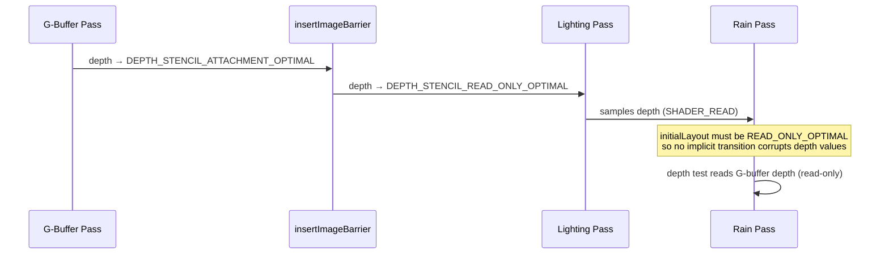

# Changelog

All notable changes to Swish are documented here.

---

## [Unreleased]

### 2026-06-28 — Windshield rain: persistent wetness map (real wipe-off + speed-driven flow)

> Rain now **accumulates** on the windshield and the wiper genuinely **wipes it off** (cleared glass stays clear and re-wets over time), via a persistent screen-space wetness map. Water **flows in the push direction** — down at rest, **up at speed** — and a real bug that made the up-flow unreachable was fixed.

Technical summary

#### Root cause

The v1 wiper was *analytic*: it cleared only a thin band exactly at the blade, and drops re-appeared instantly behind it (no persistence) — it didn't read as "wiping water off." Separately, the gravity→aero flow crossover was `smoothstep(0.1, 0.6, speedFactor)`, but the car's terminal speed is drag-limited to $v_\text{term} \approx k_\text{accel}/k_\text{drag} = 18000/2.5 = 7200$ WU/s, giving a maximum $\text{speedFactor} = v/30000 \approx 0.24$ — well below the crossover, so water never actually went up.

#### The fix — a persistent wetness map

A new fullscreen pass ([`shaders/windshield_wetness.frag`](shaders/windshield_wetness.frag)) maintains an R16F screen-space "how wet" field each frame (ping-pong A/B + a copy so the rain frag reads a fixed image):

$$W'(\mathbf x) = \mathrm{clamp}\!\Big(\,\underbrace{W(\mathbf x - \hat{\mathbf f}\,a)}_{\text{advect upstream}} + r\,i\,\Delta t \;-\; e\,\Delta t,\; 0,\,1\Big)\cdot\big(1 - \mathrm{wiper}(\mathbf x)\big)$$

- **accumulate** ($r\,i\,\Delta t$): rain wets the glass over time;
- **advect** ($\mathbf x - \hat{\mathbf f}\,a$): semi-Lagrangian, so wetness streams along the flow $\hat{\mathbf f}$;
- **wiper**: subtracts along the swept blade band — *persistently*, so cleared glass stays clear;
- **evaporate** ($e\,\Delta t$): slow drain.

The windshield-rain frag now **gates drop coverage by the sampled wetness** instead of running the wiper itself, so wiping truly removes drops and rain rebuilds them.

#### Speed-driven flow

The crossover was retuned to the achievable range so water clearly races up near full throttle:

$$\hat{\mathbf f} = \mathrm{normalize}\big(\mathrm{mix}(\mathbf g,\ \mathbf a,\ \mathrm{smoothstep}(0.05,\ 0.20,\ \text{speedFactor}))\big),\quad \mathbf g=(0,1),\ \mathbf a=(0.15,-1)$$

Both the wetness advection (CPU-computed `m_waterFlow`) and the drop motion (frag) use this same flow.

#### File changes

| File | Change |
|------|--------|
| [`shaders/windshield_wetness.frag`](shaders/windshield_wetness.frag) | New — fullscreen wetness-map update: accumulate + advect + wiper + evaporate |
| [`shaders/windshield_rain.frag`](shaders/windshield_rain.frag) | Gate drops by sampled `wetMap` (binding 2); removed the analytic wiper (now persistent); retuned flow crossover |
| [`src/renderer/WindshieldRainPass/WindshieldRainPass.h`](src/renderer/WindshieldRainPass/WindshieldRainPass.h)/[`.cpp`](src/renderer/WindshieldRainPass/WindshieldRainPass.cpp) | Ping-pong R16F wetness images + render pass + fullscreen pipeline + descriptors; `record_wetness_update()`; CPU flow + advect params; one-time clear |
| [`src/renderer/Renderer/Renderer.cpp`](src/renderer/Renderer/Renderer.cpp) | Calls `record_wetness_update` before the snapshot |
| [`CMakeLists.txt`](CMakeLists.txt) | Register `windshield_wetness.frag` |

**Verification:** build green; validation layers clean across many frames (the ping-pong update, transfer barriers, and binding-2 sampler all exercised). Visually confirmed: rain accumulates and the wiper clears a swath that **stays clear and rebuilds**. The up-at-speed flow is in place (crossover fix); a clean screenshot of the up-direction wasn't captured this session (an unrelated foreground app occluded the window) — confirm live by driving (hold ↑) with rain on.

### 2026-06-28 — docs: rain system architecture (README + Excalidraw diagram)

> Added a dedicated rain architecture document and an Excalidraw pipeline diagram explaining how both rain subsystems and the wiper are built — with LaTeX derivations, key GLSL/Vulkan snippets, tunables, and the academic/practical references used.

Technical summary

A new top-level rain doc consolidates the design into one place: the two subsystems (`RainSystem` falling streaks + `WindshieldRainPass` refractive drops), the per-frame pass order, and — for the windshield — the full math in collapsible sections:

- **Refraction lookup** $\mathbf{uv}' = \mathbf F_{xy}/\mathbf S - \hat{\mathbf n}_{xy}\,s_r\,c$ over an HDR **snapshot** (with the feedback-loop reasoning + transfer-barrier snippet).
- **Layered Voronoi height field** with signed-distance bodies and **stick-slip** sawtooth motion, $h = L(\mathbf u;\rho) + 0.55\,L(\mathbf u;2.3\rho)$.
- **Finite-difference normal** $\hat{\mathbf n} = \mathrm{normalize}(0.03\,\nabla h, 1)$, Fresnel rim $F=(1-n_z)^3$.
- **Front-pane confinement** via the object-space normal mask, and the **analytic wiper** blade SDF $\theta=\sin(\phi)\,\theta_{\max}$.

Plus a UBO-layout table, tunables table, controls, verification, limitations, and the reference list (Tatarchuk 2006, Heartfelt, Godot, olivierprat, Codrops, Radiant).

| File | Change |
|------|--------|
| [`docs/rain/README.md`](docs/rain/README.md) | New — rain architecture overview with collapsed sections, LaTeX, snippets, references |
| [`docs/diagrams/rain-architecture.excalidraw`](docs/diagrams/rain-architecture.excalidraw) | New — per-frame pipeline + windshield drop-shader detail flow (43 elements) |

### 2026-06-28 — Windshield rain: scene-refraction rewrite + wiper

> Replaced the additive "glowing blobs" windshield rain with a physically-grounded scene-refraction model (drops act as tiny lenses distorting a snapshot of the HDR scene), confined the effect to the forward-facing windshield pane (no more rain inside the cabin), and added a continuous windshield wiper toggled with `V`.

Technical summary

#### Root cause (see [`issue.md`](issue.md))

The Phase-5 windshield rain had two defects:

1. **Glowing blobs.** `beadScale = 12` gave ~12 Voronoi cells across the *entire screen* (each drop ≈8% of screen); a wide soft-halo falloff; **additive blending** so drops *emitted* light; and the drop field lived in *screen space*, so it slid as the camera turned.
2. **Rain inside the cabin.** The loader tagged the cabin-facing inner pane (`WindowInside_Geo`); the pass was double-sided (`VK_CULL_MODE_NONE`); nothing isolated the exterior surface.

#### The fix

**Refraction instead of emission.** After the glass pass, the HDR scene is snapshotted into a per-frame sampleable image (`vkCmdCopyImage`, since sampling the live HDR render target would be a read/write feedback loop). The windshield fragment shader builds a procedural drop **height field** in glass-space UV (`fragUV`), derives the surface **normal via finite differences**, and refracts the snapshot:

$$\mathbf{n} = \mathrm{normalize}(\nabla h),\qquad \mathbf{uv}_{\text{refr}} = \frac{\mathbf{gl\_FragCoord}_{xy}}{\text{screenSize}} - \mathbf{n}\cdot s_{\text{refr}}\cdot \text{coverage}$$

The pipeline switched from additive to **alpha blend** (`SRC_ALPHA / ONE_MINUS_SRC_ALPHA`) so only drops are visible and the clear glass passes through untouched.

**Higher density + glass-space.** Two stacked Voronoi layers at ~90 and ~207 cells across the glass (per-drop hash for size/phase) with tight bodies + Fresnel rim + a small sun glint, plus stick-slip (sawtooth) drop motion along a gravity→aero flow. The field uses mesh `inUV`, so drops stick to the pane.

**Confined to the front windshield.** The loader now tags only the outer `Window_Geo` (the inner `WindowInside_Geo` term was dropped); the pipeline uses single-sided culling; and — because the Porsche's exterior glass is a single combined mesh (windshield + side + rear) — the fragment shader masks drops by the object-space normal (nose `+X`), keeping only the forward-facing pane.

**Wiper.** A `Vec4 wiperState` in the UBO carries an analytic blade angle ($\theta = \sin(\phi)\cdot 1.15$ rad). The fragment shader clears drops along a rotating line-segment SDF in glass space. `V` toggles the continuous sweep (edge-detected, mirroring the `R` rain key).

#### Pass ordering

#### File changes

| File | Change |
|------|--------|
| [`shaders/windshield_rain.frag`](shaders/windshield_rain.frag) | Rewritten: layered Voronoi drops, stick-slip motion, finite-difference normals, scene refraction from `sceneRefr`, Fresnel rim + sun glint, front-normal mask, analytic wiper clear; alpha output |
| [`shaders/windshield_rain.vert`](shaders/windshield_rain.vert) | Emits glass-space `fragUV` + object-space `fragLocalNormal` (front mask); dropped screen-space UV |
| [`src/renderer/WindshieldRainPass/WindshieldRainPass.h`](src/renderer/WindshieldRainPass/WindshieldRainPass.h) | UBO → 4 `Vec4` (`screenAndRefr`, `wiperState`); refraction-source image/view/sampler arrays; wiper state; `record_scene_snapshot()`; `update()` gains `wiperEnabled` |
| [`src/renderer/WindshieldRainPass/WindshieldRainPass.cpp`](src/renderer/WindshieldRainPass/WindshieldRainPass.cpp) | Refraction image + sampler; descriptor set 1 binding 1 (combined image sampler); `record_scene_snapshot` (HDR↔transfer barriers + copy); wiper advance; pipeline → alpha blend + `FRONT` cull (cockpit sees the cabin-facing windshield face) |
| [`src/renderer/PostProcessManager/PostProcessManager.cpp`](src/renderer/PostProcessManager/PostProcessManager.cpp) | HDR image gains `VK_IMAGE_USAGE_TRANSFER_SRC_BIT` (blit source for the snapshot) |
| [`src/renderer/Renderer/Renderer.cpp`](src/renderer/Renderer/Renderer.cpp) / [`.h`](src/renderer/Renderer/Renderer.h) | Snapshot call between glass and windshield passes; `set_wiper_enabled()`; threads wiper into `update()` |
| [`src/scene/ModelManager/ModelManager.cpp`](src/scene/ModelManager/ModelManager.cpp) | `isWindshield` excludes `WindowInside_Geo` (outer pane only) |
| [`src/core/App/App.cpp`](src/core/App/App.cpp) / [`.h`](src/core/App/App.h) | `V` key edge-detected wiper toggle |
| [`tests/CMakeLists.txt`](tests/CMakeLists.txt) | Link `glfw` into `swish_tests` (pre-existing link break: `Camera.cpp` polls `glfwGetKey`) |

**Verification:** full build + shader compile green; validation layers clean (snapshot copy, transfer barriers, binding-1 sampler exercised every frame); loader logs `windshield: 1`. Visually confirmed in-app (`R` rain, `V` wiper): small refractive beads (not blobs), confined to the front windshield (no cabin/side-glass rain), wiper sweeps a clear streak — see [`docs/images/windshield-rain-fixed.png`](docs/images/windshield-rain-fixed.png). Two findings during verification: cull must be `FRONT` (the cockpit sees the windshield's cabin-facing back face; `BACK` rendered nothing), and the wiper runs in **screen space** because the windshield's mesh UVs are near-constant (not a clean `[0,1]` layout), so a glass-UV pivot missed the glass.

### 2026-06-28 — Phase 5: forward transparent glass, windshield rain trails

> Glass windows are now rendered in a dedicated forward transparent pass (Fresnel tint + sun specular). A second forward pass draws procedural Voronoi rain rivulets on the windshield; the streaks flow upward and accelerate with car speed, crossing from gravity-driven beads (~0 km/h) to aerodynamic streaks at highway speed.

Technical summary

#### Features added

**Forward transparent glass pass (`GlassPass`)**

The Porsche GLB contains three `alphaMode=BLEND` glass meshes — previously skipped by the loader with a "Phase 5 TODO". They are now loaded alongside the opaque car geometry into the same combined VBO/IBO (same vertex data, separate index ranges tracked via `is_glass = true` on `Submesh`). A dedicated `GlassPass` renders these ranges after the world rain pass using alpha blending (`SRC_ALPHA / ONE_MINUS_SRC_ALPHA`) and depth-test-read-only, so glass correctly occludes and is occluded by all opaque geometry.

Glass material parameters come directly from the glTF `pbrMetallicRoughness.baseColorFactor` (dark tint, 25% base opacity). The fragment shader adds Fresnel rim opacity and a Blinn-Phong specular highlight from the sun, giving the characteristic look of dark tinted automotive glass with bright edge glints.

**Windshield rain trails (`WindshieldRainPass`)**

A second forward pass draws rain rivulets on the windshield and side windows. It reuses the same car VBO/IBO but draws only submeshes tagged `is_windshield = true` (nodes whose names contain `"Window_Geo"` or `"WindowInside_Geo"` and whose material is not `"RED_GLASS"`). The fragment shader uses Voronoi cellular noise at two frequency bands to produce beads and streaks:

- **At rest (speed = 0):** small round beads drift slowly downward under gravity.
- **Crossover at ~22 km/h (20% of max):** aerodynamic force begins overriding gravity.
- **At highway speed (≥ 60%):** beads elongate into high-frequency streaks racing upward along the windshield, with a slight horizontal tilt from the car's screen-space forward direction.

The `WindshieldRainUBO` (set 1, binding 0) carries the screen-space flow direction, speed factor, accumulated time, wetness, and intensity. The flow direction is computed each frame inside the `Renderer` from `m_carVelocity` projected through the camera view matrix — no App-level calculation required.

**`CarEntity` additions**

- `get_forward()` — returns the world-space unit vector aligned with the car nose (`(cos yaw, 0, −sin yaw)`), consistent with the physics integration convention.
- `get_windshield_draw_calls()` — returns draw calls for `is_windshield` glass submeshes only, stamped with the current model matrix.
- `kMaxSpeed` — static constexpr exposed for normalizing speed to [0, 1] in the renderer.

**Model loader (`ModelManager::load_car`)**

BLEND primitives are no longer skipped. Each glass primitive is added to the shared `MeshData` (same normalization + Y-rotation + grounding applied) and placed in a separate `glassSubmeshes` list. Node-name heuristics tag `is_windshield`:
- Contains `"Window_Geo"` or `"WindowInside_Geo"` — all window glass
- Does **not** contain `"RED_GLASS"` — excludes taillight/marker glass

The startup log now reports glass primitive and windshield counts instead of `"skipped: N"`.

**`SceneGeometry` — raw buffer accessors**

`get_vertex_buffer()` and `get_index_buffer()` expose the underlying `VkBuffer` handles so the glass and windshield rain passes can bind the car's device-local buffers without duplicating the upload or exposing internal state for any other purpose.

#### Descriptor set layouts for the new passes

| Pass | Set 0 | Set 1 | Push constants |
|------|-------|-------|---------------|
| `GlassPass` | `CameraUBO` (shared) | — | `PushConstantData { Mat4 model; Vec4 color; }` |
| `WindshieldRainPass` | `CameraUBO` (shared) | `WindshieldRainUBO` | `PushConstantData { Mat4 model; Vec4 color; }` |

#### Pipeline order

Both new passes use `LOAD_OP_LOAD` on the HDR color attachment and inherit the depth image in `DEPTH_STENCIL_READ_ONLY_OPTIMAL` — no barrier is needed between them.

#### Files changed

| File | Change |
|------|--------|
| [`src/scene/SceneTypes.h`](src/scene/SceneTypes.h) | `Submesh` gains `is_glass` and `is_windshield` |
| [`src/scene/Entity/Entity.h`](src/scene/Entity/Entity.h) / [`Entity.cpp`](src/scene/Entity/Entity.cpp) | `ModelEntity` gains `add_glass_submesh()`, `get_glass_submeshes()`, `get_glass_draw_calls()` |
| [`src/scene/Entity/CarEntity.h`](src/scene/Entity/CarEntity.h) / [`CarEntity.cpp`](src/scene/Entity/CarEntity.cpp) | `get_forward()`, `get_windshield_draw_calls()`, `kMaxSpeed` |
| [`src/scene/ModelManager/ModelManager.cpp`](src/scene/ModelManager/ModelManager.cpp) | BLEND geometry loaded into `glassSubmeshes`; windshield tagged by node name |
| [`src/renderer/SceneGeometry/SceneGeometry.h`](src/renderer/SceneGeometry/SceneGeometry.h) | `get_vertex_buffer()`, `get_index_buffer()` |
| [`src/renderer/GlassPass/GlassPass.h`](src/renderer/GlassPass/GlassPass.h) / [`GlassPass.cpp`](src/renderer/GlassPass/GlassPass.cpp) | New — forward transparent pass |
| [`src/renderer/WindshieldRainPass/WindshieldRainPass.h`](src/renderer/WindshieldRainPass/WindshieldRainPass.h) / [`WindshieldRainPass.cpp`](src/renderer/WindshieldRainPass/WindshieldRainPass.cpp) | New — windshield rain trail pass |
| [`shaders/glass.vert`](shaders/glass.vert) / [`glass.frag`](shaders/glass.frag) | New — glass tint + Fresnel + sun specular |
| [`shaders/windshield_rain.vert`](shaders/windshield_rain.vert) / [`windshield_rain.frag`](shaders/windshield_rain.frag) | New — procedural Voronoi rivulet shader |
| [`src/renderer/Renderer/Renderer.h`](src/renderer/Renderer/Renderer.h) / [`Renderer.cpp`](src/renderer/Renderer/Renderer.cpp) | `GlassPass` + `WindshieldRainPass` owned, initialized, recorded, and recreated |
| [`src/core/App/App.cpp`](src/core/App/App.cpp) | Glass + windshield draw calls uploaded at init and refreshed each frame |
| [`CMakeLists.txt`](CMakeLists.txt) | 2 new `.cpp` sources; 4 new shader sources |

---

### 2026-06-28 — Rain system: depth occlusion fix, fog tuning, and visibility improvements

> Rain streaks are now correctly depth-tested against the G-buffer, the grey washout on rain activation is fixed, and streaks are visibly denser in the near/mid field.

Technical summary

#### Root causes fixed

**1. Rain streaks invisible — depth image layout mismatch**

After the G-buffer pass, `transitionGBufferForLighting()` in
[`src/renderer/Renderer/Renderer.cpp`](src/renderer/Renderer/Renderer.cpp)
transitions the HDR depth image from `DEPTH_STENCIL_ATTACHMENT_OPTIMAL` →
`DEPTH_STENCIL_READ_ONLY_OPTIMAL` so the lighting shader can sample it.
The rain render pass was declaring `initialLayout = DEPTH_STENCIL_ATTACHMENT_OPTIMAL`,
which caused an implicit layout transition from the wrong source, corrupting the depth
buffer and making all rain fragments fail the depth test silently.

Fix: [`src/renderer/RainSystem/RainSystem.cpp`](src/renderer/RainSystem/RainSystem.cpp)
— `createRenderPass()` now uses `DEPTH_STENCIL_READ_ONLY_OPTIMAL` for both the
attachment description and the attachment reference, matching the actual image state.
The subpass dependency `srcStageMask` was updated from `LATE_FRAGMENT_TESTS`
(depth write) to `FRAGMENT_SHADER` (lighting pass depth sample), with
`srcAccessMask = SHADER_READ_BIT`.

**2. Scene washed out to grey on rain activation**

The atmospheric fog blend in
[`shaders/composite.frag`](shaders/composite.frag) applies:

$$\text{HDR}_\text{out} = \text{mix}(\text{HDR},\; f_\text{color} \cdot E,\; \text{clamp}(d \cdot I_\text{rain},\; 0,\; 0.4))$$

where $d$ is `fog_density`, $I_\text{rain}$ is rain intensity, and $E$ is exposure.
With $d = 0.18$ and $I_\text{rain} = 1.0$, the fog factor was $0.18$. For dark interior
surfaces with HDR $\approx 0.033$, the result was:

$$0.82 \times 0.033 + 0.18 \times 0.52 \approx 0.121$$

After AgX tonemapping this lifted to screen-space $\approx 106/255$ — 2× brighter than
without fog ($\approx 57/255$). The car interior appeared medium grey instead of dark,
compressing all contrast across the scene.

Fix: [`src/renderer/Renderer/Renderer.cpp`](src/renderer/Renderer/Renderer.cpp)
— `fog_density` reduced from `0.18` to `0.04`.

**3. Rain streaks barely visible — spawn box too large**

With `kHalfExtent = 50000 WU` (50 m radius), 8192 drops distributed across a
$100 \times 100 \times 100$ m box produce a density of:

$$n = \frac{8192}{(100\text{ m})^3} \approx 8.2 \times 10^{-3}\;\text{drops/m}^3$$

The number of drops in the 5–25 m frustum range (where each drop subtends a
visible streak) was only $\sim 52$. Each streak at 15 m covers $\sim 15$ pixels,
so the windshield area had very sparse coverage and streaks registered as barely
perceptible.

Reducing `kHalfExtent` to `20000 WU` (20 m radius) raises density to
$0.128\;\text{drops/m}^3$ — a **15× increase** — placing $\sim 400$ drops
in the 5–20 m visible range and producing a dense curtain of distinct streaks.

Fix: [`src/renderer/RainSystem/RainSystem.cpp`](src/renderer/RainSystem/RainSystem.cpp)
— `kHalfExtent` reduced from `50000.0f` to `20000.0f`.

#### Files changed

| File | Change |
|------|--------|
| [`src/renderer/RainSystem/RainSystem.cpp`](src/renderer/RainSystem/RainSystem.cpp) | Depth attachment `initialLayout`/`finalLayout`/ref → `READ_ONLY_OPTIMAL`; subpass dep `srcStage`/`srcAccess` updated; `kHalfExtent` 50 000 → 20 000 WU |
| [`src/renderer/Renderer/Renderer.cpp`](src/renderer/Renderer/Renderer.cpp) | `fog_density` 0.18 → 0.04 |

---

### 2026-06-27 — GPU rain system, speed-based streaks, AgX tonemapper, 16-bit swapchain

> Implemented GPU-driven rain (billboard quads, additive blending, wetness), speed-dependent streak direction, AgX tonemapping, and optional 16-bit extended-sRGB swapchain.

Technical summary

#### Features added

**GPU rain system**
- [`src/renderer/RainSystem/RainSystem.h`](src/renderer/RainSystem/RainSystem.h) /
  [`RainSystem.cpp`](src/renderer/RainSystem/RainSystem.cpp): forward render pass after
  the lighting pass. 8 192 GPU-instanced billboard quads, each animated entirely on the
  vertex shader via a per-instance seed + time. Additive blending (`src = ONE`,
  `dst = ONE`). Wetness accumulates at `0.08 s⁻¹` and decays at `0.012 s⁻¹`.
- [`shaders/rain.vert`](shaders/rain.vert) /
  [`shaders/rain.frag`](shaders/rain.frag): view-space billboard aligned with the fall
  velocity; edge/tip smoothstep fade; cool blue-white output colour.
- Press **R** to cycle: off → light (0.35) → heavy (1.0).

**Speed-based streak direction**
- [`src/renderer/Renderer/Renderer.h`](src/renderer/Renderer/Renderer.h) /
  [`Renderer.cpp`](src/renderer/Renderer/Renderer.cpp): `set_car_velocity(Vec3)` exposes
  car velocity to the renderer.
- [`src/core/App/App.cpp`](src/core/App/App.cpp): velocity computed as
  `forward × speed` using the car's yaw angle, forwarded each frame.
- Effective wind passed to rain UBO: $\vec{w}_\text{eff} = \vec{w}_\text{rain} - \vec{v}_\text{car}$,
  so streaks lean into the windshield at speed.

**AgX tonemapper**
- [`shaders/composite.frag`](shaders/composite.frag): replaced Narkowicz ACES
  approximation with the Blender 3.4 AgX tonemapper (Troy Sobotka). Better hue
  preservation and saturation handling. GLSL `mat3` is column-major.

**16-bit swapchain**
- [`src/renderer/VulkanContext/VulkanContext.cpp`](src/renderer/VulkanContext/VulkanContext.cpp):
  optionally requests `VK_EXT_swapchain_colorspace` at instance creation.
- [`src/renderer/Swapchain/Swapchain.cpp`](src/renderer/Swapchain/Swapchain.cpp):
  prefers `VK_FORMAT_R16G16B16A16_SFLOAT + VK_COLOR_SPACE_EXTENDED_SRGB_LINEAR_EXT`;
  falls back to `B8G8R8A8_SRGB`. No shader change needed — AgX outputs linear [0, 1]
  which is correct for both colour-space variants.

**Depth occlusion (rain outside car only)**
- [`src/renderer/PostProcessManager/PostProcessManager.h`](src/renderer/PostProcessManager/PostProcessManager.h):
  `get_hdr_depth_view(frameIndex)` getter exposes the G-buffer depth to the rain system.
- Rain render pass attaches the shared HDR depth image read-only; pipeline has
  `depthTestEnable = VK_TRUE`, `depthWriteEnable = VK_FALSE`. Car body panels occlude
  rain; the open windshield area lets streaks through.

#### Pipeline order

---
