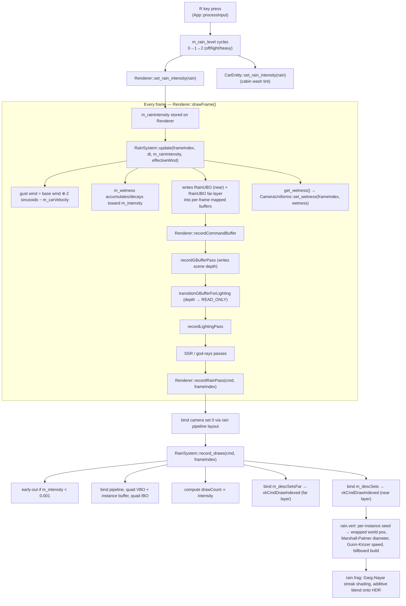

Searched for regex `rain|GLFW_KEY_R|set_rain_intensity|m_rainIntensity` (`**/src/core/App/**`), 24 results

Here's the full call chain from key press to pixels on screen, based on App.cpp and Renderer.cpp:

Key points:
- **Input → state**: `App::processInput` detects `GLFW_KEY_R`, cycles `m_rain_level` through `{0.0, 0.35, 1.0}`, and pushes it via `Renderer::set_rain_intensity()` (plus mirrors it to `CarEntity::set_rain_intensity()` for the cabin-wash tint).
- **Per-frame simulation**: `Renderer::drawFrame()` calls `RainSystem::update()` unconditionally every frame (even at intensity 0) — it advances gust wind, wetness, and writes both near/far `RainUBO`s.
- **Per-frame draw**: `Renderer::recordRainPass()` binds the camera descriptor set for the rain pipeline layout, then delegates to `RainSystem::record_draws()`, which does an early return if intensity is negligible, otherwise draws the far parallax layer then the near layer (same geometry/instance buffer, different descriptor set/UBO).
- **GPU side**: all the drop motion, size (Marshall–Palmer), and fall speed (Gunn–Kinzer) happen in rain.vert; the streak shape/shimmer and additive output happen in rain.frag — no CPU-side per-drop work at all.