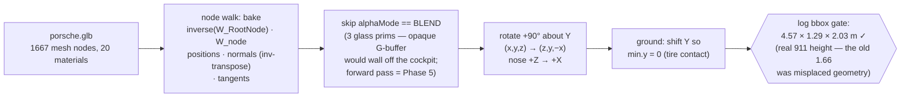
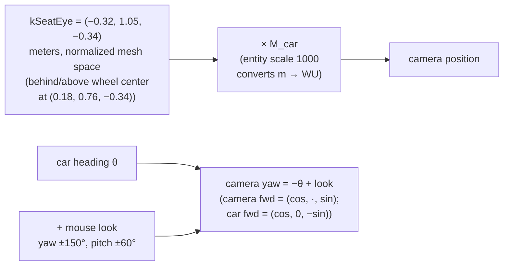
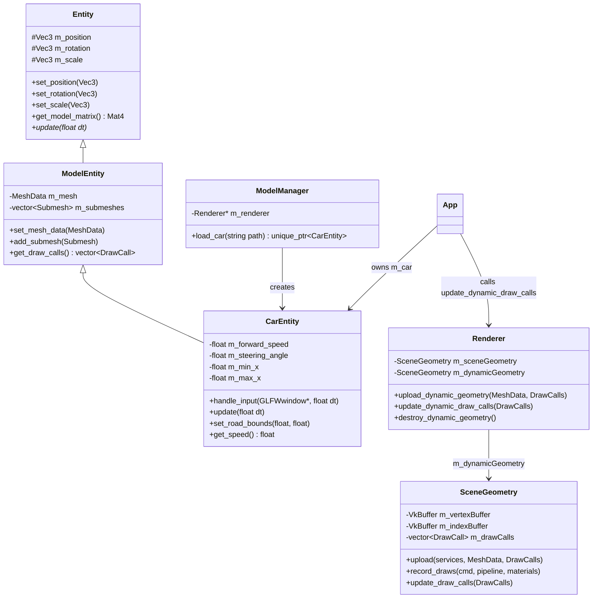
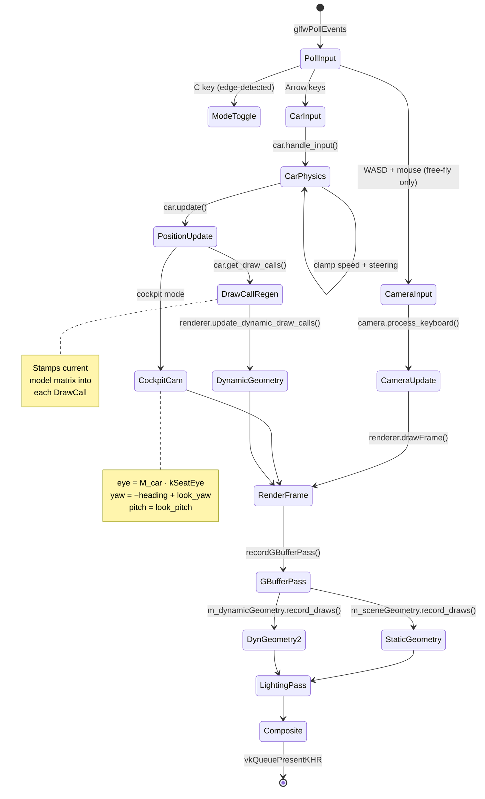
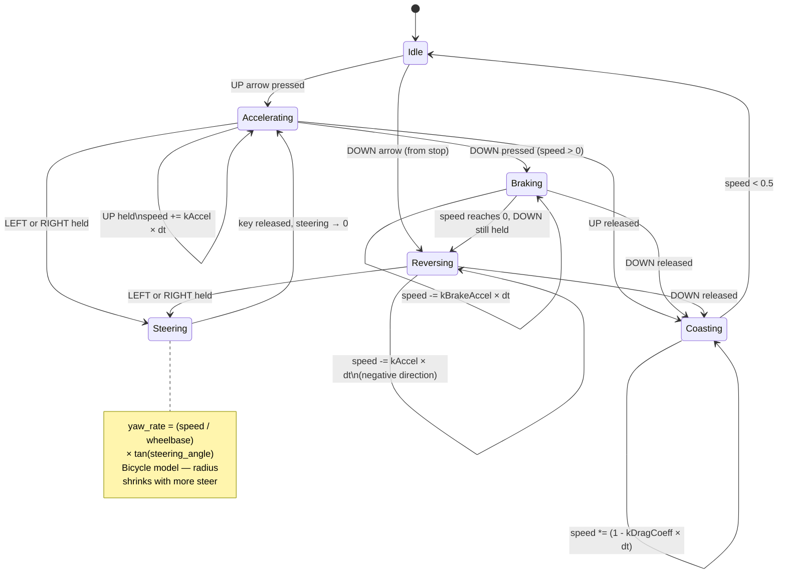

# Car System — Implementation Guide

## Coordinate Convention (read this first)

One definition of "forward" is shared by the mesh, the physics, and the
renderer, so the body always lines up with the direction of travel:

- The loader **normalizes the mesh** so the nose points **+X** at yaw 0.
- Heading: `forward = R_y(yaw)·(+X) = (cos(yaw), 0, −sin(yaw))`.
- Increasing yaw turns the body **left** (counterclockwise from above), so
  positive steering (= right) *decreases* yaw.
- **yaw = +90° faces −Z** — down the road, the same way the camera looks.

## Load-Time Mesh Normalization (node-walk loader)

`ModelManager::load_car()` walks the glTF node tree and bakes each mesh
node's transform **relative to the node named `RootNode`** into its
vertices. The chain *above* RootNode (Sketchfab axis conversion × FBX unit
scale, which nets ~10×) must not be baked; the chains *below* it place
pivoted parts — steering wheel, wipers, dials — correctly. 1,665 of the
1,667 mesh nodes carry a non-identity transform, which is why the interior
was missing before this existed. RootNode-relative space is the asset's raw
mesh space: meters, Y-up, nose +Z.



After this, `set_position(y = 0)` means "tires resting on the road surface"
(the road plane is at world Y = 0) and `set_rotation(0, 90, 0)` points the
nose down −Z.

## Cockpit Camera

The app starts in **cockpit mode**; `C` toggles cockpit ↔ free-fly.
No scene graph — the eye is *derived* from the car transform each frame:



In cockpit mode WASD camera flight is disabled (arrows drive the car);
in free-fly the camera detaches wherever it was and WASD/mouse work as
before. Mouse-look offsets reset on every toggle.

## Class Structure



---

## Per-Frame Data Flow



---

## Car Physics — State Diagram



---

## Changing Car Position

The car is spawned in `App.cpp` around line 182:

```cpp
car_entity->set_position(Vec3(6501.0f, 0.0f, -20000.0f));
car_entity->set_rotation(Vec3(0.f, 90.f, 0.f));  // +90° = nose down -Z
car_entity->set_scale(Vec3(1000.f, 1000.f, 1000.f));
```

| Parameter | Axis | Effect |
|-----------|------|--------|
| `X` | Left/Right | Move car across lanes (EB road ~1728–19610 WU) |
| `Y` | Up/Down | 0 = tires on the road (mesh is grounded at load); camera eye = ~1448 WU |
| `Z` | Forward/Back | Camera starts at −5000; more negative = further ahead |
| `rotation.y` | Yaw | +90° faces −Z (down the road); −90° faces +Z (wrong way) |
| `scale` | All | 1000 = 1 meter in world units; raise if car appears too small |

**Quick question to think about:** If you want the car to start at the camera's exact position so you're looking at it from behind, what Z offset would you add to put it 30m ahead?

---

## Improving the Drive Feel — What to Think About

The current physics is a **simplified bicycle model**. Here is what it lacks and what you'd need to add for each improvement:

### 1. Ground Contact (most impactful)
Right now `Y` is fixed. A real vehicle should sit on the road surface. What data would you need to query at the car's four wheel positions to determine the Y the car should be at?

### 2. Wheel Rotation Animation
The GLB model is static — the wheels don't spin. The car has separate wheel meshes. What property of the car's physics state would you use as the input to drive a wheel rotation angle? Think about: distance traveled per frame.

### 3. Steering Return Feel
The steering currently springs back at a fixed rate (`kSteerReturn`). Real cars return faster at high speed (self-aligning torque). Look at `CarEntity::handle_input()` — can you make the return rate a function of `m_forward_speed`?

### 4. Speed-Dependent Steering Sensitivity
At highway speed, full lock steering is dangerous. Look at `kSteerRate` in `CarEntity.h`. How would you scale it down as speed increases? What curve would feel good — linear? exponential?

### 5. Camera Follow Mode
Right now WASD controls a free camera. A follow camera would sit behind the car at a fixed offset in the car's local space. Given the car's `get_position()` and `get_rotation().y`, how would you compute the camera's world position?

**Hint:** The offset vector `(0, 1500, 3000)` in local space (up and behind) needs to be rotated by the car's yaw before being added to the car's position. Which GLM function rotates a vector by an angle around the Y axis?
