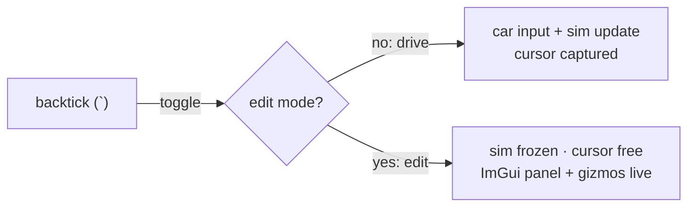
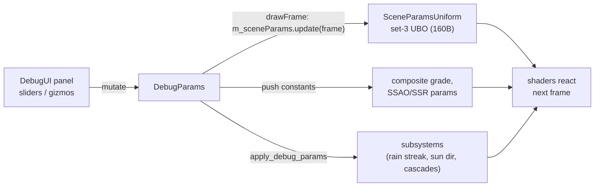

# In-Engine Debug / Tuning UI

A camera-app-style live-tuning overlay — sliders, gizmos, and TOML presets — for dialing
Swish's whole "look" against the reference LIE photograph without recompiling. It is gated
entirely behind `make debug` (`-DSWISH_DEBUG_UI=ON`): a normal `make run` release build
never compiles a line of it and produces **byte-identical** output.

> **Diagram:** the parameter data-flow is in
> [`docs/diagrams/debug-ui-dataflow.excalidraw`](diagrams/debug-ui-dataflow.excalidraw).

## What it is and why

Tuning a realistic look — sky gradient, fog density, wet-road porosity, shadow bias, IBL
strength, SSAO/SSR knobs — is iterative and visual. A recompile-per-tweak loop is death by
a thousand builds. So the branch adds an in-engine [Dear ImGui](https://github.com/ocornut/imgui)
panel: press backtick (`` ` ``) to freeze the scene into an editable frame, drag sliders and
gizmos, watch the running game react next frame, and save the result to a named TOML preset.

The design constraint is that **this must not touch release**. The whole system is a
compile-time feature: `#ifdef SWISH_DEBUG_UI`. The [release-safety strategy](#release-safety)
below is the interesting part — it's how a live-tunable engine and a provably-unchanged
release binary come from the same source.

## Edit mode vs drive mode

Input is a two-mode state machine keyed on backtick, handled in
[src/core/App/App.cpp](../src/core/App/App.cpp):

```cpp
// Backtick (`) toggles debug edit-mode: free the cursor for the panel and freeze the sim.
bool bt_down = glfwGetKey(glfw_window, GLFW_KEY_GRAVE_ACCENT) == GLFW_PRESS;
if (bt_down && !m_backtick_prev) {
    m_debug_edit_mode = !m_debug_edit_mode;
    glfwSetInputMode(glfw_window, GLFW_CURSOR,
                     m_debug_edit_mode ? GLFW_CURSOR_NORMAL : GLFW_CURSOR_DISABLED);
    m_renderer->set_debug_edit_mode(m_debug_edit_mode);
}
```

- **Drive mode** (default): cursor captured, arrow keys drive the car, WASD free-flies the
  camera, the sim advances.
- **Edit mode** (backtick): cursor freed for the panel, and the drive/physics input is
  **gated off** — `m_car->handle_input(...)` / `update(...)` only run `if (!debug_edit)`,
  and camera keyboard only runs `if (... && !debug_edit)`. The scene freezes so you tune a
  static frame. Steering/sun gizmos are only interactive in edit mode.



## The DebugParams single-struct pattern

Every tunable in the engine is one field of a single POD-ish struct,
[`DebugParams`](../src/debug/DebugParams.h). It is the **one source of truth** the UI
mutates and the renderer reads — no scattered globals, no per-subsystem config objects. The
struct groups its ~90 fields the way the panel groups them: grade, auto-exposure, sky, sun,
fog, reflection/IBL, SSR, SSAO, shadow/CSM, wet/rain, car/materials, steering, quality, plus
gizmo state and transient UI flags (`editMode`, `showPanel`, `ssaaApplyRequested`).

Because everything lives in one struct:
- the panel is a flat list of `ImGui::SliderFloat(&p.field, …)` calls,
- persistence (TOML) is a field-by-field serialize of one object,
- the renderer's `apply_debug_params` reads fields directly, and
- release simply never allocates the struct's *consumers* (the UBO, the gizmos) — the
  header is harmless to include unconditionally.

### Per-frame live-parameter flow

The flow from a slider to a shader reaction, every frame:



There are three transport lanes from `DebugParams` to the GPU, chosen by update frequency
and size:

| Lane | Carries | Mechanism |
|------|---------|-----------|
| **Set-3 UBO** | Sky / fog / reflection / shadow / wet / IBL constants (13+ values) | [`SceneParamsUniform`](../src/debug/SceneParamsUniform.h), one host-mapped UBO per frame, bound as set 3 to the lighting pipeline |
| **Push constants** | Composite grade (exposure, brightness/contrast/saturation, temp/tint, bloom); SSAO/SSR params | Written into the per-pass push block each frame |
| **CPU-side apply** | Sun direction, cascade fit, rain streak length, per-material overrides, steer override | `Renderer::apply_debug_params` + `App` feed subsystems directly |

<a id="release-safety"></a>
## Release-safety strategy — why release output is byte-identical

This is the core discipline of the branch. Three mechanisms make a live-tunable debug build
and a provably-unchanged release build from one source tree.

### 1. `#ifdef SWISH_DEBUG_UI` gating

The entire `src/debug/` module, the ImGui/ImGuizmo libraries, `DebugParamsIO`,
`SceneParamsUniform`, the set-3 pipeline layout append, and every debug-only render pass
(`recordSsaoPasses`, `recordSsrPass`, `recordLuminancePyramid`) are wrapped in
`#ifdef SWISH_DEBUG_UI`. Release doesn't compile, link, fetch, or record any of it. The
define is set only by the `SWISH_DEBUG_UI` CMake option (see [CMakeLists.txt](../CMakeLists.txt),
`option(SWISH_DEBUG_UI …)`), which also passes `-DSWISH_DEBUG_UI` to the shader compiler.

### 2. The `SP_*` macro pattern in lighting.frag

`lighting.frag` reads every scene constant through an `SP_*` macro. Under `SWISH_DEBUG_UI`
the macro reads the set-3 UBO; otherwise it expands to the **exact old literal**:

```glsl
#ifdef SWISH_DEBUG_UI
  layout(set = 3, binding = 0) uniform SceneParamsUBO { /* 10 vec4 rows */ } sp;
  #define SP_FOG_DIST63 sp.fogParams.x        // …18 macros total
  #define SP_IBL_DIFFUSE sp.iblParams.x
#else
  #define SP_FOG_DIST63 1200000.0             // the exact old literal
  #define SP_IBL_DIFFUSE 1.0
#endif
```

The key property: **`main()` is textually identical in both builds** — only the *source*
of each constant changes (a UBO read vs a compile-time literal). Compiling the release
`lighting.frag` through `glslc -O` yields SPIR-V with an identical opcode stream and
constant set (only internal SSA ids differ), and the release `.spv` contains **zero
`DescriptorSet 3`** references. The debug `.spv` contains it. That's the proof that release
is unchanged, not just an assumption.

The full macro table (with `#else` literals):

| Macro | Debug source | Release literal |
|-------|--------------|-----------------|
| `SP_SKY_HORIZON_OVERCAST` | `sp.skyHorizonOvercast.rgb` | `vec3(0.70, 0.80, 0.90)` |
| `SP_SKY_HORIZON_CLEAR` | `sp.skyHorizonClear.rgb` | `vec3(0.62, 0.80, 0.98)` |
| `SP_SKY_ZENITH_OVERCAST` | `sp.skyZenithOvercast.rgb` | `vec3(0.35, 0.55, 0.85)` |
| `SP_SKY_ZENITH_CLEAR` | `sp.skyZenithClear.rgb` | `vec3(0.09, 0.36, 0.86)` |
| `SP_SUN_DISC_EXP_MIN/MAX` | `sp.sunDisc.x` / `.y` | `32.0` / `220.0` |
| `SP_SUN_DISC_STR_MIN/MAX` | `sp.sunDisc.z` / `.w` | `0.3` / `0.9` |
| `SP_FOG_COLOR` | `sp.fogColor.rgb` | `vec3(0.52, 0.57, 0.63)` |
| `SP_FOG_DIST63` | `sp.fogParams.x` | `1200000.0` |
| `SP_FOG_MAX` | `sp.fogParams.y` | `0.65` |
| `SP_ENV_GLOSS_EXP` | `sp.fogParams.z` | `3.0` |
| `SP_SHADOW_BIAS` | `sp.shadowParams.x` | `0.0018` |
| `SP_SHADOW_FLOOR` | `sp.shadowParams.y` | `0.25` |
| `SP_WET_POROSITY` | `sp.wetParams.x` | `0.35` |
| `SP_WET_ROUGHNESS` | `sp.wetParams.y` | `0.12` |
| `SP_IBL_DIFFUSE` | `sp.iblParams.x` | `1.0` |
| `SP_IBL_SPECULAR` | `sp.iblParams.y` | `1.0` |

### 3. Primed no-op textures

Two composite operations are **always present** in the shader (release and debug), so
release must make them no-ops rather than branch:

- `hdr *= ao` — release primes the AO image **white** (`primeAOTexture`), so ×1 = identity.
- `hdr += texture(ssrTex).rgb` — release primes the SSR image **black**, so +0 = identity.

SSAO and SSR both *run* only in debug (their record functions are gated); the primed
textures cover the always-present composite reads. Same idea for the per-material roughness
multiplier: release passes `nullptr` overrides, so `record_draws` writes `material.z = 1.0`
(identity) and `gbuffer.frag`'s `roughness *= push.material.z` is a no-op.

The net result: **the release binary renders exactly what it did before the debug UI
existed**, verified by 52/52 tests and SPIR-V equivalence.

<a id="scene-params-ubo"></a>
## The scene-params UBO (descriptor set 3)

> **Diagram:** [`docs/diagrams/descriptor-sets-scene-params.excalidraw`](diagrams/descriptor-sets-scene-params.excalidraw).

Sets 0/1/2 are camera / G-buffer textures / shadow. The debug UI appends a **fourth**
descriptor set, **set 3 binding 0**, owned by [`SceneParamsUniform`](../src/debug/SceneParamsUniform.h):
one persistently-mapped host-visible UBO + descriptor set **per frame-in-flight**, bound to
the lighting pipeline. Each frame `Renderer::drawFrame` repacks the live `DebugParams` into
it right after the camera UBO write.

**std140, all-vec4 packing (MoltenVK-safe).** Every member is a `vec4`, with scalars packed
into lanes, so each field is 16-byte aligned. This sidesteps std140's `vec3` padding rules
entirely — the portability-subset-safe layout on MoltenVK, where mis-sized structs mis-map.
A `static_assert(sizeof(SceneParamsUBO) == 10 * 16)` pins the layout at **160 bytes**:

$$\underbrace{4\times\text{vec4}}_{\text{sky horizon/zenith} \times \text{overcast/clear}}\;+\;\underbrace{\text{sunDisc}}_{(e_{\min},e_{\max},s_{\min},s_{\max})}\;+\;\text{fogColor}\;+\;\underbrace{\text{fogParams}}_{(d_{63},\,\text{max},\,\text{glossExp})}\;+\;\underbrace{\text{shadowParams}}_{(\text{bias},\text{floor})}\;+\;\underbrace{\text{wetParams}}_{(\text{poros},\text{rough})}\;+\;\underbrace{\text{iblParams}}_{(\text{diff},\text{spec})}=160\,\text{B}$$

> The `iblParams` row was the 10th, appended when split-sum IBL landed (the CHANGELOG's
> earlier `9×16` figure predates it); the current assert is `10×16`.

**CameraUBO tail-append convention.** Rather than a new set, CSM data rides on the existing
camera UBO by appending after its vertex-shader prefix. `CameraUBO`
([SceneTypes.h](../src/scene/SceneTypes.h)) ends with `Vec4 sunColor; Vec4 weather;` — every
vertex shader (`basic/rain/glass/windshield`) declares only up to that prefix, so they stay
layout-compatible while `lighting.frag` alone declares and reads the appended
`Mat4 cascadeViewProj[3]` + `Vec4 cascadeSplits`. This is the same discipline: extend the
tail, keep the prefix binary-stable across shaders.

## Panel sections

The panel (`DebugUI::begin_frame`) is a set of `ImGui::CollapsingHeader` sections, each a
group of sliders bound to `DebugParams` fields:

| Section | Controls |
|---------|----------|
| **Image / Grade** | exposure, auto-exposure toggle + key/speed/min/max, brightness, contrast, saturation, temperature, tint, bloom threshold/intensity |
| **Sky** | horizon/zenith colours (overcast + clear), clarity, sun-disc exp/strength min/max |
| **Sun / Light** | sun colour, ambient, azimuth, elevation, **Sun gizmo** toggle |
| **Steering** | override + angle slider + Center, **wheel gizmo** toggle, axis-correction (euler + quaternion) |
| **Fog** | colour, distance-to-63%, max |
| **Reflections / IBL** | IBL diffuse/specular intensity, env gloss exp (legacy) |
| **SSR** | enabled, intensity, max distance, thickness, stride |
| **SSAO** | enabled, radius, bias, intensity |
| **Shadows** | shadow-compare bias, floor, CSM far, CSM split-λ, raster depth-bias const/slope |
| **Wet / Rain** | rain intensity, wet porosity, wet roughness, streak length |
| **Materials** | per-slot editor (see below) |
| **Quality** | SSAA scale + **Apply SSAA** |

Above the sections: canned presets (Reset / Overcast-LIE / Clear / Clear+Rain), a
**Print-values** button (dumps every field to stdout as a copy-pasteable block), and the
on-disk preset row.

## TOML presets (toml++)

**File:** [src/debug/DebugParamsIO.cpp](../src/debug/DebugParamsIO.cpp)

A hand-tuned look survives a quit via named presets on disk. Type a name, hit **Save** to
write `CONFIG_DIR/presets/<name>.toml`, **Load** to restore it, or pick any existing preset
from the "On disk" combo (scanned via `std::filesystem`). `CONFIG_DIR` is the compile-time
config path, so it's cwd-independent.

- The document is grouped exactly like the panel:
  `[grade] [sky] [sun] [fog] [reflection] [ssao] [ssr] [steering] [shadow] [wet] [car] [quality]`
  plus a `[[materials]]` array of tables for enabled override slots — so it hand-edits
  cleanly. `vec3`s serialize as 3-element arrays.
- **Merge-load policy:** every field loads with `value_or(current)`, so any key **absent
  from the file keeps its current in-app value**. Old presets stay forward-compatible as new
  fields are added — a preset written before `iblSpecular` existed simply leaves it at its
  default.
- Transient UI state (`editMode`, `showPanel`, `ssaaApplyRequested`) is never written.
- toml++ (v3.4.0) was already vendored for the `toml_baker` tool; the debug UI links it into
  `swish` only under `SWISH_DEBUG_UI`.

## Gizmos (ImGuizmo)

Two 3D handles float over the scene in edit mode, drawn to the ImGui foreground draw list.
`DebugUI::begin_frame(DebugParams& p, const Mat4& view, const Mat4& proj)` takes the camera
matrices so ImGuizmo can project.

### Sun gizmo

A `ROTATE` handle floated ~20 m in front of the camera (position is cosmetic, kept in view;
only the **rotation** is read back into `p.sunGizmoRot`). The Renderer derives the sun
direction as `normalize(mat3(sunGizmoRot) · baseSunDir)` in `apply_debug_params`, feeding
the CSM fit, sky, and IBL — so shadows, sky, and reflections all follow the drag.

### Steering-wheel gizmo + axis correction

> **Diagram:** [`docs/diagrams/steering-transform.excalidraw`](diagrams/steering-transform.excalidraw).

A `ROTATE_Z` (LOCAL) handle at the wheel's pivot poses the steering wheel. Because the
wheel's world-space Z is arbitrary, the per-frame **delta** rotation is recovered from the
delta matrix via the rotation-trace formula and signed by the delta axis vs the wheel's Z:

$$\theta = \arccos\!\Big(\tfrac{\operatorname{tr}(\Delta)-1}{2}\Big),\qquad \text{sign} = \operatorname{sign}\big(\vec a_\Delta \cdot \hat z_\text{wheel}\big)$$

where $\vec a_\Delta = (\Delta_{12}-\Delta_{21},\ \Delta_{20}-\Delta_{02},\ \Delta_{01}-\Delta_{10})$
is the skew-symmetric part. The recovered angle drives `CarEntity::m_steering_angle` (clamped
to the physical lock), so the front-wheel steer + car heading follow the same path the sim
uses.

**Axis correction — reorienting the whole wheel.** The panel also edits a *rest orientation*
correction quaternion `C` (via pitch/yaw/roll sliders and a synced `x/y/z/w` quaternion
editor) for when the GLB's pivot axis is slightly off. In
[CarEntity::get_draw_calls](../src/scene/Entity/CarEntity.cpp) the wheel's model matrix is:

$$M_\text{wheel} = M_\text{car}\cdot F_\text{pivot}\cdot C\cdot R(-\alpha)\cdot F_\text{pivot}^{-1}$$

where $F_\text{pivot}$ is the wheel's normalized `sw_pivot_frame`, $C = \text{mat4\_cast}(\text{correction})$
is the rest-orientation correction, and $R(-\alpha)$ is the local-Z spin by the steer angle.
Sandwiching in the pivot frame means the rotation happens about the wheel's hub, not the
world origin. Applying `C` as a **rest orientation** (not to the spin *axis*) means it
reorients the whole wheel and is visible at any steer angle — you can straighten a tilted
model. **Identity `C` reproduces the original spin exactly**, so release is unchanged. The
correction is persisted under `[steering]` in presets.

## Per-material editor

**Files:** [src/scene/SceneTypes.h](../src/scene/SceneTypes.h) (`MaterialOverride`),
[src/renderer/SceneGeometry/SceneGeometry.cpp](../src/renderer/SceneGeometry/SceneGeometry.cpp) (`record_draws`),
[shaders/gbuffer.frag](../shaders/gbuffer.frag)

`DebugParams` holds `MaterialOverride matOverrides[MAT_COUNT]` (one per `MaterialId` — asphalt,
concrete, signs, and car sub-materials `MAT_CAR_0..19`) + a `matEditSlot`. The panel is a slot
picker with a readable category label ("car" / "sign" / "asphalt" …), plus Override /
metalness / roughness-multiplier / colour for the selected slot, and Clear-this-slot /
Clear-all buttons.

When a slot's override is enabled, `SceneGeometry::record_draws` takes an optional
`const MaterialOverride*` table and routes colour → `push.color.rgb`, metalness →
`push.material.x`, roughness multiplier → `push.material.z`. `gbuffer.frag` applies
`roughness = clamp(roughness * push.material.z, …)`. The multiplier defaults to `1.0` and
release passes `nullptr`, so `material.z = 1.0` (identity) and release is unaffected.
Overrides persist as the `[[materials]]` TOML array.

## Libraries added

All three are vendored via CMake `FetchContent` **inside the `if(SWISH_DEBUG_UI)` block** —
release never fetches or builds them. See [CMakeLists.txt](../CMakeLists.txt).

| Library | Version | How vendored |
|---------|---------|--------------|
| **Dear ImGui** | `v1.91.5` | `FetchContent` → a project-owned `imgui` STATIC lib compiling the core `.cpp`s + the GLFW and Vulkan backends, linked into `swish` under the debug flag |
| **ImGuizmo** | `master` (pinned commit) | `FetchContent`; its single `src/ImGuizmo.cpp` is compiled **into the same `imgui` lib** so it shares one set of ImGui headers. Its own standalone `imguizmo` CMake target (which would fetch a second imgui) is set `EXCLUDE_FROM_ALL` so it never builds |
| **toml++** | `v3.4.0` | already vendored for `toml_baker`; linked into `swish` (`tomlplusplus::tomlplusplus`) only under `SWISH_DEBUG_UI` |

The `imgui.ini` layout file is gitignored (per-machine panel layout state).

## See also

- [realism-features.md](realism-features.md) — the GPU features every slider drives.
- [concepts.md](concepts.md) — the OOP/OOD and GPU concepts behind this system, as a study aid.
- CHANGELOG entries **2026-07-01** / **2026-07-02** — the authoritative per-feature write-ups.
