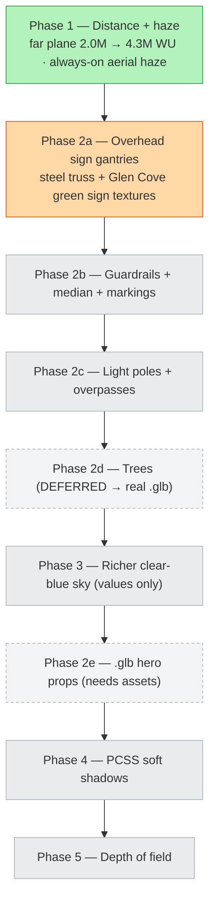
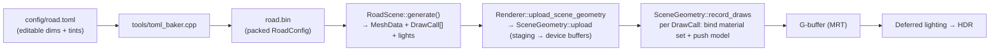

# Glen Cove-area LIE roadside detail

An in-progress effort to make Swish's procedural Long Island Expressway read like the
**Glen Cove / Nassau-County stretch of I-495** from the reference photos — and to let the
driver see farther down the road. This doc covers the goal, the phased plan and where it
stands, and exactly how the roadside-prop generation pipeline works so the next phase can be
added without re-deriving it.

> **Plan of record:** the phased plan lives in the private plan note
> `twinkly-mixing-parasol.md`; the landed work is logged in
> [`CHANGELOG.md`](../CHANGELOG.md) (entries dated 2026-07-03 / 2026-07-04).
> **Diagram:** [`docs/diagrams/roadside-detail.excalidraw`](diagrams/roadside-detail.excalidraw).

## The look we're matching

The reference is the LIE around Glen Cove Rd / Northern Blvd. The distinctive elements, and
how Swish gets each one:

| Reference element | Swish approach | Generator |
|---|---|---|
| **Overhead green sign gantries** (steel truss spanning the road, hanging green panels) | Procedural steel-truss gantry + textured green sign panel | `generate_sign_posts` |
| **Concrete jersey median** (F-shape) | Procedural sloped-quad F-profile barrier down the center | `generate_jersey_barrier` |
| **W-beam metal guardrails** + tall concrete retaining wall | Procedural rail/wall faces | `generate_guardrail` |
| **Davit / mast-arm light poles** | Procedural pole + arm + fixture, each with a warm point light | `generate_street_lamps` |
| **Overpass bridges** (local roads crossing above) | Procedural concrete deck + railings every ~0.5 mi | `generate_overpass` |
| **Sound barriers** on the embankments | Procedural panel walls with concrete posts | `generate_sound_barriers` |
| **Tree-lined embankments** | **Deferred** — will be real `.glb` models, not billboards | (`generate_trees`, currently unused) |
| **Seeing far down a hazy highway** | Far plane raised to cover the whole road + always-on aerial haze | shader / camera (Phase 1) |

Most of these props **already existed procedurally** before this effort — the road-scene
generator has emitted barriers, guardrails, signs, overpasses, lamps and sound barriers for a
while. So the work is mostly **enriching existing generators and authoring better textures**
toward the Glen Cove reference, not building props from scratch.

## Phased plan & current status



- **Phase 1 — DONE.** The far plane was raised `2.0M → 4.3M WU` (precision-safe after the
  reverse-Z change) so the whole ~4.22 km road is drawable, and an **always-on aerial-perspective
  haze** was added in [`lighting.frag`](../shaders/lighting.frag) so the far end dissolves into the
  horizon sky instead of hard-clipping. The road is one static mesh (no streaming), so it was simply
  beyond the old far plane. See the 2026-07-04 CHANGELOG entry.
- **Phase 2a — IN PROGRESS.** Enrich `generate_sign_posts` into proper steel-truss gantries and
  author **Glen Cove-specific green sign textures** (e.g. "Glen Cove Rd / Northern Blvd", "EXIT 39",
  I-495 shield, "EXIT ONLY" / speed tabs) with `tools/sign_generator.py`. The `MAT_SIGN_7` material
  slot is already wired but has **no texture on disk** (`textures/sign_00.png` … `sign_06.png` exist;
  `sign_07.png` does not) — filling it (+ `_normal` / `_roughness`) is part of this phase, adding more
  `MAT_SIGN_*` slots if needed.
- **Phase 2b/2c — not started.** W-beam guardrail + median cleanup; davit poles + overpass decks.
- **Phase 2d — DEFERRED.** `generate_trees` is fully implemented (cross-billboard quads) but **never
  called** from `generate()`. Rather than enable the billboards, trees will be authored as real
  `.glb` models loaded through the model path. Do **not** enable the billboard generator.
- **Phases 3/4/5 (clear-blue sky, PCSS, DOF)** and **2e (`.glb` hero props)** — not started; 2e is
  blocked on sourcing/authoring licensed `.glb` assets.

> **One phase per turn**, each debug-UI-tunable and release-safe (`SWISH_DEBUG_UI=OFF` output
> byte-identical unless the change is intentional and screenshot-verified), each with its own
> CHANGELOG entry. Do not begin an unstarted phase without confirmation.

## How roadside props are generated

The whole road — surfaces, markings, and every prop — is one **static mesh built once at load
time** from config, uploaded to the GPU, and re-submitted every frame. There is **no streaming,
no frustum/LOD culling, and no mesh instancing**: every quad is its own `DrawCall`, and repeated
props (each lamp, each gantry, each overpass) are individual draw calls. Extending draw distance
is therefore ~free (everything was already submitted); *adding dense props adds draw calls*.



### 1. Config → `RoadConfig`

Road dimensions, tiling, and tints live in [`config/road.toml`](../config/road.toml).
[`tools/toml_baker.cpp`](../tools/toml_baker.cpp) packs them into a `road.bin` blob whose layout
**must match** [`RoadConfig.h`](../src/scene/RoadScene/RoadConfig.h) field-for-field (magic `SWRC`,
versioned). `RoadScene`'s default constructor loads `road.bin`; dimensions that must stay tunable
belong in **both** `RoadConfig.h` and the mirror struct in `toml_baker.cpp`, kept in lockstep.
Quick per-prop tints/sizes can stay as locals inside a generator (as most props already do).

### 2. `RoadScene::generate()` and the section generators

[`RoadScene::generate()`](../src/scene/RoadScene/RoadScene.cpp) (around line 576) wraps the output
mesh + draw list in a `MeshBuilder`, computes a `RoadLayout` (eastbound start X, total road width,
westbound inner edge), then calls each **section generator** in turn over the full road span
`z_near = 0` … `z_far = -road_length`. Each generator has the uniform signature

```cpp
void generate_*(MeshBuilder&, const RoadLayout&, float z_near, float z_far) const;
```

(some also take `std::vector<LightDesc>&` to emit point lights). They read only instance state, so
they are `const`. The call list in `generate()`:

| Generator (`RoadScene.cpp`) | Emits | Material(s) |
|---|---|---|
| `generate_grass` / `generate_road_surfaces` / `generate_shoulders` | ground, lanes, shoulders | `MAT_GRASS`, `MAT_ASPHALT` |
| `generate_jersey_barrier` (~424) | F-shape concrete median (sloped quads + weathering stain) | `MAT_CONCRETE` |
| `generate_guardrail` (~469) | EB tall retaining wall + fence, WB W-beam rail | `MAT_CONCRETE`, `MAT_METAL` |
| `generate_solid_markings` (~502) / `generate_dashed_markings` (~549) | edge/lane/HOV lines | tinted quads |
| `generate_curbs` / `generate_rumble_strips` / `generate_dirt_strips` | curb, rumble, gravel strips | `MAT_CONCRETE`, `MAT_RUMBLE`, `MAT_DIRT` |
| `generate_ambient_occlusion` (~661) | dark contact strips at structure bases | `MAT_DEFAULT` |
| `generate_hov_diamonds` (~693) | HOV diamonds + "I-495" pavement text | `MAT_SIGN_6` |
| **`generate_sign_posts` (~758)** | **roadside signs + overhead truss gantries** | `MAT_METAL`, `MAT_SIGN_*` |
| `generate_overpass` (~929) | concrete bridge deck + railings every ~0.5 mi | `MAT_CONCRETE` |
| `generate_sound_barriers` (~1086) | panel walls + concrete posts on the embankment | `MAT_CONCRETE` |
| `generate_exit_ramp` (~1145) | diverging ramp + N Marginal Rd + gore markings | `MAT_ASPHALT` |
| `generate_street_lamps` (~1338) | poles + arms + fixtures **and point lights** | `MAT_METAL` + `LightDesc[]` |
| `generate_trees` (~1007) | cross-billboard trees — **implemented but NOT called (deferred)** | `MAT_TREE` |

### 3. `MeshBuilder` — quads become draw calls

[`MeshBuilder`](../src/scene/RoadScene/RoadScene.h) is the only thing that touches the vertex/index
buffers, so generators can't miscompute base indices. Its helpers each append 4 vertices + 6 indices
(two triangles, CCW-wound for Vulkan clip space) **and one `DrawCall`**:

- `addHorizontalQuad(leftX, rightX, y, zStart, zEnd, normal, color, material, tileSize)` — flat surfaces.
- `addVerticalFace(x, height, zStart, zEnd, normal, …)` — walls/posts (winding flips by normal sign).
- `addSlopedQuad(leftX, rightX, yLeft, yRight, …)` — the jersey-barrier slopes and gantry cross-braces.
- `addDashedLine(…, dashLen, gapLen, …)` — lane dashes (loops `addHorizontalQuad`).
- `pushDrawCall(indexOffset, color, material)` — for hand-built quads (e.g. angled sign panels) the
  generator adds the 4 verts / 6 indices itself, then calls this directly.

`tileSize > 0` derives UVs from world position over that period (so textures tile at a real-world
scale); `tileSize == 0` uses full `[0,1]` UVs (for a single textured panel like a sign face).

### 4. Upload and per-frame draw

[`Renderer::upload_scene_geometry`](../src/renderer/Renderer/Renderer.cpp) (~1406) hands the
`MeshData` + `DrawCall[]` to [`SceneGeometry::upload`](../src/renderer/SceneGeometry/SceneGeometry.cpp),
which stages them into device-local vertex/index buffers (one submit). Each frame,
`SceneGeometry::record_draws` (~85) iterates the draw list and, per `DrawCall`:

1. Binds **descriptor set 1** = that material's textures (`materials.get_set(dc.material)`).
2. **Camera-relative rebase in double precision** — subtracts the camera position from the model's
   translation so the vertex shader renders with the eye at the origin. This keeps precision across
   the ~4.2M WU road (both operands are large; the small difference stores exactly in float32).
3. Pushes the model matrix + color + a `material` vec4: `.x` metalness (1 for `MAT_METAL`, else 0),
   `.y` wettable mask (0 for the car, 1 for road/world), `.z` roughness multiplier, `.w` road tag
   (1 for `MAT_ASPHALT` → drives screen-space puddles). A debug `MaterialOverride` can replace these.
4. `vkCmdDrawIndexed`.

The G-buffer writes albedo/normal/material/depth; [deferred lighting](render-pipeline.md) reads them,
and Phase 1's aerial haze fades the far end of the road into the sky.

## Material system for props

A `DrawCall` carries a `MaterialId` ([`SceneTypes.h`](../src/scene/SceneTypes.h)). At draw time it
selects a descriptor set built by
[`MaterialDescriptors`](../src/renderer/MaterialDescriptors/MaterialDescriptors.cpp): one set per
`MaterialId`, each with a **texture triple** — albedo (`""`), `_normal`, and `_roughness` — looked up
by base name from `kMaterialNames`. A missing `_normal`/`_roughness` falls back to the 1×1 white
`default` texture, so a bare albedo works.

Relevant slots for roadside detail:

| `MaterialId` | Base name | Use |
|---|---|---|
| `MAT_ASPHALT` / `MAT_GRASS` / `MAT_CONCRETE` / `MAT_METAL` | `asphalt` / `grass` / `concrete` / `metal` | road, ground, barriers/bridges, rails/poles/gantries |
| `MAT_RUMBLE` / `MAT_DIRT` | `rumble` / `dirt` | rumble strip, gravel verge |
| `MAT_TREE` | `tree_leaves` | trees (deferred) |
| `MAT_SIGN_0 … MAT_SIGN_7` | `sign_00 … sign_07` | sign panels; `MAT_SIGN_6` also does "I-495" pavement text |
| `MAT_CAR_0 … MAT_CAR_19` | `car_*` | Porsche glTF material slots |

**Adding a new material** (the Phase-2 template): add a `MAT_*` before `MAT_COUNT` in `SceneTypes.h`,
add its base name at the **same index** in `kMaterialNames`, and drop `name.png` (+ optional
`_normal` / `_roughness`) in `textures/`. `MAT_SIGN_7` already occupies a slot but ships no texture —
Phase 2a fills `sign_07.png`.

## The overhead sign gantry (Phase 2a target)

In `generate_sign_posts`, sign Z-positions are expressed as **fractions of `z_far`** (0.10 … 0.90)
so signage spreads along the whole route instead of clustering near the camera. Each `SignDef`
marked `overhead` builds a steel-truss gantry spanning the road (all `MAT_METAL`), then hangs a
textured green panel (`MAT_SIGN_*`) centered over the eastbound roadway:

```
        top chord  ──────────────────────────────────  (gantry_height ≈ 20 ft)
                 ╲  vertical web members every ~15 ft  ╱
        bottom chord ───────────────────────────────    (beam depth ≈ 3 ft)
     ┌─┐            ┌───────────────────────┐            ┌─┐
     │▓│  X-braces  │  GREEN SIGN PANEL      │  X-braces  │▓│   ← MAT_SIGN_*
     │▓│            │  Glen Cove Rd  EXIT 39 │            │▓│      (textured)
     │▓│            └───────────────────────┘            │▓│
   left post                                          right post   ← MAT_METAL
  ══════════════════ roadway ═══════════════════════════════════
```

The truss is: a top + bottom **chord** (horizontal beams), **vertical web members** every ~15 ft
along the span, two thick **support posts** (paired vertical faces for depth) with **diagonal
X-bracing** built from `addSlopedQuad`, and the hanging **panel** as a hand-built textured quad.
Phase 2a's job is to make this read like the Glen Cove reference and to author the green sign
textures (roadside signs are the simpler `else` branch: a single post + a left-facing panel).

## Performance note

Because there is no culling or instancing, the cost scales with total quad count. Phase 1 (distance)
added no draw calls. Dense props (trees, closely-spaced poles) *would*; if framerate drops when a
future phase adds them, the follow-up is distance/frustum culling or true instancing (only the rain
system instances today).
