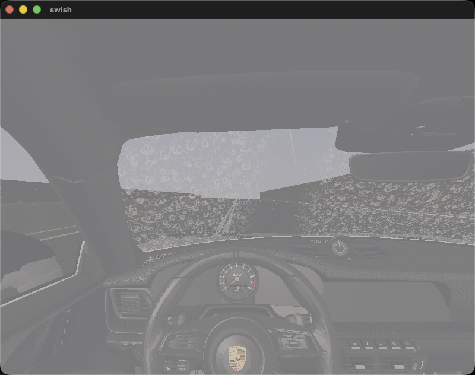
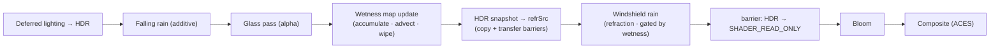

# Rain System Architecture

How rain is built in Swish — two cooperating subsystems and a wiper.

- **Falling rain** — `RainSystem`: GPU-instanced billboard streaks in world space, blended additively over the HDR scene; it also accumulates a scalar **wetness**.
- **Windshield rain** — `WindshieldRainPass`: refractive water **drops on the front windshield** (each drop a tiny lens distorting a snapshot of the scene), gated by a **persistent wetness map** that accumulates rain, advects it along the flow (down at rest, up at speed), and is cleared by a **wiper**.

> Diagram: [`docs/diagrams/rain-architecture.excalidraw`](../diagrams/rain-architecture.excalidraw) · Result:  · New to the terms? See the [**Glossary**](../GLOSSARY.md#rain-system).

The guiding principle for the windshield (the substantial part of this doc): **water refracts the scene; it does not emit light.** The old placeholder added bright premultiplied colour (additive blend) and read as glowing blobs. The rewrite samples the scene *behind* each drop and bends that lookup by the drop's surface normal — the canonical real-time technique (Tatarchuk 2006; Heartfelt; Godot "Rain on Glass").

---

## Per-frame pipeline



`RainSystem`'s wetness/intensity feed the windshield UBO each frame, so the drops only appear once the scene is wet. Ordering and the snapshot live in [`Renderer::recordCommandBuffer`](../../src/renderer/Renderer/Renderer.cpp).

---

## Part 1 — Falling rain (`RainSystem`)

<details>
<summary>GPU-instanced streaks + wetness accumulation</summary>

8192 instanced quads are animated entirely on the GPU (seed × volume wrapping in the vertex shader), oriented as view-space streaks, and blended **additively** (`src=ONE, dst=ONE`) onto the HDR target via a `LOAD_OP_LOAD` pass — no barrier needed after lighting. It owns a per-frame `RainUBO` (wind, time, intensity, volume size) and a CPU-side **wetness** value that ramps toward the current intensity:

$$w_{t+\Delta t} = w_t + (\,\text{intensity} - w_t\,)\,k\,\Delta t$$

`get_wetness()` / `get_intensity()` are read by the renderer and handed to the windshield pass, coupling "how hard it's raining" to "how wet the glass is". Code: [`src/renderer/RainSystem/`](../../src/renderer/RainSystem/), shaders `rain.vert` / `rain.frag`.

**Two parallax layers.** `record_draws` issues **two** instanced draws against the same pipeline / geometry / instance buffer — a near layer and a *far* layer bound to a second per-frame UBO with scaled params (`halfExtent ×2`, `dropSpeed ×0.7`, `intensity ×0.55`, `streakLen ×0.8`). The larger, slower, dimmer far layer reads as distant rain behind the near streaks, giving depth without sorting (additive blend + no depth write make the order irrelevant). The far field shares the near field's seeds, so its UBO time is offset by a constant `kFarTimePhase` (≈317 s) to decorrelate the two (their wrap periods differ, so they never re-align). The descriptor pool is sized `2·MAX_FRAMES_IN_FLIGHT` for both sets.

**Retinal-persistence streaks.** `rain.frag` averages $N=7$ samples along each drop's oscillation cycle (varying the Garg & Nayar (2,0)/(3,1) phase per sample) so a streak carries several superimposed highlight bands — the speckled multi-highlight look of night rain (Rousseau et al.). Shared by both layers.

</details>

---

## Part 2 — Windshield rain (scene refraction)

### 2.1 The core idea

A drop is a lens. We build a procedural **height field** $h(\mathbf u)$ over the glass, take its **surface normal** $\hat{\mathbf n}$, and sample the scene snapshot at a **screen-space position offset by that normal**:

$$\mathbf{uv}' \;=\; \underbrace{\frac{\mathbf F_{xy}}{\mathbf S}}_{\text{screen UV}} \;-\; \hat{\mathbf n}_{xy}\,\, s_r\,\, c
\qquad \mathbf C_{\text{out}} = \texttt{texture}(\text{refrSrc},\, \mathbf{uv}')$$

where $\mathbf F=\texttt{gl\_FragCoord}$, $\mathbf S$ = framebuffer size, $s_r$ = refraction strength, $c$ = drop coverage. The result is **alpha-blended** over the clear glass, so between drops the windshield is untouched.

### 2.2 Why a scene *snapshot*?

<details>
<summary>Avoiding a read/write feedback loop on the HDR target</summary>

The windshield pass renders **into** the HDR image (it sits in the forward chain). A fragment shader may not sample the same image it is writing — that is a feedback loop and undefined in Vulkan. So, after the glass pass, the HDR colour is copied into a dedicated sampled image (`refrSrc`, one per frame-in-flight) which the shader reads. The HDR image gained `VK_IMAGE_USAGE_TRANSFER_SRC_BIT` for this.

`ResourceManager::insertImageBarrier` only knows the COLOR/DEPTH/SHADER layouts, so the transfer transitions are issued explicitly:

```cpp
// HDR (color attachment) → transfer source
barrier(hdrImage, COLOR_ATTACHMENT_OPTIMAL, TRANSFER_SRC_OPTIMAL,
        COLOR_ATTACHMENT_WRITE, TRANSFER_READ, COLOR_ATTACHMENT_OUTPUT, TRANSFER);
// refrSrc: contents fully overwritten → discard via UNDEFINED
barrier(refrSrc, UNDEFINED, TRANSFER_DST_OPTIMAL, 0, TRANSFER_WRITE, TOP_OF_PIPE, TRANSFER);
vkCmdCopyImage(cmd, hdrImage, TRANSFER_SRC_OPTIMAL, refrSrc, TRANSFER_DST_OPTIMAL, 1, &region);
barrier(refrSrc, TRANSFER_DST_OPTIMAL, SHADER_READ_ONLY_OPTIMAL, ...);   // ready to sample
barrier(hdrImage, TRANSFER_SRC_OPTIMAL, COLOR_ATTACHMENT_OPTIMAL, ...);  // ready to draw into
```

Full source: [`WindshieldRainPass::record_scene_snapshot`](../../src/renderer/WindshieldRainPass/WindshieldRainPass.cpp).

</details>

### 2.3 Drop height field — layered Voronoi + stick-slip

<details>
<summary>Two Voronoi layers, per-drop hash, sawtooth motion</summary>

Each layer lays a jittered drop per Voronoi cell and returns a tight body via the cell's **signed distance** (distance to the nearest drop minus its radius):

$$\mathrm{sd}(\mathbf u) = \min_i \big(\lVert \mathbf p - \mathbf c_i\rVert\big) - r_i, \qquad
L(\mathbf u) = 1 - \mathrm{smoothstep}(-0.05,\; 0.06,\; \mathrm{sd})$$

Two layers at different frequencies give size variety (density $\rho$ ≈ cells across the glass):

$$h(\mathbf u) = L(\mathbf u;\, \rho) + 0.55\,L(\mathbf u;\, 2.3\rho)$$

Drops **cling then slip** (surface tension → sudden slide) via a per-drop sawtooth phase; the cell centre advances along the glass-space flow only while slipping:

$$\phi_i = \mathrm{fract}\!\big(\text{seed}_i + t\,v_i\big),\quad
\text{slip} = \mathrm{smoothstep}(0.55, 1, \phi_i),\quad
\mathbf c_i = \mathbf c_i^{0} + \hat{\mathbf f}\,\,\text{slip}\cdot 0.55$$

The flow direction itself crosses from gravity (at rest) to aerodynamic lift (at speed):

$$\hat{\mathbf f} = \mathrm{normalize}\big(\mathrm{mix}(\,\mathbf g,\ \mathbf a,\ \mathrm{smoothstep}(0.1, 0.6, \text{speed})\,)\big),\quad \mathbf g=(0,1),\ \mathbf a=(0.15,-1)$$

```glsl
float dropLayer(vec2 uv, float scale, float seed, vec2 flow, float time) {
    vec2 p = uv*scale, cell = floor(p), frac = fract(p);
    float minSD = 10.0;
    for (int y=-1;y<=1;y++) for (int x=-1;x<=1;x++) {
        vec2 nb = vec2(x,y), rnd = hash22(cell+nb+vec2(seed));
        float radius = mix(0.16, 0.40, rnd.x);
        float phase  = fract(rnd.x*0.37 + time*(0.10+0.35*rnd.y));
        float slip   = smoothstep(0.55, 1.0, phase);
        vec2  center = rnd + flow*slip*0.55;
        minSD = min(minSD, length(nb+center-frac) - radius);
    }
    return 1.0 - smoothstep(-0.05, 0.06, minSD);   // edge0<edge1, then invert (well-defined)
}
```

</details>

### 2.4 Surface normal — finite differences

The lens normal comes from the height gradient, **bounded** so a sharp drop edge can't blow up the refraction:

$$\nabla h \approx \tfrac{1}{\epsilon}\big(h(\mathbf u + \epsilon\hat{\mathbf x}) - h,\; h(\mathbf u + \epsilon\hat{\mathbf y}) - h\big),\qquad
\hat{\mathbf n} = \mathrm{normalize}\big(0.03\,\nabla h,\; 1\big)$$

```glsl
const float e = 0.0016;
float h  = dropHeight(fragUV, flow, time);
float hx = dropHeight(fragUV + vec2(e,0.0), flow, time);
float hy = dropHeight(fragUV + vec2(0.0,e), flow, time);
vec2 slope = (vec2(hx,hy) - h)/e * 0.03;
vec3 dropN = normalize(vec3(slope, 1.0));
```

### 2.5 Refraction + Fresnel rim + sun glint

The scene is sampled at the offset UV; a Fresnel term brightens the rim, and a small Blinn-Phong glint catches the sun:

$$F = (1 - n_z)^3, \qquad
\mathbf C = \texttt{texture}(\text{refrSrc},\,\mathbf{uv}') + \mathbf C_\odot\big(F\,g_F + \text{spec}\cdot c\big)$$

```glsl
vec2 uv = clamp(screenUV - dropN.xy * refractStrength * coverage, vec2(0.001), vec2(0.999));
vec3 refracted = textureLod(sceneRefr, uv, 0.0).rgb;
float fres = pow(1.0 - dropN.z, 3.0);
vec3 color = refracted + camera.sunColor.rgb * (fres*fresnelGain + spec*coverage);
outColor = vec4(color, alpha);   // alpha = coverage·wetness·intensity, alpha-blended
```

### 2.6 Confining drops to the front windshield

<details>
<summary>Object-space normal mask + single-sided culling</summary>

The Porsche's exterior glass is **one combined mesh** (windshield + side + rear), so "front only" can't be done by node name. Two mechanisms cooperate:

1. **Loader** ([`ModelManager.cpp`](../../src/scene/ModelManager/ModelManager.cpp)) tags only the outer `Window_Geo` — the cabin-facing inner pane `WindowInside_Geo` is *not* tagged (that was the "rain inside the cabin" bug).
2. **Shader** masks by the object-space normal. The mesh is normalized so the nose is $+X$; the windshield's outward normal has a strong $+X$ component while side glass faces $\pm Z$ and the rear faces $-X$:

$$\text{front} = \mathrm{smoothstep}(0.12,\ 0.45,\ n^{\text{obj}}_x), \qquad \text{discard if } \text{front} < 0.001$$

3. **Pipeline** uses single-sided culling. The cockpit camera looks at the windshield's *cabin-facing* face (whose outward normal points **away** from the viewer → a back face under CCW winding), so the pass culls **`FRONT`** to shade exactly that surface. (Culling `BACK` renders nothing — the symptom that revealed this during verification.)

</details>

### 2.7 Two coordinate spaces

| Space | Used for | Why |
|-------|----------|-----|
| **Glass UV** (`fragUV`) | drop height field | drops stick to the pane, constant physical size as the car turns |
| **Object normal** (`fragLocalNormal`) | front-pane mask | stable regardless of car yaw (baked at load) |
| **Screen UV** (`gl_FragCoord/S`) | refraction lookup **and** wiper | distorts the rendered scene correctly; the cockpit view is fixed relative to the glass |

> The windshield's mesh UVs turned out to cluster near $(1,1)$ rather than a clean $[0,1]^2$ — fine for the drop field (small UV deltas × density still vary), but it forced the **wiper into screen space** (a glass-UV pivot missed the visible glass).

---

## Part 3 — Persistent wetness map (accumulate · advect · wipe)

This is what makes rain **stick, flow, and genuinely wipe off**. A fullscreen pass
([`windshield_wetness.frag`](../../shaders/windshield_wetness.frag)) maintains an R16F screen-space
field $W$ each frame; the windshield-rain frag samples it and **gates drop coverage** by it, so where
$W$ is low (just wiped) no drops appear, and they rebuild as rain re-wets.

$$W'(\mathbf x) = \mathrm{clamp}\!\Big(\underbrace{W(\mathbf x - \hat{\mathbf f}\,a)}_{\text{advect upstream}} + \,r\,i\,\Delta t \;-\; e\,\Delta t,\; 0,\,1\Big)\cdot\big(1 - \mathrm{wiper}(\mathbf x)\big)$$

- **accumulate** $r\,i\,\Delta t$ — rain (intensity $i$) wets the glass over time;
- **advect** — semi-Lagrangian: sample upstream along the flow $\hat{\mathbf f}$ so wetness **streams down at rest, up at speed**;
- **wiper** — subtracts along the swept blade band, *persistently* (cleared glass stays clear);
- **evaporate** $e\,\Delta t$ — slow drain.

```glsl
vec2  src = fragUV - p.flow * p.advect;     // advect upstream
float w   = texture(prevWet, src).r;
w += p.intensity * p.dt * 0.7;              // rain accumulates
w -= p.dt * 0.04;                           // evaporation
if (p.wiperOn > 0.5) w *= (1.0 - wiperClear(fragUV, p.wiperAngle, p.aspect));
outWet = clamp(w, 0.0, 1.0);
```

<details>
<summary>Ping-pong, the wiper blade SDF, and the speed crossover</summary>

**Ping-pong.** Two images A (history) / B (current). The pass reads A and writes B; the CPU then
copies B→A so next frame's history is this result — fixed bindings (the rain frag always samples B),
no per-frame descriptor churn. With explicit transfer barriers around the copy.

**Wiper blade** — a rotating line-segment SDF in screen space (the cockpit view is fixed; the mesh
UVs aren't a clean $[0,1]^2$ so screen space is reliable). Blade angle $\theta = \sin(\phi)\,\theta_{\max}$
($\theta_{\max}\approx 66°$), `V` toggles it (edge-detected in [`App.cpp`](../../src/core/App/App.cpp)):

```glsl
float wiperClear(vec2 uv, float angle, float aspect) {
    vec2 pivot = vec2(0.5, 0.92);
    vec2 rel   = (uv - pivot) * vec2(aspect, 1.0);
    vec2 dir   = vec2(sin(angle), -cos(angle));
    float t    = clamp(dot(rel, dir), 0.0, 0.7);
    return 1.0 - smoothstep(0.045, 0.12, length(rel - dir*t));
}
```

**Speed crossover.** The flow is gravity→aero by speed. The crossover is tuned to the car's
*achievable* range — terminal speed is drag-limited to $v\approx k_\text{accel}/k_\text{drag}=7200$ WU/s
→ $\text{speedFactor}\approx 0.24$ — so a `smoothstep(0.1,0.6,\cdot)` crossover (the first attempt) never
left gravity. It's now `smoothstep(0.05, 0.20, speedFactor)`:

$$\hat{\mathbf f} = \mathrm{normalize}\big(\mathrm{mix}(\mathbf g,\ \mathbf a,\ \mathrm{smoothstep}(0.05,0.20,s))\big),\quad \mathbf g=(0,1),\ \mathbf a=(0.15,-1)$$

The same flow drives both the wetness advection (`m_waterFlow`, CPU) and the procedural drop slip (frag).

</details>

---

## UBO layout (`WindshieldRainUBO`, std140, Vec4-only)

| Field | x | y | z | w |
|-------|---|---|---|---|
| `flowAndTime` | flow dir x | flow dir y | speed [0,1] | time (s) |
| `params` | wetness | intensity | drop density | refraction strength |
| `screenAndRefr` | width (px) | height (px) | maxBlurLod (reserved) | Fresnel rim gain |
| `wiperState` | blade angle | phase | enabled (0/1) | sweep speed |

## Tunables (current values)

| Knob | Where | Value | Effect |
|------|-------|-------|--------|
| far-layer scales | `RainSystem.cpp` constants | `halfExt×2`, `speed×0.7`, `intensity×0.55`, `streak×0.8` | distance / fall speed / dimness / length of the 2nd parallax layer |
| far-layer decorrelation | `RainSystem.cpp` `kFarTimePhase` | `317` s | time offset that separates the far field from the seed-shared near field |
| streak samples | `rain.frag` `N` | `7` | retinal-persistence samples along the oscillation cycle (5–10) |
| streetlight halo | `lighting.frag` `kHaloStrength` | `0.12` | wet glow around point lights (×`att²`×wetness); bloom spreads it |
| windshield layer weights | `windshield_rain.frag` `l0/l1/l2` | `S(0,0.5)·0.65` / `S(0.05,0.45)` / `S(0,0.40)` | when static beads vs sliding rivulets appear by intensity |
| drop lens model | `windshield_rain.frag` | trail folded into `h` (×0.45); per-drop glint `pow(dropN·skyL, 30)·1.25`; body `×0.85` | drops read as refractive water (teardrop body + glint + rivulet), not Fresnel-only rings |
| layer combine | `windshield_rain.frag` `Drops()` | `max(s, m1.x, m2.x)` then `S(0.18,0.82)` | combine layers with **max not sum** — fine layers add structure, not thickness (the "too thick" fix) |
| glass alpha cap | `windshield_rain.frag` | `clamp(coverage·0.9 + haze, 0, 0.62)` | keep glass semi-transparent so the scene always shows through |
| drop body size | `windshield_rain.frag` | body `S(0.34,0,d)`, static `S(0.28)`, bead `S(0.22)` | small/crisp drops (smaller = more delicate) |
| drop density | `WindshieldRainPass::update` `params.z` | `85` | cells across glass — higher = smaller/denser |
| refraction strength | `params.w` | `0.070` | how strongly drops bend the scene |
| Fresnel rim gain | `screenAndRefr.w` | `0.06` | rim brightness — high reads "white/foamy" |
| streak width / opacity | `rain.vert` | width `3–8` WU; `fragAlpha = i·(0.20+0.60·sw)` | thin, semi-transparent streaks (Garg & Nayar) |
| streak profile / brightness | `rain.frag` | core `smoothstep(0.12,0.72)` + head taper; color `(0.72,0.82,0.97)` × `1.15` | thin bright core, translucent — not a fat glowing bar |
| haze strength | `windshield_rain.frag` | `0.035 + 0.03·intensity` | wet-glass fog veil — kept very light so beads carry the look |
| cull side | `createPipeline` | `FRONT` | which windshield face is shaded |
| front mask | `windshield_rain.frag` | `smoothstep(0.12,0.45,n.x)` | how aggressively side/rear glass is excluded |
| wiper pivot / band | `wiperClear` | `(0.5,0.92)` / `0.12` | sweep origin and streak width |
| rain / evaporation rate | `windshield_wetness.frag` | `0.7` / `0.04` | how fast glass wets / dries |
| flow crossover | `update` + frag | `smoothstep(0.05,0.20,speed)` | speed at which water flips from down → up |

## Controls
`R` — cycle rain intensity (off → light → heavy) · `V` — toggle the wiper.

## Files
`shaders/windshield_rain.{vert,frag}` · `shaders/windshield_wetness.frag` (wetness map) · [`WindshieldRainPass/`](../../src/renderer/WindshieldRainPass/) · [`PostProcessManager.cpp`](../../src/renderer/PostProcessManager/PostProcessManager.cpp) (HDR `TRANSFER_SRC`) · [`Renderer.cpp`](../../src/renderer/Renderer/Renderer.cpp) (snapshot + ordering) · [`ModelManager.cpp`](../../src/scene/ModelManager/ModelManager.cpp) (tagging) · [`App.cpp`](../../src/core/App/App.cpp) (input).

## Verification
Build green (`cmake -B build && cmake --build build`); validation layers clean (snapshot copy, transfer barriers, binding-1 sampler exercised every frame); loader logs `windshield: 1`. Visually confirmed in-cockpit: small refractive beads (not blobs), no cabin/side-glass rain, wiper sweeps a clear streak — [`docs/images/windshield-rain-fixed.png`](../images/windshield-rain-fixed.png).

## Limitations / future work
- **Refraction is subtle under overcast lighting** — the snapshot scene is low-contrast, so lensing reads mostly via rim/specular. A brighter/HDR-richer scene shows more.
- **No mip blur** — the snapshot is single-level (`textureLod(..., 0)`); `screenAndRefr.z` is reserved for a wetness-driven blur LOD once the snapshot generates mips.
- **Uniform rain accumulation** — the wetness map wets the whole windshield evenly; per-drop impact splashes or runner streaks (Tatarchuk's per-cell water mass) would add more structure to the map itself (the procedural drops already supply the fine detail).

## References
- **Tatarchuk, "Artist-Directable Real-Time Rain Rendering in City Environments," SIGGRAPH 2006** — per-cell water mass → dynamic normal map → scene refraction + Fresnel. <https://advances.realtimerendering.com/s2006/Tatarchuk-Rain.pdf>
- **Rousseau et al., "Realistic Real-Time Rain Rendering"** — refraction via a precomputed wide-angle mask. <https://classes.cs.uchicago.edu/archive/2022/fall/23700-1/papers/gpu-rain.pdf>
- **"Heartfelt" rain-on-glass (Martijn Steinrucken / BigWings)** — stick-slip sawtooth, layered drops, normal from finite differences, mip blur. <https://github.com/jeantimex/raindrop>
- **Godot "Rain on Glass"** — compact SDF drop + screen-texture refraction + per-pixel blur. <https://godotshaders.com/shader/rain-on-glass/>
- **olivierprat/rain-on-windshield (Unity HDRP)** — height-field windshield rain *with a wiper* + flow maps. <https://github.com/olivierprat/rain-on-windshield>
- **Codrops — "Rain & Water Effect Experiments"** — the drop-mask/refraction intuition. <https://tympanus.net/codrops/2015/11/04/rain-water-effect-experiments/>
- **Radiant — "How to render rain on glass"** — water-map + background-refraction two-pipeline pattern. <https://radiant-shaders.com/learn/rain-on-glass>

See also the focused notes in this folder: [codebase-map](codebase-map.md) · [technique-refraction](technique-refraction.md) · [technique-wiper](technique-wiper.md) · [implementation-plan](implementation-plan.md).
