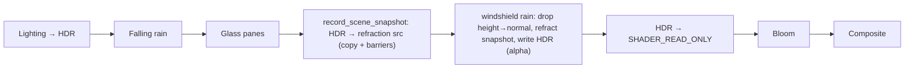

# Implementation plan (consolidated) — refractive windshield rain + wiper

Synthesizes [`codebase-map.md`](codebase-map.md), [`technique-refraction.md`](technique-refraction.md),
[`technique-wiper.md`](technique-wiper.md), and [`../../issue.md`](../../issue.md). **Implemented** — this
file records the as-built design.

## Data flow

## Change list (as built)
- **`shaders/windshield_rain.frag`** — layered Voronoi drops (glass-space `inUV`), stick-slip motion,
  finite-difference normal, refraction of `sceneRefr`, Fresnel rim + sun glint, **front-normal mask**
  (object normal `.x`, nose=+X), analytic **wiper** clear; alpha output.
- **`shaders/windshield_rain.vert`** — emits glass-space `fragUV` + object-space `fragLocalNormal`.
- **`WindshieldRainPass.{h,cpp}`** — UBO → 4 `Vec4` (`flowAndTime`, `params`, `screenAndRefr`, `wiperState`);
  per-frame refraction-source image (R16F4, `SAMPLED|TRANSFER_DST`) + linear sampler; descriptor set 1
  binding 1; `record_scene_snapshot()` (explicit transfer barriers + `vkCmdCopyImage`); wiper phase in
  `update(...,wiperEnabled)`; pipeline → `enableBlending=true`, `cullMode=BACK`.
- **`PostProcessManager.cpp`** — HDR image gains `TRANSFER_SRC`.
- **`Renderer.{h,cpp}`** — snapshot call between glass & windshield passes; `set_wiper_enabled`; wiper threaded into update.
- **`ModelManager.cpp`** — `isWindshield` excludes `WindowInside_Geo`.
- **`App.{h,cpp}`** — `V` wiper toggle.
- **`tests/CMakeLists.txt`** — link `glfw` (pre-existing break; `Camera.cpp` polls input).

## Correctness checklist (vs issue.md)
- **Blobs → fixed:** high drop density + refraction (no additive) + glass-space field.
- **Cabin rain → fixed:** inner pane untagged + single-sided cull + front-normal mask.
- **Wiper:** `V` toggles a continuous sweep that clears drops along its arc; procedural field re-wets behind.

## Build / verify
- `cmake -B build && cmake --build build` (shaders via the `shaders` target). Green.
- Runtime: validation layers clean; loader logs `windshield: 1`.
- Live tuning (drive with arrows, `R` rain, `V` wiper): `params.w` refractStrength, `params.z` density,
  cull side (`BACK`↔`FRONT`), front-mask threshold (`smoothstep(0.12,0.45,n.x)`), wiper pivot/half-sweep.
