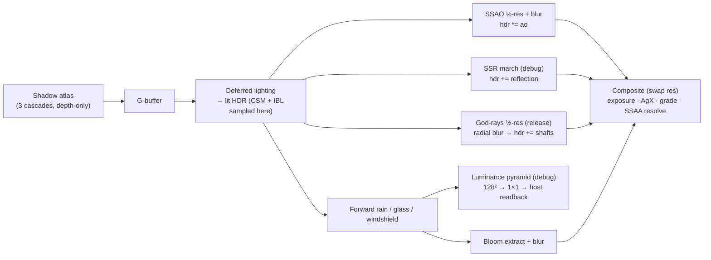
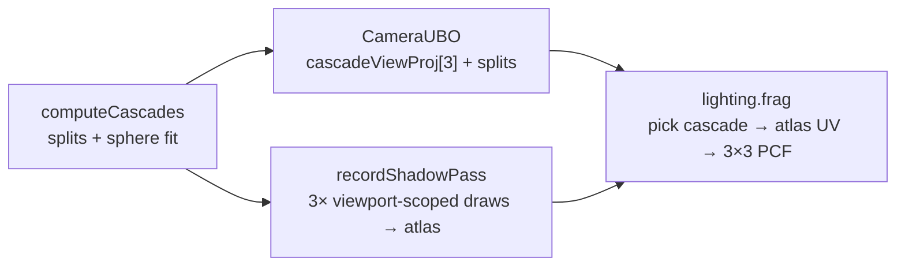
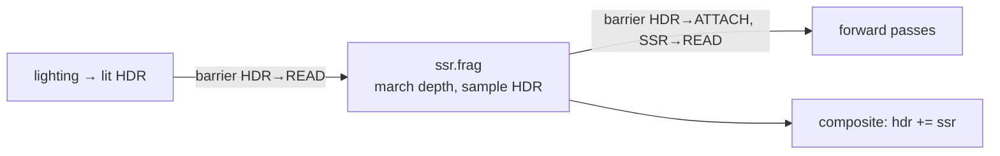
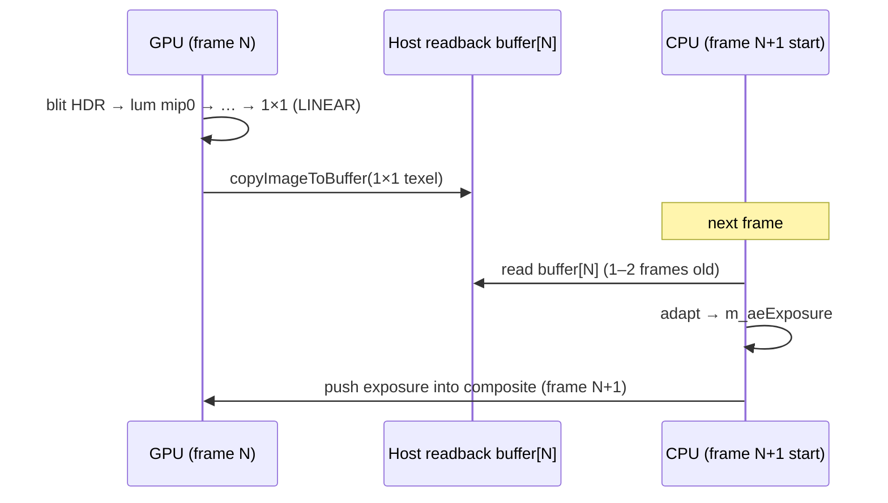

# GPU Realism Features

The `debug-ui` branch layered a suite of physically-motivated GPU effects on top of
the base 6-pass deferred pipeline documented in [render-pipeline.md](render-pipeline.md):
**SSAO**, **cascaded shadow maps (CSM)**, **split-sum image-based lighting (IBL)**,
**screen-space reflections (SSR)**, **god-rays** (volumetric light shafts), **SSAA**
(internal supersampling), and an **auto-exposure** (eye-adaptation) loop. Together they
take the scene from "flat CG"
toward the wet, overcast, low-contrast look of the reference LIE photograph.

Some ship in **release** (SSAO, CSM, IBL, SSAA — objective, verifiable improvements);
others are **debug-only, tunable** (SSR, auto-exposure — judgment calls that want live
dialing). **God-rays** are a hybrid: they *ship in release* (un-gated) yet expose live
density/decay/weight sliders in debug, reading the same defaults in both builds. The gating
strategy is described in [debug-ui.md](debug-ui.md#release-safety);
this doc covers the graphics.

> **Diagram:** the extended pass graph is in
> [`docs/diagrams/deferred-pipeline-extended.excalidraw`](diagrams/deferred-pipeline-extended.excalidraw).

## Where the passes sit

Every new pass slots **after deferred lighting** (so it can read the lit HDR and/or
the depth buffer the lighting pass left in `DEPTH_STENCIL_READ_ONLY_OPTIMAL`) and
**before composite** (so its result folds into the final tonemap). CSM is the
exception — it runs *first*, before the G-buffer, because the lighting pass samples
its output.



Barriers are the subtle part: each screen-space pass has to flip the HDR or depth
image between `COLOR_ATTACHMENT` / `SHADER_READ` / `TRANSFER_SRC` at the right moment,
then restore it for the forward passes. The per-pass barrier dance is described in
each section below and in the CHANGELOG entries.

---

## SSAO — screen-space ambient occlusion

**Files:** [shaders/ssao.frag](../shaders/ssao.frag), [shaders/ao_blur.frag](../shaders/ao_blur.frag),
[src/renderer/Renderer/Renderer.cpp](../src/renderer/Renderer/Renderer.cpp) (`recordSsaoPasses`),
[src/renderer/PostProcessManager/PostProcessManager.cpp](../src/renderer/PostProcessManager/PostProcessManager.cpp)

**What it does.** Darkens contact points and crevices — cabin seams, footwells, the
dashboard-windshield gap — that direct + ambient lighting alone leaves flat. It is a
pure **screen-space** estimate from the depth buffer: no extra geometry, no ray tracing.

**How it works.** SSAO runs at **½ render resolution** over the depth buffer:

1. **View-space reconstruction.** From each fragment's UV + depth, the shader
   reconstructs the view-space position via the supplied `invProjection`
   (`viewPosFromDepth`), and derives a geometric normal from the depth derivatives
   `normalize(cross(dFdx(P), dFdy(P)))` — no normal G-buffer read needed.
2. **16-sample hemisphere.** A fixed Poisson-distributed 16-sample kernel is rotated
   per-pixel by a hash of the UV (so there's no repeating pattern), flipped into the
   surface hemisphere (`dot(sample, N) < 0 → negate`), and offset by `aoRadius`.
3. **Occlusion test.** Each sample is projected back to screen with the explicit
   `projection` matrix (passed in so the shader avoids a per-sample `inverse()` —
   16 matrix inversions per pixel were removed), and its stored depth is compared to
   the sample's own depth. A sample that lies *in front of* the stored surface (by
   more than `aoBias`) counts as an occluder, weighted by a range check so distant
   geometry doesn't over-occlude.

The occlusion estimate ($N=16$, `intensity` = `aoIntensity`):

$$\mathrm{AO} = 1 - \frac{\text{intensity}}{N}\sum_{i=1}^{N}\Big[\,z_{\text{sample}_i} \ge z_i + \text{bias}\,\Big]\cdot \operatorname{smoothstep}\!\Big(0,\,1,\,\frac{r}{\lvert z_{\text{frag}}-z_{\text{sample}_i}\rvert}\Big)$$

**Failure modes handled.** The first implementation speckled along every silhouette:
samples that projected onto the **sky** (depth ≈ 1, an unbounded far-plane position)
read as spurious occluders. The shader now skips samples whose UV falls off-screen or
whose sampled depth is `> 0.9999`. The blur pass is a **plain 5×5 box average**
([ao_blur.frag](../shaders/ao_blur.frag), `result / 25.0`) — a genuine "bilateral"
blur was preserving the per-pixel rotation noise it was meant to remove, and AO is
low-frequency, so a flat box is correct here.

**Composite.** The blurred AO is multiplied into the HDR in composite (`hdr *= ao`),
which is always present. In **release** the AO image is primed **white** (`primeAOTexture`),
so the multiply is a no-op — SSAO is a `make debug` feature. See
[debug-ui.md](debug-ui.md#release-safety).

**MoltenVK note.** `SsaoParams` is `{mat4 invProjection; mat4 projection; float radius, bias, intensity, _pad}`
= 144 B (16-aligned). SSAO needed its **own** pipeline layout (`m_ssaoLayout`) because
its 144-B push range exceeded the shared post-process layout's 32-B range (VUID-10069);
the AO-blur pass has no push block and reuses the shared layout. The AO depth-input
descriptor set is **per-frame** (`m_aoSets[PP_MAX_FRAMES]`), each sampling its own
frame's depth in `DEPTH_STENCIL_READ_ONLY_OPTIMAL` — a single shared set pointed at
frame 0 caused cross-frame ghosting.

**Barriers.** `recordSsaoPasses` runs right after lighting (depth is still
`DEPTH_STENCIL_READ_ONLY`): SSAO → barrier `COLOR_ATTACHMENT → SHADER_READ` → box blur →
barrier `→ SHADER_READ` for composite, mirroring the bloom chain.

---

## CSM — cascaded shadow maps (3 cascades)

**Files:** [shaders/lighting.frag](../shaders/lighting.frag) (cascade select + PCF),
[src/renderer/Renderer/Renderer.cpp](../src/renderer/Renderer/Renderer.cpp) (`computeCascades`, `recordShadowPass`),
[src/renderer/DepthOnlyPipeline/DepthOnlyPipeline.cpp](../src/renderer/DepthOnlyPipeline/DepthOnlyPipeline.cpp),
[src/scene/SceneTypes.h](../src/scene/SceneTypes.h) (`CameraUBO` tail, `NUM_CASCADES`)

> **Diagram:** [`docs/diagrams/csm-cascades.excalidraw`](diagrams/csm-cascades.excalidraw).

**What it does.** The old sun shadow was a single 2048² map framing ~45 m around the
camera — crisp up close, nothing beyond. CSM splits the view frustum into
`NUM_CASCADES = 3` depth ranges, each rendered at its own resolution: near fragments
get a **tight, crisp** cascade, far fragments a **wide-covering** one, so shadows now
extend down the 4.2 km road instead of vanishing at 45 m.

**Atlas, not a texture array.** The three cascades are packed **side by side** in one
wide depth image — the shadow atlas widens to `kShadowDim × NUM_CASCADES` (6144 × 2048).
Each cascade renders into its horizontal slice `[c·2048, 0, 2048, 2048]` via a per-cascade
`vkCmdSetViewport` inside one depth-only render pass (cleared once). This keeps the
existing single-image / single-`sampler2D` plumbing and avoids per-layer image views
and array-view MoltenVK complexity.

**Split scheme.** `computeCascades` uses the practical split scheme (Zhang et al.),
blending logarithmic and uniform splits by $\lambda$ (`csmLambda`, default `0.7`):

$$d_i = \lambda\, n\Big(\tfrac{f}{n}\Big)^{i/N} + (1-\lambda)\Big(n + (f-n)\tfrac{i}{N}\Big),\qquad n=\text{near},\ f=\text{shadow far}$$

with $f$ = `csmShadowFar` (default `400000` WU ≈ 400 m, clamped to the camera far),
$n$ = camera near, $N = 3$. The logarithmic term packs resolution near the camera; the
uniform term keeps distant cascades from growing pathologically large; $\lambda$ trades
between them.

**Cascade fit (per frame, stable).** For each cascade, the camera frustum's near/far
world corners are unprojected from `inverse(proj·view)` (NDC $z\in[0,1]$, matching
`GLM_FORCE_DEPTH_ZERO_TO_ONE`) and interpolated to that slice's `[d_{i-1}, d_i]` range.
A **bounding-sphere** fit gives a square ortho of `radius × radius` — a sphere is
rotation-invariant, so it shimmers far less than an AABB fit as the camera turns — with
the near plane pulled back a `radius` margin to catch occluders behind the slice.

**Selection + sampling (`lighting.frag`).** The `CameraUBO` tail changed from a single
`mat4 lightViewProj` to `mat4 cascadeViewProj[3]` + `vec4 cascadeSplits` (view-space far
distances), appended *after* the vertex-shader prefix so `basic/rain/glass/windshield`
vertex shaders stay layout-compatible (only `lighting.frag` reads the tail). A fragment
picks the first cascade whose split covers its view-space forward depth:

```glsl
float viewDepth = -(camera.view * vec4(fragWorldPos, 1.0)).z;
int cascade = NUM_CASCADES - 1;
for (int i = 0; i < NUM_CASCADES; ++i)
    if (viewDepth <= camera.cascadeSplits[i]) { cascade = i; break; }
```

then projects into that cascade and **remaps into its atlas slice**
(with $N$ = `NUM_CASCADES`):

$$u_\text{atlas} = \frac{c + u}{N},\qquad v_\text{atlas} = v$$

**3×3 PCF, slice-clamped.** A 3×3 percentage-closer-filter softens the shadow edge;
each tap's $u$ is clamped to `[c/N + tx, (c+1)/N − tx]` so the filter can't bleed into a
neighbouring cascade's slice. Fragments outside a cascade's `[0,1]` clip read as lit.
The sun term is shadowed by `mix(SP_SHADOW_FLOOR, 1.0, vis)` — a `0.25` floor so shadows
read as darkening (ambient still lights them), not pitch black, in all weather.

**Depth bias (tunable).** `DepthOnlyPipeline` uses `VK_DYNAMIC_STATE_DEPTH_BIAS`, so the
raster constant/slope bias (`4.0` / `1.5` default) is set per-frame via `vkCmdSetDepthBias`
and tunable in debug; a separate depth-compare bias (`SP_SHADOW_BIAS`, `0.0018`) fights
self-shadow acne in the sampler. Release uses the exact same defaults.

**Cost.** The scene is now drawn **3× per frame** for shadows. Future perf: per-cascade
frustum culling, texel-grid snapping for less shimmer, or fewer/lower-res cascades.



---

## Split-sum IBL — prefiltered cubemap baked from the procedural sky

**Files:** [src/renderer/IBLManager/IBLManager.cpp](../src/renderer/IBLManager/IBLManager.cpp),
[shaders/ibl_sky.frag](../shaders/ibl_sky.frag) · [ibl_irradiance.frag](../shaders/ibl_irradiance.frag) ·
[ibl_prefilter.frag](../shaders/ibl_prefilter.frag) · [ibl_brdf.frag](../shaders/ibl_brdf.frag),
[shaders/lighting.frag](../shaders/lighting.frag) (samples set 3)

> **Diagram:** [`docs/diagrams/ibl-split-sum.excalidraw`](diagrams/ibl-split-sum.excalidraw).

**What it does.** Proper **image-based lighting** from a real prefiltered cubemap — but the
environment is **baked from the procedural sky** (not a photo HDRI), so reflections stay
consistent with the sky the scene is lit under. Diffuse ambient tracks the weather and reads
directionally (grey overcast vs blue clear); specular reflection is roughness-aware and
energy-conserving (glossy paint gets a crisp sky, rough asphalt a soft one), so the matte
cabin no longer looks frosted. A photo `.hdr` can slot into the same cubemap hooks later.

**The bake (`IBLManager`).** A one-time GPU precompute (the sky is static per weather),
re-run when the weather changes: procedural sky → **env cube** (128², 6 faces) → **diffuse
irradiance cube** (32², cosine convolution) → **GGX-prefiltered specular cube** (128², 5
roughness mips) → **BRDF LUT** (256², baked once — sky-independent). Faces render into per-face
2D views from a CPU-supplied basis (`dir = normalize(F + s·R + t·U)`); sky params are pushed as
constants so the bake needs no camera UBO (it runs at init before the camera exists).

**The split-sum approximation.** The reflectance integral over the environment is split
into two independent, precomputable factors:

$$\int_\Omega L_i(\omega)\, f(\omega,\omega_o)\, (\omega\!\cdot\!n)\, d\omega \;\approx\; \underbrace{\Big(\textstyle\int L_i\, D(\omega)\Big)}_{\text{prefiltered environment}} \cdot \underbrace{\Big(\textstyle\int f\, (\omega\!\cdot\!n)\Big)}_{\text{environment BRDF}}$$

Both factors now come from **baked textures** (the cubemap prefilter + the BRDF LUT).

**Diffuse IBL — irradiance cube.** `ibl_irradiance.frag` cosine-convolves the env cube over
the hemisphere for each output direction; `lighting.frag` samples it by the surface normal:
`skyIrr = texture(irradianceMap, N).rgb`. Ambient becomes `sun_radiance + skyIrr·SP_IBL_DIFFUSE`,
gated by $(1 - 0.5\,\text{metallic})$ since metals carry their environment response in the
specular term, not the diffuse.

**Specular IBL — prefiltered cube.** `ibl_prefilter.frag` GGX-importance-samples the env cube
per roughness mip. `lighting.frag` samples the reflection vector at a mip chosen by roughness
(glossy paint → sharp mip 0, rough asphalt → blurred high mip):

```glsl
vec3 R        = reflect(-V, N);
vec3 envColor = textureLod(prefilteredMap, R, roughness * IBL_PREFILTER_MAX_MIP).rgb;
```

The second factor is a **baked split-sum BRDF LUT** (`ibl_brdf.frag`, `RG16F`) indexed by
$(N\!\cdot\!V,\ \text{roughness})$ — the exact Karis integration, sampled as a texture:

```glsl
vec2 envBRDF = texture(brdfLUT, vec2(NdotV, roughness)).rg;  // (scale, bias)
```

The two combine as the split-sum specular term:

$$\text{spec} = \text{prefiltered}\cdot\big(F_0\cdot \text{ab}_x + \text{ab}_y\big)\cdot \text{SP\_IBL\_SPECULAR},\qquad \text{ab} = \text{brdfLUT}(N\!\cdot\!V,\ \text{rough})$$

This is energy-conserving and roughness-aware: glossy paint reflects a crisp sky, matte
cabin materials barely reflect (~1–2%), grazing rims brighten. The wet grazing-Fresnel sheen
also reflects the irradiance cube instead of a fixed tint.

**Descriptor sets + gating.** The IBL cubemaps + LUT are bound at **set 3** in *both* builds
(a genuine lighting upgrade in release too); the debug scene-params UBO moves to **set 4** when
`SWISH_DEBUG_UI` is on (a pipeline layout can't leave set 3 empty). `SP_IBL_DIFFUSE` /
`SP_IBL_SPECULAR` still resolve to `sp.iblParams.xy` (set-4 UBO) in debug and literal `1.0` in
release, so IBL strength stays live-tunable in `make debug`. The cubemaps are re-baked on a
weather change (dirty-checked). See [debug-ui.md](debug-ui.md#scene-params-ubo).

---

## SSR — screen-space reflections

**Files:** [shaders/ssr.frag](../shaders/ssr.frag), [shaders/composite.frag](../shaders/composite.frag),
[src/renderer/Renderer/Renderer.cpp](../src/renderer/Renderer/Renderer.cpp) (`recordSsrPass`),
[src/renderer/PostProcessManager/PostProcessManager.cpp](../src/renderer/PostProcessManager/PostProcessManager.cpp) (`SsrParams`)

> **Diagram:** [`docs/diagrams/ssr-raymarch.excalidraw`](diagrams/ssr-raymarch.excalidraw).

**What it does.** Real geometry-to-geometry reflections that IBL can't give: a
post-lighting pass ray-marches the depth buffer along each fragment's reflected view ray
and samples the already-lit HDR at the hit, so the road/car/scene reflect **actual
on-screen geometry** — not just the sky. It's the wet-tarmac cue. On a ray miss nothing
is added, so the split-sum sky IBL already in the HDR is the graceful fallback.

**How it works (view-space march).** For a fragment that isn't sky (`depth ≤ 0.9999`):

1. **Reflectivity gate.** Read `roughness` and the `wettable` mask from the material
   G-buffer. Wetness collapses roughness toward a mirror
   (`effRough = roughness · mix(1, 0.12, wetness·wettable)`), matching `lighting.frag`'s
   wet model. `reflectivity = (1 − effRough)²`; if it's below `0.02` the whole march is
   skipped. This is what stops the **matte cabin interior from frosting** — it's rough
   and not rain-exposed, so it never marches.
2. **Reconstruct + reflect.** View-space position from depth (`viewFromDepth`), a
   geometric normal `normalize(cross(dFdx(P), dFdy(P)))`, and the reflected ray
   `R = reflect(-V, N)`.
3. **March (40 steps, geometric growth).** Step along $R$ with the step size growing
   `×1.4` each iteration. At each step, project the ray point to screen, sample the depth
   there, and test whether the ray has passed *behind* the sampled surface within
   `thickness`:

   $$\text{hit} \iff 0 < (z_\text{sample} - z_\text{ray}) < \text{thickness}$$

   On a hit, read the lit HDR at that UV. The march terminates on: past `maxDist`,
   `clip.w ≤ 0`, off-screen, or 40 steps exhausted (a sky sample keeps marching).

4. **Weight.** The result is grazing-Fresnel × edge-fade × `intensity`:

   $$F = 0.04 + 0.96\,(1-\max(N\!\cdot\!V,0))^{4},\qquad \text{weight} = \text{reflectivity}\cdot F\cdot \text{intensity}$$

   Edge-fade uses `smoothstep(0, 0.15, hitUV)·smoothstep(0, 0.15, 1−hitUV)` so reflections
   don't pop at the screen border. The hit mask lives in the output alpha; RGB is already
   pre-weighted, so composite just does `hdr += texture(ssrTex).rgb`.

**Barriers + ordering.** `recordSsrPass` runs right after lighting (HDR = the lit
deferred scene; depth still `DEPTH_STENCIL_READ_ONLY`). It barriers the lit HDR
`COLOR_ATTACHMENT → SHADER_READ` so the march can sample it, marches into the SSR image,
then restores HDR `→ COLOR_ATTACHMENT` for the forward rain/glass passes and transitions
the SSR image `→ SHADER_READ` for composite.



**Debug-gated.** Unlike CSM/IBL, SSR's look is a judgment call and it's artifact-prone,
so `recordSsrPass` is `#ifdef SWISH_DEBUG_UI` only. `primeAOTexture` also primes the SSR
image **black**, so release's always-present composite add is a no-op → release output is
unchanged. Fully tunable: enable / intensity / maxDist / thickness / stride.

**MoltenVK note.** `SsrParams` is a 144-B push (`proj`, `invProj` mat4s + 4 floats + 3
pads, 16-aligned). The pass reuses the deferred-lighting texture layout for set 0 (depth +
material) and a single-texture layout for set 1 (the lit HDR), with **per-frame** HDR
descriptor sets so each frame samples its own HDR image.

---

## SSAA — internal supersampling

**Files:** [src/renderer/PostProcessManager/PostProcessManager.cpp](../src/renderer/PostProcessManager/PostProcessManager.cpp) (`scaleExtent`),
[src/renderer/Renderer/Renderer.cpp](../src/renderer/Renderer/Renderer.cpp)

**What it does.** Renders the entire **offscreen** chain (G-buffer, HDR color/depth,
lighting, bloom, AO, SSR, and the forward rain/glass/windshield passes) at a higher
internal resolution, then lets the composite pass output at the swapchain resolution.
That single bilinear downsample **is** the anti-aliasing resolve — edge shimmer drops and
detail sharpens, with zero shader changes.

**Two extents.** `PostProcessManager` derives both from the swap extent:

$$\text{renderExtent} = \big\lfloor \text{swapExtent}\cdot s \big\rfloor,\qquad s = \min\!\Big(k_\text{scale},\ \tfrac{\text{maxImageDimension2D}}{\max(\text{swap}_w,\text{swap}_h)}\Big),\ \ s \ge 1$$

with $k_\text{scale} = 1.5$ (~2.25× the pixels/VRAM). `m_renderExtent` sizes every
offscreen image; `m_swapExtent` sizes only the composite framebuffers and viewport.

**MoltenVK note.** The factor is **clamped per-device** against
`VkPhysicalDeviceProperties::limits.maxImageDimension2D` (Metal caps this at 16384 on
Apple silicon) so an offscreen image can never exceed the limit, and **floored at 1.0** so
it never upsamples below native.

**Live rescale.** The scale is a runtime member (`m_renderScale`), and the debug panel's
**Apply SSAA** button rebuilds the whole offscreen chain at the new factor. To avoid a
mid-frame recreate, the request is consumed at the **top of `drawFrame`** — after the
fence wait, before image acquire — so `recreateSwapchain()` never runs while a frame is in
flight (that frame is skipped; the next renders at the new resolution). See the sequence
diagram in the CHANGELOG's SSAA-rescale entry.

---

## Auto-exposure — eye / camera adaptation

**Files:** [src/renderer/Renderer/Renderer.cpp](../src/renderer/Renderer/Renderer.cpp)
(`recordLuminancePyramid`, `updateAutoExposure`),
[src/renderer/PostProcessManager/PostProcessManager.cpp](../src/renderer/PostProcessManager/PostProcessManager.cpp)
(luminance image + readback buffers)

> **Diagram:** [`docs/diagrams/auto-exposure-loop.excalidraw`](diagrams/auto-exposure-loop.excalidraw).

**What it does.** Sets the composite exposure automatically instead of the manual slider:
enable it and the scene settles to a target brightness (dark cabin brightens, bright sky
pulls back), the way an eye or camera adapts. Debug-only; release keeps the fixed exposure.

**Measurement — no compute, no stall.** After the forward passes, the lit HDR is blit into
mip 0 of a fixed **128²** luminance image (same `R16G16B16A16_SFLOAT` format, so the blit
is a pure resize), then box-downsampled through its mip chain with **LINEAR** blits — each
level halves, so a 2×2 box average cascades to a true average at 1×1. That 1×1 texel is
copied to a **per-frame host buffer** (`vkCmdCopyImageToBuffer`). Because it replaces the
pre-bloom barrier, HDR cycles `COLOR_ATTACHMENT → TRANSFER_SRC → SHADER_READ` around it.

**The one-frame-old feedback loop.** The CPU reads that buffer at the **next** frame's
start (`updateAutoExposure`), so the value is 1–2 frames stale — but adaptation is slow, so
there's **no GPU→CPU stall**. This prev-frame readback is the key trick:



**Adaptation math.** Read the 1×1 texel (RGBA16F, unpacked via `glm::unpackHalf1x16`),
take luminance with the Rec.709 weights, ease the smoothed value toward it, and derive the
exposure from a target key:

$$\bar L = \max\big(\langle(0.2126,\,0.7152,\,0.0722),\,\text{avg}\rangle,\ 10^{-4}\big)$$

$$L_t = L_{t-1} + (\bar L - L_{t-1})\big(1 - e^{-\Delta t\, s}\big),\qquad s = \text{aeSpeed}$$

$$E = \operatorname{clamp}\!\Big(\frac{\text{aeKey}}{L_t},\ E_\text{min},\ E_\text{max}\Big)$$

$E$ feeds straight into the **existing** composite exposure push-constant — no shader
change. Panel: Auto-exposure toggle + key / speed / min / max. The frame-decoupled easing
$1 - e^{-\Delta t\,s}$ makes the adaptation rate frame-rate-independent.

---

## Tonemap — AgX

**File:** [shaders/composite.frag](../shaders/composite.frag)

The composite maps HDR → LDR with the **AgX** operator (Blender 3.4 / Troy Sobotka), *not*
ACES: `hdr → ×exposure → white-balance → AgX → grade`. AgX applies an inset matrix, a log2
encoding (`(log2(c) + 12.47393) / 16.5`), a degree-6 polynomial sigmoid per channel, and an
outset matrix. It preserves hue and handles saturation better than ACES Narkowicz on the
bright sky and headlights. The tunable `exposure`, `brightness/contrast/saturation`, and
`temperature/tint` grade wrap around it — all driven by the debug panel (see
[debug-ui.md](debug-ui.md)).

---

## God-rays — volumetric light shafts

**Files:** [shaders/godrays.frag](../shaders/godrays.frag),
[src/renderer/Renderer/Renderer.cpp](../src/renderer/Renderer/Renderer.cpp) (`recordGodRaysPass`),
[src/renderer/PostProcessManager/PostProcessManager.cpp](../src/renderer/PostProcessManager/PostProcessManager.cpp)

**What it does.** Sun-anchored crepuscular rays — bright shafts fanning from the sun, broken
by the silhouettes of the car, signs and road. A cheap screen-space approximation (Mitchell
2007 / GPU Gems 3 Ch. 13) and an analytic precursor to true froxel volumetrics (deferred).

**How it works.** A **half-render-res** pass, in the same post-lighting slot as SSR:

1. **Sun → screen (CPU).** `sunDir` is a world-space *direction*; projecting the point at
   infinity gives its screen position $uv_{sun} = (P V [\hat s, 0])_{xy}/w \cdot 0.5 + 0.5$.
   A visibility factor fades to 0 as the sun leaves the frame or goes behind the camera
   ($w \le 0$), so off-screen-sun frames add nothing.
2. **Occlusion-masked radial blur.** Each fragment marches `NUM_SAMPLES = 48` steps toward
   $uv_{sun}$, summing the lit-HDR radiance **only where the depth buffer reads sky**
   (depth ≥ 0.9999) with per-step exponential `decay`; `density` scales the reach, `weight`
   the per-sample contribution. Geometry contributes nothing → dark shafts.
3. **Composite.** The half-res shaft image is added on top of the HDR (`set 0 binding 4`),
   then linearly upsampled — radial blur is low-frequency, so the upsample stays smooth.

$$\text{accum} = \Bigl(\sum_{i=1}^{N}\text{sky}\bigl(uv - i\tfrac{\text{density}}{N}(uv-uv_{sun})\bigr)\cdot\text{weight}\cdot\text{decay}^{\,i}\Bigr)\cdot\text{intensity}\cdot\text{vis}$$

**Barriers.** Mirrors SSR: the lit HDR is flipped to `SHADER_READ` for the march then
restored to `COLOR_ATTACHMENT` for the forward passes; the god-rays image ends in
`SHADER_READ` for the composite add.

**Release-safety.** Unlike SSR/SSAO (debug-only), `recordGodRaysPass` is **un-gated** — it
runs in both builds. In debug the tunables come from `DebugParams`; in release from a
default-constructed `DebugParams{}` (the struct is Vulkan/ImGui-free and included
unconditionally in `Renderer.h`), so the debug defaults *are* the shipped literals
(density 0.9, decay 0.95, weight 0.35, intensity 0.04). The gain
$\text{weight}\times\sum\text{decay}^{\,i}$ is large, so the intensity is kept small.

---

## Puddles — road-gated standing water

**Files:** [shaders/lighting.frag](../shaders/lighting.frag), [shaders/ssr.frag](../shaders/ssr.frag),
[shaders/gbuffer.frag](../shaders/gbuffer.frag).

**What it does.** Patchy pools of standing water on the asphalt that mirror the sky (and, in
debug, the scene). It reuses the *entire* existing wet-road stack — no new reflection pass. A
**road tag** (1 = asphalt) rides the previously-constant `gbMaterial.a` (written from
`MAT_ASPHALT` via `push.material.w`), so the lighting/SSR shaders can tell asphalt from grass,
car, and barriers. A world-space value-noise mask thresholded by a `coverage` knob defines the
pools; inside a pool the wet model's roughness collapse + normal-flatten run at full strength, so
the prefiltered-sky IBL specular resolves as a coherent puddle mirror:

$$\text{puddle}=\operatorname{smoothstep}(1-c,\,1-c+0.12,\,\text{noise}(xz))\cdot\operatorname{smoothstep}(0.05,0.5,\text{wet})\cdot\text{road},\qquad \text{wetLocal}=\max(\text{wet}\cdot\text{wettable},\ \text{puddle})$$

Evaluated in **world space** (from reconstructed position) so pools stay put as the camera moves.
`SP_PUDDLE_COVERAGE` is `wetParams.z` (set-4 UBO) in debug, literal `0.0` in release — so a release
build has no puddles and is byte-identical.

## Road spray — GPU compute particles

**Files:** [src/renderer/SpraySystem/SpraySystem.cpp](../src/renderer/SpraySystem/SpraySystem.cpp),
[shaders/spray_sim.comp](../shaders/spray_sim.comp), [shaders/spray.vert](../shaders/spray.vert),
[shaders/spray.frag](../shaders/spray.frag), [src/renderer/Pipeline/Pipeline.cpp](../src/renderer/Pipeline/Pipeline.cpp) (`createCompute`).

**What it does.** The mist a car throws off a wet road at speed — and the renderer's **first compute
pipeline**. A single shared SSBO of 4096 particles (`{vec4 posLife, vec4 velSize}`) is advanced *in
place* each frame by `spray_sim.comp`: dead particles respawn behind the rear axle when the
CPU-folded emit probability $p=\text{density}\cdot\text{wet}\cdot\min(\text{speed}/v_\text{ref},1)$
fires, live ones integrate under gravity + air drag and age out. A compute→vertex buffer barrier
orders the write before `spray.vert` expands each live particle into an additive camera-facing
billboard (`spray.frag` = a soft round sprite faded by life).

One *continuous* buffer (not per-frame) keeps the population smooth and the integration rate correct;
`4096 % 64 == 0`, so the single `vkCmdDispatch(64,1,1)` needs no bounds guard. The compute is recorded
outside any render pass (between god-rays and the rain pass); the draw is a forward additive pass
alongside rain. **Release-safety:** emission gates to 0 on a dry road and the whole pass early-outs, so
the dry default (and release, which can't get wet) emits nothing.

## TAA + motion blur — temporal resolve (debug-only)

**Files:** [src/renderer/TaaPass/TaaPass.cpp](../src/renderer/TaaPass/TaaPass.cpp),
[shaders/taa.frag](../shaders/taa.frag), [src/scene/Camera/Camera.cpp](../src/scene/Camera/Camera.cpp) (jitter).

**What it does.** Reprojection temporal anti-aliasing + per-pixel motion blur, as a self-contained
debug pass. Each frame the projection is offset by a **Halton(2,3) sub-pixel jitter**; the resolve
reconstructs each pixel's world position from depth, reprojects it through the *previous* frame's
un-jittered view-proj to find its history sample, **neighborhood-clamps** that history to the current
3×3 colour box (kills ghosting/disocclusion smear), and blends. With the jitter this converges to a
supersampled image. Velocity (`uv − prevUV`) then drives an optional directional smear for motion blur.
The resolved result is copied back into the HDR buffer, so the bloom/composite chain is unchanged.

Motion vectors come from **depth-reprojection** (camera motion) rather than a velocity G-buffer target —
deliberately, to avoid a MoltenVK-fragile change to the G-buffer MRT count + the 96-byte push block on
every draw. It captures the dominant motion (the world streaming past the cockpit camera); per-object
velocity for the car's own parts is a noted follow-up.

**Debug-gated; SSAA stays the release AA.** `TaaPass` lives entirely under `SWISH_DEBUG_UI` and defaults
off (`taaEnabled = false`), so release never compiles it and even a debug build is unchanged until
toggled. To trial TAA: enable it and drop the SSAA scale to 1.0; promoting it to the release default is
a one-flag follow-up once its in-motion quality is validated by driving.

---

## See also

- [debug-ui.md](debug-ui.md) — how every parameter above is tuned live and gated for release.
- [concepts.md](concepts.md) — the OOP/OOD and GPU concepts behind these features, as a study aid.
- [render-pipeline.md](render-pipeline.md) — the base 6-pass deferred pipeline these extend.
- CHANGELOG entries dated **2026-07-01** and **2026-07-02** — the authoritative per-feature write-ups.
