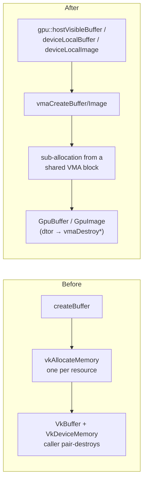
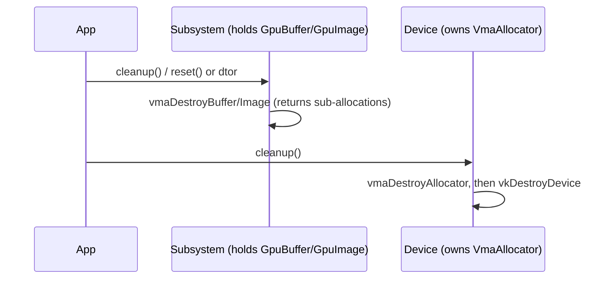

# GPU Memory: VMA + RAII Handles

> Status (2026-06-30): **complete** — the allocator and RAII wrappers are in place and
> all seven allocating subsystems are migrated. See [Migration status](#migration-status).

Swish allocates GPU memory through the [Vulkan Memory Allocator (VMA)](https://github.com/GPUOpen-LibrariesAndSDKs/VulkanMemoryAllocator)
behind two small move-only RAII wrappers, `GpuBuffer` and `GpuImage`
([GpuResource.h](../src/renderer/GpuResource/GpuResource.h)).

## Why

The original `ResourceManager` was a stateless utility: every `createBuffer` /
`createImage` did its **own** `vkAllocateMemory` and handed back a raw
`VkBuffer`/`VkImage` **and** a `VkDeviceMemory` that the caller had to pair-destroy
by hand (`vkDestroyBuffer` + `vkFreeMemory`, in the right order, on every path).

Two problems:

1. **Driver allocation cap.** Vulkan guarantees only
   `VkPhysicalDeviceLimits::maxMemoryAllocationCount` live device allocations —
   as low as **4096** on many drivers. One `vkAllocateMemory` per resource means
   the budget scales with scene size:

   $$ \text{allocations}_\text{before} \;=\; N_\text{buffers} + N_\text{images} \;\longrightarrow\; \text{approaches the } \sim\!4096 \text{ cap as the world streams in.} $$

   VMA sub-allocates many resources out of a few large device blocks:

   $$ \text{allocations}_\text{after} \;=\; \left\lceil \frac{\sum_i \text{size}_i}{\text{blockSize}} \right\rceil \;\ll\; \text{maxMemoryAllocationCount}. $$

2. **Manual lifetime.** Every consumer duplicated a `vkDestroy* + vkFreeMemory`
   teardown loop — easy to leak, double-free, or get the order wrong (exactly the
   footgun called out in the P0 review).

## How

- **One `VmaAllocator`** lives on [`Device`](../src/renderer/Pipeline/Device/Device.cpp)
  (`getAllocator()`), created with `vulkanApiVersion = VK_API_VERSION_1_3` to match
  the instance, and destroyed **before** the logical device. It is handed to
  subsystems through `RendererServices::allocator`.
- **`GpuBuffer` / `GpuImage`** are move-only. The destructor calls
  `vmaDestroyBuffer` / `vmaDestroyImage`, returning the sub-allocation to the pool.
  Because they store the allocator, they must be destroyed (or `reset()`) *before*
  `Device` destroys the allocator.
- **Factory helpers** cover the common patterns:
  - `gpu::deviceLocalBuffer` — GPU-only (vertex/index after a staging copy).
  - `gpu::hostVisibleBuffer` — host-visible **and persistently mapped**; write via
    `.mapped()` (no `vkMapMemory`/`vkUnmapMemory`).
  - `gpu::deviceLocalImage` — device-local 2D image (textures, attachments, depth).

### Teardown ordering

Subsystem GPU resources are released (their `GpuBuffer`/`GpuImage` `reset()` in
`cleanup()`, or destructor) while the device is still alive; the allocator is torn
down after, and the device last.

## Migration status

| Subsystem | Status | Notes |
|---|---|---|
| `Device` (allocator) | ✅ | single `VmaAllocator` |
| `GpuBuffer` / `GpuImage` | ✅ | RAII wrappers + factory helpers |
| `DepthBuffer` | ✅ | device-local image |
| `CameraUniforms` | ✅ | persistently-mapped UBOs |
| `TextureManager` | ✅ | device-local images + staging |
| `SceneGeometry` (static **and** dynamic/car) | ✅ | the streaming hotspot — vertex/index + staging |
| `RainSystem` | ✅ | quad VBO/IBO, instances, per-frame UBOs |
| `PostProcessManager` | ✅ | G-buffer / HDR / bloom / AO images (`GpuImage`) |
| `WindshieldRainPass` | ✅ | UBOs (`GpuBuffer`, mapped) + refraction/wetness images (`GpuImage`) |

Every allocating subsystem now goes through VMA and owns its GPU resources via
`GpuBuffer`/`GpuImage`. The last two consumers allocate a **fixed** set of resources
(recreated only on window resize), so they were never part of the streaming
allocation-count risk — but migrating them retires the manual `vkAllocateMemory` /
`vkDestroy* + vkFreeMemory` pattern everywhere.

**Verified (2026-06-30):** clean build; `ctest` 52/52; the scene renders correctly;
three swapchain recreations (window resizes) and a graceful window-close teardown
produce **zero** validation-layer errors — confirming both consumers' `recreate()`
paths re-allocate through the stored `m_allocator`, and that every `GpuBuffer`/`GpuImage`
destructor runs before `Device` calls `vmaDestroyAllocator`.

**Now unblocked (P0 #11, part 2):** with no subsystem left on the raw path, the
retained `ResourceManager::createBuffer/createImage` helpers can be removed and
`~Renderer() = default` becomes correct, since every subsystem destructor frees its
own GPU resources.
