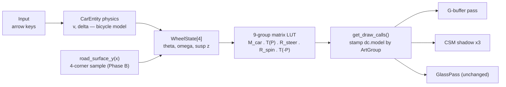

# Wheel & tire articulation — executive plan

> **Status: Phase A SHIPPED (2026-07-24)** — kinematic spin + steer articulation is implemented,
> tested (56/56), and visually verified; see the CHANGELOG entry and the as-built diagram
> [wheel-articulation-asbuilt](../diagrams/wheel-articulation-asbuilt.excalidraw). Deviations from
> this plan: per-wheel debug *gizmos* were deferred (the Road Wheels panel ships spin/steer toggles
> + spin multiplier); reverse-spin direction is pinned by unit test rather than screenshot (aliased
> stills can't read direction). Phases B and C remain unstarted.
>
> Original planning preamble: this synthesizes three expert research docs
> ([physics/math](research/01-physics-theory.md) · [rendering/asset](research/02-graphics-vulkan.md) ·
> [implementation/numerics](research/03-implementation-plan.md)) into one staged plan. All four
> gating decisions were **made by the user on 2026-07-24** (see [Decision log](#decision-log)). Per project style this
> doc guides the maintainer to implement — concepts, contracts, and file pointers, no drop-in code.

## What / why

The Porsche's four road wheels are currently welded to the body: no spin with speed, no steer with
input, no suspension. This is the single most visible realism gap at chase-camera distance. The
plan makes wheels **spin** ($\omega = v / r_e$ per axle), **steer** (front wheels + front calipers
follow the road-wheel angle $\delta$), then **ride** the road (quarter-car springs), then show
**slip/lockup** tied to rain. Headline finding: **zero render-pipeline changes** — this is pure
CPU matrix composition plus a loader upgrade.

## Current state — what already exists

| Piece | Where | Why it matters here |
| --- | --- | --- |
| Steering-wheel articulation (the template) | [src/scene/Entity/CarEntity.cpp](../../src/scene/Entity/CarEntity.cpp) lines 165–185: `dc.model = car · F · C · R(−θ) · F⁻¹` | A road wheel is the same pivot-frame conjugation with two rotations (steer, spin) and an accumulating angle |
| Pivot-frame extraction | [src/scene/ModelManager/ModelManager.cpp](../../src/scene/ModelManager/ModelManager.cpp) lines 192–211, 364–376 | The normalize/ground/scale-strip treatment the four wheel frames must copy |
| Bicycle-model physics | [src/scene/Entity/CarPhysics.h](../../src/scene/Entity/CarPhysics.h) — longitudinal 31–50, lateral 75–108 | Supplies $v$ (signed, WU/s), $\delta$ (±35°, right-positive), yaw rate, and free "traction-cap saturated" signals for Phase C |
| Per-draw model matrices in every pass | [src/renderer/SceneGeometry/SceneGeometry.cpp](../../src/renderer/SceneGeometry/SceneGeometry.cpp) 142–173 (G-buffer push), 193–206 (depth push); shadow loop [src/renderer/Renderer/Renderer.cpp](../../src/renderer/Renderer/Renderer.cpp) 724–741 | G-buffer, all 3 CSM cascades, and glass consume the same `dc.model` — spinning wheels cast spinning shadows for free |
| Analytic road height | [src/scene/RoadGeometry/RoadGeometry.cpp](../../src/scene/RoadGeometry/RoadGeometry.cpp) 11–17; hard Y snap at [src/core/App/App.cpp](../../src/core/App/App.cpp) 339–342 | Phase B "raycast" is four O(1) evaluations of the crown formula |
| Rain intensity plumbed to the car | [src/core/App/App.cpp](../../src/core/App/App.cpp) 33–47 → `m_rain_intensity` ([CarEntity.h](../../src/scene/Entity/CarEntity.h):81) | Phase C wet-μ input already exists |
| The asset ([assets/Porsche/porsche.glb](../../assets/Porsche/porsche.glb)) | 1,138 wheel pieces + 506 caliper pieces under two separate parent nodes; piece translations take **exactly 4 bit-identical values** = the wheel centers; wheelbase 2.452 m matches `kWheelbase`; radii 0.345 m front / 0.362 m rear (measured center heights) match real 992 tires | The "no pivots, flattened" blocker is **solved without Blender re-export**: group by exact translation + node ancestry at load |

Prior art: [plan/car_system_port.md](../../plan/car_system_port.md) (§1.4 DownPour wheel
articulation, §2 asset constraint, §6 loader risks) and [docs/car_system.md](../car_system.md)
(open questions 1–2, which this plan answers).

## Proposed architecture

Per frame, `CarEntity` integrates per-wheel state (spin angle θ wrapped to $[0, 2\pi)$; later
suspension travel), then `get_draw_calls` builds a small per-group matrix LUT — Body, 4 wheels,
4 calipers — and stamps each of the 1,665 submeshes by its load-time group tag. The composed
matrix per wheel is the steering-wheel sandwich with steer left of spin (steer carries the spin
axis with the upright — see the conjugation proof in [01 §6.2](research/01-physics-theory.md)):

$$
M_w = M_{\text{car}} \cdot T(P_w) \cdot R_{\text{steer}}(\hat y, -\delta)\big|_{\text{fronts}}
\cdot R_{\text{spin}} \cdot T(-P_w)
$$

where $R_{\text{spin}}$ rotates about the axle in the corner's **as-measured baked frame** with a
per-corner derived sign (see risk 2). The renderer stays a dumb consumer: no new draws, no new
descriptors, no shader edits; new CPU math is ≲ 2 µs/frame — no threads, no SIMD.

At load time (once): walk the GLB node tree; classify each piece by ancestor
(`Combined3DWheel…` = spins, `CombinedCalliperZone…` = caliper, note the asset's double-L
spelling); assign its corner by the sign pattern of its exact translation; recover per-corner
pivot frame + radius; normalize them exactly like `sw_pivot_frame`; assert piece counts
(302/302/267/267 wheels + 140/140/113/113 calipers) and fall back to a rigid body on any anomaly.

## Staged roadmap

Each phase is independently shippable, debug-UI-tunable (`#ifdef SWISH_DEBUG_UI`), and release-
inert until its one intentional, CHANGELOG'd visual change ships. Acceptance follows the
visual-verification law in [tasks/lessons.md](../../tasks/lessons.md): a clean build is not done —
run it, take **window-only** screenshots (`screencapture -R <window bounds>`, never full display),
judge extremes, revert any temp forces, keep `make test` green (52/52 today).

### Phase A — kinematic spin + steer articulation (effort: M, one session) — ✅ SHIPPED 2026-07-24

- **Scope:** loader grouping + corner frames/radii/spin-signs; new pure header
  `src/scene/Entity/WheelKinematics.h` (`wheel_spin_step` with wrap, `slip_ratio`, optional
  `ackermann_split`); θ integration at the end of `CarEntity::update`; `ArtGroup` tag +
  9-entry LUT stamping in `get_draw_calls`; gated debug tunables (spin multiplier, radius
  override, per-wheel gizmos cloning `get_steering_wheel_pivot_world`).
- **Files:** [SceneTypes.h](../../src/scene/SceneTypes.h), [ModelManager.cpp](../../src/scene/ModelManager/ModelManager.cpp),
  `WheelKinematics.h` (new), [CarEntity.h](../../src/scene/Entity/CarEntity.h)/[.cpp](../../src/scene/Entity/CarEntity.cpp),
  [tests/test_car_physics.cpp](../../tests/test_car_physics.cpp), [DebugParams.h](../../src/debug/DebugParams.h),
  [DebugUI.cpp](../../src/debug/DebugUI.cpp), [App.cpp](../../src/core/App/App.cpp), CHANGELOG.md.
- **Tests to add:** spin sign incl. **reverse**; wrap continuity across $2\pi$; 48 km float-precision
  regression (θ stays in $[0,2\pi)$, matches a double reference); creep-speed no-freeze; slip-ratio
  floor; Ackermann relation (if built).
- **Acceptance criteria:**
  - `make test` green (52 → ~58).
  - `make debug`, drive, window-only screenshots at extremes: wheels still at standstill; all four
    roll **with** travel direction at creep; spin **backward in reverse**; left and right sides
    rotate the same way (the counter-rotation gotcha); full-left AND full-right lock steer the
    fronts + front calipers visibly, rears and rear calipers stay put.
  - No cone wobble when steering at speed (order bug) and no rim wobble straight-line at speed
    (baked-tilt bug) — judge from a close chase view.
  - Wheel shadows visibly rotate/steer with the mesh (cascade 0, sun low).
  - Temp forces (e.g. an exaggerated spin multiplier used for screenshots) reverted; release build
    (`SWISH_DEBUG_UI=OFF`) byte-identical until the phase intentionally ships.

### Phase B — ride height + suspension (effort: M, 1–2 sessions; second is eye-tuning)

- **Scope:** sample `road_surface_y` under the four hubs; per-corner spring targets → semi-implicit
  Euler `suspension_step` at a **fixed internal substep** $h = 1/240$ s (stability bound
  $h < \tfrac{2}{\omega_n}(\sqrt{1+\zeta^2}-\zeta)$ — derived in [03 §2.3](research/03-implementation-plan.md));
  defaults near $f_n \approx 1.4$ Hz, $\zeta \approx 0.45$; visual body heave/pitch/roll + per-wheel
  vertical travel composed **only into draw matrices**; springs relax to neutral while the ribbon
  follower owns the pose. Weight-transfer dive/squat/lean is deferred per decision 3
  (ride-height first).
- **Files:** `WheelKinematics.h`, `CarEntity` (+ a late `update_wheel_visuals(dt)` called from
  [App.cpp](../../src/core/App/App.cpp) after the treadmill), DebugParams/DebugUI (k, ζ, travel
  sliders), tests.
- **Tests to add:** 29 mm crown-step response (overshoot consistent with ζ, settle within
  $\approx 4 / (\zeta\,\omega_n)$); stability at $h = 1/240$ with max-slider stiffness.
- **Acceptance criteria:**
  - Visible ≈ 1.1° crown lean while lane-keeping off the median; a lane change across the crown
    settles with one damped overshoot — no hard vertical snap, no ringing (screenshot sequence).
  - Suspension never writes `m_position` / `m_rotation` (it must not fight the Y snap or ribbon
    follower) — verify existing physics tests are untouched and behavior on ramps is calm.
  - Slider extremes (max k, min ζ) stay bounded in a 10 s drive.
  - Window-only screenshots; `make test` green; release identical until intentionally shipped.

### Phase C — slip/lockup visuals + rain-μ tie-in (effort: S–M, one session)

- **Scope:** `visual_omega_step` — a first-order chase of drawn ω toward rolling, lockup (ω → 0),
  or spin-up (ω > v/r) targets keyed off the **already-computed** traction-cap saturation signals
  (`powerTerm > tractionCap`, brake at the μ cap); wet μ = $\mathrm{mix}(1.10, \approx 0.6,
  \text{rain})$ feeding the visual thresholds **and** — per decision 4 (coupled) —
  `CarParams::tireMu`, so wet handling genuinely degrades; the grip delta is this phase's one
  intentional, CHANGELOG'd gameplay change. No spray, puddles, TAA, or motion blur — those are **paused** features
  ([CLAUDE.md](../../CLAUDE.md)); wagon-wheel strobing above ~25 km/h is accepted until then.
- **Files:** `WheelKinematics.h`, [CarEntity.cpp](../../src/scene/Entity/CarEntity.cpp),
  DebugParams/DebugUI (μ_wet, lockup/spin-up rates), tests.
- **Tests to add:** lockup drives ω → 0 within a stated time constant (~0.3 s ramp, never a snap);
  launch beyond traction gives ω r > v; ω re-converges to v/r when pedals release.
- **Acceptance criteria:**
  - **Test rain at both extremes, 0 and 1.0** (project law): dry launch barely slips; wet launch
    visibly spins longer (crossover speed $v^*$ rises ≈ 22.5 → 41 m/s); wheels re-sync to rolling
    on pedal release.
  - Coupled (decision 4): the handling change (e.g. 30 m/s stopping distance ~42 → ~77 m wet) is
    the one intentional, CHANGELOG'd change, with wet-handling unit tests added alongside the
    untouched dry-physics tests.
  - Window-only screenshots at both rain extremes; `make test` green.

## Decision log

| # | Decision | Options | Expert recommendation | Status |
| --- | --- | --- | --- | --- |
| 1 | Wheel pivot source | (a) Blender re-export with `wheel_FL/FR/BL/BR` groups; (b) loader-side grouping by ancestry + exact translation | **(b)** — zero asset churn, exact centers verified, load-time asserts; re-export risks five silent name/order contracts + the scale-baking trap ([plan/car_system_port.md](../../plan/car_system_port.md):438, [02 §3.1](research/02-graphics-vulkan.md)); (a) remains the escape hatch | **DECIDED (b) loader-side** — 2026-07-24 |
| 2 | Ackermann steer split | Parallel steer vs inner/outer split | **Parallel** — split is ~12.5° at full lock but ~0.002° at highway speed; keep `ackermann_split` as an optional debug toggle | **DECIDED parallel steer** — 2026-07-24 |
| 3 | Phase B scope | Crown ride-height/attitude only vs + accel/brake/cornering weight transfer (dive ≤ ~2.5–3°, roll ≈ 2°/g) | Ride-height first; weight transfer is a bounded extension on the same springs | **DECIDED ride-height first** — 2026-07-24 |
| 4 | Phase C wet μ | Cosmetic thresholds only vs coupled into `CarParams::tireMu` (real handling change) | Needs an explicit call — the coupling seam is one per-frame params copy, but it changes gameplay | **DECIDED coupled into handling** — 2026-07-24 |

## Risk register

| # | Risk | Mitigation |
| --- | --- | --- |
| 1 | **Transform-order / sign bugs** (wheels spin backward, steer mirrored, spin axis stays un-steered → 35° hula-hoop wobble at lock) | Sign-convention table with derivations ([03 §3.3](research/03-implementation-plan.md), [01 §6.3](research/01-physics-theory.md)); steer-left-of-spin order pinned by proof; per-wheel debug gizmos; unit tests pin ω sign incl. reverse; mandatory screenshot pass at both extremes |
| 2 | ~~The research docs disagree on raw node rotations~~ **RESOLVED by direct GLB measurement (2026-07-24)**: [02 §2.3](research/02-graphics-vulkan.md) is correct — the transform-bearing piece nodes carry rotations: left wheels = the right-side instance rotated ~180° about $\hat y$ (proper), baked **camber** $R_z(1°$ front $/\,2°$ rear$)$ matching real 992 alignment, and left calipers X-mirrored via $q(180°$ about $\hat x) \cdot S(-1,-1,-1)$. 03 §0.1's "pure translations / one global sign" checked the transform-less mesh grandchildren — one level too deep (corrected in place) | Implement the general form **as fact, not hedge**: spin conjugated through each corner's measured baked frame with per-corner derived sign $s_w = \operatorname{sgn}(\hat a_{\text{car}} \cdot \hat z)$; loader logs each recovered frame's rotation at load |
| 3 | Frame-tilt wobble at speed (**confirmed**: the axle is cambered 1–2°, so spinning about an untilted axis wobbles the rim by ± ~13 mm at the rear) | Same general form as risk 2; explicit "no rim wobble at speed" acceptance check |
| 4 | Loader-grouping brittleness if the asset ever changes | ε-tripwire on translation clustering; assert 4 corners + exact piece counts; loud logs next to the existing bbox log; graceful fallback to rigid body (today's look) |
| 5 | Suspension fights the Y snap / ribbon follower | Visual-only offsets, never write back to `m_position`/`m_rotation`; neutral on ribbons; update ordered after the treadmill |
| 6 | Debug sliders destabilize the spring | Semi-implicit Euler + fixed $h = 1/240$ substep (stable to $\omega_n \approx 480$ rad/s); stability unit test |
| 7 | float32 θ degradation at km distances (0.9° quanta + frozen creep at 48 km) | Wrap θ to $[0, 2\pi)$ inside the step function (heading-wrap precedent); 48 km regression test |
| 8 | Wagon-wheel strobing above ~25 km/h | Accepted; the honest fix is the **paused** motion-vectors/TAA feature — do not start it for wheels |

Smaller known deltas between the docs (pick via debug sliders, not debate): rear radius 0.362 m
(measured center height — the loader's pivot truth) vs 0.367 m (a tire outer-geometry estimate);
per-corner sprung mass 296/459 vs 327/508 kg (unsprung-mass accounting); front track
1.45 m (mount face) vs ~1.58 m (tire centerline); Phase B shape — three heave/pitch/roll filters
([01 §5.4](research/01-physics-theory.md)) vs four corner springs ([03 §4.2](research/03-implementation-plan.md)),
visually equivalent; 03's file plan assumes the latter.

## Reading list

- [research/01-physics-theory.md](research/01-physics-theory.md) — rolling kinematics, wrapping/ULP, Ackermann, slip, quarter-car, transform derivations
- [research/02-graphics-vulkan.md](research/02-graphics-vulkan.md) — draw-call/shadow flow proof, GLB measurements, loader-vs-re-export analysis, perf/MoltenVK notes
- [research/03-implementation-plan.md](research/03-implementation-plan.md) — state design, update ordering, numerics, algorithms, test matrix, phase/file plan
- [plan/car_system_port.md](../../plan/car_system_port.md) · [docs/car_system.md](../car_system.md) — prior art and the questions this plan answers
- Diagram: [docs/diagrams/wheel-tire-plan.excalidraw](../diagrams/wheel-tire-plan.excalidraw)

---
*Largely AI-generated (Claude research agents + PM synthesis, 2026-07-24) — review before relying on it.*
