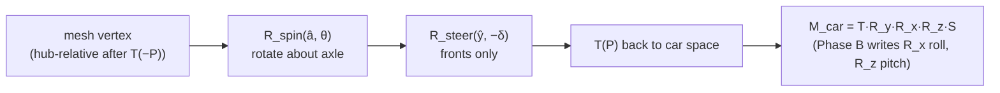
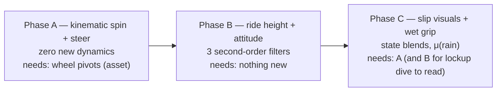

# Physics & math of rotating, steering, realistically-moving wheels

> **Status: research / theory only.** Nothing in this document is implemented. It is the study
> companion for answering open questions 1–2 in [docs/car_system.md](../../car_system.md)
> ("Ground Contact" and "Wheel Rotation Animation") and for the wheel-spin work deferred in
> [plan/car_system_port.md](../../../plan/car_system_port.md) (§2, asset constraint at line 84;
> Phase 6 outlook at line 377).
>
> **How to read this.** Each section builds one layer of theory, derives the equations rather than
> asserting them, grounds every claim in the current code with `file:line` citations, and ends with
> *Check yourself* questions. Pseudocode sketches show *structure* only — deliberately not
> drop-in C++. Textbook pointers are collected in [References](#references).
>
> **Prerequisites already in the codebase** (read these first if you haven't):
> - Longitudinal model: `longitudinal_accel` in
>   [src/scene/Entity/CarPhysics.h](../../../src/scene/Entity/CarPhysics.h) (lines 31–50) —
>   power-limited, traction-capped thrust; emergent top speed (lines 112–122).
> - Lateral model: `dynamic_bicycle_deriv` + `max_yaw_rate` (same file, lines 75–108) —
>   saturating-linear tires, friction-circle yaw cap.
> - SI ↔ world-unit boundary: `CarEntity::update` in
>   [src/scene/Entity/CarEntity.cpp](../../../src/scene/Entity/CarEntity.cpp) (lines 46–122);
>   `WORLD_SCALE = 1000` in [src/utils/Types.h](../../../src/utils/Types.h) (line 20).
> - The steering-wheel pivot mechanism: `CarEntity::get_draw_calls`
>   ([CarEntity.cpp](../../../src/scene/Entity/CarEntity.cpp) lines 173–180) and the pivot-frame
>   extraction in [src/scene/ModelManager/ModelManager.cpp](../../../src/scene/ModelManager/ModelManager.cpp)
>   (lines 192–211, 364–376).

**Contents**

1. [Rolling kinematics](#1-rolling-kinematics) — ω = v/rₑ, effective rolling radius, real 911 numbers, the wagon-wheel effect
2. [Angle wrapping & float precision](#2-angle-wrapping--float32-precision) — why θ must be wrapped, with ULP arithmetic
3. [Front-wheel steering geometry](#3-front-wheel-steering-geometry) — Ackermann vs parallel steer, quantified
4. [Longitudinal slip](#4-longitudinal-slip-phase-c-material) — slip ratio, lockup, spin-up, the wheel ODE and why it is stiff
5. [Wheel loads, ride height & suspension](#5-wheel-loads-ride-height--suspension-phase-b-material) — quarter-car, load transfer, 4-corner sampling
6. [Transform composition](#6-transform-composition-the-payoff) — the exact matrix chain, why steer precedes spin, sign conventions
7. [Symbol ↔ code mapping](#7-symbol--code-mapping-table)
8. [Recommendation: a staged model](#8-recommendation-a-staged-model)

Throughout: SI units unless noted; the code converts to world units (WU) only at the
`CarEntity` boundary, 1 m = 1000 WU ([Types.h:20](../../../src/utils/Types.h),
[CarEntity.h:99](../../../src/scene/Entity/CarEntity.h)).

---

## 1. Rolling kinematics

### 1.1 The one equation that does 90% of the job

A wheel that rolls **without slipping** satisfies the rolling constraint: the contact point has zero
velocity relative to the road. If the hub moves forward at $v$ and the wheel has effective radius
$r_e$, the constraint forces

$$
\omega = \frac{v}{r_e} \qquad \text{[rad/s]}
$$

and the visual spin angle is the integral

$$
\theta(t + \Delta t) = \theta(t) + \omega\,\Delta t = \theta(t) + \frac{v}{r_e}\,\Delta t .
$$

That is the entire Phase A physics. The car already knows $v$: it is
`m_forward_speed / kWorldUnitsPerMeter` ([CarEntity.cpp:52](../../../src/scene/Entity/CarEntity.cpp)).
DownPour did exactly this — `wheelRotation += (v / r_wheel)·dt`
([plan/car_system_port.md:58](../../../plan/car_system_port.md)).

**Sign conventions.** Use the *signed* speed. `m_forward_speed` is negative in reverse (capped at
−12 m/s, [CarEntity.h:101](../../../src/scene/Entity/CarEntity.h)), so $\theta$ automatically runs
backwards when reversing — no special case needed. What *does* need care is which rotation
direction about the axle axis means "rolling forward"; that is a geometry question, derived
properly in [§6.3](#63-the-spin-axis-and-its-sign--derived-not-guessed). For now, note the shape of
the sanity test: at speed, a wheel spinning the wrong way reads instantly wrong to the eye —
this is a *verify by looking* feature (per the project convention in
[CLAUDE.md](../../../CLAUDE.md), "Verify visual features by looking").

### 1.2 Effective rolling radius — and real 911 Turbo S numbers

Which radius goes in the denominator? A loaded tire is squashed: its axle sits at the **loaded
radius** $r_l$, below the **unloaded radius** $r_0$. But the belt of a radial tire is nearly
inextensible — it behaves like a tank track being laid down — so the distance travelled per
revolution corresponds to a radius *larger* than $r_l$. The **effective rolling radius** is defined
through the free-rolling constraint itself, $r_e = v/\omega$, and sits between the two:

$$
r_l \;<\; r_e \;<\; r_0, \qquad r_e \;\approx\; r_0 - \frac{\delta_z}{3}
\quad\text{(radial tires; } \delta_z = r_0 - r_l \text{ is the static deflection)} .
$$

The $\delta_z/3$ rule of thumb is standard (Pacejka ch. 1; Gillespie ch. 10). Now the actual car.
The 992 Turbo S runs staggered tires:

| | Front **255/35 ZR20** | Rear **315/30 ZR21** |
|---|---|---|
| Section width | 255 mm | 315 mm |
| Sidewall = width × aspect | 255 × 0.35 = 89.3 mm | 315 × 0.30 = 94.5 mm |
| Rim radius | 20 in / 2 = 254.0 mm | 21 in / 2 = 266.7 mm |
| Unloaded radius $r_0$ | 254.0 + 89.3 = **343 mm** | 266.7 + 94.5 = **361 mm** |
| Static deflection $\delta_z$ (corner load ÷ tire stiffness ≈ 3.2 kN ÷ 270 N/mm, 5.0 kN ÷ 330 N/mm) | ≈ 12 mm | ≈ 15 mm |
| Loaded radius $r_l = r_0 - \delta_z$ | ≈ 331 mm | ≈ 346 mm |
| **Effective radius $r_e \approx r_0 - \delta_z/3$** | **≈ 0.339 m** | **≈ 0.356 m** |

Manufacturer *revolutions-per-mile* specs (measured at rated load and speed) typically imply an
$r_e$ another 2–3% smaller — e.g. ~780 rev/mi for a 255/35R20 gives
$r_e = 1609.3/(780 \cdot 2\pi) \approx 0.33$ m. So the honest answer is a range:

$$
r_{e,\text{front}} \approx 0.33\text{–}0.34\ \text{m}, \qquad
r_{e,\text{rear}} \approx 0.35\text{–}0.36\ \text{m}.
$$

Recommendation: adopt **0.34 m front / 0.36 m rear** as defaults and expose both as debug-UI
sliders (like every other tunable in this project) — the eye is the final arbiter of whether the
tread appears to slide.

Because the axles have different $r_e$, front and rear wheels genuinely rotate at different rates
— keep **per-axle (or per-wheel) $\theta$**, never one shared angle.

### 1.3 Magnitudes at top speed — and the wagon-wheel effect

Top speed emerges from the force balance at $v_{\text{top}} \approx 92$ m/s
([CarPhysics.h:112–122](../../../src/scene/Entity/CarPhysics.h); the test pins it to 88–96 m/s,
[tests/test_car_physics.cpp:31–40](../../../tests/test_car_physics.cpp); the normalization constant
`kMaxForwardSpeed = 92'000` WU/s matches, [CarEntity.h:100](../../../src/scene/Entity/CarEntity.h)).
At that speed:

$$
\omega_{\text{front}} = \frac{92}{0.339} \approx 271\ \text{rad/s} \approx 43.2\ \text{rev/s} \approx 2590\ \text{rpm},
\qquad
\omega_{\text{rear}} = \frac{92}{0.356} \approx 258\ \text{rad/s} \approx 2470\ \text{rpm}.
$$

At 60 fps the wheel turns $\omega \Delta t = 271/60 \approx 4.5$ rad $\approx 259°$ **per frame**.
The renderer is a sampler, and this is textbook temporal aliasing — the *wagon-wheel effect*. A
wheel with $N$-fold spoke symmetry (the Turbo S center-lock is a 10-spoke design) presents a
pattern with angular period $2\pi/N$; sampling is unambiguous only while the per-frame rotation
stays under half a period (the Nyquist condition):

$$
\omega\,\Delta t < \frac{\pi}{N}
\quad\Longleftrightarrow\quad
v < \frac{\pi\, r_e\, f_{\text{fps}}}{N}
= \frac{\pi \times 0.339 \times 60}{10} \approx 6.4\ \text{m/s} \approx 14\ \text{mph}.
$$

Above ~14 mph at 60 fps the spokes strobe: they appear frozen whenever $N f_{\text{rot}}$ is near a
multiple of the frame rate, and run backwards in between. Implications, in order of increasing
effort:

1. **Accept it.** Film cameras alias the same way; audiences are used to it.
2. **Spoke blur at speed** — the classic racing-game trick: cross-fade the crisp rim to a
   radially-blurred rim texture (or fade spoke alpha) once $\omega \Delta t$ crosses the Nyquist
   bound above. Cheap, effective, tunable.
3. **True motion blur** needs per-pixel velocity — that is the **paused** motion-vectors/TAA
   feature ([CLAUDE.md](../../../CLAUDE.md), deferred task 4). Do not start it for wheels; just note
   that when it lands, spinning wheels are its best showcase.

**Check yourself.**
- Over a 1 km drive, how many *more* revolutions does a front wheel make than a rear wheel?
  (Answer: $\tfrac{1000}{2\pi}\left(\tfrac{1}{0.339}-\tfrac{1}{0.356}\right) \approx 22$–26 rev —
  which is why axles can't share a $\theta$.)
- Why does the rolling constraint use $r_e$ and not $r_l$, even though the axle height above the
  road *is* $r_l$? (Hint: one is about vertical geometry, the other about circumference laid down
  per revolution.)
- At 120 Hz (ProMotion), where does the 10-spoke Nyquist speed move to?

---

## 2. Angle wrapping & float32 precision

### 2.1 The problem: θ grows without bound

$\theta \mathrel{+}= \omega\,\Delta t$ accumulates forever. After the current 4.2 km road:

$$
\theta_{4.2\,\text{km}} = \frac{s}{r_e} = \frac{4200}{0.34} \approx 12{,}350\ \text{rad}
\quad (\approx 1966 \text{ revolutions}).
$$

A `float` (IEEE-754 binary32) has a 24-bit significand, so for $x \in [2^k, 2^{k+1})$ one **unit in
the last place** is $\text{ULP}(x) = 2^{k-23}$. Since
$12{,}350 \in [2^{13}, 2^{14})$:

$$
\text{ULP}(12{,}350) = 2^{13-23} = 2^{-10} \approx 9.8\times10^{-4}\ \text{rad} \approx 0.056°.
$$

Every representable wheel angle is now on a 0.056° grid — a rim-surface quantum of
$\text{ULP}\cdot r_e \approx 0.33$ mm. Marginal, arguably invisible. But the endless-LIE treadmill
targets 20–30 miles (see the rebase machinery in
[RoadGeometry.h:27–31](../../../src/scene/RoadGeometry/RoadGeometry.h), built precisely because
float coordinates degrade). At 48 km:

$$
\theta_{48\,\text{km}} = \frac{48{,}000}{0.34} \approx 141{,}200 \in [2^{17}, 2^{18})
\;\Rightarrow\;
\text{ULP} = 2^{-6} \approx 0.0156\ \text{rad} \approx 0.9°,
$$

a 5.3 mm rim quantum. Consequences at that magnitude:

- **Visible stepping at low speed.** Creeping at 0.5 m/s, the per-frame increment is
  $\Delta\theta = (0.5/0.34)/60 \approx 0.025$ rad — only ~1.6 ULP. The wheel advances in coarse,
  visibly discrete 0.9° ticks; increments below $\tfrac{1}{2}$ ULP round to *zero* and the wheel
  freezes while the car still moves.
- **Trig argument reduction.** The angle eventually feeds `sin`/`cos` (inside the rotation matrix).
  Reducing an argument of 141,200 rad modulo $2\pi$ in float discards the same low-order bits —
  the *phase* of the wheel is only known to ±0.45°, and it jitters frame to frame.

### 2.2 The fix: wrap every frame

The wheel is periodic — $\theta$ and $\theta - 2\pi k$ render identically — so unlike an odometer
nothing is lost by wrapping:

```text
theta += (v / r_e) * dt
theta  = wrap(theta)        # keep theta in [0, 2π)  (or any bounded interval)
```

Wrapped, $\theta < 2\pi < 2^3$, so ULP $\le 2^{-21} \approx 4.8\times10^{-7}$ rad forever —
five orders of magnitude finer than the failure mode, independent of distance driven.

This is the same medicine the heading already takes: `m_rotation.y` is wrapped to ±180° every
update ([CarEntity.cpp:110–111](../../../src/scene/Entity/CarEntity.cpp)), and the plan document
lists unbounded heading as a named risk
([plan/car_system_port.md](../../../plan/car_system_port.md), risk 8). Same bug class, same cure.

**Check yourself.**
- Write `wrap` two ways: with `fmod`, and with `floor`. Which one keeps a *negative* θ (reverse
  driving) in $[0, 2\pi)$? What does `std::fmod(-1.0f, 6.283f)` actually return? (Check the man
  page — the sign of the result follows the dividend.)
- Why is "accumulate in `double` instead" a weaker fix than wrapping? (Two reasons: one about
  bounded vs unbounded error, one about what type `glm::rotate` takes.)
- The heading wrap uses `fmod(ψ + 180, 360) − 180`. Derive why that lands in (−180, 180] for
  positive inputs. Does it for negative ψ?

---

## 3. Front-wheel steering geometry

### 3.1 Applying the road-wheel angle

The physics already produces a road-wheel steer angle: `m_steering_angle` in degrees,
right-positive, clamped to ±35° ([CarEntity.h:80, 105](../../../src/scene/Entity/CarEntity.h)),
converted to radians as $\delta$ at [CarEntity.cpp:86](../../../src/scene/Entity/CarEntity.cpp).
Visually, steering is a rotation of each *front* wheel about its (approximately vertical) kingpin
axis through the hub: a rotation $R(\hat y, \pm\delta)$ in the wheel's pivot frame — exactly one
extra factor in the transform chain of [§6](#6-transform-composition-the-payoff). Rear wheels get
no steer factor. (Real kingpins are not vertical — the 911 has ~6–8° caster, so a steered wheel
gains visible camber at full lock. Ignore this; it's a garnish far below current fidelity.)

The sign needs the same care as heading: the code's convention is that *positive* (right) steer
*decreases* yaw ([CarEntity.cpp:109–110](../../../src/scene/Entity/CarEntity.cpp)), because
$R_y(+)$ turns the +X nose toward −Z, which is *left* (see the frame derivation in §6.3). So the
visual steer factor is $R(\hat y, -\delta)$ — the same negation the steering wheel already applies
to its column angle (`-sw_angle`, [CarEntity.cpp:179](../../../src/scene/Entity/CarEntity.cpp)).

### 3.2 Ackermann geometry — what it is

With two steered wheels a subtlety appears: in a turn the inner front wheel tracks a tighter circle
than the outer one, so for *both* to roll without scrubbing, their axes must intersect the rear
axle line at a **common turn center**. Let $L$ = wheelbase, $w$ = front track, $R$ = turn radius
of the rear-axle midpoint. From the two right triangles:

$$
\tan\delta_i = \frac{L}{R - w/2}, \qquad \tan\delta_o = \frac{L}{R + w/2}
\quad\Longrightarrow\quad
\boxed{\;\cot\delta_o - \cot\delta_i = \frac{w}{L}\;}
$$

— the **Ackermann condition** (Gillespie ch. 8). *Parallel steer* (what a naive implementation
does) sets $\delta_i = \delta_o = \delta$ and violates it; real steering linkages sit somewhere
between parallel and full Ackermann.

### 3.3 Quantified for this car — is it worth it?

With $L = 2.45$ m ([CarPhysics.h:23](../../../src/scene/Entity/CarPhysics.h), and
$a + b = 1.49 + 0.96 = 2.45$ consistently, [CarPhysics.h:57–58](../../../src/scene/Entity/CarPhysics.h))
and front track $w \approx 1.58$–1.60 m (992 Turbo S):

**At full lock** ($\delta = 35°$, only reachable near standstill): the bicycle model's turn radius
is $R = L/\tan 35° = 3.50$ m, and Ackermann wants

$$
\delta_i = \arctan\frac{2.45}{3.50 - 0.80} = 42.2°,
\qquad
\delta_o = \arctan\frac{2.45}{3.50 + 0.80} = 29.7°,
$$

an **inner–outer split of ~12.5°** — clearly visible in a close-up of a parked car at full lock
(parallel steer is ~6–7° wrong on each wheel).

**At highway speed**: a brisk 0.3 g sweep at 30 m/s has $R = v^2/a_y \approx 306$ m and
$\delta \approx \arctan(L/R) = 0.46°$. The inner–outer split shrinks like (small-angle expansion —
derive it by differencing the two arctangents):

$$
\delta_i - \delta_o \;\approx\; \frac{L\,w}{R^2} = \frac{2.45 \times 1.6}{306^2}
\approx 4\times10^{-5}\ \text{rad} \approx 0.0024°,
$$

utterly invisible.

**Recommendation.** The physics is a single-track (bicycle) model — Ackermann has *zero* dynamic
effect here; it is purely cosmetic. In a highway sim viewed from cockpit or chase camera, steering
angles live in the sub-2° regime where the split is microscopic. **Ship parallel steer** (same
$\delta$ to both fronts). If a showcase/garage camera at full lock ever lands, upgrading is a
three-line change: feed each wheel its own $\delta_{i,o}$ from the boxed formula, using
$R = L/\tan\delta$ from the bicycle-model angle. Note which wheel is "inner" flips with the sign
of $\delta$.

**Check yourself.**
- Derive the boxed Ackermann condition from the two triangles yourself. Where exactly does the
  assumption "turn center lies on the rear axle line" come from? (Hint: rear wheels don't steer,
  and a wheel rolls only perpendicular to its axle.)
- Why does the *bicycle* model get away with one wheel per axle? What quantity is it averaging?
- For the interested: look up "Ackermann percentage" — why do race cars often run *less* than
  100% Ackermann? (Keywords: slip angle, load-dependent peak.)

---

## 4. Longitudinal slip (Phase C material)

Everything so far assumed pure rolling. Real tires transmit longitudinal force only *by* slipping
a little. This section is the theory needed to make wheels visually lock under braking and spin
under launch — and to decide how much of it to actually simulate.

### 4.1 Slip ratio and its singularity

The **slip ratio** compares the wheel's circumferential speed to the ground speed
(ISO 8855 / SAE J670 sign convention: positive = driving, negative = braking):

$$
\kappa \;=\; \frac{\omega\, r_e - v_x}{|v_x|}
\qquad
\begin{cases}
\kappa = 0 & \text{free rolling } (\omega = v_x/r_e)\\
\kappa = -1 & \text{locked wheel } (\omega = 0,\ v_x > 0)\\
\kappa \to +\infty & \text{burnout } (\omega r_e \gg v_x)
\end{cases}
$$

The denominator dies at $v_x \to 0$ — the same singularity family the codebase already handles
twice: `longitudinal_accel` floors $v$ at 3 m/s before dividing power by it
([CarPhysics.h:37](../../../src/scene/Entity/CarPhysics.h)), and the lateral model both floors
$v_x$ at 1 m/s ([CarPhysics.h:89](../../../src/scene/Entity/CarPhysics.h)) *and* hands off to a
kinematic model below 5 m/s ([CarEntity.cpp:90–107](../../../src/scene/Entity/CarEntity.cpp)).
The standard guards for κ are the same shape:

$$
\kappa = \frac{\omega r_e - v_x}{\max(|v_x|,\ v_\varepsilon)},\quad v_\varepsilon \approx 0.5\text{–}1\ \text{m/s}
\qquad\text{or the symmetric}\qquad
\kappa = \frac{2(\omega r_e - v_x)}{|\omega r_e| + |v_x| + \varepsilon}.
$$

Longitudinal force then follows a curve that rises steeply from κ = 0 ($F_x \approx C_\kappa
\kappa$ with slip stiffness $C_\kappa \sim 15$–$30\,F_z$), peaks around |κ| ≈ 0.1–0.15 at
$\mu F_z$, and falls somewhat beyond. Note the exact analogy with the *lateral* model already in
the code: slip **angle** α is the lateral input
([CarPhysics.h:93–94](../../../src/scene/Entity/CarPhysics.h)), slip **ratio** κ is the
longitudinal one; the code's `clamp(−Cα·α, ±μFz)`
([CarPhysics.h:101–102](../../../src/scene/Entity/CarPhysics.h)) is the saturating-linear
approximation of the same rise-then-plateau shape.

### 4.2 When do wheels lock? When do they spin up?

The existing model never resolves ω, so lockup/spin-up must be *derived from its saturation
states* — which turn out to be exactly the right signals.

**Braking / lockup.** The code brakes at the tire limit: $F_{\text{brake}} = \text{brake}\cdot\mu m g$
([CarPhysics.h:42](../../../src/scene/Entity/CarPhysics.h)) — i.e. it implicitly models a perfect
ABS holding the tire at its friction peak. A real wheel locks when brake torque exceeds the maximum
torque the road can react through the contact patch:

$$
T_{\text{brake}} > \mu F_z r_e
\quad\Longrightarrow\quad
I_w \dot\omega = \underbrace{\mu F_z r_e - T_{\text{brake}}}_{<\,0\ \text{const}}
\;\Rightarrow\;
t_{\text{lock}} = \frac{I_w\,\omega_0}{T_{\text{brake}} - \mu F_z r_e}.
$$

Numbers: per front wheel $F_z = \tfrac{1}{2} m g b / L = 3.2$ kN (the same static-load levers as
[CarPhysics.h:97–98](../../../src/scene/Entity/CarPhysics.h)), so the grip torque is
$\mu F_z r_e = 1.1 \times 3209 \times 0.339 \approx 1200$ N·m. A wheel + tire + disc assembly has
$I_w \approx 2$ kg·m² (≈ 12 kg of tire at ~0.32 m + rim + disc). Overbraking by 50% from 30 m/s
($\omega_0 = 88$ rad/s) locks the wheel in $t_{\text{lock}} = 2\cdot 88 / 600 \approx 0.3$ s —
fast, but not instant; a visual lockup should *ramp* over a few tenths, not snap.

**Launch / spin-up.** Drive force is $\min(P\eta/v,\ \mu m g)$
([CarPhysics.h:38–39](../../../src/scene/Entity/CarPhysics.h)). The power term exceeds the traction
cap — i.e. the tires are the binding constraint and *would* spin without the cap — whenever

$$
\frac{P\eta}{v} > \mu m g
\quad\Longleftrightarrow\quad
v < v^\* = \frac{P\eta}{\mu m g}
= \frac{478{,}000 \times 0.85}{1.1 \times 1670 \times 9.81} \approx 22.5\ \text{m/s (dry)}.
$$

So at full throttle below ~50 mph the model already sits exactly on the traction cap (the launch
test asserts this regime: a ≈ μg at standstill,
[tests/test_car_physics.cpp:11–19](../../../tests/test_car_physics.cpp)) — and the comparison
`powerTerm > tractionCap` is a **free, already-computed "wheels at the adhesion limit" flag**. Note
what happens in rain: with μ = 0.6, $v^\* = 41$ m/s — wet launches spin to much higher speeds,
automatically. (AWD with launch control slips mildly, κ ≈ 0.05–0.15; a burnout is κ ≫ 1. Both are
visual dressing on the same signal.)

### 4.3 The full wheel ODE — and why you should not integrate it per frame

The honest model adds one rotational DOF per wheel:

$$
I_w\,\dot\omega \;=\; T_{\text{drive}} \;-\; F_x(\kappa)\, r_e \;-\; T_{\text{brake}}\,\mathrm{sgn}(\omega),
\qquad
F_x = \mathrm{clamp}\!\left(C_\kappa\,\kappa,\ \pm\mu F_z\right).
$$

Its equilibrium is free rolling ($F_x$ balances the applied torque with a small κ). The catch:
linearize around κ = 0 (substitute $\kappa = (\omega r_e - v)/v$) to get
$\dot\omega = -\omega/\tau + \dots$ with time constant

$$
\tau = \frac{I_w\, v}{C_\kappa\, r_e^2}
\;\approx\; \frac{2 \times v}{64{,}000 \times 0.115}
\;\approx\; 2.7\times10^{-4}\, v
\quad\Rightarrow\quad
\tau(30\ \text{m/s}) \approx 8\ \text{ms}, \qquad \tau(3\ \text{m/s}) \approx 0.8\ \text{ms}.
$$

Explicit Euler is stable only for $\Delta t < 2\tau$ — at 60 fps ($\Delta t = 16.7$ ms) the wheel
ODE **diverges below roughly 30 m/s**, which is to say: almost always. This is *stiffness*, the
same disease that motivated the kinematic blend below 5 m/s in the lateral model. Real sims
substep the wheel at 1–2 kHz or integrate it implicitly. For a *visual* feature that would be
engineering spent invisibly.

### 4.4 The cheap "visual-only" approximation (recommended for Phase C)

Skip the ODE. Drive a per-wheel *visual* angular velocity by blending between three targets chosen
by the saturation states §4.2 already exposes:

```text
# per wheel, per frame — structure only
omega_roll = v / r_e                          # free rolling (Phase A value)

state = FREE
if brake ≈ 1 and lockup_rule:   state = LOCKED    # target omega 0
if throttle > 0 and v < v*:     state = SPINNING  # target (1 + kappa_vis) * v_eff / r_e

s     -> ease toward state's blend weight over tau_vis ≈ 0.15–0.3 s   # first-order filter
omega = mix(omega_roll, omega_target, s)
theta += omega * dt ; wrap
```

Judgment calls to make (deliberately left open):

- **`lockup_rule`:** since the longitudinal model *is* an ideal ABS, a dry full-brake stop
  arguably should *not* lock the wheels. A defensible rule: lock only when wet
  (μ scaled down, §4.6) and brake = 1 — or make it a debug-UI toggle and judge by eye.
- **`kappa_vis`:** launch-control slip reads right around 0.1–0.2; a burnout is ≥ 1. Could scale
  with the saturation margin $(P\eta/v)/(\mu m g) - 1$.
- Rears spin (RWD-biased AWD), fronts lock first (forward load transfer §5.3) — per-axle rules.

### 4.5 Pacejka's Magic Formula — is upgrading justified?

The Magic Formula (Pacejka ch. 4) fits force–slip curves with

$$
F(x) = D \sin\!\Big(C \arctan\big(Bx - E\,(Bx - \arctan Bx)\big)\Big),
$$

$x$ = κ or α; $B, C, D, E$ shape stiffness, peak, and — crucially — the **post-peak falloff**. The
existing saturating-linear tires ([CarPhysics.h:101–102](../../../src/scene/Entity/CarPhysics.h))
are the two-segment skeleton of this curve: correct initial slope, correct plateau height
($\mu F_z$), no falloff. What the falloff buys is *progressive limit behavior* — a sliding tire
gives back a little force, so slides develop and recover smoothly instead of sitting on a cliff.
That matters for drift/limit-handling gameplay; for highway cruising at ≤ 0.5 g it changes nothing
observable. **Verdict: not justified now.** If limit handling ever becomes a goal, upgrade the
*lateral* channel first, and consider combined slip (the friction ellipse,
$\left(F_x/\mu F_z\right)^2 + \left(F_y/\mu F_z\right)^2 \le 1$) at the same time — the current
code already applies the friction-circle idea to yaw rate
([CarPhysics.h:75–77](../../../src/scene/Entity/CarPhysics.h)).

### 4.6 Rain tie-in: wet grip and hydroplaning

Measured wet-asphalt peak friction is roughly **μ ≈ 0.5–0.7** (good tread, moderate speed;
Gillespie ch. 10) versus the code's dry 1.10
([CarPhysics.h:22](../../../src/scene/Entity/CarPhysics.h)). The rain system already publishes an
intensity in [0, 1] — `App::set_rain_level` maps the three rain levels to {0, 0.35, 1.0} and
forwards it to the car ([App.cpp:33–40](../../../src/core/App/App.cpp)), where it currently only
tints the cabin (`m_rain_intensity`, [CarEntity.h:81](../../../src/scene/Entity/CarEntity.h)).
The natural coupling is a lerp:

$$
\mu(\text{rain}) = \mathrm{mix}(\mu_{\text{dry}},\ \mu_{\text{wet}},\ \text{rain})
= \mathrm{mix}(1.10,\ 0.60,\ \text{rain}).
$$

The elegant part: because *everything* reads `CarParams::tireMu` — launch cap, braking force,
per-axle lateral clamps, and the friction-circle yaw cap — scaling that one number gives
consistent wet handling everywhere. Concretely at rain = 1: launch and braking cap at
0.6 g (30 → 0 m/s stopping distance grows from ~42 m to ~77 m), cornering caps at 0.6 g, and the
spin-up threshold $v^\*$ rises to 41 m/s. The implementation seam is one line of thought:
`CarEntity::update` constructs `const CarParams params;` fresh each frame
([CarEntity.cpp:51](../../../src/scene/Entity/CarEntity.cpp)) — a modified copy with scaled
`tireMu` would flow through untouched pure functions. **This is a gameplay change** (rain would
genuinely alter handling), so it needs an explicit decision — flagged as an open question in §8.

**Hydroplaning** gives wet grip a speed cliff. The classic NASA estimate (Horne & Dreher) for the
speed above which a tire rides fully on the water film:

$$
v_p \approx 10.35\,\sqrt{p_{\text{psi}}}\ \text{mph}
\;=\; 17.6\,\sqrt{p_{\text{bar}}}\ \text{m/s}
$$

($p$ = inflation pressure — higher pressure punches through the film better). At 911 pressures
(≈ 2.5 bar front / 3.0 bar rear): $v_p \approx 28$ m/s (62 mph) front, ~30 m/s rear. Caveats: the
formula assumes a flooded surface deeper than the tread can evacuate (~2.5 mm+) and was fitted on
aircraft tires — treat it as order-of-magnitude. Since the sim has no standing-water depth yet,
this belongs to the **paused** puddle feature's future interface: *when* puddles exist, a puddle
mask + $v_p$ threshold is the hook for a momentary μ collapse. Mention only — do not build.

**Check yourself.**
- Show that κ = −1 for a locked wheel directly from the definition. What is κ during the
  *reverse* creep (v < 0, ω < 0, still rolling freely)?
- Derive $\tau = I_w v /(C_\kappa r_e^2)$ from the ODE by substituting the linearized $F_x$.
  Why does stiffness get *worse* as v drops?
- Why is it *right* that the wet-μ lerp slows the top speed only negligibly? (Look at which force
  balance sets top speed — drag, not traction, [CarPhysics.h:45–49](../../../src/scene/Entity/CarPhysics.h).)

---

## 5. Wheel loads, ride height & suspension (Phase B material)

### 5.1 What exists: a hard Y snap

Today the car's vertical position is snapped to the road crown at its origin X once per frame:
`pos.y = RoadGeometry::road_surface_y(pos.x)`
([App.cpp:339–342](../../../src/core/App/App.cpp)), where `road_surface_y` is the analytic crown
formula — 2% cross-slope falling outward from the median, flat on the service road
([RoadGeometry.cpp:11–17](../../../src/scene/RoadGeometry/RoadGeometry.cpp),
[RoadGeometry.h:66](../../../src/scene/RoadGeometry/RoadGeometry.h)). Two things are missing:

1. **Attitude.** The body never pitches or rolls — not from the crown (a 2% slope is a real
   $\arctan 0.02 \approx 1.15°$ roll the car should visibly hold while lane-keeping), not from
   braking dives or cornering lean.
2. **Dynamics.** The snap is instantaneous; lane changes across the crown produce a hard vertical
   step instead of the sprung, damped settle of a real body.

### 5.2 The quarter-car spring-damper

The canonical single-corner model (Rajamani ch. 10; Gillespie ch. 5): sprung mass $m_s$ on a
spring $k$ and damper $c$ above the wheel,

$$
m_s\,\ddot z = -k\,(z - z_0) - c\,\dot z ,
$$

$z_0$ = equilibrium height above the (moving) road input. Two derived numbers characterize all of
its behavior:

$$
\omega_n = \sqrt{\frac{k}{m_s}}, \qquad f_n = \frac{\omega_n}{2\pi}, \qquad
\zeta = \frac{c}{2\sqrt{k\,m_s}} .
$$

**Targets:** ride (natural) frequency ~1.0–1.2 Hz for luxury cars, **1.3–1.6 Hz for sports cars**,
2+ Hz for race cars; damping ratio ζ ≈ 0.2–0.4 comfort, **0.4–0.5 sporty** (higher kills the
one visible overshoot that sells "suspension" to the eye). Sizing it for this car: sprung mass
≈ 1670 − 4×40 (unsprung) ≈ 1510 kg, split 39.2% front / 60.8% rear by the same $b/L$, $a/L$
levers as the tire loads ([CarPhysics.h:97–98](../../../src/scene/Entity/CarPhysics.h)):

| Corner | $m_s$ | pick $f_n$ | $k = m_s(2\pi f_n)^2$ | $c = 2\zeta\sqrt{k m_s}$ (ζ = 0.45) |
|---|---|---|---|---|
| Front | ≈ 296 kg | 1.4 Hz | ≈ 22.9 kN/m | ≈ 2.3 kN·s/m |
| Rear | ≈ 459 kg | 1.5 Hz | ≈ 40.8 kN/m | ≈ 3.9 kN·s/m |

(Rears traditionally run a slightly *higher* frequency so a bump excites pitch that settles
nose-first — the "flat ride" rule. A nicety; visible only if you look for it.)

**Integration — semi-implicit (symplectic) Euler**, the project's friend:

```text
v_z += a_z * dt        # update velocity FIRST
z   += v_z * dt        # then position with the NEW velocity
```

Order matters. For the undamped oscillator, write one step as a matrix acting on $(v, z)$ and
require its eigenvalues on the unit circle: the trace works out to $2 - \omega_n^2 \Delta t^2$,
giving the stability bound

$$
\boxed{\ \Delta t \le \frac{2}{\omega_n}\ }
\qquad\Rightarrow\qquad
\Delta t \le \frac{2}{2\pi \times 1.5} \approx 0.21\ \text{s},
$$

a ~13× margin at 60 fps, safe through any realistic frame hitch (still: clamp `dt` — the app's
physics has no substep). Contrast explicit Euler ($z$ updated with the *old* velocity): its
eigenvalues satisfy $|\lambda|^2 = 1 + \omega_n^2\Delta t^2 > 1$ — it spirals outward for **every**
Δt on the undamped problem. Deriving both is a worthwhile exercise (guided steps: write
$v' = v - \omega^2 z\,\Delta t$, $z' = z + v'\Delta t$; form the 2×2 matrix
$\bigl(\begin{smallmatrix}1 & -\omega^2\Delta t\\ \Delta t & 1-\omega^2\Delta t^2\end{smallmatrix}\bigr)$;
note its determinant is exactly 1, so stability hinges on the trace alone).

### 5.3 Load transfer → visual pitch and roll

Static axle loads are already in the code as the $a, b$ lever arms:
$F_{zF} = mgb/L = 6.4$ kN, $F_{zR} = mga/L = 10.0$ kN
([CarPhysics.h:97–98](../../../src/scene/Entity/CarPhysics.h); note $a/b = 1.55$, the 911's ~61%
rear bias, [CarPhysics.h:53–58](../../../src/scene/Entity/CarPhysics.h)). Accelerating shifts load
by a moment balance you should derive once: sum moments about the rear contact patch with a CG at
height $h$ ($\approx 0.46$ m for a 911) —

$$
\Delta F_{z,\text{axle}} = \frac{m\,a_x\,h}{L}
\qquad\text{(longitudinal)},\qquad
\Delta F_{z,\text{side}} = \frac{m\,a_y\,h}{w}
\qquad\text{(lateral, } w = \text{track)} .
$$

Max braking ($a_x = \mu g = 10.8$ m/s²): $\Delta F_z = 1670 \times 10.8 \times 0.46 / 2.45 \approx
3.4$ kN moves forward — the front axle goes 6.4 → 9.8 kN (+53%). Feed the per-corner ΔF through
the springs of §5.2 and you get the visual **dive**:

$$
\theta_{\text{pitch}} \approx \frac{x_f + x_r}{L}
= \frac{\Delta F/2k_f + \Delta F/2k_r}{L}
= \frac{0.074 + 0.041}{2.45} \approx 2.7°,
$$

which is a plausible full-ABS-stop dive (real cars add anti-dive geometry and progressive springs;
**clamp the visual to ±2.5–3°**). Launch is the mirror image (squat, nose up). For roll, computing
spring deflections honestly requires anti-roll-bar stiffnesses — skip it; the accepted visual
shortcut is a roll gain of **≈ 1.5–2.5°/g** for a sports car (the 911 is at the flat end):

$$
\varphi \approx -k_\varphi \frac{a_y}{g}, \qquad k_\varphi \approx 2°/g,
$$

negative because a *rightward* $a_y$ (right turn) rolls the body *left* (outside springs
compress). Both driving signals are already in the state: $a_x$ is the return value of
`longitudinal_accel` (cache it in `update`,
[CarEntity.cpp:58](../../../src/scene/Entity/CarEntity.cpp)) and
$a_y = v_x\, r$ — forward speed × yaw rate, the very quantity the friction circle caps
([CarPhysics.h:73–77](../../../src/scene/Entity/CarPhysics.h),
`m_yaw_rate` at [CarEntity.h:91](../../../src/scene/Entity/CarEntity.h)).

### 5.4 Four-corner road sampling → ride height and attitude

The road is analytic, so "raycasting" is just evaluating `road_surface_y` at four points — no
geometry queries needed. Sample under the four hubs (car-space corner offsets: front axle
$x \approx +a$, rear $\approx -b$ *relative to the CG* — but note the entity origin is the
grounded RootNode origin, **not** the CG; measure the wheel-center offsets from the asset once at
load and log them, the same way the loader logs the bbox,
[ModelManager.cpp:378–384](../../../src/scene/ModelManager/ModelManager.cpp)). Rotate offsets by
yaw, add the car position, evaluate:

$$
h_i = \texttt{road\_surface\_y}(x_i^{\text{world}}), \quad i \in \{FL, FR, RL, RR\}.
$$

A rectangle of four heights over-determines a plane; the least-squares plane fit has a closed form
worth deriving (fit $h(x,y) = h_0 + p\,x + q\,y$ by symmetry of the stencil):

$$
y_{\text{ride}} = \tfrac{1}{4}\textstyle\sum h_i,
\qquad
\theta_{\text{road}} \approx \frac{\bar h_F - \bar h_R}{\ell_{\text{axles}}},
\qquad
\varphi_{\text{road}} \approx \frac{\bar h_L - \bar h_R}{w},
$$

(bars = pair averages; small-angle). These are the *targets*; the springs supply the dynamics:

$$
\ddot q = \omega_n^2\,(q_{\text{target}} - q) - 2\zeta\omega_n\,\dot q,
\qquad q \in \{y_{\text{ride}},\ \theta,\ \varphi\},
$$

— the key simplification: a quarter-car per corner is equivalent (for visuals) to **three scalar
second-order filters** on heave/pitch/roll, with the load-transfer offsets of §5.3 added to the
targets. Three states, no per-corner bookkeeping, same look. That is the recommended Phase B core.

One trap, discovered by reading the transform code rather than the comment: `Entity` applies
rotations in the order $T \cdot R_y \cdot R_x \cdot R_z \cdot S$
([Entity.cpp:7–13](../../../src/scene/Entity/Entity.cpp)), and the header names the Euler slots
"(X=pitch, Y=yaw, Z=roll)" ([Entity.h:20](../../../src/scene/Entity/Entity.h)). But the car mesh's
nose points **+X** and its right side **+Z** (loader convention,
[ModelManager.cpp:344–352](../../../src/scene/ModelManager/ModelManager.cpp)) — so for *this*
entity, rotation about the model X axis is physically **roll** (about the longitudinal axis) and
rotation about model Z is **pitch** (about the lateral axis). The generic comment and the vehicle
meaning are swapped. Since $R_x$ and $R_z$ are applied inside the yawed frame (they sit right of
$R_y$), they *are* body-relative, which is exactly what a car needs — just wire dive/squat into
`rotation.z` and lean into `rotation.x`, and calibrate both signs visually (positive `rotation.z`
tips the +X nose *up*; positive `rotation.x` rolls the body *right* — derive from
$R_z: \hat x \to (\cos, \sin, 0)$ and $R_x: \hat y \to (0, \cos, \sin)$, then verify on screen).

**Interfaces to keep in mind, not build:** ramps and interchanges get their Y (and eventually
pitch) from ribbon centreline sampling — `Ribbon` + `ribbon_sample`
([SceneTypes.h:108–120](../../../src/scene/SceneTypes.h),
[RoadGeometry.h:75–78](../../../src/scene/RoadGeometry/RoadGeometry.h)) — the 4-corner sampler
should eventually accept "height provider" = crown formula *or* ribbon, but Phase B only needs the
crown.

**Check yourself.**
- Why must the *velocity* update come first in semi-implicit Euler? Try the other order on
  $\ddot z = -\omega^2 z$ with pen and paper for 3 steps at $\omega\Delta t = 1$; watch the energy.
- The crown roll is 1.15° leaning which way on the eastbound (x > 0) carriageway? (Read the sign
  of the slope out of [RoadGeometry.cpp:11–17](../../../src/scene/RoadGeometry/RoadGeometry.cpp).)
- Braking transfers ~3.4 kN to the front axle. By how much does the front tires' *lateral* grip
  budget rise during braking — and why do real cars still understeer *less* on turn-in while
  trail-braking? (Friction circle: the longitudinal demand eats the budget.)
- Why sample at the hubs and not the bumper corners? What artifact appears at a sharp crest if the
  stencil is much longer than the wheelbase?

---

## 6. Transform composition (the payoff)

### 6.1 The chain, and where it comes from

The steering wheel already demonstrates the pattern. The loader records the wheel hub's frame in
normalized mesh space, $F = $ `sw_pivot_frame` — translation to the hub center plus the node's
rotation, with scale stripped so $F^{-1}$ is stable
([ModelManager.cpp:192–211, 364–376](../../../src/scene/ModelManager/ModelManager.cpp),
[SceneTypes.h:157–160](../../../src/scene/SceneTypes.h)); and the draw call conjugates a local
rotation by that frame
([CarEntity.cpp:173–180](../../../src/scene/Entity/CarEntity.cpp)):

$$
M_{\text{sw}} = M_{\text{car}} \cdot F \cdot C \cdot R\big(\hat z,\ -\theta_{\text{column}}\big) \cdot F^{-1},
$$

($C$ = debug rest-orientation correction, identity in release). The plan document generalizes this
as the articulated-part formula $M_{\text{car}}\, T(P)\, R(\text{axis}, \theta)\, T(-P)$
([plan/car_system_port.md:144–148](../../../plan/car_system_port.md)) — same thing when the pivot
frame is a pure translation. A **road wheel needs two rotations in the sandwich**:

$$
\boxed{\;
M_w \;=\; M_{\text{car}} \cdot T(P_w)\cdot
\underbrace{R_{\text{steer}}(\hat y,\ -\delta)}_{\text{fronts only}} \cdot
R_{\text{spin}}(\hat a_w,\ \theta_w) \cdot T(-P_w)
\;}
$$

with $P_w$ = hub center in normalized mesh space, $\hat a_w$ = axle direction, and $M_{\text{car}}$
= the entity matrix $T\,R_y R_x R_z\,S$ with $S = 1000$ converting mesh-meters to WU
([Entity.cpp:7–13](../../../src/scene/Entity/Entity.cpp)). Read right-to-left as operations on a
mesh vertex: move the hub to the origin, spin about the axle, steer about the vertical, move back,
then apply the whole-car transform. The debug gizmo pattern transfers too:
`get_steering_wheel_pivot_world` returns $M_{\text{car}} \cdot F$ for gizmo placement
([CarEntity.cpp:142–149](../../../src/scene/Entity/CarEntity.cpp)) — four wheel gizmos work the
same way.



### 6.2 Why steer must sit LEFT of spin — a two-line proof

Physical statement: the wheel spins about *its own axle*, and the axle is carried by the steered
upright — so when you steer, the spin axis steers too. The algebra is one conjugation identity
(rotation matrices transform like the vectors they act on):

$$
R(\hat n, \delta)\; R(\hat a, \theta)\; R(\hat n, \delta)^{-1} \;=\; R\big(R(\hat n,\delta)\,\hat a,\ \theta\big)
\quad\Longrightarrow\quad
R_{\text{steer}}\, R_{\text{spin}}(\hat a, \theta)
= R_{\text{spin}}\big(\underbrace{R_{\text{steer}}\hat a}_{\text{steered axle}},\ \theta\big)\; R_{\text{steer}} .
$$

So the composite "steer ∘ spin" (steer written left) is *identical* to "first steer the wheel,
then spin it about the steered axle" — exactly the physical mechanism. Flip the order,
$R_{\text{spin}}\,R_{\text{steer}}$, and the spin happens about the **un-steered rest axle** even
while the wheel is steered: the wheel's symmetry axis and its rotation axis disagree by δ, so the
rim sweeps a cone of half-angle δ — at full lock a nauseating 35° hula-hoop wobble. (DownPour's
implementation composes the same way: "steer about −Y first, then spin",
[plan/car_system_port.md:59](../../../plan/car_system_port.md) — their axes differ because their
mesh convention differs; the *ordering* principle is universal.)

Guided exercise: verify the identity by acting on an eigenvector — show both sides send
$R(\hat n,\delta)\hat a$ to itself.

### 6.3 The spin axis and its sign — derived, not guessed

Set the frame first. After loader normalization the car mesh is: nose $+\hat x$, up $+\hat y$
([ModelManager.cpp:344–352](../../../src/scene/ModelManager/ModelManager.cpp)), and the body right
vector is $\hat f \times \hat y\big|_{\psi=0} = \hat x \times \hat y = +\hat z$ — the same
"right = forward × up" the position integrator uses
([CarEntity.cpp:115–118](../../../src/scene/Entity/CarEntity.cpp)). Axles therefore point along
$\pm\hat z$.

Now derive the rolling direction instead of trusting intuition. For a wheel rolling forward
(+$\hat x$) with contact at the bottom, the hub velocity is $\vec v = \vec\omega \times \vec r$
with $\vec r = r_e\,\hat y$ (contact → hub). Try $\vec\omega = \omega\,\hat z$:

$$
\vec v = \omega\,\hat z \times r_e\,\hat y = -\omega\, r_e\,\hat x
$$

— backwards. Hence **forward rolling is a *negative* rotation about $+\hat z$**:

$$
\vec\omega = -\frac{v}{r_e}\,\hat z
\qquad\Longrightarrow\qquad
\theta_z(t) = -\frac{1}{r_e}\int v\,dt .
$$

Because *all four wheels' vertices are baked into one common mesh space* (the node walk bakes
transforms; nothing is mirrored,
[ModelManager.cpp:178–183, 226](../../../src/scene/ModelManager/ModelManager.cpp)), this **one
sign works for left and right wheels alike**. There is no per-side flip in swish's architecture —
and that is worth protecting:

- **Do not mirror one side from the other with a negative scale** (the DCC symmetry shortcut).
  A mirror $S$ has $\det S = -1$; conjugating a rotation flips its sense
  ($S R(\hat a,\theta) S^{-1} = R(S\hat a, -\theta)$-like behavior), so the mirrored wheel spins
  backwards for the same θ — **and** negative determinant flips triangle winding, so back-face
  culling shows the wheel inside-out and baked normals point inward. If the re-exported GLB
  carries mirrored wheel pivot nodes, detect it: $\det$ of the pivot's 3×3 basis < 0. (The
  existing loader normalizes the steering-wheel pivot's columns,
  [ModelManager.cpp:367–371](../../../src/scene/ModelManager/ModelManager.cpp) — a det check
  belongs right there.)
- If a side must be reoriented, use the *proper* rotation $R_y(\pi)$ instead — but note it maps
  $\hat z \to -\hat z$, so that side's *local* axle axis reverses and its spin sign flips with it.
  The robust invariant: for each wheel, compute the axle direction in car space,
  $\hat a^{\text{car}} = B_w\,\hat a^{\text{local}}$ ($B_w$ = pivot basis), and choose the sign
  $s_w = \operatorname{sign}(\hat a^{\text{car}} \cdot \hat z)$ so every wheel obeys the one
  derived rule above.

**Steer sign, for symmetry:** $R_y(+)$ maps $+\hat x \to -\hat z$, i.e. nose swings *left* —
which is exactly why the heading integrator *subtracts* right-positive yaw rate
([CarEntity.cpp:109–110](../../../src/scene/Entity/CarEntity.cpp)). The visual steer factor is
therefore $R(\hat y, -\delta)$ for right-positive δ — the same negation the steering wheel applies
(`-sw_angle`, [CarEntity.cpp:179](../../../src/scene/Entity/CarEntity.cpp)). Two independent signs
(spin, steer), each derived once, each then **verified by looking** — the project's own lesson
that structural sign bugs masquerade as tuning problems.

### 6.4 Where the pivots come from (the asset problem)

The blocker recorded in the plan: `porsche.glb` has **no per-wheel pivot nodes** — all four wheels
are flattened under one node with 1,138 children, each piece merely *translated* to one of the four
wheel centers ([plan/car_system_port.md:84](../../../plan/car_system_port.md)); only
`SteeringWheel_Pivot` is clean. Options:

1. **Re-export** from `assets/blend/porsche.blend` with `wheel_FL/FR/BL/BR` pivot groups (the
   plan's stated path). Then each wheel's $F_w$ falls out of the existing node walk exactly like
   `sw_pivot_frame` ([ModelManager.cpp:199–211](../../../src/scene/ModelManager/ModelManager.cpp)).
   Author pivots at hub centers with positive uniform scale, axle along a consistent local axis.
2. **Load-time clustering fallback:** since every wheel piece is already translated to a wheel
   center, classify wheel-ish submeshes by nearest of four candidate centers (front/rear axle X ×
   ± half-track Z, at radius height Y) computed from the bbox, and synthesize $F_w = T(P_w)$.
   Workable but brittle (brake calipers must *not* spin; discs *should*); prefer (1).

---

## 7. Symbol ↔ code mapping table

| Theory symbol | Meaning | Code location |
|---|---|---|
| $v$ | forward speed, m/s (signed; − = reverse) | `m_forward_speed / kWorldUnitsPerMeter` — [CarEntity.h:79, 99](../../../src/scene/Entity/CarEntity.h), conversion at [CarEntity.cpp:52, 87](../../../src/scene/Entity/CarEntity.cpp) |
| $\delta$ | road-wheel steer angle, rad, right-positive | `glm::radians(m_steering_angle)`, clamped ±35° — [CarEntity.h:80, 105](../../../src/scene/Entity/CarEntity.h), [CarEntity.cpp:86](../../../src/scene/Entity/CarEntity.cpp) |
| $\theta_{\text{column}}$ | steering-wheel (cockpit) angle | `sw_angle = m_steering_angle * kSteerRatio`, ratio = 450/35 ≈ 12.86 — [CarEntity.h:104–106](../../../src/scene/Entity/CarEntity.h), [CarEntity.cpp:156](../../../src/scene/Entity/CarEntity.cpp) |
| $\mu$ | tire–road friction | `CarParams::tireMu = 1.10` — [CarPhysics.h:22](../../../src/scene/Entity/CarPhysics.h) |
| $m$, $P$, $\eta$ | mass, engine power, drivetrain eff. | `CarParams::mass/powerMax/drivetrainEff` — [CarPhysics.h:14–16](../../../src/scene/Entity/CarPhysics.h) |
| $L$; $a$, $b$ | wheelbase; CG→front/rear axle levers | `CarParams::wheelbase = 2.45`; `TireParams::a = 1.49, b = 0.96` — [CarPhysics.h:23, 57–58](../../../src/scene/Entity/CarPhysics.h); WU twin `kWheelbase = 2450` [CarEntity.h:110](../../../src/scene/Entity/CarEntity.h) |
| $F_{zF}, F_{zR}$ | static axle loads $mgb/L$, $mga/L$ | [CarPhysics.h:97–98](../../../src/scene/Entity/CarPhysics.h) |
| $r$ (yaw rate), $v_l$ | body-frame yaw rate, lateral velocity (right-pos) | `m_yaw_rate`, `m_lateral_velocity` — [CarEntity.h:90–91](../../../src/scene/Entity/CarEntity.h) |
| $a_y = v_x r$ | lateral acceleration (feeds roll, §5.3) | friction-circle quantity — [CarPhysics.h:73–77](../../../src/scene/Entity/CarPhysics.h), clamp at [CarEntity.cpp:104–105](../../../src/scene/Entity/CarEntity.cpp) |
| $a_x$ | longitudinal acceleration (feeds pitch, §5.3) | return of `longitudinal_accel` — [CarPhysics.h:31–50](../../../src/scene/Entity/CarPhysics.h), used at [CarEntity.cpp:58](../../../src/scene/Entity/CarEntity.cpp) (not yet cached) |
| $v^\*$ | traction↔power crossover $P\eta/(\mu m g)$ | the `min` switch — [CarPhysics.h:38–39](../../../src/scene/Entity/CarPhysics.h) |
| $v_{\text{top}}$ | emergent top speed ≈ 92 m/s | [CarPhysics.h:112–122](../../../src/scene/Entity/CarPhysics.h), [tests/test_car_physics.cpp:31–40](../../../tests/test_car_physics.cpp) |
| rain ∈ [0,1] | rain intensity (μ-lerp input, §4.6) | `m_rain_intensity` [CarEntity.h:81](../../../src/scene/Entity/CarEntity.h), set from `kRainLevels {0, 0.35, 1}` [App.cpp:33–40](../../../src/core/App/App.cpp) |
| $M_{\text{car}}$ | entity matrix $T R_y R_x R_z S$, $S{=}1000$ | [Entity.cpp:7–13](../../../src/scene/Entity/Entity.cpp); Euler-slot naming caveat §5.4 ([Entity.h:20](../../../src/scene/Entity/Entity.h)) |
| $F$ (= $T(P)B$) | pivot frame (hub center + basis) | `Submesh::sw_pivot_frame` — [SceneTypes.h:157–160](../../../src/scene/SceneTypes.h), built at [ModelManager.cpp:199–211, 364–376](../../../src/scene/ModelManager/ModelManager.cpp) |
| $h_i$ | road height under corner $i$ | `RoadGeometry::road_surface_y` — [RoadGeometry.h:66](../../../src/scene/RoadGeometry/RoadGeometry.h), [RoadGeometry.cpp:11–17](../../../src/scene/RoadGeometry/RoadGeometry.cpp); current single-point snap [App.cpp:339–342](../../../src/core/App/App.cpp) |
| WORLD_SCALE | 1 m = 1000 WU | [Types.h:20](../../../src/utils/Types.h) |
| $r_e$, $\theta_w$, $\omega$, $\kappa$, $I_w$, $k$, $c$, $\zeta$, $\omega_n$ | **new** — no code yet (Phases A–C) | proposed: per-wheel state on `CarEntity`; $r_e$, $f_n$, $\zeta$, $k_\varphi$, μ_wet as debug-UI tunables |

---

## 8. Recommendation: a staged model

Match the project's landed-features pattern: each phase independently shippable, debug-UI-tunable,
release-byte-identical until enabled, verified by looking at both extremes.



**Phase A — pure kinematics (small).** Per-wheel $\theta_w \mathrel{+}= (v/r_{e,\text{axle}})\,\Delta t$,
wrapped to $[0, 2\pi)$ (§1, §2); transform chain
$M_{\text{car}}\,T(P_w)\,R(\hat y, -\delta)\big|_{\text{front}}\,R(\hat z, -\theta_w)\,T(-P_w)$ (§6);
parallel steer (§3). Physics untouched — this is `get_draw_calls`-only, exactly like the steering
wheel today. *Blocked on wheel pivots* (§6.4). Verify: wheels roll forward when driving forward,
backward in reverse; fronts steer with the column; no wobble at full lock.

**Phase B — ride height + suspension (medium).** 4-corner `road_surface_y` sampling → heave/
pitch/roll targets; add load-transfer offsets ($mah/L$, $k_\varphi a_y/g$, clamped ±2.5°); track
targets with three semi-implicit-Euler 2nd-order filters at $f_n \approx 1.4$ Hz, $\zeta \approx
0.45$ (§5). Replaces the hard Y snap at [App.cpp:339–342](../../../src/core/App/App.cpp). Bonus
once wheels exist: per-corner suspension compression can offset each wheel's $P_w$ vertically a
few cm. Verify: crown lean (~1.1°) when lane-keeping; brake dive / launch squat; damped settle
after a lane change, no oscillation ringing.

**Phase C — slip visuals + wet grip (medium).** Visual-only ω blends keyed off the existing
saturation states — never the stiff ODE (§4.3–4.4); μ(rain) lerp 1.10 → ~0.6 through the per-frame
`CarParams` copy (§4.6), propagating consistently to launch, braking, and the friction circle.
Verify at rain = 0 and rain = 1 (project rule): dry launch barely slips, wet launch spins visibly
longer ($v^\*$: 22.5 → 41 m/s); wet braking distances visibly grow.

**Open questions for the maintainer** (decide before Phase A / C respectively):

1. Wheel pivots: re-export `porsche.blend` with `wheel_FL/FR/BL/BR` groups, or accept the
   clustering fallback (§6.4)?
2. Should wet μ affect *handling* (a real gameplay change) or stay visual-only until deliberately
   chosen (§4.6)?
3. Ackermann: parallel steer is recommended (§3.3) — any planned full-lock showcase camera that
   would overturn that?

---

## References

- **T. Gillespie, *Fundamentals of Vehicle Dynamics*** (SAE): ch. 3 braking & load transfer;
  ch. 5 ride (natural frequencies, quarter-car); ch. 6 steady-state cornering; ch. 8 the steering
  system (Ackermann); ch. 10 tires (radii, wet friction). The most readable first pass.
- **H. Pacejka, *Tire and Vehicle Dynamics*** (3rd ed.): ch. 1 slip quantities & effective rolling
  radius; ch. 4 the Magic Formula. The reference when tire detail is ever actually needed.
- **R. Rajamani, *Vehicle Dynamics and Control*** (2nd ed.): ch. 2 lateral/bicycle model (matches
  `dynamic_bicycle_deriv` almost symbol-for-symbol); ch. 4 longitudinal dynamics; ch. 6 wheel-slip
  dynamics & ABS (the $I_w\dot\omega$ ODE and its stiffness); ch. 10 quarter-car suspension.
- **Milliken & Milliken, *Race Car Vehicle Dynamics***: ch. 18 for honest lateral load-transfer
  distribution (roll centers, anti-roll bars) — only if §5.3's shortcut ever feels too crude.
- **Horne & Dreher, *Phenomena of Pneumatic Tire Hydroplaning***, NASA TN D-2056 (1963): the
  $v_p \propto \sqrt{p}$ estimate in §4.6.
- Accessible supplements: B. Beckman, *The Physics of Racing* (free article series); Hairer,
  Lubich & Wanner, *Geometric Numerical Integration* ch. 1 for why symplectic Euler behaves
  (heavy — skim only).
- In-repo prior art: [plan/car_system_port.md](../../../plan/car_system_port.md) §1.4 (DownPour's
  wheel articulation), [docs/car_system.md](../../car_system.md) (open questions this document
  answers), [tests/test_car_physics.cpp](../../../tests/test_car_physics.cpp) (the testing style
  Phases B–C math should follow: pure functions, no GPU).

---
*Largely AI-generated (Claude research agent, 2026-07-24) — review before relying on it.*
