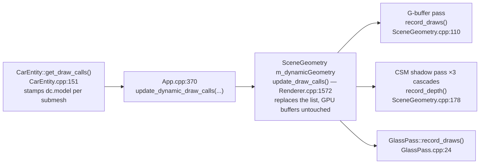

# Wheels research 02 — rendering & asset side (graphics/Vulkan)

> Research/planning only — no code was changed. Companion to the physics-side research in this
> directory. Scope: what it takes, on the **rendering and asset** side, to make the four road
> wheels visibly spin with speed, steer with input, and later articulate (suspension travel).
>
> Verdict up front: **the render pipeline needs zero changes.** Per-submesh dynamic transforms
> already flow through every pass (G-buffer, all 3 shadow cascades, glass) as per-draw push
> constants — the steering wheel proves the path end-to-end. The whole problem is **asset
> structure + loader classification**, and the asset turns out to be far more recoverable than
> the "1138 flattened children" summary in [`plan/car_system_port.md`](../../../plan/car_system_port.md)
> (§2, asset constraint) suggests. All numbers below were measured from
> [`assets/Porsche/porsche.glb`](../../../assets/Porsche/porsche.glb) with throwaway GLB-parsing
> scripts (the bundled [`tools/car_analyzer`](../../../tools/car_analyzer) needs Blender's `bpy`,
> which is not installed in its venv — `uv run python -m car_analyzer … → ModuleNotFoundError: bpy`
> — so the inspection replicated the loader's node math in stdlib Python instead).

---

## 1. How a model matrix flows today

### 1.1 The path, pass by pass

One `DrawCall` = one index range + **one `Mat4 model`** ([`src/scene/SceneTypes.h:175-195`](../../../src/scene/SceneTypes.h)).
The car regenerates its full draw-call list **every frame**:



- **G-buffer (ScenePipeline).** `SceneGeometry::record_draws` pushes a 96-byte
  `PushConstantData { mat4 model; vec4 color; vec4 material; }` **per draw**
  ([`SceneGeometry.cpp:142-173`](../../../src/renderer/SceneGeometry/SceneGeometry.cpp),
  block defined at [`SceneTypes.h:203-207`](../../../src/scene/SceneTypes.h)). The vertex shader
  consumes it at [`shaders/basic.vert:16-20`](../../../shaders/basic.vert). The translation
  column is rebased to camera-relative space in double precision (`SceneGeometry.cpp:144-146`)
  — this happens *after* your composed wheel matrix, so articulation is unaffected.
- **Normal matrix: computed in the shader, per vertex, from the pushed model.**
  [`basic.vert:38`](../../../shaders/basic.vert): `mat3 normalMatrix = mat3(transpose(inverse(push.model)))`,
  applied to normal *and* tangent (TBN). Nothing on the CPU precomputes or caches it. Consequence
  in §5.1: rotating a wheel automatically rotates its normals correctly.
- **CSM shadow pass (DepthOnlyPipeline).** `Renderer::recordShadowPass` loops the 3 cascades and
  records **the same `m_dynamicGeometry`** inside the loop —
  [`Renderer.cpp:724-741`](../../../src/renderer/Renderer/Renderer.cpp), car at line 740. Per draw,
  `record_depth` pushes `dc.model` into bytes [64,128) of the 128-byte
  `DepthPushConstants { mat4 lightViewProj; mat4 model; }`
  ([`SceneGeometry.cpp:202-205`](../../../src/renderer/SceneGeometry/SceneGeometry.cpp),
  [`DepthOnlyPipeline.h:29-35`](../../../src/renderer/DepthOnlyPipeline/DepthOnlyPipeline.h),
  [`shaders/depth_only.vert:21-27`](../../../shaders/depth_only.vert)).
  **Key finding: the shadow pass consumes the identical articulated draw-call list.** There is one
  `m_drawCalls` vector per `SceneGeometry` ([`SceneGeometry.h:96-101`](../../../src/renderer/SceneGeometry/SceneGeometry.h));
  `record_draws` and `record_depth` both iterate it. A spinning wheel therefore casts a spinning
  shadow with **no** extra work — the steering wheel already does (invisibly, being indoors).
- **GlassPass** (forward transparent, wheels don't use it but it proves uniformity): per-draw
  80-byte model+color prefix push, [`GlassPass.cpp:50-57`](../../../src/renderer/GlassPass/GlassPass.cpp)
  (`kPushConstantModelColorSize`, [`SceneTypes.h:211`](../../../src/scene/SceneTypes.h)).

### 1.2 The proof-of-concept that already ships: the steering wheel

[`CarEntity::get_draw_calls`, `CarEntity.cpp:165-185`](../../../src/scene/Entity/CarEntity.cpp):
every submesh gets `dc.model = car_model`, **except** the one with `is_steering_wheel`, which gets

$$
M \;=\; M_{\text{car}} \cdot F_{\text{sw}} \cdot C \cdot R_z(-\theta_{\text{sw}}) \cdot F_{\text{sw}}^{-1}
$$

where $F_{\text{sw}}$ = `Submesh::sw_pivot_frame` ([`SceneTypes.h:157-160`](../../../src/scene/SceneTypes.h)),
recorded by the loader as the `Steering_Wheel` node's RootNode-relative frame, normalized (+90° Y),
grounded, and scale-stripped ([`ModelManager.cpp:192-211, 364-376`](../../../src/scene/ModelManager/ModelManager.cpp)).
The conjugation $F R F^{-1}$ rotates the *already-baked* vertices about their own hub in the
node's local axis space. **A road wheel is the same pattern with a different frame, axis, and a
continuously accumulating angle** — exactly what the plan doc anticipated
(`plan/car_system_port.md` §3.1: "a future wheel is just another articulated part").

### 1.3 Conclusion for part 1

**No pipeline, descriptor-set, render-pass, or shader change is required.** Per-wheel dynamic
transforms are pure CPU-side matrix composition inside `CarEntity::get_draw_calls`, consumed
unmodified by all three passes. Descriptor sets stay exactly as documented in
[`CLAUDE.md`](../../../CLAUDE.md) (set 0 camera, set 1 materials, set 2 shadow, set 3 scene params).
The entire task reduces to: *which submeshes belong to which wheel, and where is each wheel's
pivot frame?* — a loader/data-model question.

---

## 2. The asset problem, with real data

### 2.1 What the GLB actually contains

`assets/Porsche/porsche.glb` (a Sketchfab-exported **911 GT3 Touring 2022** — every material is
named `Porsche_911GT3TouringRewardRecycled_2022…`): **3341 nodes, 1667 meshes, 1668 primitives,
20 materials** (exactly the `kMaxCarMaterials = 20` cap, [`ModelManager.cpp:147`](../../../src/scene/ModelManager/ModelManager.cpp)).
Scene chain above the reference node — confirming the risk documented at
`plan/car_system_port.md` §6.1:

```
[3340] Sketchfab_model   R = −90° X (quat −0.7071,0,0,0.7071), S = 1000 (1000.0001220703125!)
[3339] FINAL_MODEL.fbx   R = +90° X,  S = 0.01
[3338] RootNode          identity        ← loader's reference frame (ref_inverse)
```

Under `RootNode`, four children:

| node | content | mesh nodes | prims | verts | tris |
|---|---|---:|---:|---:|---:|
| `bod_1:Kit1_Interior_Geo_lodABody_lodA`, `bod_2:Kit1_Paint_Geo_lodABody_lodA` | interior shell, paint shell | 2 | 2 | — | — |
| `Body_lodA` (17 groups: grilles, badge, base, carbon, coloured, windows, plates, seatbelt, **SteeringWheel_Pivot** hiding under `Kit1_Badge_Geo_lodA`) | body | 21 | 22 | 109,527 | 108,020 |
| `Wheel1A_3D` → `Combined_Wheels_3D_` → `Combined3DWheel_3DWheel_Front_L Instance1_Src4` | **all 4 wheels** (tires, rims, discs) | **1138** | 1138 | 32,088 | 35,176 |
| `Wheel1A_3D` → `Calliper1_A_A(Clone)` → `Combined_CaliperCalliperZone` → `CombinedCalliperZoneCalliperZone_Front_L Instance1_Src4` | **all 4 brake calipers** | **506** | 506 | 9,314 | 11,288 |

So the "one combined node with 1138 children" from the plan doc is precisely
`Combined3DWheel_3DWheel_Front_L Instance1_Src4` — and there is a **second, separate 506-child
cluster for the calipers**. Every wheel piece is a two-node sandwich: an outer
`polySurfaceNNNN` node carrying translation+rotation, and an inner mesh node
(`polySurfaceNNNN_Porsche_…_Wheel1A_3D_3DWheel2C_Material`). Names are generic — **no
"tire"/"rim"/"disc" tokens anywhere** (the analyzer's name-based `PartClassifier` in
[`tools/car_analyzer/car_analyzer/parts.py`](../../../tools/car_analyzer/car_analyzer/parts.py)
can only bucket them wholesale by the material substring).

### 2.2 Are the pieces really clustered at the four wheel centers? Yes — exactly

The outer piece nodes have **exactly four distinct translations** (raw asset space; count = pieces
per corner including both wheel and caliper clusters):

| raw `T` (asset space) | count | corner |
|---|---:|---|
| `( 0.725, 0.345,  1.1964)` | 442 (302 wheel + 140 caliper) | front right† |
| `(−0.725, 0.345,  1.1964)` | 442 (302 + 140) | front left† |
| `( 0.708, 0.362, −1.256)`  | 380 (267 + 113) | rear |
| `(−0.708, 0.362, −1.256)`  | 380 (267 + 113) | rear |

†left/right naming depends on your seat convention — driver side is −Z in normalized mesh space
([`App.cpp:385`](../../../src/core/App/App.cpp) comment).

In the loader's **normalized mesh space** (nose +X, Y-up, metres, after the +90° Y rotation of
[`ModelManager.cpp:347-355`](../../../src/scene/ModelManager/ModelManager.cpp); grounding shifts Y
by only +0.0027 m), the per-corner **combined vertex bounding boxes** of the wheel cluster are:

| corner | bbox center (= axle point) | bbox size (L×H×W) | radius (H/2) |
|---|---|---|---:|
| FL | `(+1.1964, +0.3461, −0.7890)` | `0.687 × 0.691 × 0.279` | **0.3455 m** |
| FR | `(+1.1964, +0.3461, +0.7890)` | same | 0.3455 m |
| BL | `(−1.2560, +0.3642, −0.7719)` | `0.724 × 0.734 × 0.351` | **0.3669 m** |
| BR | `(−1.2560, +0.3642, +0.7719)` | same | 0.3669 m |

Sanity checks, all passing:

- Center height ≈ radius, and tire bottoms sit at y ≈ 0 (front +0.0006, rear −0.0027 — the rear
  tires define the ground plane the loader grounds against).
- Wheelbase = 1.1964 + 1.2560 = **2.452 m** — matches `kWheelbase = 2450` WU
  ([`CarEntity.h:110`](../../../src/scene/Entity/CarEntity.h)).
- Real 992 GT3 tires: front 255/35 ZR20 → OD ≈ 0.687 m, rear 315/30 ZR21 → OD ≈ 0.722 m. The
  measured 0.687/0.724 m are a faithful match (and give the physics side its per-axle rolling
  radii: $r_F = 0.3455$, $r_B = 0.3669$ m).
- The **outer node translation's X,Y equal the geometric axle point** to ≈1 mm; only its lateral Z
  sits ~64 mm inboard of the tire mid-plane (the grouping pivot is at the mounting face). For a
  spin about the lateral axis this is irrelevant — translation *along* the rotation axis doesn't
  change the rotation (only the axle line's X,Y matter).

### 2.3 The fine print you'd only find by measuring

1. **Per-corner rigid frames are uniform.** Within one corner, *every* outer piece node has the
   identical translation + rotation, so one frame per corner fully describes the cluster —
   exactly the `sw_pivot_frame` situation, ×4.
2. **The frames are slightly rotated.** Front outer nodes carry a 1.000° rotation about the raw
   longitudinal axis; rear carry 2.000°. This tilt is baked into today's vertices (it's the pose
   you see on screen). If you spin about an *untilted* lateral axis the rim will wobble by the
   tilt angle — $r\sin 2° \approx \pm 13$ mm laterally at the rear tire's outer edge, likely
   visible up close. Spin about the **frame-local** axis (conjugation through the corner frame)
   and there is zero wobble.
3. **One side is 180°-flipped.** Half of the outer nodes carry a 180° quaternion about ~Y
   (e.g. `(0.008727, 0.999962, 0, 0)`) — the right-side wheels are the left-side geometry rotated
   180°, Sketchfab-instancing style. Consequence: the frame-local spin axis (local ±X, the wheel
   plane normal — verified from ring-piece local bboxes, thin in local X) points in *opposite
   world directions* on the two sides. Spinning both sides by $+\theta$ about their local axis
   makes them counter-rotate on screen. The fix is a per-corner sign, normalized once at load:
   $\mathrm{sign} = \operatorname{sgn}\big(\hat a_{\text{world}} \cdot \hat z_{\text{mesh}}\big)$
   where $\hat a_{\text{world}} = F_{\text{corner}} \cdot \hat x_{\text{local}}$.
4. **Spin/no-spin separation is structural, not name-based.** Everything under
   `Combined_Wheels_3D_` spins: tread segments (918 of the 1138 pieces are < 0.1 m — tread blocks
   of ~12 verts each), rim spokes/rings (the 20 large pieces are full rings, e.g. rear
   `0.701 × 0.701 × 0.037 m` ring pieces at the inboard face), and **disc-diameter rings**
   (16 pieces of 0.30–0.55 m diameter, e.g. `polySurface1085`: `0.412 × 0.410 × 0.007 m` — brake
   disc faces, which *should* spin). Everything under `Calliper1_A_A(Clone)` must **not** spin:
   its per-corner bboxes are small pods (front `0.158 × 0.325 × 0.164 m`) hanging at one clock
   position — calipers only, no disc mixed in. So the physically-correct split (tire+rim+disc
   spin; caliper doesn't) falls straight out of the two ancestor nodes. Front calipers do
   **steer** with the upright, though — see §4.
5. **Corner pieces interleave in node order.** The first 40 wheel mesh nodes alternate
   FL/BR/FL/BR…, so per-corner index ranges in the baked index buffer are scattered, not
   contiguous. Today that costs nothing (each piece is already its own submesh); it only matters
   if you later want to *merge* a corner into one draw — the loader would need to emit indices
   grouped by corner (trivial reordering at bake time).
6. **Glass/material bookkeeping** (for completeness): 1665 opaque + 3 BLEND primitives
   (2× `Window_Material` + 1× `RED_GLASS`); 1 MASK (license plate) treated opaque. Wheels are all
   `mat19`, calipers all `mat18` → `MAT_CAR_19` / `MAT_CAR_18`.

### 2.4 So is loader-side recovery possible? Emphatically yes

The pessimistic framing ("flattened, origins lost") describes the *baked vertex buffer*, not the
*load-time information*. `ModelManager::load_car` walks every node and has each node's
RootNode-relative transform in hand **before** baking
([`ModelManager.cpp:184-188, 221-227`](../../../src/scene/ModelManager/ModelManager.cpp)).
At that moment, wheel membership and corner identity are unambiguous:

- membership: ancestor is `Combined_Wheels_3D_` (spins) or `Calliper1_A_A(Clone)` (steers-only
  at front, static at rear);
- corner: the piece translation is one of exactly 4 values — classify by
  $(\operatorname{sgn} x, \operatorname{sgn} z)$ of the node translation, no magic constants, no
  ε-tuning needed (the clusters are separated by metres, the within-cluster spread is 0);
- pivot: accumulate a per-corner vertex bbox during the existing bake loop (the loader already
  runs an O(n) bbox pass at lines 347-355) → bbox center = axle point; or take the outer node's
  frame directly, as `sw_pivot_frame` does.

Nothing about the four wheel centers has to be authored, hardcoded, or guessed.

---

## 3. Two solution paths, weighed

### 3.1 Path (a) — Blender re-export with `wheel_FL/FR/BL/BR` pivot groups

What it would look like: open [`assets/blend/porsche.blend`](../../../assets/blend/porsche.blend),
create four empties at the axle points, parent each corner's wheel pieces (and optionally
calipers) under them, re-export the GLB, and extend the loader's pivot detection to look for the
four names exactly as it looks for `Steering_Wheel` (`ModelManager.cpp:202-211`).

Why this is riskier than it sounds — the loader's correctness currently leans on **five name/
structure contracts with the current export**, all of which a Blender round-trip can silently
break:

| contract | where | how a re-export breaks it |
| --- | --- | --- |
| A node literally named `RootNode` exists; everything is baked relative to it | `ModelManager.cpp:183, 203-204` | Blender's glTF importer typically *collapses* the `Sketchfab_model (S=1000, R=−90°X)` → `FINAL_MODEL.fbx (S=0.01, R=+90°X)` → `RootNode` chain (net ≈10× scale, rotations cancel — measured, §2.1) into object transforms, and the exporter writes a different root structure. If `RootNode` disappears, `ref_inverse` stays identity and the car bakes ~10× too large — this is exactly risk 1 in `plan/car_system_port.md` §6. The bbox guard (loader logs `bbox (m) length 4.58 × 1.29 × 2.03`, `ModelManager.cpp:378-384`; plan gate "≈4.5 m") catches the blow-up but doesn't fix it; the loader would need a "find the reference frame" rewrite. |
| `Steering_Wheel` node name | `ModelManager.cpp:205` | Blender renames dots/duplicates (`Steering_Wheel.001`) and may re-parent when transforms are applied. The pivot's S=0.1 / child S=10 cancellation (measured) must survive or the scale-strip at lines 367-371 changes meaning. |
| `Window_Geo` / `RED_GLASS` / `Interior` name matches for glass/windshield/interior tagging | `ModelManager.cpp:243-252` | same rename hazards; windshield rain and cabin handling regress silently. |
| glTF **material order** → `MAT_CAR_0..19` slots | `ModelManager.cpp:150, 316-317` | Blender reorders/deduplicates materials on import/export; the asset sits exactly at the 20-slot cap, so a split pushes materials off the end (silent `MAT_DEFAULT` fallback — plan §6.7). Wheel=mat19/caliper=mat18 mappings, and any debug material-override presets keyed by slot, shuffle. |
| the 1°/2° corner-frame tilts and the 180° side flips | §2.3 | "Apply transforms" style cleanups change the baked pose subtly (that pose is the shipped look). |

None of these are fatal — they are all *detectable-with-eyes* — but each one costs a
build-look-fix loop, and the loader's guards only cover the first. Re-export also re-encodes
textures and can change vertex counts (split normals), so "release output byte-identical" is off
the table for a change whose goal is purely additive.

The counter-argument *for* (a): a hand-authored hierarchy is the durable, self-documenting fix;
DownPour's sidecar-JSON role mapping (`plan/car_system_port.md` §1.4) assumes it; and future asset
work (LODs, damage, better interior) goes through Blender anyway. If the maintainer *wants* the
Blender practice, (a) is a fine second step — after (b) proves the runtime.

### 3.2 Path (b) — loader-side recovery, no asset change

Extend the existing node walk: while visiting a primitive, look up the ancestor chain (the walk
already recurses parent→child, so pass a small "current wheel context" down), classify corner by
translation signs, record per-corner frames + bbox, tag the submesh. Runtime composes matrices in
`CarEntity::get_draw_calls` exactly like the steering wheel. Everything lands in two files the
steering-wheel feature already shaped (`ModelManager.cpp`, `CarEntity.cpp`) plus a few fields in
`SceneTypes.h`, all inert unless a wheel angle is nonzero — release stays byte-identical until
the physics feeds a nonzero $\theta$.

Evidence-based confidence: the four frames are *exact* (zero spread), uniform per corner, the
spin/static split is structural, the pivots self-derive from geometry, and the whole thing is
assertable at load ("found 4 wheel groups of 302/302/267/267 + 140/140/113/113 pieces; centers
symmetric within 1 mm; radius 0.34–0.37 m") — a far stronger guard than the ≈4.5 m bbox check.

### 3.3 Recommendation

**Path (b).** Lower effort (no Blender round-trip, no name-contract re-verification), independently
verifiable at load time, zero asset churn, and it converts directly into the `ArticulatedPart`
shape the plan doc wants — if/when a re-exported GLB with clean `wheel_*` pivots arrives, the
loader's *detection* changes (read four named nodes instead of clustering) while the *data model
and runtime composition stay identical*. So (b) is not a dead end; it is the same destination via
a safer road.

**User decision flag:** path (a) is the artistically satisfying route and the maintainer may
*enjoy* the Blender work (adding empties/pivot groups is a good rigging exercise). Nothing below
depends on choosing (a) vs (b) — the Submesh/runtime design is shared. Decide based on appetite
for Blender time, not on technical necessity.

---

## 4. Loader/data-model changes (conceptual sketch)

Mirror the `is_steering_wheel` / `sw_pivot_frame` pattern, but keep per-corner data on the entity
(4 frames) rather than duplicating a `Mat4` into ~1,644 submeshes:

```cpp
// SceneTypes.h (sketch — names illustrative)
enum class WheelId : uint8_t { None, FL, FR, BL, BR };

struct Submesh {
    ...existing fields...
    WheelId wheel_id = WheelId::None; // corner membership (wheel + caliper pieces)
    bool    spins    = false;         // Combined_Wheels_3D_ descendants (tire/rim/disc)
    bool    steers   = false;         // wheel_id is FL/FR (calipers steer too — bolted to the upright)
};

// CarEntity (sketch)
struct WheelFrame {                   // one per corner, built by the loader
    Mat4  frame;      // corner node frame, RootNode-rel, +90°Y-normalized, grounded,
                      // scale-stripped — the norm_matrix_y90 + bb_min.y + normalize
                      // treatment sw_pivot_frame gets at ModelManager.cpp:364-376
    float radius;     // bbox height / 2  (0.3455 F, 0.3669 B — feeds omega = v/r)
    float spin_sign;  // ±1, from sign(frame·x̂_local · ẑ_mesh)   (§2.3 item 3)
};
WheelFrame m_wheel_frames[4];
float      m_wheel_spin_angle[2];     // per axle (or per corner once slip differs)
```

Runtime composition in `get_draw_calls` (pseudocode, matching the steering-wheel line
`CarEntity.cpp:180`):

```text
spin  = R_localX( spin_sign * theta )          // theta accumulates: theta += (v / r) * dt
steer = R_y( -delta_road )                     // fronts only; delta_road = steering_angle (deg→rad)
if (s.spins  && s.steers)  dc.model = car * T(p)·steer·T(-p) * F·spin·F⁻¹
if (s.spins  && !s.steers) dc.model = car * F·spin·F⁻¹
if (!s.spins && s.steers)  dc.model = car * T(p)·steer·T(-p)          // front calipers
```

Notes to reason through (deliberately left as exercises, per Learning Mode):

- **Order matters:** steer is applied *outside* spin so the spin axis turns with the wheel —
  DownPour composes `steerQuat · spinQuat` the same way (`plan/car_system_port.md` §1.4). Work
  out what the wheel does at full lock if you swap them.
- The steer pivot `p` is the **wheel** bbox center (the kingpin passes through the axle in top
  view), *not* the caliper cluster's own centroid (front caliper bbox center is at x = +1.052,
  ~14 cm behind the axle at +1.196 — steering about the wrong point orbits the caliper).
- Only 6 distinct non-trivial matrices exist per frame (2 front spin+steer, 2 rear spin, 2 front
  caliper steer-only) — compose each **once**, then stamp the 1,644 submeshes by `wheel_id`+flags.
  Do not multiply per piece.
- Spin sign convention: rolling forward (car +X) is a **positive** rotation about the +Z (right)
  axis — derive via $\vec v_{\text{contact}} = \vec\omega \times \vec r$ with
  $\vec r = (0,-r,0)$, then verify visually at both extremes, per
  [`tasks/lessons.md`](../../../tasks/lessons.md) discipline.
- **Suspension seam (later):** vertical travel inserts as one more outer factor,
  `car · T(0, Δy_i, 0) · [steer]·[spin-conjugation]` — same mechanism, still zero renderer
  changes. That is the "wheels move realistically" hook.
- A wheel debug gizmo can clone `get_steering_wheel_pivot_world`
  ([`CarEntity.cpp:142-149`](../../../src/scene/Entity/CarEntity.cpp)); all UI stays
  `#ifdef SWISH_DEBUG_UI` per [`CLAUDE.md`](../../../CLAUDE.md).
- Loader assertion sketch: 4 corners found; piece counts 302/302/267/267 (+140/140/113/113);
  |center.x_L − center.x_R| < 1 mm; radius ∈ [0.3, 0.4] m — loud failure beats silent misgrouping.

---

## 5. Rendering realism roadmap

Each item: what/why, cost, hook points. Items marked **PAUSED** are interface-only per the
standing pause in [`CLAUDE.md`](../../../CLAUDE.md) — do not build them without the user.

### 5.1 Correct normals under rotation — free, already handled

`basic.vert:38` recomputes $\left(M^{-1}\right)^{\!\top}$ per vertex from the pushed model. For a
rigid rotation $R$, $\left(R^{-1}\right)^{\!\top} = R$, so lighting on a spinning tire is exact
with no CPU work and no new plumbing. (The conjugated wheel matrix is rotation+translation only —
the loader strips pivot scale, as it already must for the steering wheel,
`ModelManager.cpp:367-371`.) Cost: zero new. Only caveat: keep the composed matrix orthonormal
(compose from quats/axis-angle, don't accumulate float drift by multiplying incrementally every
frame — rebuild from the scalar $\theta$ each frame, which the sketch in §4 does).

### 5.2 Wheels in the shadow cascades — free, verify by eye

§1.1 proved `record_depth` consumes the same articulated list, once per cascade
(`Renderer.cpp:740`). The car's draws carry the "never cull" sentinel (`boundsRadius = -1`,
[`SceneTypes.h:190-194`](../../../src/scene/SceneTypes.h)), so wheel pieces can't be culled out of
any cascade. Two things to *look at* (not code): (i) the moving tire shadow at the contact point —
the existing depth bias (`DepthOnlyPipeline.h:51-52`) may lift it slightly off the tire
(peter-panning), which the blob AO of §5.5 masks anyway; (ii) spokes are thin casters — at
cascade-0 resolution expect some shimmer under motion; PCF already softens it.

### 5.3 Spinning-wheel temporal aliasing (wagon-wheel) — physics says it will strobe

Apparent rim motion aliases when the spoke-pattern frequency exceeds half the frame rate. With
$n$-fold rim symmetry the pattern frequency is $f = n \,\omega / 2\pi$; strobing (stationary or
backward-turning wheels) begins around

$$
\omega \gtrsim \frac{\pi \cdot f_{\text{frame}}}{n}
\;\;\xrightarrow{\;n=10,\; f=60\;}\; \omega \approx 18.8\ \mathrm{rad/s}
\;\;\Leftrightarrow\;\; v = \omega r \approx 6.9\ \mathrm{m/s} \approx 25\ \mathrm{km/h}.
$$

So above ~25 km/h the rims *will* wagon-wheel; at 100 km/h ($\omega \approx 76$ rad/s rear) they
are deep past Nyquist. Facts about existing machinery:

- **SSAA does not help.** It supersamples *spatially* within one instant
  ([`Renderer.cpp:127`](../../../src/renderer/Renderer/Renderer.cpp) — every offscreen target is
  scaled); temporal aliasing needs integration over the *shutter*, i.e. motion blur.
  (TAA exists as a debug-only resolve, `Renderer.h:244`, and real motion vectors → TAA + motion
  blur is **PAUSED**, item 4 of the deferred list in `CLAUDE.md`.)
- **Cheap accepted-practice tricks**, in increasing effort: (i) do nothing — filmed cars strobe
  too, and viewers tolerate it; (ii) *spoke smear*: above an $\omega$ threshold cross-fade the
  rim to a radially-blurred representation. With this asset that means fading the ~200 small rim
  pieces toward a flat disc look (e.g. darken + roughen via the existing per-draw
  `material.z` roughness multiplier and `color` push constants — both already per-draw,
  `SceneGeometry.cpp:147-169`) rather than swapping textures, since the rim is geometry, not a
  texture. A true pre-blurred "spinning rim" texture would need a baked disc mesh + material slot —
  asset work, note only.
- **Interface to define now (build later):** per-wheel $\omega$ travels
  `CarEntity → App → Renderer` beside the existing `set_car_velocity/position`
  (`App.cpp:374-380`); if a shader ever needs it, the 96-byte push block grows by one `vec4`
  (→112 B, still a 16-multiple — §6.3) or it rides the set-3 scene-params UBO.

### 5.4 Wet tires + spray hooks (spray feature itself **PAUSED**)

- **Wet-tire darkening.** Today the *whole car* opts out of wet effects: `dc.dry = true` for
  every car draw ([`CarEntity.cpp:170`](../../../src/scene/Entity/CarEntity.cpp)) → push
  `material.y = 0` (`SceneGeometry.cpp:154`) → G-buffer "wettable" channel 0
  ([`gbuffer.frag` outMaterial.b](../../../shaders/gbuffer.frag)) → `lighting.frag:253,267`
  computes `wetLocal = max(wetness * wettable, puddle) = 0`. Once submeshes know they are tires,
  the hook is one line of policy in `get_draw_calls`: leave `dry = false` for `spins` submeshes so
  rubber darkens with rain. Caveat to evaluate by eye: the wet BRDF (porosity darkening + roughness
  collapse + sky sheen) is tuned for horizontal asphalt; a tire may want only the darkening term.
  If so, that's a small lighting.frag policy split keyed off the existing road-tag channel —
  design when un-paused.
- **Spray.** [`SpraySystem`](../../../src/renderer/SpraySystem/SpraySystem.h) already exists and
  runs: 4096-particle SSBO advanced by `spray_sim.comp` (the renderer's first compute pass), drawn
  as additive billboards; emission gated by wetness × speed. Its single spawn point is
  `carPosition − forward·1500 WU` — one point behind the rear axle
  ([`Renderer.cpp:471-488`](../../../src/renderer/Renderer/Renderer.cpp)). With wheel frames, the
  natural upgrade is four spawn origins at the rear of each contact patch
  ($M_{\text{car}} \cdot p_i$ with $y \to 0$) with per-wheel $\omega$ scaling emission — an
  extension of `SpraySimUBO` (spawn centres) when the puddle/spray feature un-pauses. Interface
  note only.

### 5.5 Cheap contact-patch darkening (blob AO)

There is **no decal system** in the codebase (verified by grep), so three candidate mechanisms:

1. **Rely on SSAO** ([`shaders/ssao.frag`](../../../shaders/ssao.frag), depth-based, push block at
   [`PostProcessManager.h:47`](../../../src/renderer/PostProcessManager/PostProcessManager.h)): the
   tire–road crease is real geometry, so SSAO already darkens it somewhat. Zero work; verify how
   much it reads at driving distance before building anything.
2. **Four blob quads in a forward mini-pass** (the RainSystem/SpraySystem billboard pattern):
   alpha-blended dark ellipses with radial falloff at the four contact points, depth-tested
   against the G-buffer depth (LOAD), drawn before bloom. Cheapest to build, order-independent
   enough at 4 quads. Position = wheel pivot with $y = 0$, size ≈ contact patch
   (~0.28–0.35 m wide from the tire widths in §2.2), strength scaled down as the car... leaves the
   ground? It doesn't — constant is fine until suspension exists.
3. **Analytic in the deferred shader**: pass 4× `vec4(xz, radius, strength)` via the set-3
   scene-params/debug UBO and darken ambient/AO where a shaded road pixel is near a patch —
   "deferred-native", no extra pass, but it touches `lighting.frag` and the UBO layout, and
   release needs the values wired even with the debug UI off.

Recommendation when the time comes: try 1 (free), ship 2 if more is needed; keep 3 for when
puddle-reflection masking wants the same data anyway.

---

## 6. Performance & MoltenVK notes

### 6.1 Current car draw-call budget (measured)

The loader emits one `Submesh` per glTF primitive → the car is **1,665 opaque + 3 glass draw
calls**. Per frame the car costs ≈ **6,663 draws**: 1,665 (G-buffer) + 3 × 1,665 (three shadow
cascades, `Renderer.cpp:724-741`) + 3 (glass). All of them bypass distance/frustum culling via the
`boundsRadius = -1` sentinel. This is *today's* cost — wheels don't change it.

### 6.2 What articulation adds: nothing on the GPU, microseconds on the CPU

Wheel groups are **different matrix values on existing draws** — draw count, pipelines,
descriptors, and buffers are untouched. The per-frame CPU delta is 6 matrix compositions plus a
`wheel_id` branch while stamping the 1,665-entry vector that `get_draw_calls` already rebuilds and
copies every frame (`App.cpp:370`, `Renderer.cpp:1572`). Not measurable against the existing
per-frame work.

### 6.3 Push-constant headroom (MoltenVK 16-byte rule)

| pass | block | size |
| --- | --- | ---: |
| ScenePipeline (G-buffer) | `PushConstantData` (model+color+material) | 96 B |
| DepthOnly (CSM) | `DepthPushConstants` (lightViewProj+model) | 128 B |
| GlassPass / windshield | model+color prefix | 80 B |
| SSAO (fullscreen) | 2×mat4 + 4 floats | 144 B |

Vulkan guarantees only `maxPushConstantsSize ≥ 128`; the SSAO pass at 144 B shows this device
(MoltenVK reports 4 KiB, the Metal `setBytes` ceiling) is already relied on beyond the minimum.
So growing the scene block 96 → 112/128 B for per-draw wheel data ($\omega$, blur weight, …) is
safe *here*, but (i) keep every block a **16-byte multiple** — the 80→84 B incident rendered
geometry black ([`SceneTypes.h:197-207`](../../../src/scene/SceneTypes.h) documents it), (ii) grow
vertex/fragment-visible blocks in lockstep in both shader stages (`basic.vert` declares the same
block as `gbuffer.frag`), and (iii) prefer *not* growing at all: nothing in §4 needs a bigger
block — spin/steer live entirely in `dc.model`.

### 6.4 Metal-specific observations

- Push constants map to Metal `setVertexBytes`/`setFragmentBytes` — cheap per draw; 6.7k
  pushes/frame is normal territory. No comparison-sampler or format concerns arise (no new
  samplers, images, or formats are involved at all).
- The heavier per-draw cost is `vkCmdBindDescriptorSets` for the material set on **every** draw
  (`SceneGeometry.cpp:139-140`) — including 1,138 consecutive binds of the same `mat19` set for
  wheel pieces. Articulation doesn't worsen it, but it points at the real future win: **merge
  same-corner, same-material pieces at bake time** (regroup indices; corners interleave, §2.3
  item 5). The wheel clusters would collapse from 1,644 draws to 8 (4 wheel + 4 caliper), and the
  same idea applied body-wide takes the car from 1,665 toward ~30 draws — per-corner grouping is
  *required* for that merge anyway, so the `wheel_id` work is a prerequisite, not a conflict.
  Follow-up, not part of the articulation change.
- Shadow pass: the car is re-recorded per cascade; a merged-wheel future cuts that 3× as well.

---

## 7. Suggested next steps (for discussion, not started)

1. Decide path (a) vs (b) with the user (recommendation: **(b)** now, (a) optional later — §3.3).
2. Loader: wheel-context node walk + corner frames/radii/signs + submesh tagging + load-time
   assertions (§4). Release-inert by construction.
3. CarEntity: $\theta$ accumulation from `m_forward_speed / r`, steer compose for fronts,
   6-matrix stamping. Verify by eye at 0 and speed, both steering extremes; check the
   counter-rotation gotcha (§2.3 item 3) and shadow motion (§5.2).
4. Debug UI (gated): per-wheel angle override + pivot gizmo, mirroring the steering-wheel gizmo.
5. Only then: revisit §5.3–§5.5 extras against the pause list in `CLAUDE.md`.

---
*Largely AI-generated (Claude research agent, 2026-07-24) — review before relying on it.*
