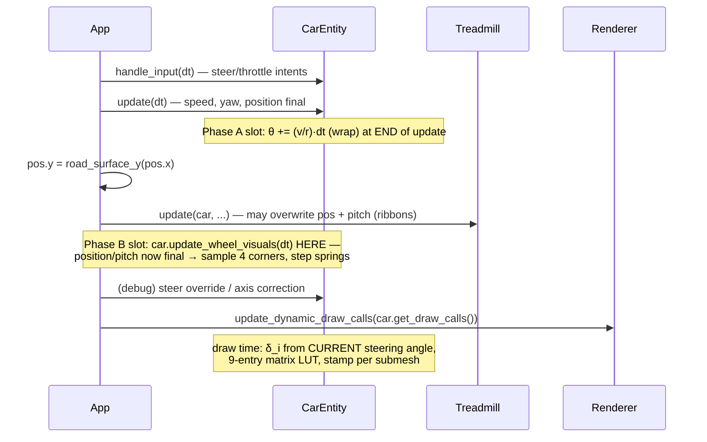

# Wheels 03 — Implementation plan: state, numerics, algorithms, performance, testing

> Research/planning document — **no code has been changed**. It grounds every claim in the
> current codebase (`file:line` citations, branch `debug-ui`) and in a direct inspection of
> `assets/Porsche/porsche.glb` (JSON chunk parsed read-only, 2026-07-24). Math uses KaTeX
> delimiters (`$...$` inline, `$$...$$` display), matching
> [plan/car_system_port.md](../../../plan/car_system_port.md) conventions.
>
> Goal of the feature this plans: make the four road wheels **spin with speed** and **steer with
> input** (Phase A), then **ride the road** with a quarter-car spring (Phase B), then show
> **slip/lockup/burnout** and couple to rain (Phase C). This document covers algorithms, data
> structures, architecture, numerics, performance, and testing — signatures and contracts only,
> no drop-in implementations.

---

## 0. Verified ground truth (read before anything else)

Everything below was verified on 2026-07-24 by reading the code and parsing the GLB's JSON chunk.
It **refines** the asset summary in [plan/car_system_port.md](../../../plan/car_system_port.md)
(§2, "Asset constraint", line 84) in a way that materially improves the plan.

### 0.1 The asset is better than "flattened, no pivots"

`porsche.glb`: 3,341 nodes, 1,667 meshes, **1,668 triangle primitives**, 20 materials
(3 primitives use `alphaMode == "BLEND"` → glass). The interesting structure:

| Node | Name | Children | Meaning |
|---|---|---|---|
| 3335 | `Combined3DWheel_3DWheel_Front_L Instance1_Src4` | 1,138 | **all four wheels' pieces** (name is an instancing artifact — it is *not* just the front-left) |
| 1056 | `CombinedCalliperZoneCalliperZone_Front_L Instance1_Src4` | 506 | **all four calipers' pieces** (note the asset's double-L "Calliper" spelling) |
| 3337 | `Wheel1A_3D` | 2 | groups the two combined nodes above |
| 3338 | `RootNode` | 4 | the loader's reference frame (`ref_inverse`, [ModelManager.cpp:203-204](../../../src/scene/ModelManager/ModelManager.cpp)) |

Each of the 1,138 wheel children is a `polySurfaceN` node carrying a translation **and a small
baked rotation** (see the correction below) — the translations take **exactly four distinct
values** (bit-identical across pieces):

| Corner (raw mesh space: meters, Y-up, nose = +Z) | Translation | Wheel pieces | Caliper pieces |
|---|---|---|---|
| Front left  | $(+0.725,\ 0.345,\ +1.1964)$ | 302 | 140 |
| Front right | $(-0.725,\ 0.345,\ +1.1964)$ | 302 | 140 |
| Rear left   | $(+0.708,\ 0.362,\ -1.256)$  | 267 | 113 |
| Rear right  | $(-0.708,\ 0.362,\ -1.256)$  | 267 | 113 |

Each child has exactly one grandchild holding the mesh, with **no local transform of its own**
(verified: 0 of 1,138 grandchildren carry T/R/S). So every wheel piece's vertex data is authored
*relative to its wheel center*.

> **Correction (2026-07-24, post-review measurement).** The original draft claimed the
> `polySurfaceN` nodes carry *only* translations, so "one spin sign works for both sides". That
> conclusion came from checking the transform-less mesh **grandchildren** — one level too deep.
> Walking the ancestor chain of one piece per corner shows each `polySurfaceN` node carries a
> translation **and a rotation**: left-side wheels are the right-side instance rotated
> ~**180° about $\hat y$** (a proper rotation, e.g. FL $q = (0.0087,\ 0.99996,\ 0,\ \approx 0)$),
> every corner adds a baked **camber tilt** $R_z(\pm 1°\ \text{front} / \pm 2°\ \text{rear})$ —
> matching real 992 alignment (rear more negative) — and left **calipers** are X-mirrored
> improperly via $q(180°\ \text{about}\ \hat x)$ combined with scale $(-1,-1,-1)$.
> Consequences, corrected:
>
> 1. **The wheel centers are still recoverable exactly** at load — grouping by exact translation
>    stands (ε kept only as an assert; §4.1).
> 2. **A per-corner spin axis/sign IS required** — the left axle direction is the negated right
>    one, and spin must be conjugated through the corner's **measured baked frame** or the
>    cambered rim wobbles ($\pm\, r \sin 2° \approx 13$ mm rear). Derive the sign from the
>    recovered frame (§3.3's derivation still applies, per corner); do not assume a global sign.
>    See [../README.md](../README.md) risk 2 and [02 §2.3](02-graphics-vulkan.md).

Sanity cross-checks: wheelbase from centers $= 1.1964 + 1.256 = 2.4524\,\mathrm{m}$, matching
`CarParams::wheelbase = 2.45` ([CarPhysics.h:23](../../../src/scene/Entity/CarPhysics.h)) and
`kWheelbase = 2450` WU ([CarEntity.h:110](../../../src/scene/Entity/CarEntity.h)). Center heights
$0.345$ m (front) / $0.362$ m (rear) match real 992 Turbo S tire radii (255/35R20 ≈ 0.343 m,
315/30R21 ≈ 0.359 m) — i.e. the asset's ground plane is at $y=0$ and **center height = rolling
radius**, so per-axle radii come free from the recovered centers (§4.1). Only 23 mesh nodes
(24 primitives) are *not* under the two combined nodes — the visible body.

### 0.2 The mechanism to generalize already exists

The steering-wheel articulation is the template: the loader captures a pivot frame
([ModelManager.cpp:192-211](../../../src/scene/ModelManager/ModelManager.cpp)), normalizes it the
same way as vertices ([ModelManager.cpp:364-376](../../../src/scene/ModelManager/ModelManager.cpp)),
and `CarEntity::get_draw_calls` stamps the conjugated matrix per submesh
([CarEntity.cpp:173-183](../../../src/scene/Entity/CarEntity.cpp)):

$$\mathrm{model} = M_{\mathrm{car}} \cdot M_{\mathrm{pivot}} \cdot C \cdot R(\theta) \cdot M_{\mathrm{pivot}}^{-1}$$

For road wheels the pivot frame is $F_i = T(P_i)\,R_i$ with a per-corner baked rotation $R_i$
(camber tilt plus the 180° left-side flip — see the §0.1 correction), so the conjugation keeps the
full-frame form $F_i\,R\,F_i^{-1}$, exactly like the steering wheel. The plan doc anticipated
exactly this: *"A future wheel
is just another articulated part with a continuously accumulating θ — the mechanism is identical"*
([plan/car_system_port.md:136-148](../../../plan/car_system_port.md)).

### 0.3 Units and existing state

- $1\,\mathrm{m} = 1000$ WU (`WORLD_SCALE`, [Types.h:20](../../../src/utils/Types.h)); physics is
  SI inside pure functions, converted at the entity boundary
  ([CarEntity.cpp:52,64](../../../src/scene/Entity/CarEntity.cpp)).
- `CarEntity` owns `m_forward_speed` (WU/s), `m_steering_angle` (deg, **right-positive**),
  `m_lateral_velocity`, `m_yaw_rate` ([CarEntity.h:79-91](../../../src/scene/Entity/CarEntity.h)).
- Pure-function house style: header-only, SI, no GLM/GLFW, unit-testable without a GPU
  ([CarPhysics.h:1-9](../../../src/scene/Entity/CarPhysics.h)).

---

## 1. State & data-structure design

### 1.1 Where wheel state lives: inside `CarEntity`

Three candidate homes were considered:

| Option | Verdict |
|---|---|
| **`std::array<WheelState,4>` member of `CarEntity`** | **Chosen.** `CarEntity` already owns every sibling of this state (`m_forward_speed`, `m_steering_angle`, `m_yaw_rate` — [CarEntity.h:79-91](../../../src/scene/Entity/CarEntity.h)), and the sole consumer is its own `get_draw_calls`. Zero new plumbing. |
| Separate `WheelSet` component / mini-ECS | Indirection with exactly one car in the scene and no second consumer. Violates Simplicity First ([CLAUDE.md](../../../CLAUDE.md), Core Principles). Revisit only if a second vehicle type ever appears. |
| Renderer-side (animate in `SceneGeometry`) | Wrong layer — the renderer must stay a dumb consumer of `DrawCall.model` ([SceneGeometry.cpp:130-175](../../../src/renderer/SceneGeometry/SceneGeometry.cpp)); physics state in the render layer would also dodge the pure-function test story. |

### 1.2 The state record (contract sketch, not final code)

```
enum class Wheel : uint8_t { FL = 0, FR = 1, BL = 2, BR = 3 };   // fixed array index
constexpr size_t kNumWheels = 4;

struct WheelState {          // SI units, per corner
    float theta_rad;         // spin angle, ALWAYS wrapped to [0, 2π)   — Phase A state
    float omega_rad_s;       // spin rate; derived (v/r) in Phase A, real state in Phase C
    float compression_m;     // spring compression from rest             — Phase B state
    float comp_vel_mps;      // compression rate                         — Phase B state
};
```

Held as `std::array<WheelState, kNumWheels> m_wheels;` plus two load-time constants filled by the
loader: `std::array<Vec3, 4> m_wheel_center_mesh;` (normalized mesh space, meters) and
`std::array<float, 4> m_wheel_radius_m;` (= center $y$ after grounding — §0.1). Per-axle radii
differ ($0.345$ vs $0.362$ m → rear wheels spin ~4.7% slower at the same road speed); using the
recovered per-wheel value is both cheaper than a config knob and self-consistent with where the
tire touches the ground.

**Effective steer $\delta_i$ is *not* stored** — it is derived at draw time from
`m_steering_angle`, exactly as the steering-wheel visual angle is
(`sw_angle` computed inside `get_draw_calls`, [CarEntity.cpp:156](../../../src/scene/Entity/CarEntity.cpp)).
Rationale: the debug UI can override the steering angle *after* `CarEntity::update` runs
([App.cpp:358-361](../../../src/core/App/App.cpp)), so anything derived from it must be computed
at the last moment. Persistent state is only what integrates over time (θ; later compression).

### 1.3 Submesh tagging: one group index, not more booleans

`Submesh` currently uses per-flag booleans (`is_steering_wheel`, `is_glass`, `is_interior` —
[SceneTypes.h:157-170](../../../src/scene/SceneTypes.h)). Wheels need **nine** behaviors, which is
where booleans stop scaling. Add one small enum + field instead:

```
enum class ArtGroup : uint8_t {
    Body = 0,                                  // plain M_car (default)
    WheelFL, WheelFR, WheelBL, WheelBR,        // steer∘spin (front) / spin (rear)
    CaliperFL, CaliperFR,                      // steer only (mounted on the upright)
    CaliperBL, CaliperBR,                      // static → same matrix as Body
};
// Submesh gains:  ArtGroup art_group = ArtGroup::Body;
```

`get_draw_calls` then builds a 9-entry `std::array<Mat4, 9>` LUT once per call and stamps
`dc.model = lut[submesh.art_group]` — an O(1) lookup inside the loop that already visits every
submesh (§5.3). Front calipers steer but never spin; rear calipers are rigid to the body — this
is physical reality (calipers mount to the knuckle, not the hub) and the asset conveniently
separates them (§0.1).

### 1.4 Pure update API (house style — signatures + contracts only)

New header `src/scene/Entity/WheelKinematics.h`, mirroring the `CarPhysics.h` preamble contract
(header-only, SI, no GLM/GLFW — [CarPhysics.h:3-5](../../../src/scene/Entity/CarPhysics.h)):

```cpp
// Advance a wheel's spin angle by one frame of pure rolling and return it
// WRAPPED to [0, 2π). Contract: r > 0; sign of the increment follows sign
// of v (reverse spins backward); wrapping preserves R(θ) exactly (§3.1).
inline float wheel_spin_step(float theta_rad, float v_mps, float r_m, float dt);

// Longitudinal slip ratio κ = (ω r − v) / max(|v|, 3).  Floors the
// denominator with the SAME 3 m/s pattern longitudinal_accel uses for its
// 1/v singularity (CarPhysics.h:37) — near standstill κ loses meaning and
// the traction cap dominates anyway. κ > 0 ⇒ driven slip, κ < 0 ⇒ braking slip.
inline float slip_ratio(float omega_rad_s, float r_m, float v_mps);

// Ackermann split of the bicycle-model steer angle across the two front
// wheels. R = L / tan δ; δ_inner = atan(L / (R − w/2)), δ_outer with +w/2.
// Contract: odd in δ; δ = 0 → {0, 0}; |δ_in| ≥ |δ| ≥ |δ_out|; caller passes
// wheelbase L and front track w in meters.
struct AckermannPair { float inner_rad, outer_rad; };
inline AckermannPair ackermann_split(float delta_rad, float wheelbase_m, float track_m);

// One SEMI-IMPLICIT Euler step of a quarter-car corner spring
//   m ẍ = −k (x − x_target) − c ẋ
// Contract: stable iff h < (2/ω_n)(√(1+ζ²) − ζ) with ω_n = √(k/m),
// ζ = c / (2√(km)) (§2.3 derivation); caller substeps to guarantee it.
struct CornerSpring { float x_m, v_mps; };
inline CornerSpring suspension_step(CornerSpring s, float x_target_m,
                                    float k_n_per_m, float c_ns_per_m, float m_kg, float h_s);

// Phase C: visual spin rate chasing pure rolling, with lockup/spin-up.
// First-order rate-limited chase toward the target ω implied by throttle/
// brake/μ; brake beyond the traction cap drives ω → 0 (lockup), throttle
// beyond it drives ω above v/r (burnout). Pure, testable thresholds (§6.1).
inline float visual_omega_step(float omega_rad_s, float v_mps, float r_m,
                               float throttle, float brake, float mu, float dt);
```

### 1.5 AoS vs SoA — and why n = 4 ends the debate

- **AoS (`array<WheelState,4>`)**: the whole array is $4 \times 16$ B $= 64$ B — **one cache
  line**. Every access pattern we have ("for each wheel, use all its fields") is the AoS-friendly
  one. This is the choice.
- **SoA** pays off when (a) you vectorize one field across *many* identical entities, or
  (b) you stream a subset of fields through memory and the unused fields would waste bandwidth.
  With $n=4$, a full SIMD lane-width of work is a single iteration; there is nothing to win.
- **Where SoA *will* matter**: the deferred GPU road-spray particles (paused feature #3 in
  [CLAUDE.md](../../../CLAUDE.md)) — thousands of particles whose position/velocity live in GPU
  storage buffers, which are SoA by construction for coalesced access. The existing
  [SpraySystem](../../../src/renderer/SpraySystem/SpraySystem.h) is the seam; this plan only
  exposes per-wheel hooks for it (§7.3), it does not design it.

---

## 2. Update-loop integration

### 2.1 Exact ordering today

The main loop lives in `App::run()` ([App.cpp:281-400](../../../src/core/App/App.cpp)). Per frame:

| Step | Call | Line |
|---|---|---|
| 1 | `delta_time` computed, **capped at $1/15$ s** ("prevent physics explosion") | [App.cpp:282-285](../../../src/core/App/App.cpp) |
| 2 | `pollEvents`, key toggles (ESC/C/R/V/G, debug backtick) | [App.cpp:293-324](../../../src/core/App/App.cpp) |
| 3 | Free-fly camera WASD | [App.cpp:327-330](../../../src/core/App/App.cpp) |
| 4 | `m_car->handle_input(window, dt)` — throttle/brake/steer intents | [App.cpp:335](../../../src/core/App/App.cpp) |
| 5 | `m_car->update(dt)` — longitudinal force balance, bicycle yaw, position | [App.cpp:336](../../../src/core/App/App.cpp) |
| 6 | **Y snap**: `pos.y = RoadGeometry::road_surface_y(pos.x)` | [App.cpp:339-342](../../../src/core/App/App.cpp) |
| 7 | `m_treadmill.update(...)` — origin rebase, chunk windows, **ribbon follower may overwrite position *and* pitch** | [App.cpp:348](../../../src/core/App/App.cpp), [Treadmill.cpp:120-132](../../../src/scene/Treadmill/Treadmill.cpp) |
| 8 | Debug steering gizmo block — **may override `m_steering_angle`** | [App.cpp:350-368](../../../src/core/App/App.cpp) |
| 9 | `get_draw_calls()` → `update_dynamic_draw_calls` (+ glass, windshield) | [App.cpp:370-372](../../../src/core/App/App.cpp) |
| 10 | Car velocity/position → renderer (rain lean, spray origin) | [App.cpp:374-380](../../../src/core/App/App.cpp) |
| 11 | Cockpit camera weld, `drawFrame(dt)` | [App.cpp:389-399](../../../src/core/App/App.cpp) |



### 2.2 Where the wheel update slots in

- **Phase A (kinematic spin)**: at the **end of `CarEntity::update(dt)`**, after
  `m_forward_speed` is final ([CarEntity.cpp:64-77](../../../src/scene/Entity/CarEntity.cpp)).
  The treadmill never mutates speed (it reads it — [Treadmill.cpp:93](../../../src/scene/Treadmill/Treadmill.cpp)),
  so θ integrated there is correct. Effective steer is draw-time-derived (§1.2), so the debug
  override at step 8 is automatically honored — same as the steering wheel today.
- **Phase B (suspension)**: needs the **final** position/pitch, which steps 6-7 produce *after*
  `update()`. Add one small public entry point — `CarEntity::update_wheel_visuals(float dt)` —
  called from App between steps 7 and 8 (the marked slot). Keeping it separate from `update()` is
  the honest fix for the ordering, not a hack: it is the "late update" phase that depends on
  world placement, and it stays a two-line change in App.

### 2.3 Variable render dt vs fixed substep — what each phase actually needs

**Phase A needs nothing.** $\dot\theta = v/r$ is an *integral with no feedback* — there is no
error-growth mechanism, so it is unconditionally stable at any dt. The existing dt cap
($1/15$ s, [App.cpp:285](../../../src/core/App/App.cpp)) bounds the worst per-frame increment at
$\Delta\theta = (92/0.345) \cdot 0.0667 \approx 17.8$ rad — the wrap (§3.1) absorbs it.

**Phase B is a damped oscillator — integrator choice decides the stability bound.** The corner
spring is

$$m\,\ddot{x} = -k\,(x - x_{\mathrm{road}}) - c\,\dot{x}, \qquad
\omega_n = \sqrt{k/m}, \quad \zeta = \frac{c}{2\sqrt{km}}.$$

*Explicit Euler* (update $x$ with the **old** $v$): the continuous eigenvalues are
$\lambda_\pm = -\zeta\omega_n \pm i\,\omega_n\sqrt{1-\zeta^2}$, and the discrete update multiplies
error by $1 + \lambda\,\Delta t$. Stability needs $|1+\lambda \Delta t| < 1$:

$$|1+\lambda\Delta t|^2 = 1 - 2\zeta\omega_n\Delta t + \omega_n^2\Delta t^2 < 1
\;\;\Longleftrightarrow\;\; \boxed{\Delta t < \frac{2\zeta}{\omega_n}} \quad \text{(explicit Euler)}$$

Note what this says: the bound **vanishes as damping → 0**. A lightly-damped debug-slider setting
would explode no matter how small ω_n is. (This $2\zeta/\omega_n$ bound is the one usually quoted
for spring-damper game code — it is the *explicit*-Euler bound.)

*Semi-implicit (symplectic) Euler* (update $v$ first, then $x$ with the **new** $v$) has the
one-step matrix, in $(x, v)$ ordering with step $h$:

$$A = \begin{pmatrix} 1-\omega_n^2 h^2 & h\,(1-2\zeta\omega_n h) \\ -\omega_n^2 h & 1-2\zeta\omega_n h \end{pmatrix},
\qquad \operatorname{tr} A = 2 - 2\zeta\omega_n h - \omega_n^2 h^2, \quad \det A = 1 - 2\zeta\omega_n h.$$

Applying the Jury conditions for a real $2\times 2$ map ($|\det| < 1$, $|\operatorname{tr}| < 1 + \det$)
— worth doing by hand once; the middle condition is automatic — the binding constraint is

$$\boxed{\;h < \frac{2}{\omega_n}\left(\sqrt{1+\zeta^2} - \zeta\right)\;} \quad \text{(semi-implicit Euler)}
\qquad (\to 2/\omega_n \text{ as } \zeta \to 0).$$

The damping-independent $2/\omega_n$ scale is exactly why the semi-implicit form is the right
choice here (it is also what the existing lateral-dynamics test harness effectively uses —
sequential state updates at fixed h, [test_car_physics.cpp:62-75](../../../tests/test_car_physics.cpp)).

**Concrete numbers.** Per-corner sprung masses from the static axle-load formulas already in the
code ($F_{zF} = mgb/L$, $F_{zR} = mga/L$ — [CarPhysics.h:97-98](../../../src/scene/Entity/CarPhysics.h),
$m=1670$ kg, $a=1.49$, $b=0.96$): front ≈ 327 kg/corner, rear ≈ 508 kg/corner. A sports-car-ish
default $k = 40\,\mathrm{kN/m}$, $\zeta = 0.4$:

| | $\omega_n$ (front) | explicit bound $2\zeta/\omega_n$ | semi-implicit bound | render-dt cap ($1/15$ s) |
|---|---|---|---|---|
| defaults ($k{=}40$k, $\zeta{=}0.4$) | 11.1 rad/s | 0.072 s | 0.122 s | 0.067 s — both OK |
| slider $\zeta = 0.1$ | 11.1 rad/s | **0.018 s — unstable** | 0.163 s — OK | 0.067 s |
| slider $k = 400$k, $\zeta{=}0.4$ | 35.0 rad/s | 0.023 s — unstable | **0.039 s — unstable** | 0.067 s |

So even semi-implicit needs protection once debug sliders enter. **Safe choice: a fixed internal
substep $h = 1/240$ s** with $N = \lceil dt/h \rceil \le 16$ (given the $1/15$ s cap). At
$h = 1/240$, semi-implicit is stable for $\omega_n$ up to $\approx 2/h \approx 480$ rad/s
($k \approx 75\,\mathrm{MN/m}$ at 327 kg) — beyond any sane slider, with the derivation as the
documented reason rather than folklore. Precedent for $1/240$: the lateral-dynamics tests
integrate at exactly this h ([test_car_physics.cpp:63](../../../tests/test_car_physics.cpp)).
Prefer the substep over a dt clamp: a clamp changes behavior on slow frames (suspension visibly
slows down); substeps keep simulated time = wall time.

**Determinism.** The existing car physics integrates at raw render dt
([CarEntity.cpp:58,97-98](../../../src/scene/Entity/CarEntity.cpp)) and the project has no replay
requirement — do **not** build a global fixed-tick loop for this feature (over-engineering).
What we do keep deterministic: all pure functions are deterministic per (state, dt) pair, and
every unit test drives them at fixed h, so test results are exactly reproducible.

---

## 3. Numerics

### 3.1 θ accumulation: float32 ULP analysis and the wrap

For a float32 $x \in [2^e, 2^{e+1})$, one ULP is $2^{e-23}$. Spin angle after driving distance $L$
at radius $r$ is $\theta = L/r$:

| Scenario | θ (rad) | binade | ULP | ULP in degrees |
|---|---|---|---|---|
| Authored road, 4.2 km @ $r{=}0.345$ | $\approx 12{,}174$ | $[2^{13},2^{14})$ | $2^{-10} \approx 9.8\times10^{-4}$ rad | 0.056° — invisible |
| Endless-LIE target, 30 mi ≈ 48.3 km | $\approx 139{,}900$ | $[2^{17},2^{18})$ | $2^{-6} \approx 1.56\times10^{-2}$ rad | **0.90° — visible stepping** |

Worse than the quantization: **the wheel freezes at creep speeds.** `x += d` contributes nothing
once $d < \tfrac{1}{2}\mathrm{ULP}(x)$. At θ ≈ 140k rad, that threshold is $7.8\times10^{-3}$ rad;
at 120 fps the per-frame increment is $d = \frac{v}{r \cdot 120}$, so the wheel stops visually
updating below $v \approx 0.32$ m/s — a car creeping in traffic with frozen wheels, precisely the
kind of structural bug the project's lessons say to hunt before retuning
([tasks/lessons.md](../../../tasks/lessons.md), "suspect structural bugs").

**Fix: wrap θ to $[0, 2\pi)$ *inside* the pure step function** (`wheel_spin_step`, §1.4) — every
step, not at draw time — so stored θ never leaves $[0, 2\pi)$, where ULP is
$2^2 \cdot 2^{-23} \approx 4.8\times10^{-7}$ rad (0.000027°) forever. Wrapping is exact for the
rendered result because rotation is $2\pi$-periodic: $R(\theta) \equiv R(\theta \bmod 2\pi)$, and
IEEE `fmod` is computed exactly (it is a remainder, not a division-multiply round trip). Two
precedents to cite when implementing: heading wraps every frame at
[CarEntity.cpp:111](../../../src/scene/Entity/CarEntity.cpp), and the plan doc lists unbounded
heading as a known gotcha ([plan/car_system_port.md:445](../../../plan/car_system_port.md)).
Residual per-step rounding of the wrapped sum is a random walk of ~$5\times10^{-7}$ rad steps —
phase drift of order $10^{-4}$ rad over the whole 30 mi, and wheel *phase* is cosmetic anyway;
what matters is smoothness, which the wrap guarantees.

(Also note: `sinf/cosf` of a 140k-rad argument would be accurate *for that float*, but the float
itself is already up to 0.45° off — the wrap fixes the error at the source, not in the trig.)

### 3.2 v ≈ 0 singularities

Slip ratio's denominator is the textbook singularity: $\kappa = (\omega r - v)/|v|$ blows up at
standstill. The codebase already answers this three times — floor the denominator:
`vEff = max(|v|, 3.0f)` in `longitudinal_accel` ([CarPhysics.h:37](../../../src/scene/Entity/CarPhysics.h)),
`max(|vx|, 1.0f)` in `max_yaw_rate` ([CarPhysics.h:76](../../../src/scene/Entity/CarPhysics.h)) and
in `dynamic_bicycle_deriv` ([CarPhysics.h:89](../../../src/scene/Entity/CarPhysics.h)). Reuse the
3 m/s pattern in `slip_ratio` (§1.4): below ~3 m/s the value degrades gracefully toward
"scaled velocity difference", which is all the Phase C visuals need (burnout at standstill is
driven by the throttle-vs-traction test, not by κ).

### 3.3 Sign conventions table (the mirrored-wheel-spins-backward antidote)

All in the normalized mesh frame the loader guarantees: **nose = +X, up = +Y, right side = +Z**
(driver side −Z — [CarEntity.h:19-23](../../../src/scene/Entity/CarEntity.h),
[App.cpp:384-388](../../../src/core/App/App.cpp)).

| Quantity | Storage / definition | Positive means | Source |
|---|---|---|---|
| Forward speed | `m_forward_speed`, WU/s | car moves toward its nose (+X body) | [CarEntity.h:79](../../../src/scene/Entity/CarEntity.h) |
| World forward | $(\cos\psi, 0, -\sin\psi)$, ψ = yaw | — | [CarEntity.h:67-70](../../../src/scene/Entity/CarEntity.h) |
| Steer input δ | `m_steering_angle`, deg | **right** turn | [CarEntity.h:80](../../../src/scene/Entity/CarEntity.h) |
| Yaw rate r | `m_yaw_rate`, rad/s, right-positive; applied `m_rotation.y -= deg(r)·dt` | right turn ⇒ heading *decreases* | [CarEntity.h:91](../../../src/scene/Entity/CarEntity.h), [CarEntity.cpp:110](../../../src/scene/Entity/CarEntity.cpp) |
| Model matrix order | $T \cdot R_y \cdot R_x \cdot R_z \cdot S$ | — | [Entity.cpp:7-13](../../../src/scene/Entity/Entity.cpp) |
| **Wheel spin axis** | axle = mesh **+Z** (left→right); rolling **forward = negative** rotation about +Z | draw $R_z(-\theta_{\mathrm{roll}})$, $\theta_{\mathrm{roll}} \ge 0$ when $v>0$ | derived below |
| **Visual steer** | rotation about **+Y** at the wheel center; right-positive δ ⇒ $R_y(-\delta)$ | matches heading sign convention | derived below |
| Steering-wheel precedent | `glm::rotate(..., radians(-sw_angle), Vec3(0,0,1))` | same "negate for right-positive" idiom | [CarEntity.cpp:179](../../../src/scene/Entity/CarEntity.cpp) |
| Reverse | $v<0 \Rightarrow \dot\theta < 0$ automatically | wheels spin backward | falls out of `wheel_spin_step` |

*Spin sign derivation (do this once, then trust the table):* rolling without slip means the
contact point (offset $\vec u = (0,-r,0)$ from the center) has zero velocity:
$\vec v_{\mathrm{center}} + \vec\omega \times \vec u = 0$. With $\vec\omega = (0,0,\omega_z)$,
$\vec\omega \times \vec u = (\omega_z r, 0, 0)$, so $v_x = -\omega_z r$ and

$$\omega_z = -\,v_x / r \quad\Rightarrow\quad \text{forward motion } (v_x > 0) \text{ is a negative rotation about +Z}.$$

*Steer sign:* glm's $R_y(\alpha)$ maps $+X \to (\cos\alpha, 0, -\sin\alpha)$, i.e. positive α
swings the nose toward −Z = **left**; a right-positive δ therefore needs $R_y(-\delta)$ — the
same negation the heading update applies ([CarEntity.cpp:110](../../../src/scene/Entity/CarEntity.cpp)).

*Why no mirrored-wheel bug is possible here:* both sides' vertices are baked into one shared
frame (§0.1) — there is no per-side local axis to flip, so one $R_z(-\theta)$ serves left and
right. The bug class needs mirrored local frames, which this asset (post-bake) does not have.
The unit test in §6.1 pins this anyway.

*Compose order:* spin happens about the wheel's own axle, which steers with the knuckle — apply
spin first, then steer: $T(P_i)\,R_y(-\delta_i)\,R_z(-\theta)\,T(-P_i)$ (right-to-left reading:
vertices spin, then the spun wheel steers). Same order DownPour used
([plan/car_system_port.md:59](../../../plan/car_system_port.md)).

---

## 4. Algorithms

### 4.1 Load-time submesh → wheel grouping

**Inputs already available in the loader loop:** for each mesh node the loader computes
`xform = ref_inverse * node_world[ni]` ([ModelManager.cpp:226](../../../src/scene/ModelManager/ModelManager.cpp));
its translation column is the piece's position in RootNode-relative mesh space — for wheel pieces
that is *exactly* one of the four centers (§0.1).

**Algorithm (one-time, at load):**

1. **Ancestry discriminator first.** A mesh node is wheel geometry iff an ancestor's name begins
   `"Combined3DWheel"`, caliper geometry iff `"CombinedCalliperZone"` (asset spelling!). Two
   implementation shapes: extend the DFS (`gltf_walk_nodes`,
   [ModelManager.cpp:69-77](../../../src/scene/ModelManager/ModelManager.cpp)) to carry a group
   flag down the recursion exactly as it carries the parent matrix, or build a parent map and
   walk up per node. Either is O(nodes) total.
2. **Corner assignment by nearest center.** Collect the ≤ 4 distinct translations among wheel
   pieces (they are bit-identical per corner today); classify front/rear by the sign of the
   normalized-space X (front > 0), left/right by sign of Z (left < 0). Assign each wheel/caliper
   piece to the nearest center, **rejecting if the distance exceeds ε ≈ 0.05 m** — with today's
   asset every distance is 0, so ε functions as a tripwire for a future re-export, not a tuning
   knob. Complexity $O(n \cdot 4)$ with $n = 1667$ mesh nodes, dwarfed by parsing the 13.9 MB GLB.
3. **Normalize the recovered centers like everything else**: apply the +90° Y swizzle
   $(x,y,z) \to (z,y,-x)$ and the grounding shift `y -= bb_min.y` — the exact sequence applied
   to vertices ([ModelManager.cpp:349-362](../../../src/scene/ModelManager/ModelManager.cpp)) and
   to the steering-wheel pivot ([ModelManager.cpp:364-366](../../../src/scene/ModelManager/ModelManager.cpp)).
   Per-wheel radius = normalized center's y (§0.1).
4. **Tag submeshes** with `ArtGroup` (§1.3) as they are created
   (loop at [ModelManager.cpp:221-336](../../../src/scene/ModelManager/ModelManager.cpp)); pass
   the four centers + radii to `CarEntity` alongside the existing submesh hand-off
   ([ModelManager.cpp:391-397](../../../src/scene/ModelManager/ModelManager.cpp)).
5. **Assert loudly, degrade gracefully**: expect exactly 4 clusters and log the per-corner piece
   counts (302/302/267/267 wheels, 140/140/113/113 calipers as of this asset) next to the
   existing bbox log ([ModelManager.cpp:379-389](../../../src/scene/ModelManager/ModelManager.cpp));
   on any anomaly, fall back to `ArtGroup::Body` (car renders rigid — today's behavior — rather
   than crashing or rendering garbage).

**The caliper pitfall, resolved by inspection.** The prompt-level worry "calipers sit at wheel
centers but must not spin" is real, and the two obvious discriminators *fail* on this asset:
piece **names** are all `polySurfaceN` (useless), and **radial extent** overlaps (caliper pieces
reach 0.285–0.303 m from the center; wheel pieces span 0 (hub) to ~0.35 m — no separating radius
exists). **Ancestry is the only reliable discriminator**, and it is 100% clean here (506 caliper
pieces under their own combined node). Radial extent is still worth computing as a *validation*
log line (a wheel cluster whose max radius ≪ its center height would indicate mis-grouping).

**Alternative path — GLB re-export with `wheel_FL/FR/BL/BR` pivot nodes**
([plan/car_system_port.md:84](../../../plan/car_system_port.md) proposed it before this
inspection). Still viable, but now strictly optional: it buys nothing the exact translations
don't already provide, costs a Blender round-trip
(`assets/blend/porsche.blend`), and risks disturbing the material/normalization assumptions the
loader encodes. **Recommendation: loader-side grouping; keep re-export as the escape hatch** if
the asset is ever replaced wholesale. Flagged as a user decision in the risk register (§7.4).

### 4.2 Road-height query for Phase B — verdict: analytic, O(1), already used

**An analytic query exists**: `RoadGeometry::road_surface_y(float x)`
([RoadGeometry.cpp:11-17](../../../src/scene/RoadGeometry/RoadGeometry.cpp)) — the crown formula

$$y(x) = s_{\mathrm{crown}} \cdot \big(N_{\mathrm{lanes}} - \mathrm{clamp}(\ell(x))\big) \cdot w_{\mathrm{lane}} + y_{\mathrm{marking}}, \qquad \ell(x) = \frac{|x| - x_{\mathrm{barrier}}}{w_{\mathrm{lane}}}$$

with $s_{\mathrm{crown}} = 0.02$ ([RoadGeometry.h:38](../../../src/scene/RoadGeometry/RoadGeometry.h)).
Key facts for suspension:

- **The mainline is dead flat along Z** — y depends on |x| only. There is *no* longitudinal road
  input; road-induced motion is purely the **2% cross-slope**. Across the 1.45 m front track that
  is $\Delta y = 0.02 \times 1.45 \approx 29$ mm → a static body roll of ≈ 1.1° when straddling
  the slope, which Phase B's 4-corner sampling reproduces for free.
- The EB frontage road is flat at `kServiceY`
  ([RoadGeometry.cpp:12-13](../../../src/scene/RoadGeometry/RoadGeometry.cpp)).
- App **already snaps the car's Y** with this query every frame
  ([App.cpp:339-342](../../../src/core/App/App.cpp)) — Phase B extends the same call to 4 corner
  X's instead of 1.
- **Exception — interchange ribbons**: on ramps/deck the Treadmill follower overrides Y *and*
  pitch from the 3D centreline ([Treadmill.cpp:120-132](../../../src/scene/Treadmill/Treadmill.cpp)),
  sampling via `ribbon_sample` (linear walk over the polyline,
  [RoadGeometry.cpp:48-65](../../../src/scene/RoadGeometry/RoadGeometry.cpp)). Phase B v1 should
  **relax springs to neutral while `m_carRibbon >= 0`** rather than corner-sample a ribbon;
  per-wheel $(s, t)$ ribbon sampling is a later refinement if ramp body-roll ever matters.

**The O(1) 4-corner scheme:** corner world position $= M_{\mathrm{car}} \cdot P_i$ (the model
matrix already encodes yaw/scale — [Entity.cpp:7-13](../../../src/scene/Entity/Entity.cpp)); take
its world X; call `road_surface_y`; target compression = (corner ride height) − (road y);
`suspension_step` each corner; derive visual body roll/pitch from left-right and front-rear
compression differences (two subtractions and two `atan`s). Total: 4 function calls against a
closed-form expression per frame.

**Critical design rule for Phase B:** suspension output is a **visual-only offset composed into
the draw matrices** (body pose and per-wheel vertical travel), never written back into
`m_position` / `m_rotation` — otherwise it fights the authoritative Y snap
([App.cpp:341](../../../src/core/App/App.cpp)) and the ribbon follower, the two systems that
already own placement. This one rule eliminates the entire "suspension oscillates against the
snap" bug class.

### 4.3 Spatial index — none, deliberately

Nothing here searches: the road query is closed-form; clustering compares against exactly 4
centers once at load; draw stamping is an array index. A grid/BVH/k-d tree would add code, memory,
and a maintenance surface to accelerate an $O(4)$ problem — rejected per Simplicity First
([CLAUDE.md](../../../CLAUDE.md)). The first real spatial-query customer would be arbitrary-mesh
contact (puddle splashes, curb strikes), which belongs to the **paused** puddles/spray feature
and is screen-space/GPU in its current plan anyway — decide there, not here.

---

## 5. Performance analysis (honest numbers)

### 5.1 Draw calls — the headline: wheels add **zero**

The loader creates **one `Submesh` per glTF primitive** (creation loop,
[ModelManager.cpp:229-335](../../../src/scene/ModelManager/ModelManager.cpp)); the GLB has 1,668
primitives, 3 of them BLEND glass ⇒ **1,665 opaque submeshes**. `CarEntity::get_draw_calls`
emits one `DrawCall` per submesh ([CarEntity.cpp:151-187](../../../src/scene/Entity/CarEntity.cpp)),
and every car draw is unculled by design (`boundsRadius = -1` sentinel,
[SceneTypes.h:186-190](../../../src/scene/SceneTypes.h)).

Where they are recorded, per frame:

| Pass | Record site | Times/frame |
|---|---|---|
| CSM shadow depth | `m_dynamicGeometry.record_depth` inside the cascade loop — [Renderer.cpp:724-741](../../../src/renderer/Renderer/Renderer.cpp) (car at :740); one push+draw per DrawCall — [SceneGeometry.cpp:193-206](../../../src/renderer/SceneGeometry/SceneGeometry.cpp) | ×3 cascades |
| G-buffer | `m_dynamicGeometry.record_draws` — [Renderer.cpp:869/:880](../../../src/renderer/Renderer/Renderer.cpp); bind+push+draw per DrawCall — [SceneGeometry.cpp:130-175](../../../src/renderer/SceneGeometry/SceneGeometry.cpp) | ×1 |

So the car already costs ≈ **6,660 `vkCmdDrawIndexed` + push-constant pairs per frame** (plus 3
glass/windshield draws). Wheel articulation changes **none** of this: the pieces are already
independent draws; only the *values* in `dc.model` change. (If that 6.6k ever becomes the
bottleneck, the fix is load-time index-range merging of same-material, same-group wheel pieces —
1,138 pieces could collapse to ~tens of draws — an orthogonal optimization, noted and not planned.)

### 5.2 New per-frame math — nanoseconds, shown

- **State update (Phase A):** 4 wheels × (~6 flops + one `fmod`) ≈ 50–100 ns.
- **Matrix LUT:** 9 entries; the expensive ones are 4 spin conjugations and 2 steer∘spin composes
  ≈ 20–30 mat4 multiplies ≈ $30 \times 112$ flops ≈ 3.4 kflop ≈ **≲ 1 µs** on one core.
- **Phase B worst case:** 16 substeps × 4 corners × ~20 flops ≈ 1.3 kflop, plus 4 crown
  evaluations (~10 flops each) — noise.

### 5.3 Cache behavior — measure against the traffic that already exists

The per-frame draw path **already** iterates all 1,665 `Submesh` records (~100 B each with the
embedded `Mat4 sw_pivot_frame` — [SceneTypes.h:151-171](../../../src/scene/SceneTypes.h)) and
builds a fresh 1,665-entry `DrawCall` vector (~112 B each), which App then copies again into
`SceneGeometry::m_drawCalls` ([App.cpp:370](../../../src/core/App/App.cpp) →
[SceneGeometry.h:96](../../../src/renderer/SceneGeometry/SceneGeometry.h), a vector assignment).
That is ≈ **0.5 MB/frame of existing, sequential, prefetch-friendly memory traffic** (~50 µs-class
at DRAM bandwidth, less from L2).

Against that baseline: tagging costs **+1 byte per submesh** and the stamping loop replaces
"copy `car_model`" with "copy `lut[art_group]`" — one extra indexed load from a 576 B LUT that
lives in L1 for the whole loop. A separate precomputed list of wheel-submesh indices would buy
nothing: the loop must visit every submesh regardless (it builds every DrawCall), so the
"touch 1,138 records vs an index list" comparison collapses — the records are touched either way;
the precompute that matters is the **per-group matrix LUT** (computed once per call), which is
already the design.

### 5.4 Conclusion — and why no threads, no SIMD

Total new CPU cost is **≲ 2 µs/frame against a multi-millisecond frame** — CPU-negligible; keep
it simple. Explicitly rejected:

- **Threads:** dispatch + synchronization overhead (µs-scale) exceeds the *entire* workload;
  there is also a hard ordering dependency (state → LUT → stamp) with no parallel width.
- **SIMD:** 4 lanes over 4 wheels saves tens of nanoseconds and costs readability and the
  pure-scalar house style ([CarPhysics.h:1-9](../../../src/scene/Entity/CarPhysics.h)); the draw
  loop is memory-bound on submesh records, not ALU-bound, so vectorizing the math moves nothing.

This mirrors the project's Simplicity First principle; the honest cost center remains the
pre-existing 6.6k-draw encode, untouched by this feature.

---

## 6. Testing & tooling plan

### 6.1 Unit tests (pure functions — `tests/test_car_physics.cpp` style)

New `TEST_CASE`s live alongside the existing car tests (Catch2, tags, `WithinAbs` — see
[test_car_physics.cpp:1-19](../../../tests/test_car_physics.cpp)); `catch_discover_tests`
auto-registers them ([tests/CMakeLists.txt:60](../../../tests/CMakeLists.txt)) and the header-only
`WheelKinematics.h` needs **no** CMake source-list change (include dirs already cover `src/`,
[tests/CMakeLists.txt:22-25](../../../tests/CMakeLists.txt)). Keep the suite green: 52 pass today
(`ctest` inventory verified).

| Test | Assertion sketch |
|---|---|
| `ω = v/r` consistency + reverse sign `[wheel][kinematic]` | Integrate `wheel_spin_step` at constant v over T; unwrapped Δθ ≈ $vT/r$ (track wrap count or use short T); with $v<0$, θ decreases. Sign matches §3.3 table. |
| Wrap preserves continuity `[wheel][numerics]` | Step θ across the $2\pi$ boundary; successive *wrapped angular differences* (mod-2π delta) equal $\omega\,dt$ within float tolerance — no jump. |
| Long-haul precision regression `[wheel][numerics]` | Simulate 48 km at 30 m/s, $h=1/240$ (~386k steps): θ stays in $[0,2\pi)$; final phase matches a `double` reference within $10^{-3}$ rad (documents §3.1). |
| Creep does not freeze `[wheel][numerics]` | After the 48 km run, 1000 steps at $v=0.2$ m/s each change θ by ≈ $v\,h/r > 0$ — the float32-freeze failure mode (§3.1) is dead. |
| Slip-ratio floor `[wheel][slip]` | $\kappa$ finite and bounded as $v \to 0$; matches $(\omega r - v)/3$ below the floor — mirrors the [CarPhysics.h:37](../../../src/scene/Entity/CarPhysics.h) pattern. |
| Lockup / spin-up thresholds `[wheel][slip]` | `visual_omega_step` with brake ≥ cap → ω → 0 within a stated time constant; throttle beyond traction at low v → $\omega r > v$ (burnout); throttle within traction → ω tracks $v/r$. |
| Suspension step response `[wheel][suspension]` | From a 29 mm target step (the crown number, §4.2) at defaults: converges to target; overshoot consistent with ζ (e.g. ≤ $e^{-\pi\zeta/\sqrt{1-\zeta^2}}$ + tolerance); settles within ~$4/(\zeta\omega_n)$. |
| Stability bound respected `[wheel][suspension]` | At $h = 1/240$ with the max slider $k$: bounded for 10 simulated seconds (finite, no growth). Optionally: a single step at $h$ just *above* the §2.3 bound diverges — documenting the bound as executable math. |
| Ackermann relation `[wheel][steer]` | For δ > 0: $\delta_{\mathrm{in}} > \delta > \delta_{\mathrm{out}}$; odd symmetry; at L=2.45, w=1.45, δ=35°: inner ≈ 41°, outer ≈ 30° (band assert, like the top-speed test [test_car_physics.cpp:31-40](../../../tests/test_car_physics.cpp)). |

Loader-side grouping is intentionally *not* unit-tested (it needs the GLB + tinygltf); it is
covered by the load-time asserts/logs (§4.1 step 5) plus visual verification.

### 6.2 Debug-UI tunables (all `#ifdef SWISH_DEBUG_UI`)

Follow the steering-gizmo triple precedent — fields in `DebugParams`
([DebugParams.h:198-211](../../../src/debug/DebugParams.h)), a panel section in `DebugUI.cpp`,
and an apply-block in App ([App.cpp:350-368](../../../src/core/App/App.cpp)):

| Tunable | Purpose |
|---|---|
| `wheelSpinEnable` (default **on**) | kill-switch while iterating |
| `wheelRadiusOverride` (0 = asset-derived) | validate the ω = v/r feel; diagnose radius-vs-visual mismatch |
| `wheelSpinMul` | exaggerate spin for screenshot verification at low speed |
| `wheelSteerAckermann` (toggle) | A/B the inner/outer split vs single-δ |
| `showWheelGizmos[4]` / per-wheel pivot axes | ImGuizmo frames at $M_{\mathrm{car}} \cdot T(P_i)$ — precedent: `get_steering_wheel_pivot_world` ([CarEntity.cpp:142-149](../../../src/scene/Entity/CarEntity.cpp)) |
| `wheelThetaOverride` + angle slider | pose a wheel statically in edit mode (sim frozen — [App.cpp:288-291](../../../src/core/App/App.cpp)) |
| Phase B: `suspK`, `suspC` (or `suspZeta`), `suspTravelMax` | live spring tuning; the §2.3 substep makes any slider value safe |
| Phase C: `wheelMuWet`, lockup/spin-up rate sliders | tune the visual state machine against rain levels |

### 6.3 Release-build staging vs the byte-identical rule

The convention: release output must stay **byte-identical — "or intentionally changed and
verified"** ([CLAUDE.md](../../../CLAUDE.md), conventions). Wheel spin is a *visible product
feature*, so it ships release-**on** through the intentional-change clause:

1. All tunables, gizmos, and overrides are `SWISH_DEBUG_UI`-gated; **defaults reproduce the
   shipped look** doctrine per [DebugParams.h:13-15](../../../src/debug/DebugParams.h). Release
   compiles none of the UI, and the release code path takes asset-derived radii + identity
   corrections — no override table, matching the `MaterialOverride` pattern
   ([SceneTypes.h:77-86](../../../src/scene/SceneTypes.h)).
2. The intentional release change per phase is exactly one thing (A: wheels move; B: body rides;
   C: slip visuals) — documented in `CHANGELOG.md` and **verified by looking**, per the
   [tasks/lessons.md](../../../tasks/lessons.md) workflow: window-only `screencapture -R`,
   judged at both extremes (standstill vs speed; full-left vs full-right lock; forward vs
   reverse), temp forces reverted.
3. If a safety valve is wanted for landing Phase A in pieces, gate the *state update call* behind
   a compile-time default-on constant rather than shipping half-articulated visuals — but prefer
   landing Phase A whole; it is small (§7.1).

---

## 7. Staged implementation plan

### 7.1 Phase A — kinematic spin + steer articulation (smallest, highest ROI)

Wheels spin at $\dot\theta = v/r_i$ (per-axle radius), front wheels + front calipers steer with
$\delta$ (optionally Ackermann-split). No new draws, no suspension.

| File | Change | Size |
|---|---|---|
| [src/scene/SceneTypes.h](../../../src/scene/SceneTypes.h) | `ArtGroup` enum + `Submesh::art_group` | XS |
| [src/scene/ModelManager/ModelManager.cpp](../../../src/scene/ModelManager/ModelManager.cpp) | ancestry flag in walk, exact-translation grouping, center/radius recovery + normalization, asserts/logs (§4.1) | M (~80 LOC) |
| `src/scene/Entity/WheelKinematics.h` **(new)** | `wheel_spin_step`, `ackermann_split`, `slip_ratio` (§1.4) | S (~50 LOC) |
| [src/scene/Entity/CarEntity.h](../../../src/scene/Entity/CarEntity.h) / [.cpp](../../../src/scene/Entity/CarEntity.cpp) | `m_wheels`, centers/radii setters, θ update at end of `update()`, 9-entry LUT stamping in `get_draw_calls` | M (~70 LOC) |
| [tests/test_car_physics.cpp](../../../tests/test_car_physics.cpp) | ω/θ/wrap/Ackermann/slip-floor cases (§6.1) | S |
| [src/debug/DebugParams.h](../../../src/debug/DebugParams.h), [DebugUI.cpp](../../../src/debug/DebugUI.cpp), [App.cpp](../../../src/core/App/App.cpp) | gated tunables + per-wheel gizmos (§6.2) | S-M |
| [CHANGELOG.md](../../../CHANGELOG.md) | dated entry per convention | XS |

**Effort:** one focused session. **Verify:** unit tests green (52 → ~58); screenshots at
standstill / creep / speed / full lock / reverse (wheels must spin backward).

### 7.2 Phase B — ride height + quarter-car suspension

Per-corner crown sampling (§4.2) → `suspension_step` at fixed $h = 1/240$ (§2.3) → **visual-only**
body roll/pitch/heave + per-wheel travel in the draw matrices (§4.2 critical rule). Neutral
fallback while the ribbon follower owns the pose. Files: `WheelKinematics.h` (+`suspension_step`),
`CarEntity` (+`update_wheel_visuals(dt)`), [App.cpp](../../../src/core/App/App.cpp) (one call in
the marked slot, §2.2), DebugParams (k/c sliders), tests (step response, stability bound).
**Effort:** one to two sessions — the second is tuning k/ζ by eye. Optional extension (user call):
longitudinal/lateral weight transfer from `longitudinal_accel` output and $v_x \cdot r$ as spring
targets — pure bookkeeping on top of the same 4 springs.

### 7.3 Phase C — slip/lockup/burnout visuals + rain μ coupling

`visual_omega_step` becomes the source of drawn ω (Phase A's $v/r$ is its steady state); lockup
under threshold braking, spin-up under launch throttle. Rain is already plumbed to the entity:
`App::set_rain_level` → `m_car->set_rain_intensity(rain)`
([App.cpp:33-47](../../../src/core/App/App.cpp), [CarEntity.h:62-64,81](../../../src/scene/Entity/CarEntity.h));
Phase C maps it to $\mu_{\mathrm{wet}} = \mathrm{mix}(1.10, \sim 0.6, \mathrm{rain})$ feeding the
visual thresholds. **Scope decision for the user:** whether μ(rain) also feeds the *handling*
model (`CarParams::tireMu` consumers: [CarPhysics.h:38,42,101-102](../../../src/scene/Entity/CarPhysics.h)) —
that changes driving behavior, not just visuals. **Paused-feature hooks only:** expose per-wheel
world contact position + κ getters (for the future GPU spray spawn — it already takes a single
car position, [App.cpp:379-380](../../../src/core/App/App.cpp)); no spray, puddle, TAA, or
motion-blur work here. (Known visual limit: spoke aliasing above ~26 m/s — the wagon-wheel
effect; the paused motion-vector work is the eventual answer, so Phase C accepts it.)
**Effort:** one session visuals-only.

### 7.4 Risk register

| # | Risk | Likelihood / impact | Mitigation |
|---|---|---|---|
| 1 | **Asset/loader path decision** (loader grouping vs GLB re-export) | — / high (blocks Phase A) | **User decision, recommended = loader grouping** (§4.1): zero asset churn, exact centers verified, mechanism identical either way. Re-export stays the escape hatch. |
| 2 | Transform-order / sign bugs (wheel spins backward, steer mirrored, spin axis drifts when steered) | medium / medium | Sign-convention table (§3.3) with derivations; spin-before-steer compose order pinned; per-wheel gizmos; unit tests pin ω sign incl. reverse; screenshot pass mandatory ([tasks/lessons.md](../../../tasks/lessons.md)). |
| 3 | Debug sliders destabilize the spring (Phase B) | high w/o mitigation / low | Semi-implicit + fixed $h=1/240$ substep (§2.3) — stable to $\omega_n \approx 480$ rad/s; stability test in CI. |
| 4 | Suspension fights the Y snap / ribbon follower | medium / medium | Visual-only offset rule (§4.2); neutral fallback on ribbons; `update_wheel_visuals` ordered after placement (§2.2). |
| 5 | Future GLB re-export silently breaks grouping | low / medium | ε tripwire + cluster-count asserts + loud logs, graceful `Body` fallback (§4.1 step 5). |
| 6 | float32 θ degradation on the endless road | certain w/o fix / medium | Wrap-in-step (§3.1) + 48 km regression test; matches the heading-wrap precedent ([CarEntity.cpp:111](../../../src/scene/Entity/CarEntity.cpp)). |

### 7.5 Open questions for the user

1. **Loader grouping vs GLB re-export** (risk #1) — recommendation: loader grouping.
2. **Ackermann in Phase A** — cheap and correct (§1.4); or defer and steer both fronts by δ?
3. **Phase B scope** — crown-only ride, or also accel/brake/cornering weight transfer?
4. **Phase C μ(rain)** — visuals only, or coupled into the handling model too?

---
*Largely AI-generated (Claude research agent, 2026-07-24) — review before relying on it.*
