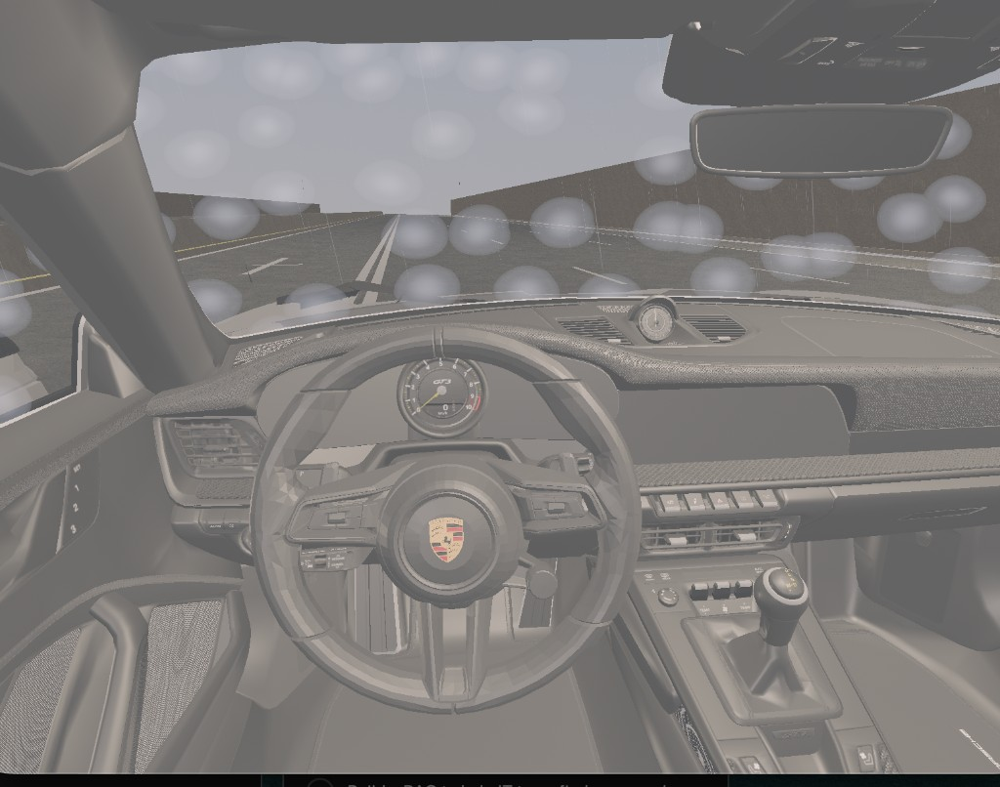

# Issue: Windshield rain looks like giant blobs and renders inside the cabin

**Status:** Open
**Area:** `WindshieldRainPass` / `shaders/windshield_rain.*`
**Severity:** High — the effect is not shippable in its current form.



---

## Summary

The windshield rain effect added in Phase 5 has two distinct, visible defects:

1. **Unrealistic "blobs."** Instead of fine rivulets and small beads, the glass is
   covered by a handful of huge, soft, semi-opaque white circles (roughly 1/10 of the
   screen each). They glow rather than refract, and they do not read as water at all.
2. **Rain appears *inside* the car.** The droplets are visible over the dashboard,
   the A-pillars, the side glass and the interior — not confined to the *outer* surface
   of the *front* windshield. From the cockpit camera it looks like it is raining inside
   the cabin.

Both are consequences of the way the current shader and pass were built (a quick
procedural placeholder), not of a single typo. This document explains the root causes,
points to the exact code to change, and collects established techniques/resources for a
proper fix.

---

## Issue 1 — Huge, glowing blobs

### Symptoms
- ~6–12 large soft circles instead of many small drops.
- Drops are bright bluish-white and **wash the scene out** (they add light).
- No distortion of the road/scene behind them — real drops act like tiny lenses.

### Root causes

**1a. Voronoi frequency is far too low.**
The bead field uses `beadScale = 12`, i.e. only ~12 cells across the **entire screen**
in `[0,1]` UV. Each Voronoi cell therefore spans ~8 % of the screen → one drop is huge.

```36:38:src/renderer/WindshieldRainPass/WindshieldRainPass.cpp
    WindshieldRainUBO ubo{};
    ubo.flowAndTime = Vec4(screenFlowDir.x, screenFlowDir.y, speedFactor, m_time);
    ubo.params      = Vec4(wetness, intensity, 12.0f, 0.0f);   // <-- beadScale = 12
```

```86:93:shaders/windshield_rain.frag
    // ── Bead layer — small circular droplets ─────────────────────────
    // Aspect ratio: compress vertically at speed to form streaks
    vec2 aspectUV = fragScreenUV * vec2(beadScale, beadScale * mix(1.0, 0.25, speed));
    vec2 beadUV   = aspectUV + flowDir * time * scrollRate * beadScale;
    float beadD   = cellDist(beadUV);
    // Inner bright core + soft halo
    float bead = smoothstep(0.28, 0.0, beadD) +
                 smoothstep(0.45, 0.28, beadD) * 0.35;
```

Realistic windshield drops need a much higher cell count (roughly 60–200 across the
glass), plus several layers at different scales for size variation.

**1b. The drop falloff is a wide soft halo.**
`smoothstep(0.28, 0.0, beadD)` plus a `0.45 → 0.28` halo produces a large, blurry
gradient blob with no defined rim. Real beads have a tight, near-circular body with a
sharp Fresnel rim and a small specular dot.

**1c. Additive blending is physically wrong for water on glass.**
The pipeline is configured for additive output, and the shader emits a bright premultiplied
colour:

```292:295:src/renderer/WindshieldRainPass/WindshieldRainPass.cpp
    cfg.cullMode         = VK_CULL_MODE_NONE;
    cfg.enableDepthTest  = true;
    cfg.enableDepthWrite = false;
    cfg.additiveBlending = true;   // rain trails are additive (blue-white light)
```

```116:120:shaders/windshield_rain.frag
    // Cool blue-white water color
    vec3 waterColor = vec3(0.65, 0.78, 1.0) + camera.sunColor.rgb * spec;

    // Additive output (premultiplied)
    outColor = vec4(waterColor * alpha, alpha);
```

Additive blending makes drops *emit* light, so they look like glowing spots and wash out
the scene. Water on glass is mostly **refraction + Fresnel reflection**, not emission. The
correct model samples the scene behind the drop and offsets the lookup by the drop's
surface normal (a lens), optionally darkening/blurring — not `dst + src`.

**1d. The noise lives in screen space, so it does not behave like water.**
`fragScreenUV = (clip.xy / clip.w) * 0.5 + 0.5` ties the pattern to the screen, not the
glass:

```30:35:shaders/windshield_rain.vert
    // Screen-space UV in [0,1]: used by the rain rivulet noise
    fragScreenUV = (clip.xy / clip.w) * 0.5 + 0.5;

    mat3 normalMat = mat3(transpose(inverse(push.model)));
    fragNormal     = normalize(normalMat * inNormal);
    fragWorldPos   = worldPos.xyz;
```

Because of this, drop size scales with the screen (not the glass), drops slide when the
camera turns rather than sticking to the pane, and there is no correct anisotropy.

---

## Issue 2 — Rain renders inside the car

### Symptoms
- Droplets appear over the dashboard, A-pillars, side windows and interior trim, not just
  the front windshield's outer face.

### Root causes

**2a. The interior glass pane is deliberately tagged as windshield.**
The loader tags *both* the outer window and the inner pane (`WindowInside_Geo`), and it
matches *all* `Window_Geo` nodes — including the **side** windows — not just the front
windshield:

```241:247:src/scene/ModelManager/ModelManager.cpp
        // Windshield = any BLEND pane whose node name contains "Window_Geo"
        // but is NOT the red taillight glass. The interior pane
        // (WindowInside_Geo) is also tagged so rain shows on both surfaces.
        const bool isWindshield = isGlass
            && (node.name.find("Window_Geo") != std::string::npos
                || node.name.find("WindowInside_Geo") != std::string::npos)
            && node.name.find("RED_GLASS") == std::string::npos;
```

The inner pane faces *into* the cabin, so painting drops on it literally puts rain inside
the car. Side windows should at most carry side-running rain, not the front-windshield
effect, and certainly not from the cockpit forward view.

**2b. The pass is double-sided.**
`cfg.cullMode = VK_CULL_MODE_NONE` (see 2-1c above) means the back face of the glass —
the surface normal pointing toward the driver — is also shaded with drops. Even on the
correct windshield mesh, the cabin-facing face gets rain. Rain belongs only on the
**exterior** face (front-facing, away from the camera-in-cabin).

**2c. Depth does not isolate the exterior surface.**
The pass reads the opaque G-buffer depth read-only (`enableDepthWrite = false`,
`DEPTH_STENCIL_READ_ONLY_OPTIMAL`). The transparent glass is not in that depth buffer, so
there is nothing to reject the near (interior) glass surface or to stop drops from
appearing on panes the driver shouldn't see rain on. Combined with 2a/2b, the effect
leaks across the whole cabin view.

---

## Where to look (debugging map)

| Concern | File | What to inspect |
|---------|------|-----------------|
| Drop shape, size, blending, colour | [`shaders/windshield_rain.frag`](shaders/windshield_rain.frag) | `beadScale`, `cellDist`, `smoothstep` ranges, additive output |
| Screen-space vs surface-space UV | [`shaders/windshield_rain.vert`](shaders/windshield_rain.vert) | `fragScreenUV` — should use the mesh UV (`inUV`) or a stable glass-space coord |
| Blend mode, cull mode, depth | [`src/renderer/WindshieldRainPass/WindshieldRainPass.cpp`](src/renderer/WindshieldRainPass/WindshieldRainPass.cpp) | `createPipeline()` (`additiveBlending`, `cullMode`), `createRenderPass()` (no scene-color input for refraction) |
| `beadScale` value | [`src/renderer/WindshieldRainPass/WindshieldRainPass.cpp`](src/renderer/WindshieldRainPass/WindshieldRainPass.cpp) | `update()` — `ubo.params` |
| Which meshes get the effect | [`src/scene/ModelManager/ModelManager.cpp`](src/scene/ModelManager/ModelManager.cpp) | `isWindshield` tagging — front-only, outer-only |
| Flow direction / speed feed | [`src/renderer/Renderer/Renderer.cpp`](src/renderer/Renderer/Renderer.cpp) | `drawFrame()` `screenFwd` / `speedFactor` block (~L313–331) |
| Pass ordering | [`src/renderer/Renderer/Renderer.cpp`](src/renderer/Renderer/Renderer.cpp) | `recordWindshieldRainPass()` — runs after glass; for refraction it must read the HDR scene |

### Quick triage / bisection steps
1. **Confirm the geometry leak:** in `ModelManager.cpp`, temporarily drop the
   `WindowInside_Geo` term and restrict to the single front node
   (`Kit1_Window_Geo_lodA_..._Window_Material_0`). If the cabin rain disappears, 2a is
   confirmed.
2. **Confirm the blend problem:** set `cfg.additiveBlending = false` and output a flat
   dark colour with moderate alpha. If the blobs stop glowing, 1c is confirmed.
3. **Confirm the frequency problem:** bump `beadScale` from `12` to `~100`. If drops
   shrink to a believable size, 1a is confirmed.
4. **Confirm back-face shading:** set `cfg.cullMode = VK_CULL_MODE_BACK_BIT` (and verify
   winding). If interior-facing drops vanish, 2b is confirmed.

---

## Proposed solution / direction

The current pass is a procedural *emissive* placeholder. The established way to render
rain on glass is a **screen-space refraction** layer: treat each drop as a tiny lens that
distorts (and slightly blurs/darkens) the scene already rendered behind it.

### Recommended changes

1. **Switch from additive to refractive.**
   Render the windshield rain *after* the scene is available as a sampleable texture
   (the HDR color target), and have the fragment shader sample that scene with a
   normal-driven UV offset instead of adding light:
   ```glsl
   // derive drop normal from the drop height field via finite differences
   vec2 n = vec2(drops(uv + vec2(e,0)) - d, drops(uv + vec2(0,e)) - d);
   vec3 col = textureLod(sceneHDR, screenUV + n * refractStrength, blurLod).rgb;
   ```
   This requires adding the HDR scene as a sampler input (set 1) to the pass and a barrier
   so it is readable — see `RainSystem`/`PostProcessManager` for the existing HDR
   image/view plumbing.

2. **Raise drop density and tighten the shape.**
   Use multiple Voronoi/SDF layers at much higher frequency (~60–200 across the glass),
   with a tight body + sharp Fresnel rim + small specular dot. Drive size variation by
   per-drop hash, not a single global `beadScale`.

3. **Use surface/glass-space coordinates, not raw screen UV.**
   Feed the mesh `inUV` (or a stabilized glass-plane projection) so drops stick to the
   pane and keep a constant physical size, then convert to a screen offset only for the
   refraction lookup.

4. **Confine to the exterior front windshield.**
   In `ModelManager.cpp`, tag only the outer front pane (exclude `WindowInside_Geo`, and
   exclude side-window nodes). Enable back-face culling in the pass so only the
   exterior-facing surface is shaded.

5. **Add stick-slip flow, not constant scroll.**
   Real drops cling via surface tension then suddenly slide (sawtooth motion), leaving a
   thinning trail — see the "Heartfelt" model below. Keep the existing speed→flow-direction
   idea (gravity at rest → aerodynamic up at speed) but apply it to drop motion in
   glass space.

### Resources

Academic / industry:
- **Tatarchuk, "Artist-Directable Real-Time Rain Rendering in City Environments,"
  SIGGRAPH 2006 course.** GPU water-droplet simulation on glass: per-cell water *mass*,
  dynamically derived normal map, scene refraction + reflection + Fresnel, droplet
  merging/separation and wetting trails. The canonical reference for this effect.
  https://advances.realtimerendering.com/s2006/Tatarchuk-Rain.pdf
  (full chapter: https://advances.realtimerendering.com/s2006/Chapter3-Artist-Directable_Real-Time_Rain_Rendering_in_City_Environments.pdf)
- **Rousseau et al., "Realistic Real-Time Rain Rendering" (GPU rain).** Refraction
  through drops using a precomputed wide-angle refraction mask; GPU particle animation
  with collisions and wind advection.
  https://classes.cs.uchicago.edu/archive/2022/fall/23700-1/papers/gpu-rain.pdf

Practical shader references:
- **"Heartfelt" rain-on-glass by Martijn Steinrucken (BigWings).** The widely used
  procedural model: stick-slip drops via sawtooth, layered drop fields, **normal from
  finite differences**, mipmap-based background blur. WebGPU port with a clear writeup:
  https://github.com/jeantimex/raindrop
- **Codrops — "Rain & Water Effect Experiments."** Walks through using a drop "normal/mask"
  to flip and distort the background (the lens/refraction intuition).
  https://tympanus.net/codrops/2015/11/04/rain-water-effect-experiments/
- **Godot "Rain on Glass" shader.** Compact SDF-drop + screen-texture refraction +
  per-pixel blur (`textureLod`) example that maps almost directly to our fragment shader.
  https://godotshaders.com/shader/rain-on-glass/
- **olivierprat/rain-on-windshield (Unity HDRP).** Height-field → normal-map rain on a
  windshield with flow maps and a wiper, a good structural reference for a car windshield
  specifically.
  https://github.com/olivierprat/rain-on-windshield
- **"How to render rain on glass" (Radiant).** Two-pipeline pattern: build a water map,
  then a fragment shader refracts the background through it — decode RG as a 2D offset.
  https://radiant-shaders.com/learn/rain-on-glass

### Common thread across all references
Drops are rendered by **refracting the already-rendered scene** through a normal/height
field, not by adding glowing geometry. Adopting that single change (plus higher drop
density and restricting to the exterior front pane) fixes both issues at once.
