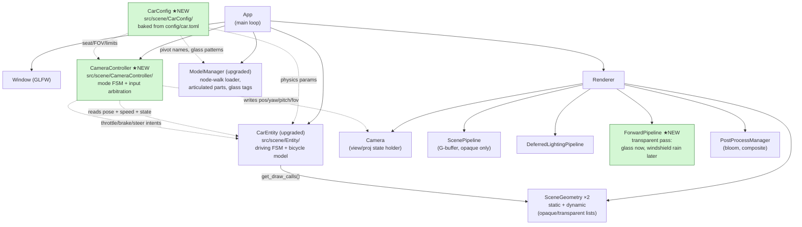
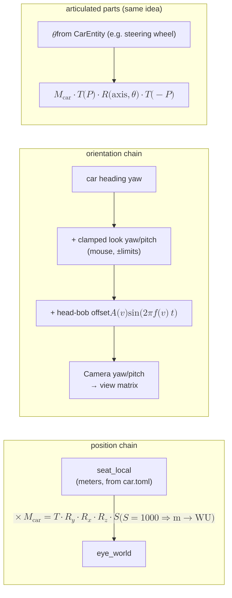
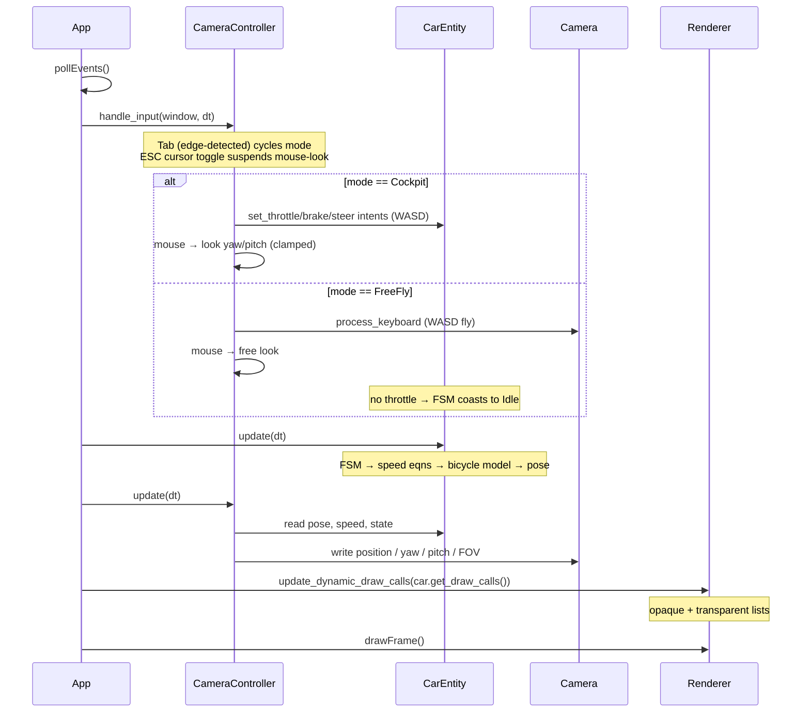
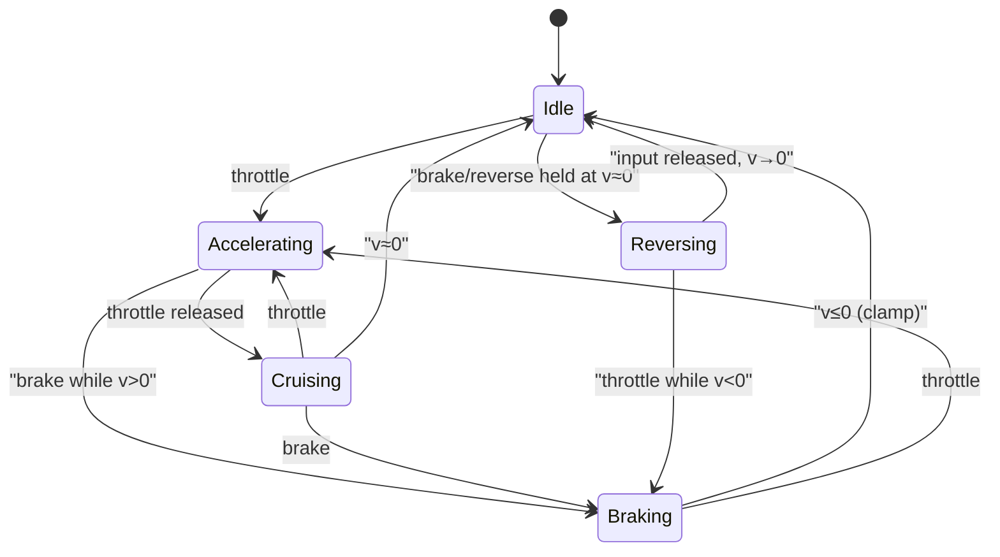
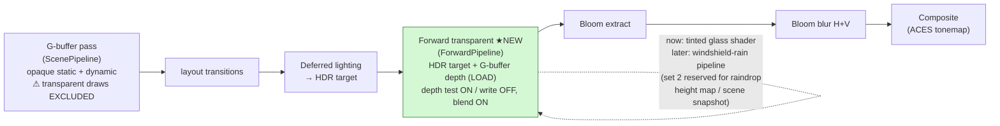
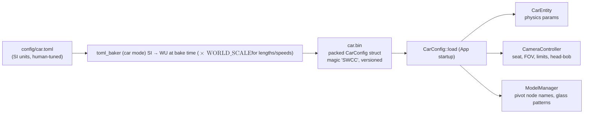
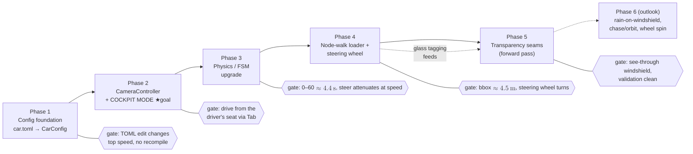

# Car / Driving System Port: DownPour → swish

> Architecture plan for mimicking DownPour's working car + driving implementation in swish,
> adapted to swish conventions. **Primary goal: cockpit (interior) camera while driving,
> with the architecture seams in place for rain-on-windshield later.**
>
> This is a plan document — it describes structure, equations, and data flow, not finished code.
>
> **Math:** Markdown uses KaTeX delimiters — inline `$...$`, display `$$...$$`. Mermaid diagrams use `$$...$$` per the [Mermaid math config](https://mermaid.ai/open-source/config/math.html).

- Reference implementation: `examples/DownPour/` (esp. `src/scene/CarEntity.cpp`, `src/scene/CameraEntity.cpp`, `DRIVING_SYSTEM.md`, `CAR_SYSTEM_TRACE.md`)
- Current swish car docs: `docs/car_system.md` (the FSM section below supersedes its simpler state machine)
- Companion diagram: `architecture.excalidraw` — dark-canvas atlas, one island per concept (main loop, Vulkan core, render passes, scene/geometry, car system, camera system, config pipeline, rain seam, asset facts)

---

## 1. How DownPour does it (reference analysis)

### 1.1 Car entity update order

DownPour's `CarEntity::update()` (`examples/DownPour/src/scene/CarEntity.cpp:132`) runs four steps per frame, in this order:

```
updateInput → updatePhysics → updateState → updateAnimations
```

- **updateInput** — reads W/A/S/D, accumulates steering, applies state-specific acceleration.
- **updatePhysics** — bicycle-model heading integration, position integration, wheel-spin accumulation.
- **updateState** — FSM transitions (Idle / Accelerating / Cruising / Braking / Reversing) from speed thresholds + input.
- **updateAnimations** — applies wheel spin, front-wheel steer compose, steering-wheel rotation to scene-graph nodes.

### 1.2 The driving model (equations)

All values are authored in SI units and multiplied by `WORLD_SCALE = 1000` at load (both projects share this convention: $1\,\mathrm{m} = 1000$ world units).

| Behavior | Equation | DownPour values |
|---|---|---|
| Acceleration curve | $v \mathrel{+}= a_{\max}\,(1 - (v/v_{\max})^2)\,dt$ | $a_{\max} = 6.43\,\mathrm{m/s^2}$, $v_{\max} = 69.44\,\mathrm{m/s}$ → tanh velocity profile, 0–60 mph in $\approx 4.4\,\mathrm{s}$ |
| Cruise deceleration (no throttle) | $a_d = c_{rr}\,g\,\mathrm{WS} + c_d\,v^2\,(0.0008 / \mathrm{WS})$ | $c_{rr} = 0.015$, $c_d = 0.35$ |
| Braking | $v \mathrel{-}= a_{\mathrm{brake}}\,dt$, clamp at $0$ | $a_{\mathrm{brake}} = 10\,\mathrm{m/s^2}$ (60→0 in $\approx 2.7\,\mathrm{s}$) |
| Reverse | $v \mathrel{-}= a_{\mathrm{rev}}\,dt$, clamp at $-v_{\mathrm{rev,max}}$ | $a_{\mathrm{rev}} = 3\,\mathrm{m/s^2}$, $v_{\mathrm{rev,max}} = 5\,\mathrm{m/s}$ |
| Bicycle model steering | $R = L / \tan(\delta)$, $\mathrm{heading} \mathrel{-}= (v/R)\,dt$ | wheelbase $L = 2.9\,\mathrm{m}$, $\delta_{\max} = 35°$ |
| Speed-dependent steering | $\delta_{\mathrm{eff}} = \delta_{\max} / (1 + K v^2)$ | $K = 2 \times 10^{-9}$ (in WU): full lock at standstill, $\approx 39\%$ of lock at 100 km/h |
| Position integration | $x \mathrel{+}= v\sin(\mathrm{heading})\,dt$, $z \mathrel{+}= v\cos(\mathrm{heading})\,dt$ | — |

### 1.3 Cockpit camera

DownPour's cockpit camera (`examples/DownPour/src/scene/CameraEntity.cpp`) is a scene-graph child of the car root: a seat position authored in **mesh-space meters** in a sidecar JSON, transformed by the car's world matrix every frame. On top of that:

- **Mouse look** — yaw/pitch *relative to the car heading*, clamped so you can't look through the headrest.
- **Speed-based FOV** — base FOV widens toward $fov_{\mathrm{base}} + fov_{\mathrm{gain}}$ as $v \to v_{\max}$, lerped.
- **Head bob** — $\Delta y = A(v)\,\sin(2\pi f(v)\, t)$; amplitude and frequency scale with speed and FSM state (stronger while accelerating).

### 1.4 Articulation & roles

DownPour maps logical roles (`wheel_FL`, `disc_BR`, `middle_steering_wheel`, …) to glTF node names via the sidecar JSON, then rotates those nodes at runtime:

- Wheels: spin quaternion about local X, accumulated as $\mathrm{wheelRotation} \mathrel{+}= (v / r_{\mathrm{wheel}})\,dt$.
- Front wheels: `steerQuat · spinQuat` compose (steer about $-Y$ first, then spin).
- Steering wheel: $\theta_{\mathrm{visual}} = \delta \cdot \mathrm{ratio}$ ($\pm 450°$ for $\pm 35°$ in DownPour, ratio $\approx 12.9$).

### 1.5 Windshield / transparency

Glass submeshes are detected at load (material name contains `glass|window|windshield`, or glTF `alphaMode == BLEND`) and rendered **outside** the deferred G-buffer, in a **forward transparent pass after deferred lighting** — alpha blending on, depth test on, depth write off. The rain-on-windshield effect is just a different pipeline bound in that same pass: a windshield shader that refracts through a raindrop height map. *The pass is the architectural seam; the rain shader is a later plug-in.*

### 1.6 The one bug worth remembering

DownPour originally **overwrote** the car root node's rotation with the heading quaternion, destroying the asset's Sketchfab axis-conversion rotation ($-90°$ around $X$) — the car appeared "upside down" and the road went vertical (`examples/DownPour/Car_Debug.md`). The fix: capture the original rotation once and **compose**: $\mathrm{localRotation} = \mathrm{headingQuat} \cdot \mathrm{originalRotation}$. Section 6 explains how swish avoids this class of bug structurally.

---

## 2. Gap analysis: swish today vs. target

| Area | swish today | Target (this plan) |
|---|---|---|
| Physics | Basic bicycle model in `src/scene/Entity/CarEntity.cpp`: linear accel, exponential drag, fixed max steer | DownPour model: FSM, accel curve, rolling + quadratic drag, speed-dependent steering |
| Tunables | `constexpr` in `CarEntity.h` (violates the no-hardcoded-params rule in `.cursorrules`) | `config/car.toml` → baked `car.bin` → `CarConfig`, cloning the `road.toml` pipeline |
| Input | Arrows drive car, WASD flies camera — both always active | WASD drives in car modes, Tab cycles camera, one input owner (`CameraController`) |
| Camera | Free-fly FPS only (`src/scene/Camera/`) | Mode FSM: FreeFly ↔ **Cockpit** (Chase/Orbit later) |
| Model loading | `ModelManager` flattens GLB, **ignores node transforms** | Node-walk loader that bakes transforms, records articulated parts, tags glass |
| Articulation | None (rigid mesh) | Steering wheel via `SteeringWheel_Pivot`; wheel hooks dormant (asset lacks wheel pivots) |
| Transparency | Glass drawn opaque into the G-buffer | Glass tagged + excluded from G-buffer, drawn in a new forward pass (rain seam) |

**Asset constraint (verified):** `assets/Porsche/porsche.glb` has no per-wheel pivot nodes — all four wheels are flattened under one combined node (1138 children, each piece translated to one of the four wheel centers). Only `SteeringWheel_Pivot` (with `Steering_Wheel` child) is clean. So: steering-wheel articulation now, wheel spin deferred until the GLB is re-exported from `assets/blend/porsche.blend` with `wheel_FL/FR/BL/BR` pivot groups.

---

## 3. Target architecture

### 3.1 Components and ownership

Two new scene-layer classes, one new renderer pipeline, one new config — slotted into the existing structure without changing the descriptor-set contract (set 0 camera/lights, set 1 materials).



Key decisions:

**No scene graph — flat articulated parts.** A general scene graph (DownPour's approach) is more machinery than the goals need. Instead, `ModelManager` records an `ArticulatedPart` per config-named pivot node:

```
ArticulatedPart { name, first_submesh, submesh_count, pivot P (mesh-space), axis, angle theta }
```

`ModelEntity::get_draw_calls()` stamps articulated submeshes with

$$
\mathrm{model} = M_{\mathrm{car}} \cdot T(P) \cdot R(\mathrm{axis}, \theta) \cdot T(-P)
$$

and everything else with plain $M_{\mathrm{car}}$. A future wheel is just another articulated part with a continuously accumulating $\theta$ — the mechanism is identical, so nothing is painted into a corner.

**`Camera` stays a dumb view-state holder.** It remains Renderer-owned; `CameraController` writes into it each frame through the existing setters (`set_position` / `set_yaw` / `set_pitch` plus a new `set_fov` that preserves aspect/near/far). No renderer-side changes for camera modes.

**Cockpit without a scene graph.** The cockpit eye is derived, not attached:



Because the entity scale is 1000 (= `WORLD_SCALE`), a seat position authored in **meters** in `car.toml` lands at the right spot in world units after multiplying by $M_{\mathrm{car}}$ — no unit juggling in the controller.

### 3.2 Input arbitration and per-frame flow

Today App pipes WASD to the camera and arrow keys to the car unconditionally. After this port, **only `CameraController` touches GLFW input** for driving/looking; `CarEntity` exposes intent setters (`set_throttle_input`, `set_brake_input`, `set_steer_input`) and never sees the window.



### 3.3 Driving FSM

Explicit states replace the current "sign of speed" logic. The state also feeds the camera (head-bob intensity, FOV) and, later, audio/wipers.



Per-state speed updates (KaTeX):

| State | Equation |
|---|---|
| Accelerating | $v \mathrel{+}= a_{\max}(1-(v/v_{\max})^2)\,dt$ |
| Cruising | $v \mathrel{-}= (c_{rr}\,g\,\mathrm{WS} + c_d v^2 \cdot 0.0008/\mathrm{WS})\,dt$ |
| Braking | $v \mathrel{-}= a_{\mathrm{brake}}\,dt$ (clamp $0$) |
| Reversing | $v \mathrel{-}= a_{\mathrm{rev}}\,dt$ (clamp $-v_{\mathrm{rev,max}}$) |

Steering (all states): $\delta_{\mathrm{eff}} = \delta_{\max}/(1+Kv^2)$; A/D accumulate at `steer_rate`, spring back at `steer_return`; yaw integrates $\omega = v\tan(\delta)/L$.

### 3.4 Render pass flow (the windshield seam)



Seams that must exist **now** so the rain phase is a plug-in, not a refactor:

1. **Load-time glass tagging** — `Submesh`/`DrawCall` gain a `flags` field (`SUBMESH_TRANSPARENT`, `SUBMESH_WINDSHIELD`), set when the glTF material name matches the `[glass]` patterns in `car.toml` or `alphaMode == BLEND`. On the Porsche this catches `Kit1_Window_Geo_lodA` (incl. the RED_GLASS primitive) and `Kit1_WindowInside_Geo_lodA`.
2. **Draw-list split** — dynamic geometry keeps separate opaque/transparent lists; the G-buffer pass draws only opaque, the forward pass only transparent. (Glass must be *excluded* from the G-buffer, not merely redrawn — see risk 3.)
3. **Pipeline slot, not pass redesign** — the forward pass ships with a plain tinted-glass shader; the future rain phase binds a different pipeline (windshield refraction) *within the same pass*. Its layout alone reserves **set 2** for pass-specific resources, keeping sets 0/1 untouched everywhere else.

### 3.5 Config pipeline

Clones the existing `road.toml → toml_baker → road.bin → RoadConfig` pattern (`CMakeLists.txt:102-109`, packed struct as in `src/scene/RoadScene/RoadConfig.h`).



---

## 4. Phase roadmap

Ordered to reach *"sitting in the cockpit while driving, in rain-ready architecture"* fastest. Each phase builds, runs, and has an observable verification gate before the next starts.



### Phase 1 — Config foundation (no behavior change)

Move every car/camera tunable out of headers, per `.cursorrules` ("no hardcoded scene parameters").

| File | Change |
|---|---|
| `config/car.toml` | NEW — schema in §5 |
| `src/scene/CarConfig/CarConfig.h` | NEW — packed struct + loader, modeled on `src/scene/RoadScene/RoadConfig.h` (magic `"SWCC"`, version field; strings as fixed `char[64]`) |
| `tools/toml_baker.cpp` | Add a car mode (`toml_baker car in.toml out.bin`); SI→WU conversion at bake time |
| `CMakeLists.txt` | Second bake step `car.toml → car.bin` mirroring lines 102–109 |
| `src/scene/Entity/CarEntity.h/.cpp` | Replace `kMaxForwardSpeed` etc. with a params struct set via `set_config()` |
| `src/core/App/App.cpp` | Load `car.bin`; spawn position/rotation/scale from config instead of hardcoded `(6501, 0, −20000)` |

**Verify:** builds; `car.bin` produced; driving feels identical; editing `max_speed_mps` in TOML + re-bake changes top speed with no C++ recompile.

### Phase 2 — CameraController + cockpit mode (primary goal lands here)

| File | Change |
|---|---|
| `src/scene/CameraController/CameraController.h/.cpp` | NEW — mode enum, Tab cycle (edge-detect), input routing, cockpit transform math (§3.1), look clamps, FOV lerp, simple speed-based head bob |
| `src/core/App/App.cpp` | Main loop calls `controller.handle_input` + `controller.update`; remove direct `camera->process_keyboard` / `car->handle_input`; mouse callback forwards to controller |
| `src/scene/Entity/CarEntity.h/.cpp` | Replace `handle_input(GLFWwindow*)` with intent setters; arrow-key driving removed |
| `src/scene/Camera/Camera.h/.cpp` | Add `set_fov(float)` preserving aspect/near/far; per-mode near plane |

Seat starts from config ($\approx (0.35, 1.2, 0.3)\,\mathrm{m}$, base pitch $\approx 5°$), then tuned visually against the Porsche interior.

**Verify:** Tab toggles FreeFly ↔ Cockpit; in Cockpit WASD drives from the driver's seat, mouse-look clamps at the headrest, FOV widens with speed; in FreeFly the car coasts and WASD flies.

### Phase 3 — Physics / FSM upgrade (drive feel)

| File | Change |
|---|---|
| `src/scene/Entity/CarEntity.h/.cpp` | `enum class DriveState`; restructure update as `update_state → update_speed → update_steering → integrate pose` per §3.3; expose `get_state()` |
| `src/scene/CameraController/CameraController.cpp` | Head bob amplitude/frequency keyed off state + speed |
| `config/car.toml` + baker + `CarConfig.h` | Fill any missed fields (rolling resistance, drag, steer K) |

Kept from today's CarEntity: bicycle-model yaw integration, Euler heading in `m_rotation.y`, road-bounds X clamp, steer rate / return-to-center.

**Verify:** log speed once per second from standstill — 0–60 mph in $\approx 4.4\,\mathrm{s}$ with asymptotic top speed; throttle release → gradual coast-down, not a snap; steering visibly attenuated at speed; reverse capped at $5\,\mathrm{m/s}$.

### Phase 4 — Node-walk loader + articulated steering wheel

| File | Change |
|---|---|
| `src/scene/ModelManager/ModelManager.h/.cpp` | Replace mesh-iteration with a recursive node walk from scene roots; bake accumulated node transforms into vertices, **normalized so mesh space stays in meters** (divide out net root scale — risk 1); record `ArticulatedPart` for config-named nodes; tag glass flags (prep for Phase 5) |
| `src/scene/SceneTypes.h` | `Submesh`/`DrawCall` gain `flags`; `ArticulatedPart` struct |
| `src/scene/Entity/Entity.h/.cpp` | `ModelEntity` stores articulated parts; `get_draw_calls()` composes the pivot transform for them |
| `src/scene/Entity/CarEntity.cpp` | Per update: $\theta_{\mathrm{sw}} = -\delta \cdot \mathrm{ratio}$ (ratio from config) |
| `config/car.toml` | `[articulation]` table: pivot node names, axes, ratios |

**Verify:** car still renders at correct size/orientation — assert bounding box $\approx 4.5\,\mathrm{m}$ length in the loader; from the cockpit the steering wheel turns with A/D and springs back; no detached or distorted submeshes.

### Phase 5 — Transparency seams (rain-ready)

| File | Change |
|---|---|
| `src/renderer/SceneGeometry/SceneGeometry.h/.cpp` | Dynamic geometry keeps separate opaque/transparent draw lists (split by `flags`) |
| `src/renderer/Renderer/Renderer.h/.cpp` | `recordForwardPass()` between lighting and bloom; G-buffer pass filters out transparent draws; depth attachment reused with `LOAD_OP_LOAD` |
| `src/renderer/ForwardPipeline/ForwardPipeline.h/.cpp` | NEW — alpha-blended pipeline, depth test on / write off, sets 0+1; layout leaves room for a set-2 variant |
| `shaders/glass.vert/.frag` | NEW — simple tinted transmissive glass; register in `SHADER_SOURCES` |
| `src/renderer/PostProcessManager/*` | Expose HDR target + depth view to the forward pass; extra image-layout transitions |

**Verify:** windshield/windows see-through with tint from inside the cockpit; interior visible through glass from outside; no glass silhouettes in G-buffer debug views; validation layers clean.

### Phase 6 — Outlook (explicitly out of scope here)

Raindrop height-map simulation + windshield refraction pipeline (the set-2 seam); wipers; Chase (spring-damper: $v \mathrel{+}= k\,(\mathrm{target}-\mathrm{pos})\,dt$, $v \mathrel{*}= (1-c\,dt)$) and Orbit as new `CameraMode` cases; wheel spin once the GLB is re-exported with per-wheel pivots. All land in seams created above with no further architectural change.

---

## 5. `config/car.toml` schema sketch

```toml
[meta]
version = 1

[spawn]                     # world units (this section only)
position = [6501.0, 0.0, -20000.0]
yaw_deg  = -90.0

[physics]                   # SI units; baker multiplies by WORLD_SCALE = 1000
max_speed_mps        = 69.44     # 250 km/h
accel_mps2           = 6.43      # 0–60 in ~4.4 s via (1-(v/vmax)^2) curve
brake_decel_mps2     = 10.0
reverse_accel_mps2   = 3.0
max_reverse_mps      = 5.0
rolling_resistance   = 0.015     # dimensionless; × g × WORLD_SCALE at runtime
drag_coefficient     = 0.30      # × v^2 × (0.0008 / WORLD_SCALE)
wheelbase_m          = 2.45      # Porsche 911

[steering]
max_steer_deg        = 35.0
steer_rate_dps       = 90.0
steer_return_dps     = 120.0
speed_steer_k        = 2.0e-9    # delta_eff = delta_max/(1+K*v^2), v in WU/s

[cockpit]                   # meters in car mesh space (loader keeps mesh space = meters)
seat_position        = [0.35, 1.2, 0.3]
base_pitch_deg       = 5.0
look_yaw_limit_deg   = 150.0
look_pitch_limit_deg = 60.0
near_plane_wu        = 80.0      # cockpit-mode near plane override
fov_base_deg         = 70.0
fov_speed_gain_deg   = 12.0      # added at v_max (see physics.max_speed_mps)
fov_lerp_speed       = 2.0
headbob_amplitude_m  = 0.005
headbob_frequency_hz = 1.2
headbob_speed_ref    = 10.0      # m/s at which nominal amplitude applies

[articulation]
steering_wheel_node  = "SteeringWheel_Pivot"
steering_wheel_axis  = [0.0, 0.0, 1.0]   # local axis — verify against the asset
steering_wheel_ratio = 10.3              # visual wheel deg per road-wheel deg
# wheel_nodes = []                       # dormant until asset has per-wheel pivots

[glass]
material_patterns    = ["glass", "window", "windshield"]
windshield_pattern   = "windshield"      # fallback: largest tagged glass submesh
tint                 = [0.85, 0.9, 0.95, 0.35]
```

Baked to a packed, trivially-copyable `CarConfig` struct exactly following the `RoadConfig` pattern; node names / patterns become fixed-size `char[64]` fields.

---

## 6. Risks & gotchas

1. **Node-transform baking changes effective scale (highest risk, Phase 4).** Today's loader ignores node transforms entirely; the car only renders correctly by accident of the asset's raw mesh space. The Porsche chain (`Sketchfab_model` $S=1000$ / $R=-90°X$ → `FINAL_MODEL.fbx` $S=0.01$ / $R=+90°X$) nets to $\approx 10\times$ with the rotations canceling — naively baking would render the car $10\times$ too large at entity scale 1000. **Mitigation:** normalize mesh space to meters (divide out the net root scale) so entity scale 1000 and `[cockpit] seat_position` in meters both stay valid. Guard with the bounding-box assertion ($\approx 4.5\,\mathrm{m}$).
2. **Compose, don't overwrite, rotations (DownPour's lesson, §1.6).** Swish dodges this class of bug structurally: after Phase 4 all asset axis-conversion rotations are baked into vertices and heading lives purely in `Entity::m_rotation.y`. **Invariant to keep:** the loader must never leave un-baked rotations that the entity transform is expected to preserve.
3. **Glass must be *excluded* from the G-buffer, not just redrawn.** Otherwise opaque glass depth/normals occlude the interior and corrupt lighting behind it. Enforce the flags split inside `SceneGeometry`'s dynamic draw path, not only in the entity.
4. **Input ownership conflicts.** After Phase 2, only `CameraController` reads GLFW key/mouse state for driving/looking. Tab needs edge detection (previous-frame key state). The existing ESC cursor toggle in `App.cpp` must suspend mouse-look in both modes.
5. **Near plane / depth precision at WORLD_SCALE = 1000.** Current near=10 WU (1 cm) with far=2,000,000 WU is a $2 \times 10^5$ ratio — poor precision for distant road geometry. Cockpit needs a near plane that doesn't clip the dashboard ($\approx 0.3\,\mathrm{m} \approx 300\,\mathrm{WU}$ away) but is as large as possible: per-mode near, config-driven ($\approx 80\,\mathrm{WU}$ cockpit). Reversed-Z is a future renderer improvement, out of scope. Also: FOV modulation rebuilds the projection each frame — refresh aspect on swapchain recreate.
6. **Forward-pass depth plumbing.** The G-buffer depth image must be re-bindable as a depth attachment (LOAD) after lighting sampled it — extra image-layout transitions in `PostProcessManager`/`Renderer`. Budget validation-layer iteration time here.
7. **Material slot ceiling.** `MAT_CAR_0..19` caps at 20 glTF materials. Count materials at load and log over-cap loudly instead of silently mapping to `MAT_DEFAULT`.
8. **Heading wrap.** `m_rotation.y` grows unbounded driving in circles; wrap to ±180° at integration time before the cockpit camera composes look-yaw with it, or the look clamp misbehaves.
